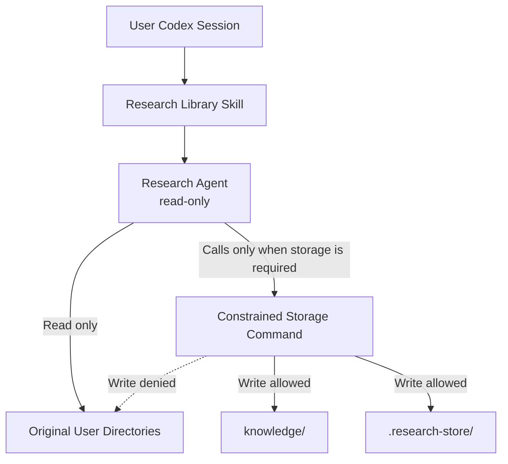
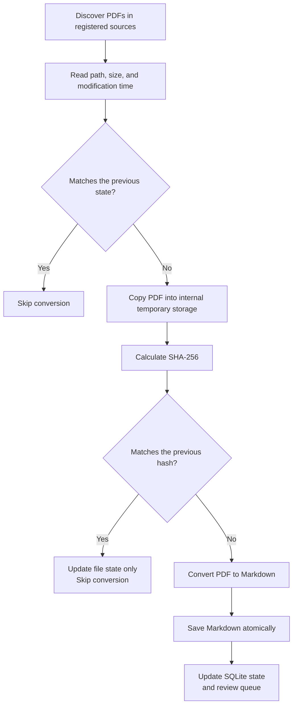
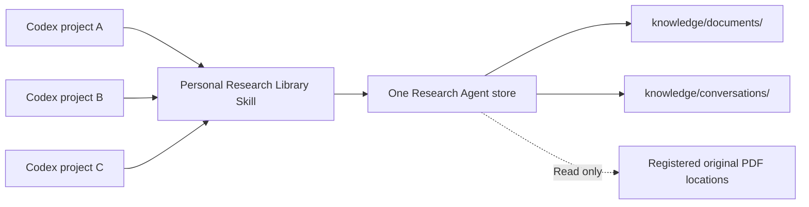
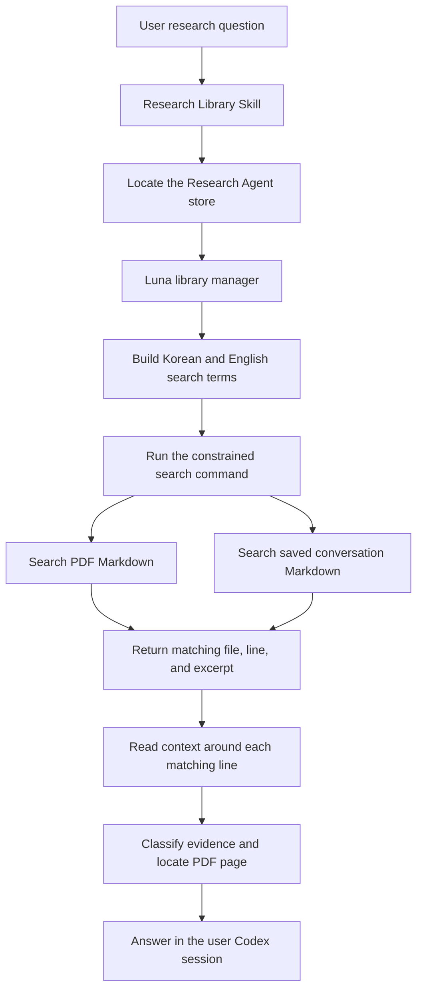
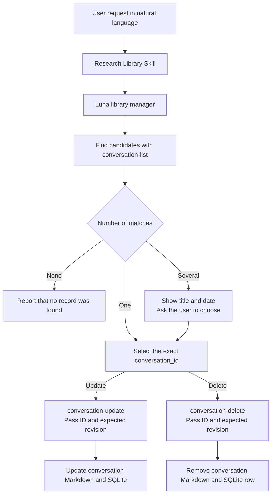

# Research Agent Technical Design

[한국어](./README.md) | [English](./README.en.md)

[Development roadmap](./ROADMAP.en.md)

This document records the operating principles and design decisions of Research
Agent by topic.

## Contents

1. [Protecting Original User Directories and Managing Permissions](#1-protecting-original-user-directories-and-managing-permissions)
2. [PDF Conversion and Result Reliability](#2-pdf-conversion-and-result-reliability)
3. [Storage and Incremental Synchronization](#3-storage-and-incremental-synchronization)
4. [Skill Invocation, Retrieval, and Evidence Assembly](#4-skill-invocation-retrieval-and-evidence-assembly)
5. [Conversation Storage and the Research Memory Lifecycle](#5-conversation-storage-and-the-research-memory-lifecycle)

## 1. Protecting Original User Directories and Managing Permissions

### Design Goal

Research Agent reads PDF files stored across multiple user-selected locations
and converts them into searchable Markdown. The most important design principle
is to ensure that **Research Agent does not modify the user's original
directories**.

Original PDFs and their directories are used only as input sources. Converted
Markdown, search state, and temporary files are stored entirely within
directories owned by Research Agent.

### Permission Flow



When a user Codex session invokes Research Agent, the invoked agent does not
automatically use the parent session's permissions. Research Agent explicitly
runs with a separate `read-only` sandbox mode. As a result, the agent cannot
directly modify either the original files or the Research Agent store.

When Markdown or SQLite state must be saved, the agent invokes an approved
storage command. This command runs within a separate, constrained permission
profile.

| Location | Permission | Purpose |
| --- | --- | --- |
| Original user directories | Read only | PDF discovery and conversion input |
| `knowledge/` | Read and write | Converted Markdown and saved conversations |
| `.research-store/` | Read and write | Configuration, SQLite state, and temporary files |
| Other locations | Read or denied | Not used as Research Agent storage |

### Protection Layers

Original file protection does not depend on agent instructions alone.

1. **Agent permissions**
   Both the library management agent and the PDF visual review agent run in
   read-only mode. Rather than omitting the setting and inheriting permissions
   from the parent Codex session, their agent configurations explicitly declare
   read-only access.

2. **Storage command permissions**
   The agents do not create or modify files directly. They use a dedicated
   command that can write only within Research Agent. Original directories are
   included only as readable locations for this command.

3. **Application path validation**
   The application verifies that every generated file remains inside Research
   Agent. It rejects path traversal, symbolic links, and hard links that could
   redirect a write into an original directory or another external location.
   Original PDFs are read and then processed in internal temporary storage. If
   an original changes during processing, the result is discarded.

4. **Limited feature scope**
   Research Agent provides no feature for editing, moving, renaming, or deleting
   original files. Removing a registered source only stops future discovery. It
   does not delete the original files or existing Markdown records.

### Relationship to the Parent Codex Session

Research Agent permissions and the permissions of the user Codex session that
invokes it are separate.

Research Agent runs with its own read-only permissions, and the storage command
runs with a constrained permission profile. Full access granted to the parent
session does not automatically expand the permissions of Research Agent.

Research Agent cannot, however, reduce the permissions of the parent Codex
session. A parent session with Full access can bypass Research Agent and perform
the following actions:

- Modify an original file directly.
- Modify Research Agent installation files or configuration.
- Run other commands that Research Agent does not provide.

This is a permission issue for the user Codex session as a whole rather than for
Research Agent operations. A less-privileged child agent cannot restrict the
more-privileged parent session that invoked it.

### Scope of the Guarantee

The current design guarantees the following:

> Operations performed through Research Agent do not write to original user
> directories.

The current design alone cannot guarantee the following:

> No operation on the computer, including one performed by a parent Codex
> session with Full access, can modify an original user directory.

The second level of protection requires a permission profile that makes the
original paths read-only for the entire user session rather than only for
Research Agent. Environments requiring stronger isolation must use an external
protection boundary, such as operating-system file permissions, a separate user
account, or a read-only mount.

### Verification Criteria

The permission design is verified through the following behaviors:

- The constrained storage command can write to `knowledge/` and
  `.research-store/`.
- The operating-system sandbox blocks the same command from writing to an
  external original directory.
- File contents in an original directory remain identical before and after
  synchronization.
- The application rejects output paths and links that point outside Research
  Agent.
- Registering or removing an original path changes only configuration owned by
  Research Agent.
- Removing Research Agent leaves every registered original file untouched.

### Implementation Responsibilities

| Responsibility | Source files |
| --- | --- |
| Install personal agents, command rules, and the constrained permission profile | [`scripts/personal_registration.py`](../../scripts/personal_registration.py) |
| Define the roles and behavioral limits of read-only agents | [`research-library-manager.toml`](../../resources/agents/research-library-manager.toml), [`research-paper-converter.toml`](../../resources/agents/research-paper-converter.toml) |
| Re-enter through the constrained storage command | [`research-store` launcher](../../resources/skills/research-library/scripts/research-store) |
| Validate storage and source boundaries | [`config.py`](../../src/research_store/config.py), [`safety.py`](../../src/research_store/safety.py) |
| Verify installation collisions and real sandbox permissions | [`test_personal_registration.py`](../../tests/test_personal_registration.py), [`test_install_security.py`](../../tests/test_install_security.py), [`test_permission_profile_integration.py`](../../tests/test_permission_profile_integration.py) |

## 2. PDF Conversion and Result Reliability

### Design Goal

PDF conversion is not intended to reproduce an editable document that is
structurally identical to the original. Research Agent first creates a
**page-level text index for search and discovery**, then visually checks only
the pages where equations, tables, figures, or extraction failures make accuracy
more important.

Base extraction and visual verification remain separate in the saved record. A
user can therefore tell whether a result came from plain text extraction or was
checked again against an image of the original page.

### Conversion Flow


### Base Text Extraction

`pypdf` reads the text stored inside the PDF one page at a time. Each page is
preceded by a marker such as:

```markdown
<!-- page: 3 -->

Text extracted from the page
```

The result is not a complete semantic reconstruction of the paper in Markdown.
It stores searchable text by page instead of rebuilding titles, body sections,
equations, and tables as structured Markdown elements.

For ordinary text-based English PDFs, the result is useful for finding titles,
abstracts, and important terms in the body. Base extraction alone is less
reliable for:

- The exact reading order of multi-column documents
- Words split by line breaks and hyphenation
- Superscripts, subscripts, fractions, and special mathematical symbols
- Table row and column relationships and merged cells
- The meaning of figures, plots, legends, and axes
- Characters encoded with specialized fonts
- Scanned documents stored only as images

### Selecting Pages for Visual Review

The base extraction stage registers a page for visual review when it detects:

- `Table`, `Figure`, `Equation`, or the corresponding Korean terms
- A high density of mathematical symbols
- Multiple short lines that resemble equations
- Images embedded in the PDF page
- Very little extracted text

This selection is a rule-based candidate detector. It can include pages that do
not require review and can miss important pages such as captionless vector
diagrams or equations whose fonts were not recognized. `not-needed` therefore
means that the current rules did not detect a need for review; it does not mean
that the page's accuracy was verified.

### Sol High Visual Review

Only selected pages are rendered as 220 DPI PNG images. The visual review agent
compares each page image with the base Markdown and records:

- LaTeX representations of equations that are visually clear
- Markdown representations of simple tables
- Confirmed figure structure, axes, legends, and relationships
- Errors confirmed in the base text extraction
- Symbols, cells, or layouts that remain unreadable

Visual review does not overwrite the base extraction. It appends a separate
`Visual verification notes` section. The reviewer must not guess an ambiguous
value and leaves the page as `needs-review` when uncertainty remains.

The system also compares the PDF's SHA-256 at rendering time and at review
completion. If the hashes differ, it rejects notes created from the outdated
page image.

### Meaning of Review States

| State | Meaning |
| --- | --- |
| `not-needed` | The current selection rules found no review candidate |
| `pending` | Selected for visual review but not yet completed |
| `verified` | The visual review agent checked the selected page |
| `needs-review` | Visual review was performed, but uncertainty remains |

`verified` records completion of AI review for the selected pages. It is not a
human certification or a guarantee of mathematical identity for equations and
numeric values.

### Reliability by Use Case

| Use case | Current assessment |
| --- | --- |
| Search paper titles, topics, abstracts, and ordinary prose | Suitable as a search index |
| Locate a document and page containing relevant content | Page markers support returning to the original |
| Reuse an equation exactly | Check the original page even after visual review |
| Cite table values and row or column relationships | Check the original page |
| Read exact numeric values from a graph | Check the original page |
| Reproduce a PDF as structurally identical Markdown | Outside the current design goal |

The current architecture is suitable for a research discovery prototype. Using
Markdown alone as an exact source for scientific values, equations, and tables
is outside its present guarantee.

### Implementation Responsibilities

| Responsibility | Source files |
| --- | --- |
| Discover PDFs, create temporary copies, extract text, select candidates, render pages, and save review results | [`sync.py`](../../src/research_store/sync.py) |
| Manage document state and page-level review state | [`state.py`](../../src/research_store/state.py) |
| Coordinate synchronization and visual review agents | [`research-library-manager.toml`](../../resources/agents/research-library-manager.toml) |
| Define image interpretation and uncertainty handling | [`research-paper-converter.toml`](../../resources/agents/research-paper-converter.toml) |
| Route user requests into synchronization, search, and review | [`research-library/SKILL.md`](../../resources/skills/research-library/SKILL.md) |
| Verify conversion, queues, hash matching, and source preservation | [`test_sync.py`](../../tests/test_sync.py) |

## 3. Storage and Incremental Synchronization

### Design Goal

Research Agent does not convert every PDF again whenever it revisits registered
source locations. It checks whether PDFs still exist and reads their basic file
state, but converts only newly discovered documents or documents whose content
has changed.

This design reduces repeated work and avoids unnecessary visual review and
subscription usage for unchanged documents. Research Agent writes no state file
or index into an original location. Every synchronization record remains inside
the Research Agent project.

### Responsibilities of Each Storage Area

| Storage area | Responsibility |
| --- | --- |
| `knowledge/documents/` | PDF-derived Markdown that Codex and the user search and read |
| `.research-store/library.sqlite` | Internal ledger of document state, hashes, parser versions, and review queues |
| `.research-store/tmp/` | Temporary PDF copies and page images used during processing |

Markdown preserves content for search and citation. SQLite is not the database
for user-facing document text. It records the state needed to decide whether a
PDF must be processed again.

### Document Identity

Each PDF is identified by combining its **source ID and its relative path within
that source**.

```text
<source-id>:<relative-path>
```

For example, `optics/laser.pdf` inside a source registered as `papers` has the
document key `papers:optics/laser.pdf`. Identical PDFs in different source
locations remain separate documents because they have different provenance.

### Synchronization Flow



### Change Detection Order

The first step compares file size, nanosecond modification time, parser version,
the previous error state, and the presence of generated Markdown. When all of
these values match, the document is marked `unchanged` without reading the PDF
again.

When the basic state differs, Research Agent copies the original PDF into its
internal temporary storage and calculates SHA-256. This is an ordinary temporary
file copy, not a process or repository fork. If the hash matches the previous
record, the content is considered unchanged and only metadata such as size and
modification time is updated. The temporary PDF copy is deleted after the check
or conversion finishes.

Research Agent performs a full conversion when:

- It discovers a PDF for the first time.
- SHA-256 differs from the previous record.
- The PDF parser version has changed.
- Generated Markdown is missing.
- The previous conversion ended with an error.
- A storage-path migration requires regeneration.

After reconversion, Research Agent replaces the Markdown and rebuilds the visual
review candidates from the current PDF. An unchanged document keeps its existing
Markdown and visual review state.

### Detecting Changes During Processing

Research Agent compares the original PDF's size and modification time before and
after conversion. If the source changes while it is being processed, the new
result is rejected and the event is recorded as an error. Existing Markdown, if
any, remains in place so the next synchronization can retry safely.

The original remains a read-only input throughout this process. Hashing and
conversion operate on the internal copy, and no temporary file is created in the
original source location.

### Missing Documents and Unavailable Sources

When a previously recorded PDF is absent from a source that was scanned
successfully, SQLite records it as `missing` together with the time it was
noticed. Existing Markdown and review records are retained.

When an entire source is unavailable or unreadable, Research Agent does not mark
all of its documents as missing. It reports the source as `unavailable` so that a
disconnected external drive or a temporary permission failure is not mistaken
for document deletion.

### Representative Behavior

| Situation | Behavior |
| --- | --- |
| A new PDF appears | Generate Markdown and register review candidates |
| Synchronization runs with no changes | Scan the source and skip conversion |
| Only modification time changes | Update state without conversion when the hash matches |
| PDF content changes | Regenerate Markdown and rebuild review candidates |
| Parser version changes | Convert again with the current parser |
| Generated Markdown is deleted | Recreate it from the original PDF |
| Conversion fails | Record the error and retry during the next synchronization |
| An original PDF is deleted | Mark it `missing` and retain existing Markdown |
| A source is disconnected | Report a source error without marking its documents missing |
| A missing PDF returns | Check its hash and restore its current state |

### Current Scope and Limitations

- Conversion is skipped for unchanged PDFs, but every synchronization still
  scans registered sources for PDF files.
- Renaming a file or changing its relative path marks the old document as
  `missing` and creates a new document. The system does not automatically connect
  the two paths as a document move.
- Identical PDFs in multiple source locations are stored separately to preserve
  provenance, which can produce duplicate search results.
- The fast path trusts file size and modification time. It does not calculate a
  hash on every run to detect an unusual content change that preserves both
  values.

This approach is intended to reduce repeated conversion costs while preserving
the relationship between original locations and generated results at a personal
research-library scale. If the number of PDFs grows enough for discovery itself
to become slow, filesystem monitoring or a separate indexing strategy should be
reconsidered.

### Implementation Responsibilities

| Responsibility | Source files |
| --- | --- |
| Discover PDFs, detect changes, create temporary copies, convert, and record missing documents | [`sync.py`](../../src/research_store/sync.py) |
| Store document state, hashes, parser versions, and review queues | [`state.py`](../../src/research_store/state.py) |
| Configure source locations and Research Agent storage paths | [`config.py`](../../src/research_store/config.py) |
| Validate safe paths and save Markdown atomically | [`safety.py`](../../src/research_store/safety.py) |
| Verify incremental behavior and source immutability | [`test_sync.py`](../../tests/test_sync.py) |

## 4. Skill Invocation, Retrieval, and Evidence Assembly

### Design Goal

Research Agent is not installed inside a particular Codex project. A personal
Research Library skill registered in the user's home directory locates one
separately installed Research Agent store from any Codex project. It searches
synchronized PDFs and conversations that the user explicitly saved.

Retrieval is intended to locate relevant Markdown rather than produce an answer
immediately. The library manager reads context around each match, distinguishes
the type of information and its PDF page, and makes that evidence available to
the user Codex session for answering.

### Relationship Between Projects and Research Agent

The default installation places the Research Agent repository at
`~/research-agent`. The installer records the physical location of the repository
from which it runs, so an installation made elsewhere continues to use that
location.



The skill does not assume that the current working directory is Research Agent.
Its installed `research-root` launcher calculates the project root from its own
physical location, verifies the project marker, and returns the store path. The
same personal research store is therefore available while the user works in
another project.

The current design does not create a separate Research Agent store for every
Codex project. Every invocation uses the same `knowledge/` directory and SQLite
state. This supports finding scattered research documents and saved ideas across
project and session boundaries.

### Search Targets

The search command recursively reads Markdown in two locations.

| Location | Result type |
| --- | --- |
| `knowledge/documents/` | Document evidence generated from PDFs |
| `knowledge/conversations/` | Conversation ranges explicitly saved by the user |

Retrieval does not reopen and convert every original PDF. SQLite is not used for
full-text search. A PDF that has not been synchronized and a past conversation
that has not been saved cannot appear in results.

### Retrieval Flow



### Building Search Terms From a Question

The library manager selects important terms from the user's natural-language
question. It also supplies related English technical terms for Korean questions
so that English research documents can be found.

For example, a question about `광소자의 결합 효율` may be expanded to terms such
as:

```text
광소자
결합 효율
optical device
coupling efficiency
coupling loss
```

There is no fixed synonym dictionary. Luna chooses useful terms from the context
of the question and passes them together in one search command.

### Current Retrieval Method

The current implementation uses neither vectors nor embeddings. It reads each
Markdown file line by line and performs case-insensitive substring matching. A
result contains:

- Whether the match came from a PDF document or a saved conversation.
- The project-relative Markdown path.
- The matching line number and terms.
- A short excerpt around the match.

When several terms are used, results are interleaved across the terms. This keeps
a very common term from displacing every result for the other terms.

The excerpt returned by the search command is a candidate location rather than
the final evidence. The library manager reopens the Markdown around that line and
decides whether the surrounding context is relevant. The system reads context
adaptively instead of storing fixed chunks in advance.

### PDF Pages and Visual Review Evidence

For base PDF extraction, the library manager finds the nearest page marker around
the result.

```markdown
<!-- page: 12 -->
```

An answer can include the Markdown path, the configured original location, and
the page number. Content under `Visual verification notes` uses the note heading
and visual review marker instead of the nearest base page marker.

```markdown
### Pages 12

<!-- visual-review-pages: 12 -->
```

This distinguishes base text extraction from an AI review of the rendered
original page.

### Distinguishing Information Types

PDFs and saved conversations are searched together but are not treated as the
same kind of evidence.

| Information type | Meaning in an answer |
| --- | --- |
| PDF evidence | Content from base PDF extraction or rendered-page review |
| User record | Something the user previously said or decided |
| Prior Codex explanation | A previous AI response that is not treated as paper evidence |

A Codex explanation preserved in a saved conversation must not be presented as a
fact verified by a PDF. The distinction among user ideas, decisions, unverified
claims, and document evidence remains intact.

### Data From Multiple Codex Projects

PDFs are identified by source ID and relative path rather than by the Codex
project from which the source was registered. The originating Codex project is
not recorded.

Saved conversations are identified by date, title, selected scope, tags, and a
content hash. They do not currently record the Codex project from which they were
saved. Conversations from multiple projects therefore share
`knowledge/conversations/` and are searched together.

This behavior matches the current goal of sharing one personal research memory
across projects. If unrelated research areas eventually require separation, the
preferred extension is to add a logical classification such as `collection` to
PDF sources and conversations, then search either all collections or a selected
one instead of copying the whole store per project.

### Current Scope and Limitations

- Results can be missed when query expansion fails to produce terms used by the
  document.
- Line breaks or hyphenation in extracted PDF text can prevent a string match.
- Results are not ranked by semantic similarity or evidential importance.
- Existing Markdown remains searchable when its original disappears or its
  source is removed from future scans.
- Unsaved conversations and unsynchronized PDFs cannot be searched.
- Retrieval cannot currently be limited to the current Codex project or filter
  conversations by project.

This method is a prototype for finding exact terms and their surrounding context
in a personal-scale research library without a separate embedding model. Results
from real documents should determine whether a full-text index, semantic
retrieval, or collection boundaries are needed.

### Verification Criteria

- Every Codex project resolves to the one registered Research Agent store.
- PDF Markdown and conversation Markdown excluded from Git can be searched
  together.
- Useful English technical terms can supplement a Korean question.
- Results distinguish PDF evidence, user records, and prior Codex explanations.
- PDF evidence is connected to the correct Markdown path and page marker.
- A common search term does not displace every result for other terms.

### Implementation Responsibilities

| Responsibility | Source files |
| --- | --- |
| Skill entry point, query expansion, and evidence-labeling rules | [`research-library/SKILL.md`](../../resources/skills/research-library/SKILL.md) |
| Locate the registered store | [`research-root`](../../resources/skills/research-library/scripts/research-root) |
| Luna retrieval and contextual reading | [`research-library-manager.toml`](../../resources/agents/research-library-manager.toml) |
| Discover Markdown, match strings, and distribute results | [`search.py`](../../src/research_store/search.py) |
| Verify unified PDF and conversation retrieval | [`test_search.py`](../../tests/test_search.py) |

## 5. Conversation Storage and the Research Memory Lifecycle

### Design Goal

A saved conversation is not the original Codex conversation. It is a
user-selected range captured as searchable Research Agent memory. The user must
be able to find a record in natural language, correct its search-oriented
organization, and delete it when it is no longer wanted.

Updates and deletions apply only to conversation records owned by Research
Agent. They do not affect original PDFs, PDF-derived Markdown, other saved
conversations, or the actual conversation in the Codex app.

### User Requests and Internal Commands

The user does not need to know terminal commands or conversation IDs in
advance. They can make natural-language requests from any Codex project.

```text
“Show me my saved conversations.”
“Update the summary and tags for the conversation about refractive-index correction.”
“Delete the saved memory about the laser experiment.”
```



`conversation-list`, `conversation-update`, and `conversation-delete` are
internal commands used by the skill and library manager. The agent never edits
Markdown or SQLite directly. It makes every change through constrained commands
that validate paths and file links.

`conversation-list` takes no additional input and returns each record's ID,
title, scope, creation and update times, revision, tags, aliases, and internal
path. This output is an index for resolving a natural-language request to an
exact record rather than terminal output that the user must interpret directly.

When title, tags, and aliases are not enough to locate the record described by
the user, the manager keeps only conversation results from unified search and
joins each result path back to the path and exact ID in the list. It may read a
small number of candidate Markdown records for context. It never guesses an ID
from a search result or title alone.

When one candidate is unambiguous, the requested operation proceeds. Only when
several records have the same or similar description does the skill show their
titles, saved times, and IDs and ask the user to choose. An update or deletion is
never selected by title or file path alone.

### Record Identity and Revision History

The initial save assigns a content-derived `conversation_id`. Updating a title,
summary, or tags does not change this ID. Because several records may share a
title, every later update and deletion uses the stable ID.

```yaml
id: conversation-20260921-...
created_at: 2026-09-21T10:00:00+09:00
updated_at: 2026-09-21T14:30:00+09:00
revision: 2
```

| Field | Meaning |
| --- | --- |
| `id` | Stable identifier retained after the record is created |
| `created_at` | Initial save time, which is immutable |
| `updated_at` | Time when search-oriented organization was last changed |
| `revision` | Starts at 1 and increases by one after each successful update |

The current `revision` returned by the list command also acts as a condition
that protects the record from another Codex task running at the same time. The
library manager passes an internal `--expected-revision <N>` value with every
update and deletion; the user never needs to see or supply this flag.

If two tasks both observe revision 2 and one updates the record to revision 3,
an update or deletion submitted by the other task with revision 2 is rejected.
Neither Markdown nor SQLite is changed. The manager must list and read the
record again and rebuild the request from the latest values rather than reusing
stale JSON or a stale revision. This prevents one project from silently
overwriting or deleting a change just made from another project.

### Editable Content

An update corrects the organization created for retrieval and reuse. It does
not rewrite the captured transcript.

| Editable | Immutable |
| --- | --- |
| Title | Selected transcript |
| Search summary | Saved `scope` |
| Tags and aliases | Initial `created_at` |
| User points | Conversation ID |
| Decisions | Transcript capture status and omission note |
| Unverified ideas | Original PDFs and PDF-derived Markdown |
| Open questions | Actual conversation in the Codex app |
| Related-document references |  |

`conversation-update <conversation-id> --expected-revision <N>` reads one JSON
object containing every editable field from standard input. If the user asks to
change only some fields, the library manager reads the current Markdown at the
internal path returned by the list command and supplies a complete object,
including editable fields that should remain unchanged. The command rejects the
operation without a change when a field is missing, an unknown field is present,
or an immutable field such as transcript or scope is supplied.

The exact nine keys are `title`, `summary`, `tags`, `aliases`, `user_points`,
`decisions`, `unverified`, `open_questions`, and `related_documents`.

The command safely replaces the Markdown and then updates SQLite lookup fields.
For ordinary write errors it attempts to restore both sides to their prior
state. A successful update makes the revised title and summary available to the
next search.

If the selected range or transcript was saved incorrectly, Research Agent does
not edit the quoted text into a record that differs from the real conversation.
The user deletes that record and saves the correct range again.

### Deletion Boundary

`conversation-delete <conversation-id> --expected-revision <N>` permanently
removes the following two items only when both the exact ID and the revision
observed in the list still match:

```text
The corresponding Markdown under knowledge/conversations/
The corresponding conversation row in .research-store/library.sqlite
```

It does not delete:

- The actual conversation retained by the Codex app.
- Original PDFs or original source directories.
- PDF-derived Markdown or visual review records.
- Any other saved conversation.

The prototype has no trash or undo operation for a deleted conversation record.
When the Markdown exists, deletion proceeds only when it is inside Research
Agent's conversation storage, the SQLite path agrees with it, and the ID inside
the Markdown matches the requested ID. A symbolic link, hard link, path escape,
or ID mismatch causes the operation to fail without deleting anything.

If the list reports `available: false`, the Markdown is already missing. An
update is rejected because the transcript and metadata cannot be verified. A
deletion can still clean up the remaining SQLite row when the safe conversation
path, exact ID, and revision match; the result reports that no Markdown remained
to delete.

### Current Scope and Limitations

- A past conversation that was never saved cannot be listed, updated, or
  deleted.
- This feature does not edit or delete the actual Codex conversation.
- Conversations saved from several Codex projects share one store, so records
  with similar titles may need to be distinguished by date and ID.
- Revision tracking currently retains only the revision number and latest
  update time, not a full copy of each previous version.
- Deleted records have no trash or recovery mechanism.
- Individual transcript passages cannot be rewritten. An incorrect transcript
  or scope must be deleted and saved again.
- The Markdown file and SQLite are not one ACID transaction. The implementation
  attempts compensating recovery for ordinary errors and detects revision
  mismatches, but a process or computer that stops during file replacement or
  deletion can leave the two sides inconsistent or leave an internal staged
  deletion file. The prototype has no automatic repair command.
- The initial ID incorporates the first title, timestamp, and transcript. If a
  record is retitled and the same transcript is saved again under that new
  title, a second record can be created.

### Verification Criteria

- A natural-language request can list saved conversations.
- One unambiguous candidate is updated or deleted by exact ID without another
  selection step.
- When several candidates match, the user can select the exact record before it
  changes.
- Updating preserves the ID, transcript, scope, and initial creation time.
- Updating increments `revision` and refreshes `updated_at`.
- Revised organizational information appears in the next search.
- Deleting removes only the corresponding Markdown and SQLite record, so it no
  longer appears in search.
- Updates and deletions do not affect PDFs, other conversations, or the actual
  Codex conversation.
- An update or deletion using a stale revision is rejected without a change.
- Unsupported future Markdown versions and Markdown/SQLite revision mismatches
  are rejected without a change.
- Manipulated paths, links, and ID mismatches are rejected without a change.

### Implementation Responsibilities

| Responsibility | Source files |
| --- | --- |
| Route natural-language requests to conversation listing, update, and deletion | [`research-library/SKILL.md`](../../resources/skills/research-library/SKILL.md) |
| Select candidates and invoke constrained commands with Luna | [`research-library-manager.toml`](../../resources/agents/research-library-manager.toml) |
| Define the saved format, editable fields, and safe deletion | [`conversations.py`](../../src/research_store/conversations.py) |
| Manage conversation lookup, revisions, and deletion state | [`state.py`](../../src/research_store/state.py) |
| Define inputs and outputs for internal conversation commands | [`cli.py`](../../src/research_store/cli.py) |
| Verify the conversation lifecycle and preservation of originals | [`test_conversation_management.py`](../../tests/test_conversation_management.py) |
