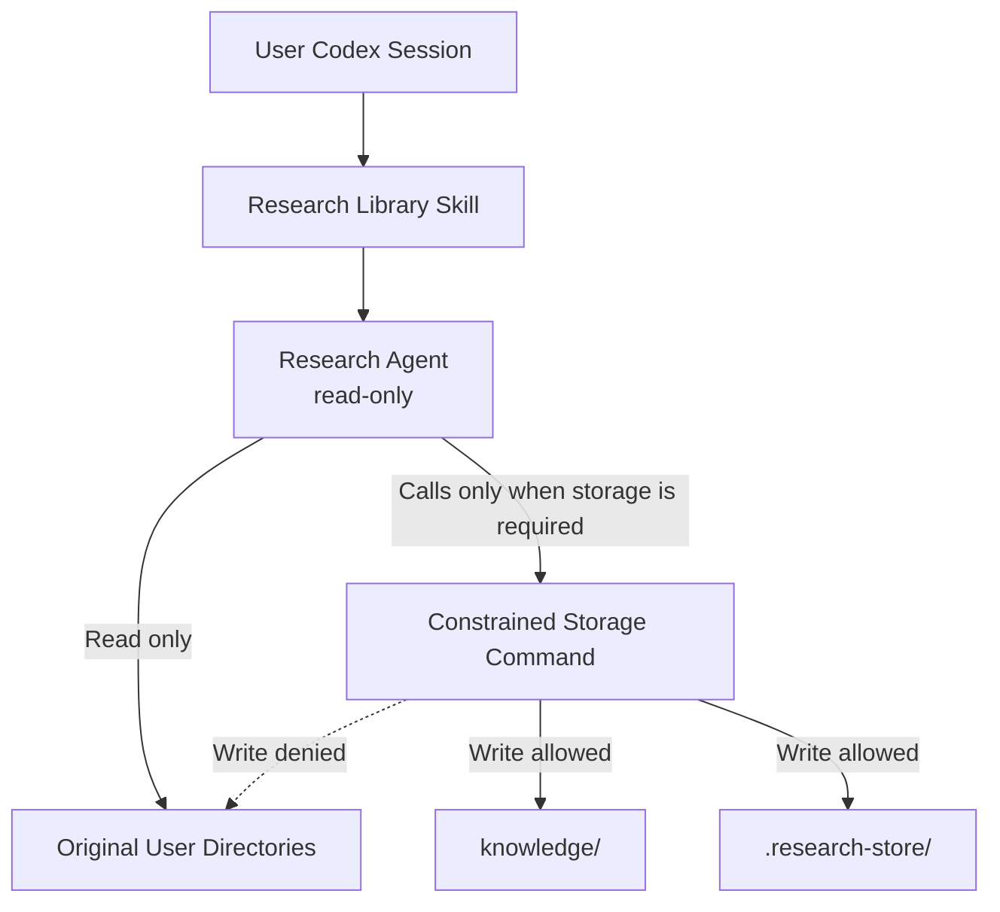

# Research Agent Technical Design

[한국어](./README.md) | [English](./README.en.md)

[Development roadmap](./ROADMAP.en.md)

This document records the operating principles and design decisions of Research
Agent by topic.

## 1. Protecting Original User Directories and Managing Permissions

### Design Goal

Research Agent reads PDF files stored across multiple user-selected locations
and converts them into searchable Markdown. The most important design principle
is to ensure that **Research Agent does not modify the user's original
directories**.

Original PDFs and their directories are used only as input sources. Converted
Markdown, search state, and temporary files are stored entirely within
directories owned by Research Agent.

### Permission Flow



When a user Codex session invokes Research Agent, the invoked agent does not
automatically use the parent session's permissions. Research Agent explicitly
runs with a separate `read-only` sandbox mode. As a result, the agent cannot
directly modify either the original files or the Research Agent store.

When Markdown or SQLite state must be saved, the agent invokes an approved
storage command. This command runs within a separate, constrained permission
profile.

| Location | Permission | Purpose |
| --- | --- | --- |
| Original user directories | Read only | PDF discovery and conversion input |
| `knowledge/` | Read and write | Converted Markdown and saved conversations |
| `.research-store/` | Read and write | Configuration, SQLite state, and temporary files |
| Other locations | Read or denied | Not used as Research Agent storage |

### Protection Layers

Original file protection does not depend on agent instructions alone.

1. **Agent permissions**
   Both the library management agent and the PDF visual review agent run in
   read-only mode. Rather than omitting the setting and inheriting permissions
   from the parent Codex session, their agent configurations explicitly declare
   read-only access.

2. **Storage command permissions**
   The agents do not create or modify files directly. They use a dedicated
   command that can write only within Research Agent. Original directories are
   included only as readable locations for this command.

3. **Application path validation**
   The application verifies that every generated file remains inside Research
   Agent. It rejects path traversal, symbolic links, and hard links that could
   redirect a write into an original directory or another external location.
   Original PDFs are read and then processed in internal temporary storage. If
   an original changes during processing, the result is discarded.

4. **Limited feature scope**
   Research Agent provides no feature for editing, moving, renaming, or deleting
   original files. Removing a registered source only stops future discovery. It
   does not delete the original files or existing Markdown records.

### Relationship to the Parent Codex Session

Research Agent permissions and the permissions of the user Codex session that
invokes it are separate.

Research Agent runs with its own read-only permissions, and the storage command
runs with a constrained permission profile. Full access granted to the parent
session does not automatically expand the permissions of Research Agent.

Research Agent cannot, however, reduce the permissions of the parent Codex
session. A parent session with Full access can bypass Research Agent and perform
the following actions:

- Modify an original file directly.
- Modify Research Agent installation files or configuration.
- Run other commands that Research Agent does not provide.

This is a permission issue for the user Codex session as a whole rather than for
Research Agent operations. A less-privileged child agent cannot restrict the
more-privileged parent session that invoked it.

### Scope of the Guarantee

The current design guarantees the following:

> Operations performed through Research Agent do not write to original user
> directories.

The current design alone cannot guarantee the following:

> No operation on the computer, including one performed by a parent Codex
> session with Full access, can modify an original user directory.

The second level of protection requires a permission profile that makes the
original paths read-only for the entire user session rather than only for
Research Agent. Environments requiring stronger isolation must use an external
protection boundary, such as operating-system file permissions, a separate user
account, or a read-only mount.

### Verification Criteria

The permission design is verified through the following behaviors:

- The constrained storage command can write to `knowledge/` and
  `.research-store/`.
- The operating-system sandbox blocks the same command from writing to an
  external original directory.
- File contents in an original directory remain identical before and after
  synchronization.
- The application rejects output paths and links that point outside Research
  Agent.
- Registering or removing an original path changes only configuration owned by
  Research Agent.
- Removing Research Agent leaves every registered original file untouched.

### Implementation Responsibilities

| Responsibility | Source files |
| --- | --- |
| Install personal agents, command rules, and the constrained permission profile | [`scripts/personal_registration.py`](../../scripts/personal_registration.py) |
| Define the roles and behavioral limits of read-only agents | [`research-library-manager.toml`](../../resources/agents/research-library-manager.toml), [`research-paper-converter.toml`](../../resources/agents/research-paper-converter.toml) |
| Re-enter through the constrained storage command | [`research-store` launcher](../../resources/skills/research-library/scripts/research-store) |
| Validate storage and source boundaries | [`config.py`](../../src/research_store/config.py), [`safety.py`](../../src/research_store/safety.py) |
| Verify installation collisions and real sandbox permissions | [`test_personal_registration.py`](../../tests/test_personal_registration.py), [`test_install_security.py`](../../tests/test_install_security.py), [`test_permission_profile_integration.py`](../../tests/test_permission_profile_integration.py) |

## 2. PDF Conversion and Result Reliability

### Design Goal

PDF conversion is not intended to reproduce an editable document that is
structurally identical to the original. Research Agent first creates a
**page-level text index for search and discovery**, then visually checks only
the pages where equations, tables, figures, or extraction failures make accuracy
more important.

Base extraction and visual verification remain separate in the saved record. A
user can therefore tell whether a result came from plain text extraction or was
checked again against an image of the original page.

### Conversion Flow


### Base Text Extraction

`pypdf` reads the text stored inside the PDF one page at a time. Each page is
preceded by a marker such as:

```markdown
<!-- page: 3 -->

Text extracted from the page
```

The result is not a complete semantic reconstruction of the paper in Markdown.
It stores searchable text by page instead of rebuilding titles, body sections,
equations, and tables as structured Markdown elements.

For ordinary text-based English PDFs, the result is useful for finding titles,
abstracts, and important terms in the body. Base extraction alone is less
reliable for:

- The exact reading order of multi-column documents
- Words split by line breaks and hyphenation
- Superscripts, subscripts, fractions, and special mathematical symbols
- Table row and column relationships and merged cells
- The meaning of figures, plots, legends, and axes
- Characters encoded with specialized fonts
- Scanned documents stored only as images

### Selecting Pages for Visual Review

The base extraction stage registers a page for visual review when it detects:

- `Table`, `Figure`, `Equation`, or the corresponding Korean terms
- A high density of mathematical symbols
- Multiple short lines that resemble equations
- Images embedded in the PDF page
- Very little extracted text

This selection is a rule-based candidate detector. It can include pages that do
not require review and can miss important pages such as captionless vector
diagrams or equations whose fonts were not recognized. `not-needed` therefore
means that the current rules did not detect a need for review; it does not mean
that the page's accuracy was verified.

### Sol High Visual Review

Only selected pages are rendered as 220 DPI PNG images. The visual review agent
compares each page image with the base Markdown and records:

- LaTeX representations of equations that are visually clear
- Markdown representations of simple tables
- Confirmed figure structure, axes, legends, and relationships
- Errors confirmed in the base text extraction
- Symbols, cells, or layouts that remain unreadable

Visual review does not overwrite the base extraction. It appends a separate
`Visual verification notes` section. The reviewer must not guess an ambiguous
value and leaves the page as `needs-review` when uncertainty remains.

The system also compares the PDF's SHA-256 at rendering time and at review
completion. If the hashes differ, it rejects notes created from the outdated
page image.

### Meaning of Review States

| State | Meaning |
| --- | --- |
| `not-needed` | The current selection rules found no review candidate |
| `pending` | Selected for visual review but not yet completed |
| `verified` | The visual review agent checked the selected page |
| `needs-review` | Visual review was performed, but uncertainty remains |

`verified` records completion of AI review for the selected pages. It is not a
human certification or a guarantee of mathematical identity for equations and
numeric values.

### Reliability by Use Case

| Use case | Current assessment |
| --- | --- |
| Search paper titles, topics, abstracts, and ordinary prose | Suitable as a search index |
| Locate a document and page containing relevant content | Page markers support returning to the original |
| Reuse an equation exactly | Check the original page even after visual review |
| Cite table values and row or column relationships | Check the original page |
| Read exact numeric values from a graph | Check the original page |
| Reproduce a PDF as structurally identical Markdown | Outside the current design goal |

The current architecture is suitable for a research discovery prototype. Using
Markdown alone as an exact source for scientific values, equations, and tables
is outside its present guarantee.

### Implementation Responsibilities

| Responsibility | Source files |
| --- | --- |
| Discover PDFs, create temporary copies, extract text, select candidates, render pages, and save review results | [`sync.py`](../../src/research_store/sync.py) |
| Manage document state and page-level review state | [`state.py`](../../src/research_store/state.py) |
| Coordinate synchronization and visual review agents | [`research-library-manager.toml`](../../resources/agents/research-library-manager.toml) |
| Define image interpretation and uncertainty handling | [`research-paper-converter.toml`](../../resources/agents/research-paper-converter.toml) |
| Route user requests into synchronization, search, and review | [`research-library/SKILL.md`](../../resources/skills/research-library/SKILL.md) |
| Verify conversion, queues, hash matching, and source preservation | [`test_sync.py`](../../tests/test_sync.py) |
