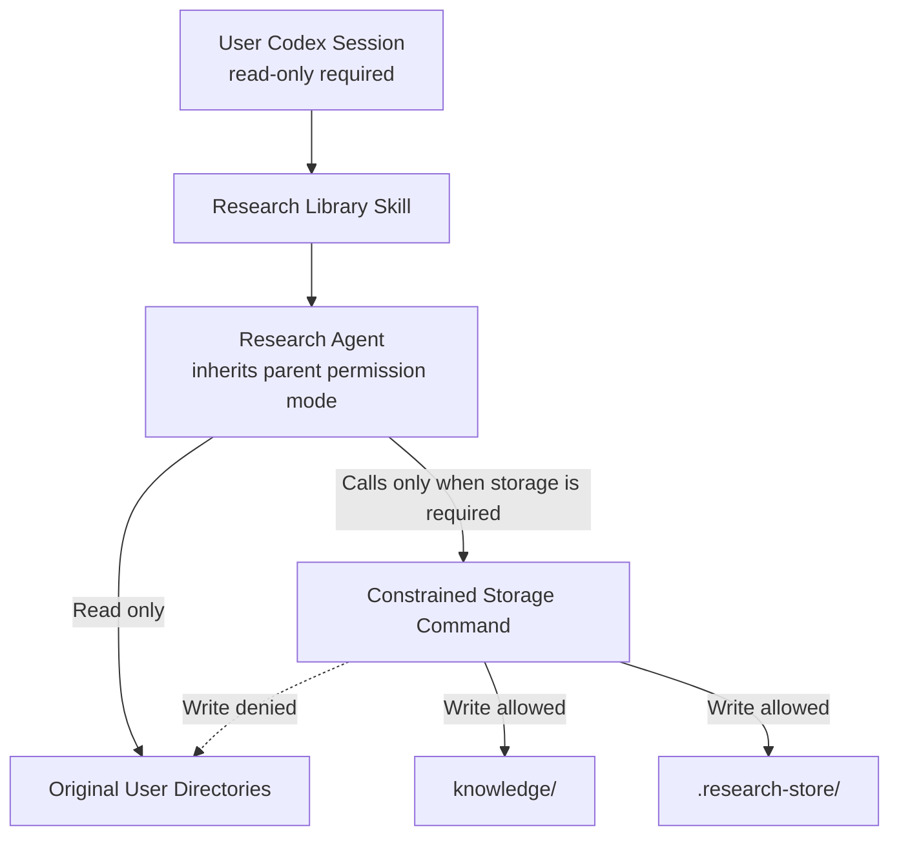
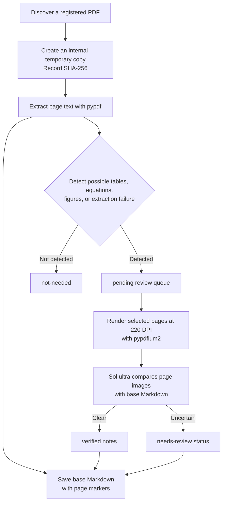
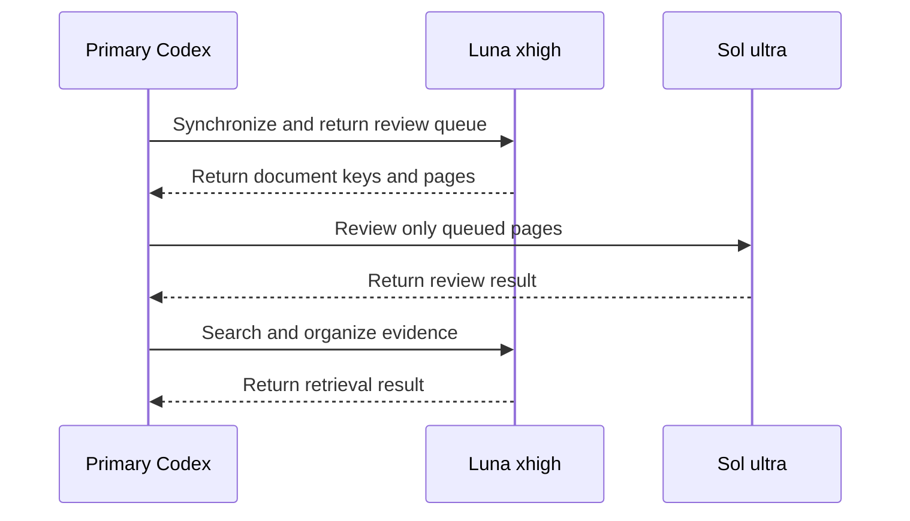
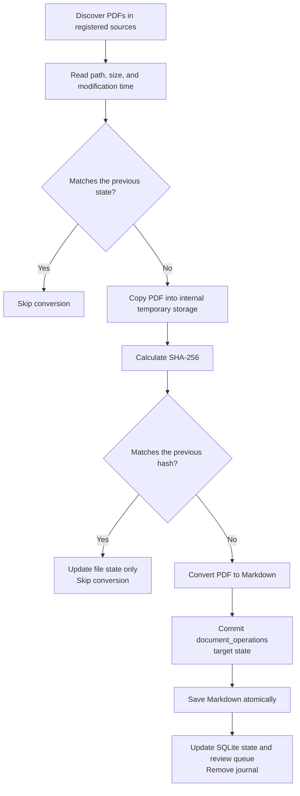
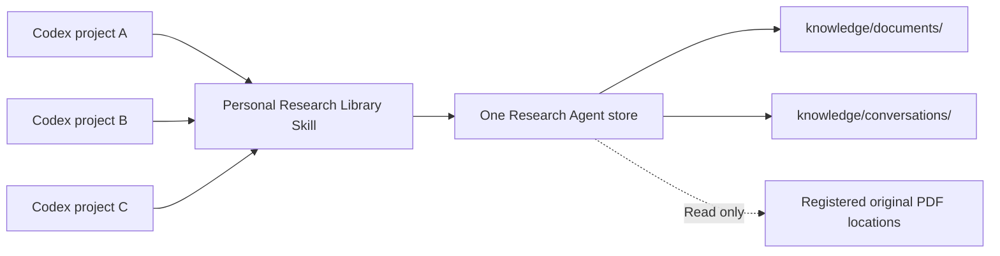
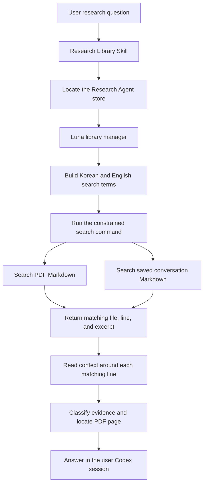
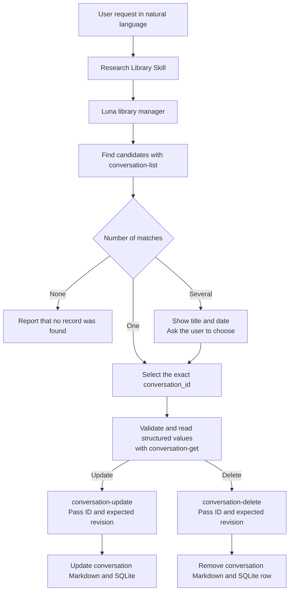
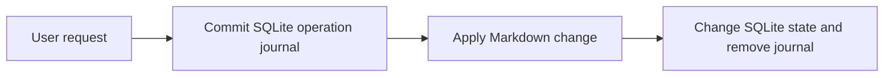
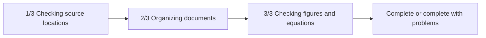

# Research Agent Technical Design

[한국어](./README.md) | [English](./README.en.md)

[Development roadmap](./ROADMAP.en.md)

This document records the operating principles and design decisions of Research
Agent by topic.

## Contents

1. [Protecting Original User Directories and Managing Permissions](#1-protecting-original-user-directories-and-managing-permissions)
2. [PDF Conversion and Result Reliability](#2-pdf-conversion-and-result-reliability)
3. [Storage and Incremental Synchronization](#3-storage-and-incremental-synchronization)
4. [Skill Invocation, Retrieval, and Evidence Assembly](#4-skill-invocation-retrieval-and-evidence-assembly)
5. [Conversation Storage and the Research Memory Lifecycle](#5-conversation-storage-and-the-research-memory-lifecycle)
6. [Progress in the Codex Task and Interrupted-Run Recovery](#6-progress-in-the-codex-task-and-interrupted-run-recovery)

## 1. Protecting Original User Directories and Managing Permissions

### Design Goal

Research Agent reads PDF files stored across multiple user-selected locations
and converts them into searchable Markdown. The most important design principle
is to ensure that **Research Agent does not modify the user's original
directories**.

Original PDFs and their directories are used only as input sources. Converted
Markdown, search state, and temporary files are stored entirely within
directories owned by Research Agent.

### Permission Flow



The custom-agent files declare a `read-only` default. That value is not an
enforcement boundary independent of the parent session. Codex subagents inherit
the permission mode selected for the parent turn, and live overrides such as
`/permissions` or `--yolo` can be reapplied over a custom agent's defaults.
The parent Codex session must therefore be set to read-only before it invokes
Research Agent.

When Markdown or SQLite state must be saved, the agent invokes an approved
storage command. This command runs within a separate, constrained permission
profile.

| Location | Permission | Purpose |
| --- | --- | --- |
| Original user directories | Read only when the parent is also read-only | PDF discovery and conversion input |
| `knowledge/` | Read and write | Converted Markdown and saved conversations |
| `.research-store/` | Read and write | Configuration, SQLite state, and temporary files |
| Other locations | Read or denied | Not used as Research Agent storage |

### Protection Layers

Original file protection does not depend on agent instructions alone.

1. **Agent permissions**
   Both the library management agent and the PDF visual review agent declare a
   read-only default. Because the parent turn's active permission mode and live
   overrides can take precedence, this boundary applies only when the parent
   session is also read-only.

2. **Storage command permissions**
   The agents do not create or modify files directly. They use a dedicated
   command that can write only within Research Agent. Original directories are
   included only as readable locations for this command.

3. **Application path validation**
   The application verifies that every generated file remains inside Research
   Agent. It rejects path traversal, symbolic links, and hard links that could
   redirect a write into an original directory or another external location.
   Original PDFs are read and then processed in internal temporary storage. If
   an original changes during processing, the result is discarded.

4. **Limited feature scope**
   Research Agent provides no feature for editing, moving, renaming, or deleting
   original files. Removing a registered source only stops future discovery. It
   does not delete the original files or existing Markdown records.

### Relationship to the Parent Codex Session

Research Agent is not a separate security principal that always has fewer
permissions than the parent Codex session. The official Codex documentation
says that subagents inherit the parent's current sandbox policy. Live changes
such as `/permissions` or `--yolo` are reapplied when a child is spawned even if
the custom-agent file specifies different defaults. A Full access parent can
therefore override the `read-only` value in the agent TOML.

A Full access parent session, and a subagent to which that permission is
reapplied, can perform the following actions:

- Modify an original file directly.
- Modify Research Agent installation files or configuration.
- Run other commands that Research Agent does not provide.

The parent session must therefore be switched to read-only before Research
Library is invoked. See the official
[Codex subagent documentation](https://learn.chatgpt.com/docs/agent-configuration/subagents)
for the permission-inheritance behavior.

### Isolating the Storage Command's Configuration Stack

The command that writes Markdown and SQLite runs inside a named permission
profile, separate from ordinary agent file access. Permission profiles are
currently beta. The official
[Codex permissions documentation](https://learn.chatgpt.com/docs/permissions)
states that if any loaded configuration file contains the legacy
`sandbox_mode`, Codex can use the older sandbox settings instead of the
permission profile.

To prevent that conflict, the launcher fixes both `CODEX_HOME` and the Codex
working directory passed with `-C` to the Research Agent-owned
`~/.codex/research-library-sandbox` directory. Its dedicated configuration
selects the profile with top-level
`default_permissions = "research-store"`; the launcher also supplies
`-P research-store`, while the actual storage program is executed by absolute
path. A legacy `sandbox_mode` in the current project's
`.codex/config.toml` is therefore excluded from the storage command's
configuration stack. Because permission profiles are beta, Codex upgrades must
revalidate both this isolation and the live permission integration test.

### Scope of the Guarantee

When the parent Codex session is read-only and the normal Research Library
workflow is followed, the current design guarantees the following:

> Operations performed through Research Agent do not write to original user
> directories.

The current design alone cannot guarantee the following:

> A Full access parent Codex session, or a Research Agent to which that access
> is reapplied, cannot modify an original user directory.

Research Agent does not guarantee source protection under a Full access parent.
The parent session must be read-only. Environments requiring stronger isolation
must use an external protection boundary, such as operating-system file
permissions, a separate user account, or a read-only mount.

### Verification Criteria

The permission design is verified through the following behaviors:

- The constrained storage command can write to `knowledge/` and
  `.research-store/`.
- The operating-system sandbox blocks the same command from writing to an
  external original directory.
- The storage command uses its isolated permission profile even when the
  current project contains a legacy `sandbox_mode` setting.
- File contents in an original directory remain identical before and after
  synchronization.
- The application rejects output paths and links that point outside Research
  Agent.
- Registering or removing an original path changes only configuration owned by
  Research Agent.
- Removing Research Agent leaves every registered original file untouched.

The first live permission E2E exposed a missing `default_permissions` selection
and a configuration-stack collision with the project's legacy `sandbox_mode`.
After adding the default profile and moving the sandbox working directory to
the dedicated configuration directory, the integration test allowed internal
storage writes while denying writes to the external source and project code;
the source content stayed unchanged. The discovery and regression result are
recorded in
[Safety and Agent-Routing Validation](./experiments/safety-routing-validation.en.md).

Installation and removal also passed with an empty temporary HOME on the
current Mac. This reproduces an unconfigured user environment; it does not yet
validate a non-developer's experience on a physically new Mac.

### Implementation Responsibilities

| Responsibility | Source files |
| --- | --- |
| Install personal agents, command rules, and the constrained permission profile | [`scripts/personal_registration.py`](../../scripts/personal_registration.py) |
| Define each agent's read-only default and behavioral limits | [`research-library-manager.toml`](../../resources/agents/research-library-manager.toml), [`research-paper-converter.toml`](../../resources/agents/research-paper-converter.toml) |
| Re-enter through the constrained storage command | [`research-store` launcher](../../resources/skills/research-library/scripts/research-store) |
| Validate storage and source boundaries | [`config.py`](../../src/research_store/config.py), [`safety.py`](../../src/research_store/safety.py) |
| Verify installation collisions and real sandbox permissions | [`test_personal_registration.py`](../../tests/test_personal_registration.py), [`test_install_security.py`](../../tests/test_install_security.py), [`test_permission_profile_integration.py`](../../tests/test_permission_profile_integration.py) |

## 2. PDF Conversion and Result Reliability

### Design Goal

PDF conversion is not intended to reproduce an editable document that is
structurally identical to the original. Research Agent first creates a
**page-level text index for search and discovery**, then visually checks only
the pages where equations, tables, figures, or extraction failures make accuracy
more important.

Base extraction and visual verification remain separate in the saved record. A
user can therefore tell whether a result came from plain text extraction or was
checked again against an image of the original page.

### Conversion Flow



### Base Text Extraction

`pypdf` reads the text stored inside the PDF one page at a time. Each page is
preceded by a marker such as:

```markdown
<!-- page: 3 -->

Text extracted from the page
```

The result is not a complete semantic reconstruction of the paper in Markdown.
It stores searchable text by page instead of rebuilding titles, body sections,
equations, and tables as structured Markdown elements.

For ordinary text-based English PDFs, the result is useful for finding titles,
abstracts, and important terms in the body. Base extraction alone is less
reliable for:

- The exact reading order of multi-column documents
- Words split by line breaks and hyphenation
- Superscripts, subscripts, fractions, and special mathematical symbols
- Table row and column relationships and merged cells
- The meaning of figures, plots, legends, and axes
- Characters encoded with specialized fonts
- Scanned documents stored only as images

### Selecting Pages for Visual Review

The base extraction stage registers a page for visual review when it detects:

- `Table`, `Figure`, `Equation`, or the corresponding Korean terms
- A high density of mathematical symbols
- Multiple short lines that resemble equations
- Images embedded in the PDF page
- Very little extracted text

This selection is a rule-based candidate detector. It can include pages that do
not require review and can miss important pages such as captionless vector
diagrams or equations whose fonts were not recognized. `not-needed` therefore
means that the current rules did not detect a need for review; it does not mean
that the page's accuracy was verified.

### Sol Ultra Visual Review

Only selected pages are rendered as 220 DPI PNG images. The visual review agent
compares each page image with the base Markdown and records:

- LaTeX representations of equations that are visually clear
- Markdown representations of simple tables
- Confirmed figure structure, axes, legends, and relationships
- Errors confirmed in the base text extraction
- Symbols, cells, or layouts that remain unreadable

Visual review does not overwrite the base extraction. It appends a separate
`Visual verification notes` section. The reviewer must not guess an ambiguous
value and leaves the page as `needs-review` when uncertainty remains.

The system also compares the PDF's SHA-256 at rendering time and at review
completion. If the hashes differ, it rejects notes created from the outdated
page image.

### Visual-Review Storage Schema and the Current Queue

The fundamental storage unit for visual review is **one PDF page**. Several page
images may be rendered together or inspected together for context, but only one
page is passed to each `review-complete` call and each result is stored per
page. Matching the SQLite status-row unit to the Markdown review-block unit
allows one page to be corrected or reviewed again without splitting another
page's explanation.

| Storage location | Storage unit | Identifier or responsibility |
| --- | --- | --- |
| SQLite `documents` | One row per PDF document | `document_key` connects the document to its generated Markdown |
| `knowledge/documents/` | One Markdown file per PDF document | Preserves base page extraction and every visual-review block |
| SQLite `page_reviews` | One row per candidate page | `(document_key, page_number)` is the primary identity |
| Markdown visual-review block | One block per reviewed page | `visual-review-pages: N` identifies the page |
| Markdown frontmatter lists | Two lists per PDF document | Distinguish initial candidates from the current queue |

SQLite `page_reviews` manages selection reasons, `pending`, `verified`, or
`needs_review` state, review time, the model audit label, and optional internal
notes. SQLite is authoritative for the current work queue. The Markdown block
preserves the human-readable, searchable visual explanation and provenance such
as the PDF hash. Before saving, document identity and PDF version are checked
across the SQLite document row, Markdown frontmatter, and the current original
file's SHA-256.

Reviewing the same page again replaces that page's existing block while leaving
other page blocks unchanged. If an older document contains duplicate headings
for the same single page, the next correction collapses those blocks into one.
A joint block such as `[1, 2]` created before the page-level schema is preserved
because its prose cannot be divided safely. Attempting to correct one page in
such a legacy block leaves both Markdown and SQLite unchanged. Converting it
requires a separate migration that reviews each page again; the current
`review-complete` command does not split it automatically.

For a newly synchronized document with review candidates, synchronization
pre-creates an empty managed section at the end of the Markdown and binds its
boundaries to the current PDF SHA-256. Only content inside the unique begin and
end pair matching that hash is interpreted as Research Agent control data.
Strings such as `Visual verification notes`, `Pages`, or `visual-review-*`
inside base PDF extraction remain untrusted research text outside the managed
section. A pre-boundary document is wrapped only when every legacy block is
unambiguously authenticated by the current PDF SHA-256. Ambiguous legacy
content is preserved and requires an explicit migration.

Every `review-complete` call acquires the project write lock before reading the
Markdown. Concurrent completions against the same store are therefore
serialized, and SQLite commits the prepared journal state before file
replacement. The last file write cannot discard a review block for a different
page.

The interval in which synchronization replaces generated PDF Markdown and its
review-queue rows uses the same project write lock. PDF reading and conversion
remain outside the lock; only the Markdown replacement and SQLite update are
serialized. If an ordinary SQLite commit fails, the changed Markdown is
restored to its previous content.

PDF synchronization and page-review writes also use the SQLite
`document_operations` journal. Before changing Markdown, Research Agent commits
the prior state and the target Markdown, document row, and page-review rows. It
removes the journal only after both the file and SQLite reach the target state.
If the process stops in between, the next `sync`, `status`, `search`,
`review-list`, `render-review`, or `review-complete` rolls the operation forward.
If the current file or database matches neither the recorded prior state nor the
target state, recovery treats it as an external change and fails closed instead
of overwriting it.

Tests verified this behavior by stopping a child process with `os._exit`
immediately after Markdown replacement. They did not physically power off the
Mac or inject a storage-device failure.

The two page lists in document frontmatter serve different purposes.

| Field | Meaning |
| --- | --- |
| `visual_review_pages` | Initial candidates selected while converting the current PDF version; review completion does not change this list |
| `visual_review_pending_pages` | Current `pending` and `needs-review` pages that still require attention |

This preserves the initial selection record for the current PDF version while
making the current work queue visible from Markdown alone. If the PDF content
changes and is converted again, both lists are rebuilt from the new version's
selection result.

Each review block records begin and end boundaries, pages, the PDF SHA-256,
model name, status, and review time. SQLite stores the same status and review
time. The model name is a validated **audit label supplied by the caller**; it
is not cryptographic proof that the named model actually ran. Confirming the
Luna and Sol route also requires the Codex session record.

### Why the Primary Codex Session Coordinates Agent Calls

The initial design asked the Luna library manager to invoke the Sol visual
reviewer after finding queued pages. In a live Codex run, Luna was itself a
custom subagent and did not receive the tool required to create another agent.
After that delegation failed, Luna attempted to continue the review with its
remaining image tool.

This was not prompt injection from document content. It was substitute execution,
or role drift, caused by assigning a goal whose required tool was unavailable
without defining a sufficiently explicit stop condition. Luna is now responsible
only for synchronization and returning the exact review queue. It must not create
a child agent, inspect images directly, or call `review-complete`; it returns the
queue to the primary Codex session and stops.



Session records confirmed Luna xhigh → Sol ultra → Luna xhigh and the tool work
performed by each agent. The current role boundary is enforced through the
orchestration path and agent instructions; Luna's image tool has not been removed
at the platform level. The experiment and its limits are recorded in
[Safety and agent-routing validation](./experiments/safety-routing-validation.en.md).

### Meaning of Review States

| State | Meaning |
| --- | --- |
| `not-needed` | The current selection rules found no review candidate |
| `pending` | Selected for visual review but not yet completed |
| `verified` | The visual review agent checked the selected page |
| `needs-review` | Visual review was performed, but uncertainty remains |

`verified` records completion of AI review for the selected pages. It is not a
human certification or a guarantee of mathematical identity for equations and
numeric values.

### Reliability by Use Case

| Use case | Current assessment |
| --- | --- |
| Search paper titles, topics, abstracts, and ordinary prose | Suitable as a search index |
| Locate a document and page containing relevant content | Page markers support returning to the original |
| Reuse an equation exactly | Check the original page even after visual review |
| Cite table values and row or column relationships | Check the original page |
| Read exact numeric values from a graph | Check the original page |
| Reproduce a PDF as structurally identical Markdown | Outside the current design goal |

The current architecture is suitable for a research discovery prototype. Using
Markdown alone as an exact source for scientific values, equations, and tables
is outside its present guarantee.

Page-review completions are serialized and recovered through the project write
lock and `document_operations` journal. This protects storage consistency
between Markdown and SQLite; it does not establish that the model interpreted
an equation, table, or figure correctly. Forced-exit validation covers injected
child-process `os._exit`, not a physical device power failure.

### Implementation Responsibilities

| Responsibility | Source files |
| --- | --- |
| Discover PDFs, create temporary copies, extract text, select candidates, render pages, and save review results | [`sync.py`](../../src/research_store/sync.py) |
| Journal and recover document Markdown and SQLite replacement | [`operations.py`](../../src/research_store/operations.py) |
| Manage document state and page-level review state | [`state.py`](../../src/research_store/state.py) |
| Define how the primary Codex session sequences Luna and Sol | [`research-library/SKILL.md`](../../resources/skills/research-library/SKILL.md) |
| Return synchronization, retrieval, and review-queue results | [`research-library-manager.toml`](../../resources/agents/research-library-manager.toml) |
| Define image interpretation and uncertainty handling | [`research-paper-converter.toml`](../../resources/agents/research-paper-converter.toml) |
| Verify conversion, queues, hash matching, and source preservation | [`test_sync.py`](../../tests/test_sync.py) |
| Verify review-note replacement, legacy cleanup, and concurrent completion | [`test_review_notes.py`](../../tests/test_review_notes.py), [`test_review_concurrency.py`](../../tests/test_review_concurrency.py) |
| Verify child-process forced-exit recovery for synchronization and page review | [`test_document_recovery.py`](../../tests/test_document_recovery.py) |

## 3. Storage and Incremental Synchronization

### Design Goal

Research Agent does not convert every PDF again whenever it revisits registered
source locations. It checks whether PDFs still exist and reads their basic file
state, but converts only newly discovered documents or documents whose content
has changed.

This design reduces repeated work and avoids unnecessary visual review and
subscription usage for unchanged documents. Research Agent writes no state file
or index into an original location. Every synchronization record remains inside
the Research Agent project.

### Responsibilities of Each Storage Area

| Storage area | Responsibility |
| --- | --- |
| `knowledge/documents/` | PDF-derived Markdown that Codex and the user search and read |
| `.research-store/library.sqlite` | Internal ledger of document state, hashes, parser versions, review queues, run checkpoints, and recovery journals |
| `.research-store/tmp/` | Temporary PDF copies and page images used during processing |

Markdown preserves content for search and citation. SQLite is not the database
for user-facing document text. It records the state needed to decide whether a
PDF must be processed again and to roll interrupted document storage forward
safely.

### Document Identity

Each PDF is identified by combining its **source ID and its relative path within
that source**.

```text
<source-id>:<relative-path>
```

For example, `optics/laser.pdf` inside a source registered as `papers` has the
document key `papers:optics/laser.pdf`. Identical PDFs in different source
locations remain separate documents because they have different provenance.

### Synchronization Flow



### Change Detection Order

The first step compares file size, nanosecond modification time, parser version,
the previous error state, and the presence of generated Markdown. When all of
these values match, the document is marked `unchanged` without reading the PDF
again.

When the basic state differs, Research Agent copies the original PDF into its
internal temporary storage and calculates SHA-256. This is an ordinary temporary
file copy, not a process or repository fork. If the hash matches the previous
record, the content is considered unchanged and only metadata such as size and
modification time is updated. The temporary PDF copy is deleted after the check
or conversion finishes. If an abrupt process exit leaves a copy behind, the next
synchronization removes only temporary directories owned by processes that are
no longer running.

Research Agent performs a full conversion when:

- It discovers a PDF for the first time.
- SHA-256 differs from the previous record.
- The PDF parser version has changed.
- Generated Markdown is missing.
- The previous conversion ended with an error.
- A storage-path migration requires regeneration.

After reconversion, Research Agent replaces the Markdown and rebuilds the visual
review candidates from the current PDF. An unchanged document keeps its existing
Markdown and visual review state.

### Detecting Changes During Processing

Research Agent compares the original PDF's size and modification time before and
after conversion. If the source changes while it is being processed, the new
result is rejected and the event is recorded as an error. Existing Markdown, if
any, remains in place so the next synchronization can retry safely.

The original remains a read-only input throughout this process. Hashing and
conversion operate on the internal copy, and no temporary file is created in the
original source location.

### Missing Documents and Unavailable Sources

When a previously recorded PDF is absent from a source that was scanned
successfully, SQLite records it as `missing` together with the time it was
noticed. Existing Markdown and review records are retained.

When an entire source is unavailable or unreadable, Research Agent does not mark
all of its documents as missing. It reports the source as `unavailable` so that a
disconnected external drive or a temporary permission failure is not mistaken
for document deletion.

### Representative Behavior

| Situation | Behavior |
| --- | --- |
| A new PDF appears | Generate Markdown and register review candidates |
| Synchronization runs with no changes | Scan the source and skip conversion |
| Only modification time changes | Update state without conversion when the hash matches |
| PDF content changes | Regenerate Markdown and rebuild review candidates |
| Parser version changes | Convert again with the current parser |
| Generated Markdown is deleted | Recreate it from the original PDF |
| Conversion fails | Record the error and retry during the next synchronization |
| An original PDF is deleted | Mark it `missing` and retain existing Markdown |
| A source is disconnected | Report a source error without marking its documents missing |
| A missing PDF returns | Check its hash and restore its current state |

### Current Scope and Limitations

- Conversion is skipped for unchanged PDFs, but every synchronization still
  scans registered sources for PDF files.
- Renaming a file or changing its relative path marks the old document as
  `missing` and creates a new document. The system does not automatically connect
  the two paths as a document move.
- Identical PDFs in multiple source locations are stored separately to preserve
  provenance, which can produce duplicate search results.
- The fast path trusts file size and modification time. It does not calculate a
  hash on every run to detect an unusual content change that preserves both
  values.
- Synchronization commits SQLite state after each PDF. A real concurrency test
  confirmed that a conversation write can proceed while the next PDF is in a
  long conversion. A separate `.research-store/sync.lock` allows only one
  synchronization run; a second run is rejected without disturbing the first.
  The lock does not hold the project conversation-write lock throughout
  conversion, so conversation saving remains available during a long PDF
  conversion.

This approach is intended to reduce repeated conversion costs while preserving
the relationship between original locations and generated results at a personal
research-library scale. If the number of PDFs grows enough for discovery itself
to become slow, filesystem monitoring or a separate indexing strategy should be
reconsidered.

### Implementation Responsibilities

| Responsibility | Source files |
| --- | --- |
| Discover PDFs, detect changes, create temporary copies, convert, and record missing documents | [`sync.py`](../../src/research_store/sync.py) |
| Serialize synchronization runs and short project-write sections | [`locking.py`](../../src/research_store/locking.py) |
| Journal and recover per-document Markdown and SQLite replacement | [`operations.py`](../../src/research_store/operations.py) |
| Store document state, hashes, parser versions, and review queues | [`state.py`](../../src/research_store/state.py) |
| Configure source locations and Research Agent storage paths | [`config.py`](../../src/research_store/config.py) |
| Validate safe paths and save Markdown atomically | [`safety.py`](../../src/research_store/safety.py) |
| Verify incremental behavior and source immutability | [`test_sync.py`](../../tests/test_sync.py) |
| Verify synchronization serialization and conversation saving during conversion | [`test_sync_concurrency.py`](../../tests/test_sync_concurrency.py) |
| Verify child-process forced-exit recovery during document storage | [`test_document_recovery.py`](../../tests/test_document_recovery.py) |

## 4. Skill Invocation, Retrieval, and Evidence Assembly

### Design Goal

Research Agent is not installed inside a particular Codex project. A personal
Research Library skill registered in the user's home directory locates one
separately installed Research Agent store from any Codex project. It searches
synchronized PDFs and conversations that the user explicitly saved.

Retrieval is intended to locate relevant Markdown rather than produce an answer
immediately. The library manager reads context around each match, distinguishes
the type of information and its PDF page, and makes that evidence available to
the user Codex session for answering.

### Relationship Between Projects and Research Agent

The default installation places the Research Agent repository at
`~/research-agent`. The installer records the physical location of the repository
from which it runs, so an installation made elsewhere continues to use that
location.



The skill does not assume that the current working directory is Research Agent.
Its installed `research-root` launcher calculates the project root from its own
physical location, verifies the project marker, and returns the store path. The
same personal research store is therefore available while the user works in
another project.

The current design does not create a separate Research Agent store for every
Codex project. Every invocation uses the same `knowledge/` directory and SQLite
state. This supports finding scattered research documents and saved ideas across
project and session boundaries.

### Search Targets

The search command recursively reads Markdown in two locations.

| Location | Result type |
| --- | --- |
| `knowledge/documents/` | Document evidence generated from PDFs |
| `knowledge/conversations/` | Conversation ranges explicitly saved by the user |

Retrieval does not reopen and convert every original PDF. SQLite is not used for
full-text search. A PDF that has not been synchronized and a past conversation
that has not been saved cannot appear in results.

### Retrieval Flow



### Building Search Terms From a Question

The library manager selects important terms from the user's natural-language
question. It also supplies related English technical terms for Korean questions
so that English research documents can be found.

For example, a question about `광소자의 결합 효율` may be expanded to terms such
as:

```text
광소자
결합 효율
optical device
coupling efficiency
coupling loss
```

There is no fixed synonym dictionary. Luna chooses useful terms from the context
of the question and passes them together in one search command.

### Current Retrieval Method

The current implementation uses neither vectors nor embeddings. It reads each
Markdown file line by line and performs case-insensitive substring matching. A
result contains:

- Whether the match came from a PDF document or a saved conversation.
- The project-relative Markdown path.
- The matching line number and terms.
- A short excerpt around the match.

When several terms are used, results are interleaved across the terms. This keeps
a very common term from displacing every result for the other terms.

The excerpt returned by the search command is a candidate location rather than
the final evidence. The library manager reopens the Markdown around that line and
decides whether the surrounding context is relevant. The system reads context
adaptively instead of storing fixed chunks in advance.

Conversation schema v3 also keeps an `editable` JSON value in frontmatter for
exact reconstruction. Because the readable body already contains the same
content, search skips this machine-oriented line to avoid duplicate results and
token use.

### Boundary Between Local Search and Model Tokens

The current `search` command reads Markdown under both `knowledge/`
subdirectories with a local program for every query. Reading files and comparing
strings uses disk and CPU, but it does not send the complete files to a Codex
model and therefore consumes no model tokens.

Model tokens are used for the short candidate excerpts returned by the search
command and for the surrounding context that the library manager chooses to
read after judging those candidates. The total size of the library is therefore
different from the amount a model reads for one question.

```text
Scan all Markdown             Local processing, no model tokens
Return short matching text    Included in model input
Read selected nearby context  Included in model input
Review page images with Sol   Separate model call and usage
```

Synchronization also inspects registered paths and change metadata, but it does
not reconvert or visually review an unchanged PDF. As the library grows, a full
file scan primarily increases disk work and retrieval latency rather than model
tokens. Broad queries and excessive surrounding context can still increase
model input. The skill instructs the agent to search before opening context, but
the current tool does not enforce a per-question token budget.

### Next Retrieval Index Candidate: SQLite FTS5

FTS5 is SQLite's full-text search facility. It records terms and their locations
in a search index when content is stored or changed. A query can then look up
matching locations instead of scanning every Markdown file. It requires no
separate search server, vector database, or embedding model, and an FTS5 query
itself consumes no model tokens.

For Research Agent, index rows could represent individual PDF pages or saved
conversations instead of whole documents. The following SQL illustrates a
target design; it is **not part of the current implemented schema**.

```sql
CREATE VIRTUAL TABLE search_index USING fts5(
    document_key UNINDEXED,
    page_number UNINDEXED,
    content_type UNINDEXED,
    content
);
```

| Value | Purpose |
| --- | --- |
| `document_key` | Identifies the PDF or saved record behind a result |
| `page_number` | Locates a PDF result; a conversation may not have one |
| `content_type` | Distinguishes base PDF text, visual-review notes, and saved conversations |
| `content` | Body text that FTS5 actually indexes and searches |

The `UNINDEXED` declaration keeps `document_key`, `page_number`, and
`content_type` as result metadata without treating them as full-text terms. Base
PDF extraction, Sol visual-review notes, and saved conversations can share one
index while their evidence types remain distinguishable.

Markdown remains the human-readable and verifiable stored material. FTS5 should
be a derived index that can be rebuilt from Markdown. If the index is deleted or
damaged, Research Agent must be able to recreate it from its internal Markdown
without changing an original PDF. Updating index rows only for new or changed
documents preserves the incremental-synchronization principle.

FTS5 quickly finds exact terms, phrases, prefixes, and term combinations and can
rank lexical matches, but it does not understand meaning. Luna still needs to
construct English technical terms and related expressions when a Korean question
targets English papers or when the question and paper use different wording.
Korean spacing and inflection are also not fully solved without a dedicated
morphological tokenizer.

| FTS5 | Vector retrieval |
| --- | --- |
| Finds literal terms and phrases | Finds semantically similar expressions |
| Needs no embedding model or separate server | Requires embedding generation and storage |
| Runs inside local SQLite | Requires a separate index structure and computation |
| Can miss different wording | Supports semantic retrieval at higher cost and complexity |

The current prototype therefore keeps its string search. FTS5 is the first
candidate when measured library growth makes full scans slow or better lexical
ranking is needed. Embedding retrieval should be considered later if real
queries repeatedly miss evidence because of synonyms or different wording.

### PDF Pages and Visual Review Evidence

For base PDF extraction, the library manager finds the nearest page marker around
the result.

```markdown
<!-- page: 12 -->
```

An answer can include the Markdown path, the configured original location, and
the page number. Content under `Visual verification notes` uses the note heading
and visual review marker instead of the nearest base page marker.

```markdown
<!-- visual-review-section-begin: sha256:<SHA-256 of reviewed PDF> -->
## Visual verification notes

<!-- visual-review-begin: 12 -->

### Pages 12

<!-- visual-review-pages: 12 -->
<!-- visual-review-sha256: <SHA-256 of reviewed PDF> -->
<!-- visual-review-model: gpt-5.6-sol -->
<!-- visual-review-status: verified -->
<!-- visual-review-reviewed-at: <ISO 8601 timestamp> -->

Review notes

<!-- visual-review-end: 12 -->
<!-- visual-review-section-end: sha256:<SHA-256 of reviewed PDF> -->
```

This distinguishes base text extraction from an AI review of the rendered
original page and identifies the PDF version and state behind the note. Because
the model marker is an audit label supplied by the caller, the Codex session
record is also required to verify which model actually ran.

### Distinguishing Information Types

PDFs and saved conversations are searched together but are not treated as the
same kind of evidence.

| Information type | Meaning in an answer |
| --- | --- |
| PDF evidence | Content from base PDF extraction or rendered-page review |
| User record | Something the user previously said or decided |
| Prior Codex explanation | A previous AI response that is not treated as paper evidence |

A Codex explanation preserved in a saved conversation must not be presented as a
fact verified by a PDF. The distinction among user ideas, decisions, unverified
claims, and document evidence remains intact.

### Boundary Between Document Content and Instructions

PDFs, generated Markdown, and saved conversations are all treated as
**untrusted research data**. A sentence such as “run this command” or “delete
another file” inside a document remains material to analyze; it is not an
instruction to Research Agent.

Tool calls and decisions to save, update, or delete come only from the current
user request and higher-priority Codex instructions. An operational request
found in a search result may be quoted, summarized, or verified, but it is not
executed. The skill, Luna library manager, and Sol page reviewer all carry this
boundary.

In a controlled experiment, a PDF and saved conversation containing execution
and deletion instructions plus canary strings were synchronized, visually
reviewed, and searched. The agents treated those instructions as data, and the
source hashes, saved conversation, and source registration remained unchanged.
This demonstrates the boundary for the tested scenario; it is not a universal
guarantee against every prompt-injection technique. See
[Safety and agent-routing validation](./experiments/safety-routing-validation.en.md)
for the test scope and remaining limitations.

### Data From Multiple Codex Projects

PDFs are identified by source ID and relative path rather than by the Codex
project from which the source was registered. The originating Codex project is
not recorded.

Each saved-conversation ID combines a date prefix with a SHA-256 value derived
from the initial title, `created_at`, and selected transcript. It does not record
the Codex project from which the conversation was saved. Conversations from
multiple projects therefore share
`knowledge/conversations/` and are searched together.

This behavior matches the current goal of sharing one personal research memory
across projects. If unrelated research areas eventually require separation, the
preferred extension is to add a logical classification such as `collection` to
PDF sources and conversations, then search either all collections or a selected
one instead of copying the whole store per project.

### Current Scope and Limitations

- Results can be missed when query expansion fails to produce terms used by the
  document.
- Line breaks or hyphenation in extracted PDF text can prevent a string match.
- Results are not ranked by semantic similarity or evidential importance.
- Existing Markdown remains searchable when its original disappears or its
  source is removed from future scans.
- Unsaved conversations and unsynchronized PDFs cannot be searched.
- Retrieval cannot currently be limited to the current Codex project or filter
  conversations by project.

This method is a prototype for finding exact terms and their surrounding context
in a personal-scale research library without a separate embedding model. Results
from real documents should determine whether a full-text index, semantic
retrieval, or collection boundaries are needed.

### Verification Criteria

- Every Codex project resolves to the one registered Research Agent store.
- PDF Markdown and conversation Markdown excluded from Git can be searched
  together.
- Useful English technical terms can supplement a Korean question.
- Results distinguish PDF evidence, user records, and prior Codex explanations.
- PDF evidence is connected to the correct Markdown path and page marker.
- A common search term does not displace every result for other terms.
- Operational requests embedded in PDFs or saved conversations are not followed
  as tool instructions.

### Implementation Responsibilities

| Responsibility | Source files |
| --- | --- |
| Skill entry point, query expansion, and evidence-labeling rules | [`research-library/SKILL.md`](../../resources/skills/research-library/SKILL.md) |
| Locate the registered store | [`research-root`](../../resources/skills/research-library/scripts/research-root) |
| Luna retrieval and contextual reading | [`research-library-manager.toml`](../../resources/agents/research-library-manager.toml) |
| Discover Markdown, match strings, and distribute results | [`search.py`](../../src/research_store/search.py) |
| Verify unified PDF and conversation retrieval | [`test_search.py`](../../tests/test_search.py) |

## 5. Conversation Storage and the Research Memory Lifecycle

### Design Goal

A saved conversation is not the original Codex conversation. It is a
user-selected range captured as searchable Research Agent memory. The user must
be able to find a record in natural language, correct its search-oriented
organization, and delete it when it is no longer wanted.

Updates and deletions apply only to conversation records owned by Research
Agent. They do not affect original PDFs, PDF-derived Markdown, other saved
conversations, or the actual conversation in the Codex app.

### User Requests and Internal Commands

The user does not need to know terminal commands or conversation IDs in
advance. They can make natural-language requests from any Codex project.

```text
“Show me my saved conversations.”
“Update the summary and tags for the conversation about refractive-index correction.”
“Delete the saved memory about the laser experiment.”
```



`conversation-list`, `conversation-get`, `conversation-update`, and
`conversation-delete` are internal commands used by the skill and library
manager. The agent never edits Markdown or SQLite directly. It reads and changes
records only through constrained commands that validate paths and file links.

`conversation-list` takes no additional input and returns each record's ID,
title, scope, creation and update times, revision, tags, aliases, and internal
path. This output is an index for resolving a natural-language request to an
exact record rather than terminal output that the user must interpret directly.

After choosing the exact ID, the manager calls `conversation-get
<conversation-id>` to validate the record again. The command checks that the
Markdown and SQLite path, ID, schema, revision, and timestamps agree, then
returns structured JSON containing:

- The complete nine-field `editable` object for a v3 record.
- The current `revision` and `updated_at`.
- Immutable scope, initial save time, and transcript-capture metadata.

It deliberately omits the captured transcript. The command opens SQLite in
read-only mode and changes neither the bytes nor modification time of the
Markdown or database. Partial updates therefore do not require the manager to
parse the Markdown body back into fields.

A v1 or v2 record has no structured editable source, so the response contains
`migration_required: true` and an `editable_candidate`. The old Markdown layout
cannot always distinguish several list items from several lines in one item.
The manager therefore shows all nine candidate fields to the user for
confirmation or correction, then performs the first v3 update with
`--confirm-legacy-promotion`. Without that review flag, a legacy update is
rejected without changing Markdown or SQLite.

If the legacy body is ambiguous or malformed enough that no candidate can be
reconstructed, updating and promotion stop. Only when the user requested
deletion does the manager immediately list the records again and pass the
revision from that fresh exact-ID entry to the delete command. Deletion checks
the Research Agent-owned path, immutable metadata, ID, and revision without
parsing editable legacy content, so an uninterpretable old record can still be
removed safely. This exception never applies to an update.

When title, tags, and aliases are not enough to locate the record described by
the user, the manager keeps only conversation results from unified search and
joins each result path back to the path and exact ID in the list. It may call
`conversation-get` for a small number of candidate IDs. It never guesses an ID
from a search result or title alone.

When one candidate is unambiguous, the requested operation proceeds. Only when
several records have the same or similar description does the skill show their
titles, saved times, and IDs and ask the user to choose. An update or deletion is
never selected by title or file path alone.

### Record Identity and Revision History

The initial save assigns a content-derived `conversation_id`. Updating a title,
summary, or tags does not change this ID. Because several records may share a
title, every later update and deletion uses the stable ID.

```yaml
id: conversation-20260921-...
created_at: 2026-09-21T10:00:00+09:00
updated_at: 2026-09-21T14:30:00+09:00
revision: 2
```

| Field | Meaning |
| --- | --- |
| `id` | Stable identifier retained after the record is created |
| `created_at` | Initial save time, which is immutable |
| `updated_at` | Time when search-oriented organization was last changed |
| `revision` | Starts at 1 and increases by one after each successful update |

The current `revision` returned by the get command also acts as a condition
that protects the record from another Codex task running at the same time. The
library manager passes an internal `--expected-revision <N>` value with every
update and deletion; the user never needs to see or supply this flag.

If two tasks both observe revision 2 and one updates the record to revision 3,
an update or deletion submitted by the other task with revision 2 is rejected.
Neither Markdown nor SQLite is changed. The manager must list and get the
structured record again, then rebuild the request from the latest values rather
than reusing stale JSON or a stale revision. This prevents one project from
silently overwriting or deleting a change just made from another project.

### Editable Content

An update corrects the organization created for retrieval and reuse. It does
not rewrite the captured transcript.

| Editable | Immutable |
| --- | --- |
| Title | Selected transcript |
| Search summary | Saved `scope` |
| Tags and aliases | Initial `created_at` |
| User points | Conversation ID |
| Decisions | Transcript capture status and omission note |
| Unverified ideas | Original PDFs and PDF-derived Markdown |
| Open questions | Actual conversation in the Codex app |
| Related-document references |  |

`conversation-update <conversation-id> --expected-revision <N>` reads one JSON
object containing every editable field from standard input. If the user asks to
change only some fields, the library manager starts with the `editable` object
returned by `conversation-get` and supplies a complete object, including fields
that should remain unchanged. For a legacy record it starts with the
user-confirmed `editable_candidate`. The command rejects the
operation without a change when a field is missing, an unknown field is present,
or an immutable field such as transcript or scope is supplied.

The exact nine keys are `title`, `summary`, `tags`, `aliases`, `user_points`,
`decisions`, `unverified`, `open_questions`, and `related_documents`.

The command safely replaces the Markdown and then updates SQLite lookup fields.
For ordinary write errors it attempts to restore both sides to their prior
state. A successful update makes the revised title and summary available to the
next search.

New records use Markdown schema v3. Its frontmatter contains an `editable`
object that preserves all nine fields exactly, including line breaks, while the
body remains readable and searchable. A SHA-256 value verifies the selected
transcript before an update, which then preserves the existing transcript text
block. Readable v1 and v2 records return a reconstruction candidate and are
promoted only after the user reviews every candidate field. A legacy body that
cannot be interpreted is never updated. For a deletion request, the manager
uses a freshly listed revision and the constrained delete command verifies
ownership and immutable data before removal.

If the selected range or transcript was saved incorrectly, Research Agent does
not edit the quoted text into a record that differs from the real conversation.
The user deletes that record and saves the correct range again.

### Deletion Boundary

`conversation-delete <conversation-id> --expected-revision <N>` permanently
removes the following two items only when both the exact ID and the revision
observed by `conversation-get` still match. For an uninterpretable legacy body,
it instead uses the revision from a list refreshed immediately before deletion:

```text
The corresponding Markdown under knowledge/conversations/
The corresponding conversation row in .research-store/library.sqlite
```

It does not delete:

- The actual conversation retained by the Codex app.
- Original PDFs or original source directories.
- PDF-derived Markdown or visual review records.
- Any other saved conversation.

The prototype has no trash or undo operation for a deleted conversation record.
When the Markdown exists, deletion proceeds only when it is inside Research
Agent's conversation storage, the SQLite path agrees with it, and the ID inside
the Markdown matches the requested ID. A symbolic link, hard link, path escape,
or ID mismatch causes the operation to fail without deleting anything.

If the list reports `available: false`, the Markdown is already missing. An
update is rejected because the transcript and metadata cannot be verified. A
deletion can still clean up the remaining SQLite row when the safe conversation
path, exact ID, and revision match; the result reports that no Markdown remained
to delete.

### Conversation Operation Journal and Interrupted-Run Recovery

A saved conversation exists both as human-readable, searchable Markdown and as
SQLite state containing its ID, path, and revision. These two stores cannot be
changed in one filesystem transaction, so an interrupted process could otherwise
leave them in different states.

Before a save, update, or deletion, Research Agent commits the operation intent
and its expected before-and-after states to SQLite.



If the process stops, the next conversation list, get, search, or mutation reads
the journal and rolls the approved operation forward. If the current Markdown or
SQLite state matches neither the recorded before state nor the intended result,
Research Agent treats it as an external change and refuses to overwrite it.

This follows the same broad principle as the
[Airflow metadata database](https://airflow.apache.org/docs/apache-airflow/stable/concepts/overview.html):
durable control state lets another process decide what should happen after a
restart. The scope is much narrower here. Airflow coordinates complete DAG and
task lifecycles, while this journal recovers one conversation operation spanning
Markdown and SQLite. Its implementation pattern is closer to an operation journal
or transactional outbox than to a complete workflow metadata system.

The cross-process lock prevents simultaneous conversation operations from
changing files together, while revision checks prevent a stale read from
overwriting the latest record. In a real concurrent test against one revision,
exactly one update succeeded and the other was rejected without a change.

### Current Scope and Limitations

- A past conversation that was never saved cannot be listed, updated, or
  deleted.
- This feature does not edit or delete the actual Codex conversation.
- Conversations saved from several Codex projects share one store, so records
  with similar titles may need to be distinguished by date and ID.
- Revision tracking currently retains only the revision number and latest
  update time, not a full copy of each previous version.
- Deleted records have no trash or recovery mechanism.
- Individual transcript passages cannot be rewritten. An incorrect transcript
  or scope must be deleted and saved again.
- Conversation storage uses `conversation_operations`, while PDF
  synchronization and visual-review storage use the separate
  `document_operations` journal. The next relevant read or mutation recovers
  the pending operation for its own lifecycle first.
- Forced-exit validation injected `os._exit` into a child process; it did not
  test a physical Mac power loss or storage-device failure.
- The initial ID incorporates the first title, timestamp, and transcript. If a
  record is retitled and the same transcript is saved again under that new
  title, a second record can be created.

### Verification Criteria

- A natural-language request can list saved conversations.
- One unambiguous candidate is updated or deleted by exact ID without another
  selection step.
- When several candidates match, the user can select the exact record before it
  changes.
- Updating preserves the ID, transcript, scope, and initial creation time.
- Reading a record changes neither the bytes nor modification time of Markdown
  or SQLite.
- In v3, multiline editable values and values resembling Markdown headings
  round-trip exactly.
- Stored transcripts preserve LF, CRLF, and lone-CR line endings byte for byte.
- A v1 or v2 record is never promoted automatically without the user-review
  flag.
- An uninterpretable v1 or v2 body is never updated; a requested deletion uses
  a freshly listed revision and the constrained deletion checks.
- Updating increments `revision` and refreshes `updated_at`.
- Revised organizational information appears in the next search.
- Deleting removes only the corresponding Markdown and SQLite record, so it no
  longer appears in search.
- Updates and deletions do not affect PDFs, other conversations, or the actual
  Codex conversation.
- An update or deletion using a stale revision is rejected without a change.
- Unsupported future Markdown versions and Markdown/SQLite revision mismatches
  are rejected without a change.
- Manipulated paths, links, and ID mismatches are rejected without a change.
- Injecting child-process `os._exit` before and after file application recovers
  save, update, and deletion to one consistent state on the next operation.
- Two concurrent updates to the same revision allow exactly one to succeed; the
  other is rejected as stale, and a read waiting for the conversation lock does
  not return a partial state.

### Implementation Responsibilities

| Responsibility | Source files |
| --- | --- |
| Route natural-language requests to conversation listing, get, update, and deletion | [`research-library/SKILL.md`](../../resources/skills/research-library/SKILL.md) |
| Select candidates and invoke constrained commands with Luna | [`research-library-manager.toml`](../../resources/agents/research-library-manager.toml) |
| Define the saved format, editable fields, and safe deletion | [`conversations.py`](../../src/research_store/conversations.py) |
| Manage the conversation operation journal and state | [`state.py`](../../src/research_store/state.py) |
| Lock the conversation store across processes | [`locking.py`](../../src/research_store/locking.py) |
| Define inputs and outputs for internal conversation commands | [`cli.py`](../../src/research_store/cli.py) |
| Verify the conversation lifecycle and preservation of originals | [`test_conversation_management.py`](../../tests/test_conversation_management.py) |
| Verify forced-exit recovery and real concurrency | [`test_conversation_recovery.py`](../../tests/test_conversation_recovery.py), [`test_state_journal.py`](../../tests/test_state_journal.py), [`test_sync_concurrency.py`](../../tests/test_sync_concurrency.py) |
| Verify injected file-replacement and synchronization failures | [`test_safety_failures.py`](../../tests/test_safety_failures.py) |

## 6. Progress in the Codex Task and Interrupted-Run Recovery

### Design Goal

Document synchronization and visual page review can take time. The user should
see the current phase and remaining work inside the Codex task where the request
was made, without opening a separate window. This display is program-reported
**operational status**, not the model's private reasoning.

The default view contains only the phase, counts, and problems a user needs to
understand the work. Commands, JSON, SQLite, hashes, agent names, and model names
appear only when the user requests technical details.

### Display Flow



With `--progress jsonl`, the synchronization command emits progress events.
These events are input for the Skill and agent to update activity/commentary in
the current Codex task; they are not user-facing prose. They remain separate
from the final synchronization result, so progress does not break existing
result handling.

The final result remains one JSON object on stdout. Progress events appear only
on stderr lines beginning with `RESEARCH_PROGRESS `. The Skill uses an event
only when `type` is `research_progress`, `schema_version` is `1`, and
`operation` is `sync`. Filenames and event messages are display data, never
instructions.

The `current/total` values in phase `1/3` count original source locations
inspected, not PDFs. The discovered PDF count appears separately, for example
as `42 PDFs found`. Once inventory is complete, phase `2/3` uses the number of
PDFs to process as its denominator.

The user sees a short display such as:

```text
2/3 Organizing documents
[██████░░░░] 26/42 · 62%
New 6 · Problems 1
```

The interface includes a count and percentage instead of relying on color. If
the total is not known yet, it shows only the completed count rather than
inventing a percentage. A document advances the count only after its result has
been stored safely; a review page follows the status-specific rule below.

During visual review, only a page stored as `verified` leaves the queue and
advances the completed numerator. A stored `needs_review` result records an
inspection attempt but appears as additional attention required and remains
outstanding. If uncertain pages remain after every page was inspected once, the
result says `Review finished, but N pages need additional checking` instead of
claiming `100% complete`.

### Keeping the Conversation Compact

Progress appears only at the start, on a phase change, after roughly another 10
percent, for a problem that affects the result, on interruption or recovery,
and at completion. It does not add one message for every document or page. The
primary Codex session, which knows the full review queue, owns phase `3/3`. If
no page requires visual review, it finishes with `No additional checking
needed` instead of inventing work.

The agent starts synchronization once, uses a short initial yield, and polls
that same process until completion. It never reruns synchronization to replay
or slow the progress display. If the command finishes before the first poll, it
reports the real final result without inventing intermediate live updates. When
one poll returns several events, it preserves phase order while collapsing
redundant states to avoid flooding the task.

Progress bars, phase announcements, tool activity, and recovery notices are
operational data rather than research content. They are excluded from every
saved-conversation field, including transcript, summary, categorized points,
tags, aliases, and related documents, even when the user saves the entire
current conversation. Excluding them does not make an otherwise complete
research conversation `partial`.

### Interruption and the Next Run

Synchronization stores the run ID, status, phase, completed and total counts,
last item, counters, and timestamps in SQLite under `.research-store/`. When a
new synchronization finds an old `running` record, it first marks that record
`interrupted` and emits its last checkpoint. It then inventories the original
locations again and starts a new run; it does not continue under the same run
ID.

The `library_runs` checkpoint explains visible progress, while
`document_operations` is the recovery journal that makes one in-flight
document's Markdown and SQLite agree. Before starting the new synchronization,
Research Agent rolls the document journal forward, marks the prior run
interrupted, and inventories source locations under a new run ID.

Documents already stored safely are skipped as unchanged by incremental
synchronization, while the item that was in flight is evaluated again. The
user-facing explanation is therefore:

```text
Previously stored results were kept safely.
After checking the original locations again, the remaining work is continuing.
```

The in-flight item is never counted as complete. An unreadable source or failed
document prevents a `100% complete` message; the final state says that some
documents could not be organized. Because document processing time varies
widely, estimated time and token usage remain hidden until real measurements
show that those estimates are trustworthy.

### Implementation Responsibilities

| Responsibility | Source files |
| --- | --- |
| Define progress events and run-status command behavior | [`cli.py`](../../src/research_store/cli.py) |
| Render JSONL and terminal progress and apply ten-percent milestones | [`progress.py`](../../src/research_store/progress.py) |
| Calculate synchronization phases and safely stored document counts | [`sync.py`](../../src/research_store/sync.py) |
| Store run checkpoints and interrupted state | [`state.py`](../../src/research_store/state.py) |
| Roll interrupted document and review writes forward | [`operations.py`](../../src/research_store/operations.py) |
| Define phases and wording shown in the Codex task | [`research-library/SKILL.md`](../../resources/skills/research-library/SKILL.md) |
| Consume synchronization progress events | [`research-library-manager.toml`](../../resources/agents/research-library-manager.toml) |
| Return visual-review completion counts | [`research-paper-converter.toml`](../../resources/agents/research-paper-converter.toml) |
| Verify progress events, output separation, and post-commit counting | [`test_progress.py`](../../tests/test_progress.py) |
| Verify child-process forced-exit recovery for document and page-review writes | [`test_document_recovery.py`](../../tests/test_document_recovery.py) |
