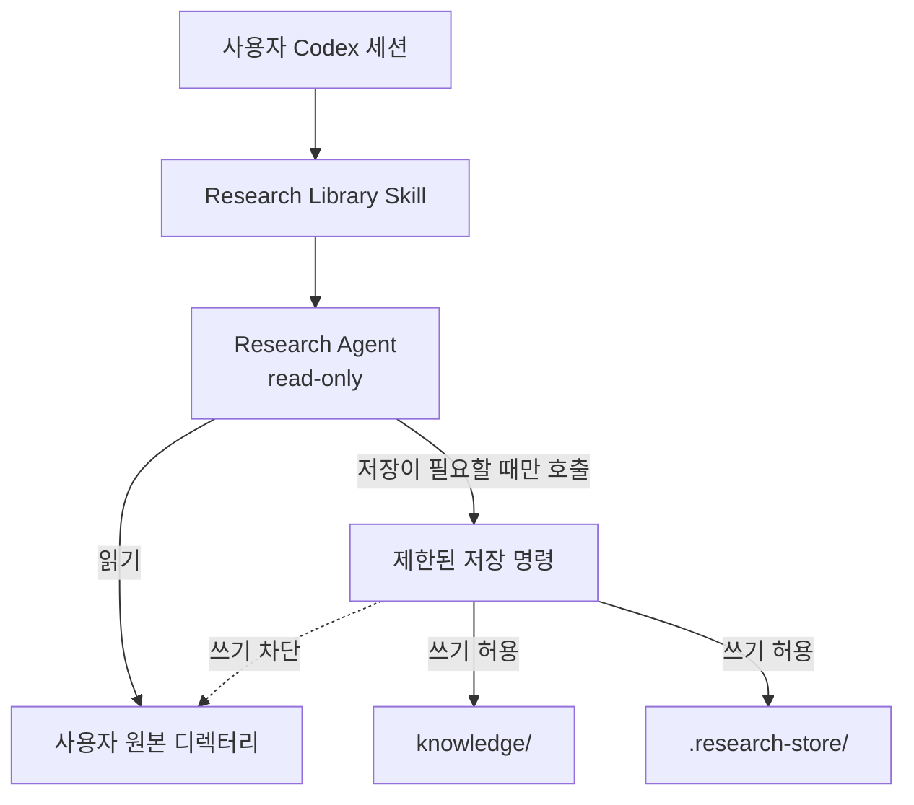
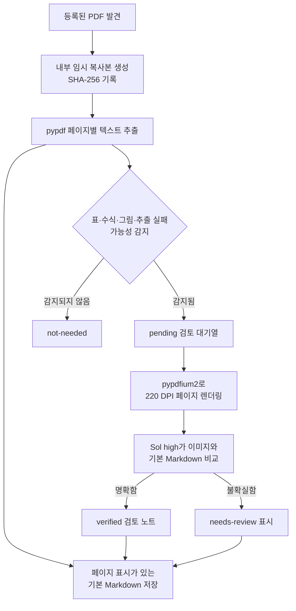

# Research Agent 기술 설계

[한국어](./README.md) | [English](./README.en.md)

[개발 로드맵](./ROADMAP.md)

이 문서는 Research Agent의 동작 원리와 설계 판단을 주제별로 기록한다.

## 1. 사용자 원본 디렉터리 보호와 권한 관리

### 설계 목표

Research Agent는 사용자가 여러 위치에 보관한 PDF를 읽고, 검색 가능한
Markdown으로 변환한다. 이 과정에서 가장 중요한 원칙은 **사용자의 원본
디렉터리를 수정하지 않는 것**이다.

원본 PDF와 원본 디렉터리는 입력 자료로만 사용한다. 변환된 Markdown,
검색 상태, 임시 파일은 모두 Research Agent가 소유한 디렉터리에 저장한다.

### 권한 흐름



사용자 Codex 세션이 Research Agent를 호출하더라도 호출된 에이전트가 부모
세션의 권한을 그대로 사용하지 않도록 별도의 `read-only` 샌드박스 모드를
명시한다. 따라서 Research Agent는 원본 파일과 Research Agent 저장소를 직접
수정할 수 없다.

Markdown이나 SQLite 상태를 저장해야 할 때는 허용된 전용 명령만 호출한다.
이 명령은 다시 별도의 제한된 권한 프로필 안에서 실행된다.

| 위치 | 허용 권한 | 용도 |
| --- | --- | --- |
| 사용자 원본 디렉터리 | 읽기 | PDF 탐색과 변환 입력 |
| `knowledge/` | 읽기·쓰기 | 변환된 Markdown과 대화 기록 |
| `.research-store/` | 읽기·쓰기 | 설정, SQLite 상태, 임시 작업 파일 |
| 그 외 위치 | 읽기 또는 차단 | Research Agent의 저장 대상이 아님 |

### 보호 장치

원본 보호는 에이전트 지침 하나에 의존하지 않는다.

1. **에이전트 권한**
   문서 관리 에이전트와 PDF 시각 검토 에이전트는 모두 읽기 전용으로
   실행된다. 부모 Codex 세션에서 권한 설정을 생략해 상속하는 방식이 아니라,
   에이전트 설정에 읽기 전용 권한을 명시한다.

2. **저장 명령의 권한**
   에이전트는 파일을 직접 만들거나 수정하지 않는다. Research Agent 내부에만
   쓸 수 있는 전용 명령을 사용한다. 원본 디렉터리는 이 명령의 읽기 영역으로만
   포함된다.

3. **프로그램의 경로 검사**
   생성되는 파일이 Research Agent 내부에 있는지 다시 확인한다. 경로 이탈,
   심볼릭 링크, 하드 링크를 이용해 원본이나 외부 위치에 쓰는 동작을 거부한다.
   원본 PDF는 읽은 뒤 내부 임시 공간에서 처리하며, 처리 도중 원본이 바뀌면
   해당 결과를 폐기한다.

4. **기능 범위 제한**
   원본 파일을 편집하거나 이동하고, 이름을 바꾸거나 삭제하는 기능을 제공하지
   않는다. 원본 경로 등록을 해제해도 이후 탐색만 중단하며 원본과 기존 Markdown
   기록은 삭제하지 않는다.

### 부모 Codex 세션과의 관계

Research Agent의 권한과 Research Agent를 호출한 사용자 Codex 세션의 권한은
서로 다르다.

Research Agent에는 별도의 읽기 전용 권한이 적용되고, 저장 명령에도 제한된
권한 프로필이 적용된다. 부모 세션이 Full access여도 이 권한이 Research Agent에
자동으로 확대되지는 않는다.

하지만 Research Agent는 부모 Codex 세션의 권한을 낮출 수 없다. Full access를
가진 부모 세션은 Research Agent를 거치지 않고 다음 작업을 수행할 수 있다.

- 원본 파일을 직접 수정한다.
- Research Agent의 설치 파일이나 설정을 수정한다.
- Research Agent가 제공하지 않는 다른 명령을 실행한다.

이것은 Research Agent 작업의 권한 문제가 아니라 사용자 Codex 세션 전체의
권한 문제다. 권한이 더 작은 하위 에이전트가 자신을 호출한 상위 세션을 제한할
수는 없다.

### 보장 범위

현재 설계가 보장하는 내용은 다음과 같다.

> Research Agent를 통해 수행되는 작업은 사용자 원본 디렉터리에 쓰지 않는다.

현재 설계만으로 다음 내용까지 보장할 수는 없다.

> Full access를 가진 부모 Codex 세션을 포함해 컴퓨터에서 실행되는 모든 작업이
> 사용자 원본 디렉터리를 수정하지 않는다.

두 번째 수준의 보호가 필요하다면 Research Agent가 아니라 사용자 세션 전체에
원본 경로를 읽기 전용으로 만드는 권한 프로필을 적용해야 한다. 더 강한 격리가
필요한 환경에서는 운영체제 파일 권한, 별도 사용자 계정 또는 읽기 전용 마운트와
같은 외부 보호 장치가 필요하다.

### 검증 기준

권한 설계는 다음 동작으로 확인한다.

- 제한된 저장 명령이 `knowledge/`와 `.research-store/`에는 쓸 수 있다.
- 같은 명령으로 외부 원본 디렉터리에 쓰려고 하면 운영체제 샌드박스가 차단한다.
- 동기화 전후 원본 디렉터리의 파일 내용이 동일하다.
- Research Agent 밖을 가리키는 저장 경로와 링크를 프로그램이 거부한다.
- 원본 경로 등록과 해제는 Research Agent 내부 설정만 변경한다.
- Research Agent를 제거해도 등록했던 원본 파일은 그대로 남는다.

### 책임별 구현 파일

| 책임 | 구현 파일 |
| --- | --- |
| 개인 에이전트, 명령 규칙, 제한 권한 프로필 설치 | [`scripts/personal_registration.py`](../../scripts/personal_registration.py) |
| 읽기 전용 에이전트의 역할과 행동 제한 | [`research-library-manager.toml`](../../resources/agents/research-library-manager.toml), [`research-paper-converter.toml`](../../resources/agents/research-paper-converter.toml) |
| 제한된 저장 명령으로 다시 진입 | [`research-store` launcher](../../resources/skills/research-library/scripts/research-store) |
| 저장 경로와 원본 경로의 경계 검증 | [`config.py`](../../src/research_store/config.py), [`safety.py`](../../src/research_store/safety.py) |
| 설치 충돌과 실제 샌드박스 권한 검증 | [`test_personal_registration.py`](../../tests/test_personal_registration.py), [`test_install_security.py`](../../tests/test_install_security.py), [`test_permission_profile_integration.py`](../../tests/test_permission_profile_integration.py) |

## 2. PDF 변환 과정과 결과의 신뢰성

### 설계 목표

PDF 변환의 목적은 원본과 동일한 편집용 문서를 다시 만드는 것이 아니다.
Research Agent는 먼저 **검색과 내용 발견에 사용할 페이지별 텍스트 색인**을
만들고, 수식·표·그림처럼 정확성이 중요한 페이지만 이미지로 다시 확인한다.

기본 추출 결과와 시각 검토 결과를 구분해 보존하므로 사용자는 검색 결과가
단순 텍스트 추출에서 나온 것인지, 원본 페이지 이미지로 다시 확인된 것인지
판단할 수 있다.

### 변환 흐름



### 기본 텍스트 추출

`pypdf`가 PDF 안에 저장된 글자를 페이지별로 읽는다. 각 페이지 앞에는 다음과
같은 표시를 추가한다.

```markdown
<!-- page: 3 -->

페이지에서 추출한 텍스트
```

이 결과는 Markdown 문법으로 논문의 구조를 완전히 재구성한 문서가 아니다.
제목, 본문, 수식, 표를 의미 단위로 복원하기보다 검색 가능한 텍스트를 페이지
단위로 저장한 것이다.

텍스트가 들어 있는 일반 영문 PDF에서는 제목, 초록, 본문의 주요 용어를 찾는
용도로 사용할 수 있다. 다음 요소는 기본 추출만으로 신뢰하기 어렵다.

- 다단 문서의 정확한 읽기 순서
- 줄바꿈과 하이픈으로 나뉜 단어
- 수식의 위첨자, 아래첨자, 분수와 특수 기호
- 표의 행·열 관계와 병합된 셀
- 그림, 그래프, 범례와 축의 의미
- 특수 폰트로 인코딩된 글자
- 이미지로만 저장된 스캔 문서

### 시각 검토 대상 선별

기본 추출 단계는 다음 특징을 가진 페이지를 시각 검토 대상으로 등록한다.

- `Table`, `Figure`, `Equation` 또는 이에 대응하는 한국어 표현
- 수학 기호가 많은 페이지
- 등식 형태의 짧은 줄이 여러 개 있는 페이지
- PDF 내부 이미지가 포함된 페이지
- 추출된 텍스트가 매우 적은 페이지

이 선별은 규칙 기반 후보 탐지다. 검토가 필요 없는 페이지를 포함할 수 있고,
캡션이 없는 벡터 도표나 인식되지 않은 수식처럼 중요한 페이지를 놓칠 수도
있다. 따라서 `not-needed`는 정확성이 검증됐다는 뜻이 아니라 현재 규칙이 검토
필요성을 발견하지 못했다는 뜻이다.

### Sol high 시각 검토

검토 대상으로 선택된 페이지만 220 DPI PNG로 렌더링한다. 시각 검토 에이전트는
페이지 이미지와 기본 Markdown을 함께 보고 다음 정보를 검토 노트로 작성한다.

- 명확하게 읽히는 수식의 LaTeX 표현
- 구조가 단순한 표의 Markdown 표현
- 그림의 구성, 축, 범례와 확인 가능한 관계
- 기본 텍스트 추출에서 확인된 오류
- 끝까지 판독할 수 없는 기호, 셀 또는 배치

시각 검토 결과는 기본 추출문을 덮어쓰지 않고 `Visual verification notes`에
추가한다. 불명확한 값을 추측하지 않으며, 확신할 수 없으면 `needs-review`로
남긴다.

렌더링할 때 사용한 PDF와 결과를 저장할 때의 PDF가 같은지도 SHA-256으로
확인한다. 해시가 달라지면 오래된 페이지 이미지를 기준으로 만든 검토 결과를
저장하지 않는다.

### 검토 상태의 의미

| 상태 | 의미 |
| --- | --- |
| `not-needed` | 현재 선별 규칙이 검토 대상을 발견하지 못함 |
| `pending` | 시각 검토 대상으로 선택됐지만 아직 완료되지 않음 |
| `verified` | 선택된 페이지를 시각 검토 에이전트가 확인함 |
| `needs-review` | 시각 검토를 수행했지만 불확실성이 남아 있음 |

`verified`는 선택된 페이지에 대한 AI 검토 완료 상태다. 사람의 검증이나 수식과
수치의 수학적 동일성을 보장하는 인증은 아니다.

### 용도별 신뢰 범위

| 사용 목적 | 현재 판단 |
| --- | --- |
| 논문 제목, 주제, 초록과 일반 본문 검색 | 기본 추출 결과를 검색 색인으로 사용 가능 |
| 관련 내용이 있는 문서와 페이지 발견 | 페이지 표시를 이용해 원본으로 이동 가능 |
| 수식의 정확한 재사용 | 시각 검토 후에도 원본 페이지 확인 필요 |
| 표의 수치와 행·열 관계 인용 | 원본 페이지 확인 필요 |
| 그래프의 정확한 수치 판독 | 원본 페이지 확인 필요 |
| PDF를 동일한 구조의 Markdown으로 복원 | 현재 설계 목표가 아님 |

현재 구조는 연구 자료 검색과 내용 발견을 위한 프로토타입으로 적합하다. 정확한
과학적 수치, 수식, 표를 Markdown만 보고 그대로 사용하는 것은 현재 보장 범위를
벗어난다.

### 책임별 구현 파일

| 책임 | 구현 파일 |
| --- | --- |
| PDF 탐색, 임시 복사, 텍스트 추출, 후보 선별, 페이지 렌더링과 검토 결과 저장 | [`sync.py`](../../src/research_store/sync.py) |
| 문서 상태와 페이지별 검토 상태 관리 | [`state.py`](../../src/research_store/state.py) |
| 동기화와 시각 검토 에이전트 연결 | [`research-library-manager.toml`](../../resources/agents/research-library-manager.toml) |
| 이미지 해석 원칙과 불확실성 처리 | [`research-paper-converter.toml`](../../resources/agents/research-paper-converter.toml) |
| 사용자 요청을 동기화·검색·검토 흐름으로 연결 | [`research-library/SKILL.md`](../../resources/skills/research-library/SKILL.md) |
| 변환, 대기열, 해시 일치와 원본 보존 검증 | [`test_sync.py`](../../tests/test_sync.py) |
