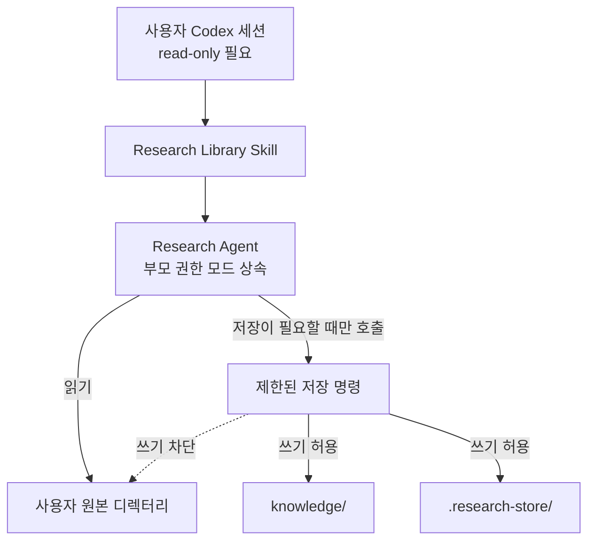
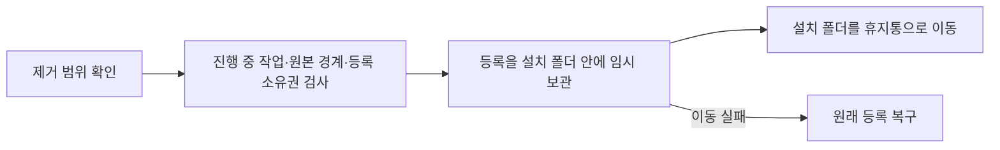
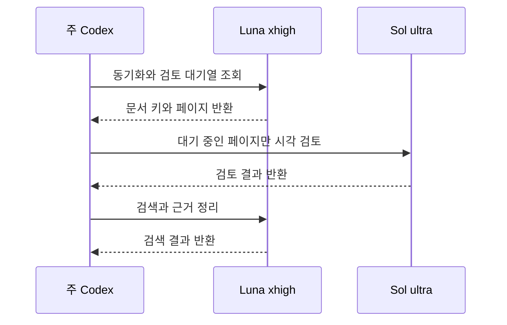
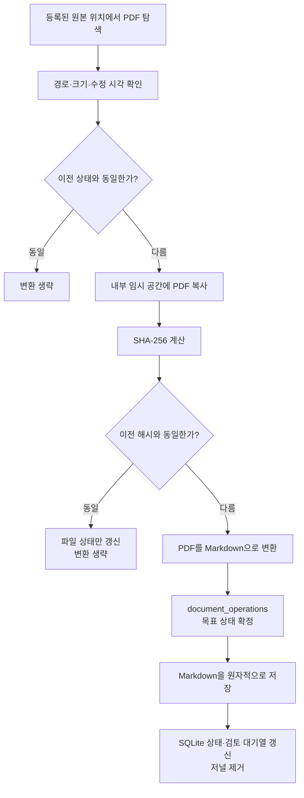
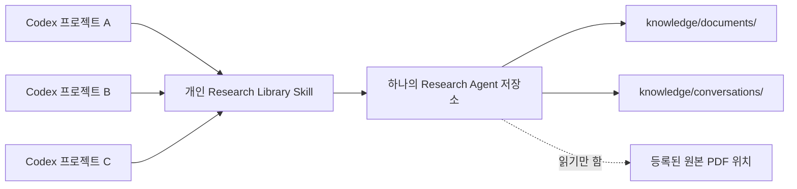
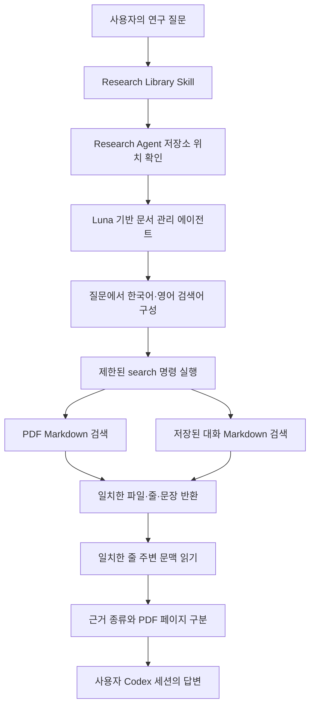
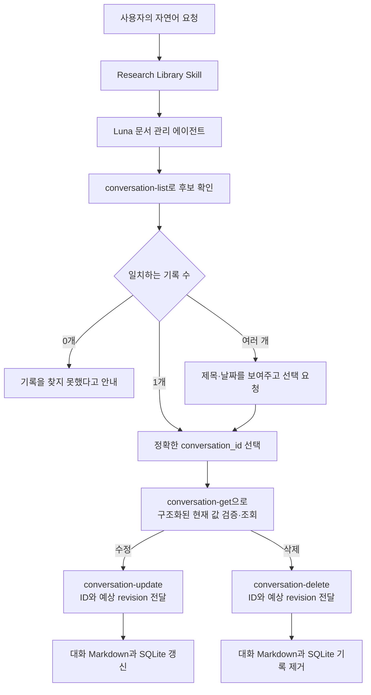
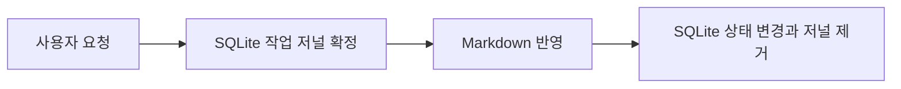
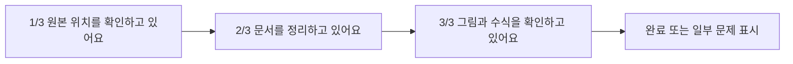

# Research Agent 기술 설계

[한국어](./README.md) | [English](./README.en.md)

[개발 로드맵](./ROADMAP.md)

이 문서는 Research Agent의 동작 원리와 설계 판단을 주제별로 기록한다.

## 목차

1. [사용자 원본 디렉터리 보호와 권한 관리](#1-사용자-원본-디렉터리-보호와-권한-관리)
2. [PDF 변환 과정과 결과의 신뢰성](#2-pdf-변환-과정과-결과의-신뢰성)
3. [저장 구조와 증분 동기화](#3-저장-구조와-증분-동기화)
4. [스킬 호출과 검색·근거 구성](#4-스킬-호출과-검색근거-구성)
5. [대화 저장과 연구 기억의 수명](#5-대화-저장과-연구-기억의-수명)
6. [Codex 대화 안의 진행 상태와 중단 복구](#6-codex-대화-안의-진행-상태와-중단-복구)

## 1. 사용자 원본 디렉터리 보호와 권한 관리

### 설계 목표

Research Agent는 사용자가 여러 위치에 보관한 PDF를 읽고, 검색 가능한
Markdown으로 변환한다. 이 과정에서 가장 중요한 원칙은 **사용자의 원본
디렉터리를 수정하지 않는 것**이다.

원본 PDF와 원본 디렉터리는 입력 자료로만 사용한다. 변환된 Markdown,
검색 상태, 임시 파일은 모두 Research Agent가 소유한 디렉터리에 저장한다.

### 권한 흐름



사용자 정의 에이전트 파일에는 `read-only` 기본값을 명시한다. 그러나 이 값은
부모 세션과 독립된 강제 경계가 아니다. Codex 하위 에이전트는 부모 턴에서 선택한
현재 권한 모드를 상속하고, `/permissions`나 `--yolo` 같은 실행 중 변경도 사용자
정의 에이전트의 기본값보다 우선해 다시 적용받을 수 있다. 따라서 Research Agent를
호출하기 전에 부모 Codex 세션을 읽기 전용으로 설정해야 한다.

Markdown이나 SQLite 상태를 저장해야 할 때는 허용된 전용 명령만 호출한다.
이 명령은 다시 별도의 제한된 권한 프로필 안에서 실행된다.

| 위치 | 허용 권한 | 용도 |
| --- | --- | --- |
| 사용자 원본 디렉터리 | 읽기(부모 세션도 읽기 전용일 때) | PDF 탐색과 변환 입력 |
| `knowledge/` | 읽기·쓰기 | 변환된 Markdown과 대화 기록 |
| `.research-store/` | 읽기·쓰기 | 설정, SQLite 상태, 임시 작업 파일 |
| 그 외 위치 | 읽기 또는 차단 | Research Agent의 저장 대상이 아님 |

### 보호 장치

원본 보호는 에이전트 지침 하나에 의존하지 않는다.

1. **에이전트 권한**
   문서 관리 에이전트와 PDF 시각 검토 에이전트 설정에는 읽기 전용 기본값을
   명시한다. 부모 턴의 현재 권한 모드와 실행 중 변경이 이 기본값보다 우선하므로,
   실제 보호 경계는 부모 세션도 읽기 전용일 때 성립한다.

2. **저장 명령의 권한**
   에이전트는 파일을 직접 만들거나 수정하지 않는다. Research Agent 내부에만
   쓸 수 있는 전용 명령을 사용한다. 원본 디렉터리는 이 명령의 읽기 영역으로만
   포함된다.

3. **프로그램의 경로 검사**
   생성되는 파일이 Research Agent 내부에 있는지 다시 확인한다. 경로 이탈,
   심볼릭 링크, 하드 링크를 이용해 원본이나 외부 위치에 쓰는 동작을 거부한다.
   원본 PDF는 읽은 뒤 내부 임시 공간에서 처리하며, 처리 도중 원본이 바뀌면
   해당 결과를 폐기한다.

4. **기능 범위 제한**
   원본 파일을 편집하거나 이동하고, 이름을 바꾸거나 삭제하는 기능을 제공하지
   않는다. 원본 경로 등록을 해제해도 이후 탐색만 중단하며 원본과 기존 Markdown
   기록은 삭제하지 않는다.

### 부모 Codex 세션과의 관계

Research Agent는 부모 Codex 세션보다 항상 작은 권한으로 실행되는 별도 보안
주체가 아니다. 공식 Codex 문서에 따르면 하위 에이전트는 부모의 현재 샌드박스
정책을 상속하며, `/permissions`나 `--yolo` 같은 실행 중 권한 변경은 사용자 정의
에이전트 파일에 다른 기본값이 있어도 다시 적용된다. 따라서 Full access 부모가
호출하면 에이전트 TOML의 `read-only`만으로 원본 보호를 보장할 수 없다.

Full access를 가진 부모 세션과 그 권한을 다시 적용받은 하위 에이전트는 다음
작업을 수행할 수 있다.

- 원본 파일을 직접 수정한다.
- Research Agent의 설치 파일이나 설정을 수정한다.
- Research Agent가 제공하지 않는 다른 명령을 실행한다.

따라서 Research Library를 사용할 때는 부모 세션의 권한 모드를 먼저 읽기
전용으로 선택해야 한다. 근거는 공식
[Codex 하위 에이전트 문서](https://learn.chatgpt.com/docs/agent-configuration/subagents)의
권한 상속 설명이다.

### 저장 명령의 설정 스택 격리

Markdown과 SQLite를 기록하는 저장 명령은 에이전트의 일반 파일 권한과 별도로
이름 있는 permission profile 안에서 실행된다. 이 기능은 현재 베타이며, 공식
[Codex 권한 프로필 문서](https://learn.chatgpt.com/docs/permissions)에 따르면
불러온 설정 파일 중 하나라도 기존 `sandbox_mode`를 포함하면 Codex가 permission
profile 대신 기존 샌드박스 설정을 사용할 수 있다.

이 충돌을 피하기 위해 launcher는 `CODEX_HOME`과 Codex의 작업 디렉터리 `-C`를
Research Agent가 소유한 `~/.codex/research-library-sandbox`로 함께 고정한다.
전용 설정은 최상위 `default_permissions = "research-store"`로 프로필을 선택하며,
launcher도 `-P research-store`를 명시하고 실제 저장 프로그램은 절대 경로로
실행한다. 따라서 현재 프로젝트의
`.codex/config.toml`에 기존 `sandbox_mode`가 있어도 그 프로젝트 설정을 저장
명령의 설정 스택에 불러오지 않는다. permission profile 형식이 베타인 동안에는
Codex 버전 변경 때 이 격리와 실제 권한 통합 테스트를 다시 확인해야 한다.

### 보장 범위

부모 Codex 세션을 읽기 전용으로 사용하고 정상 Research Library 흐름을 따를 때
현재 설계가 보장하는 내용은 다음과 같다.

> Research Agent를 통해 수행되는 작업은 사용자 원본 디렉터리에 쓰지 않는다.

현재 설계만으로 다음 내용까지 보장할 수는 없다.

> Full access를 가진 부모 Codex 세션이나 그 권한을 다시 적용받은 Research
> Agent가 사용자 원본 디렉터리를 수정하지 않는다.

Research Agent는 Full access 부모에서 원본 보호를 보장하지 않는다. 부모 세션을
읽기 전용으로 사용해야 하며, 더 강한 격리가 필요한 환경에서는 운영체제 파일
권한, 별도 사용자 계정 또는 읽기 전용 마운트와 같은 외부 보호 장치가 필요하다.

### 검증 기준

권한 설계는 다음 동작으로 확인한다.

- 제한된 저장 명령이 `knowledge/`와 `.research-store/`에는 쓸 수 있다.
- 같은 명령으로 외부 원본 디렉터리에 쓰려고 하면 운영체제 샌드박스가 차단한다.
- 현재 프로젝트에 기존 `sandbox_mode` 설정이 있어도 저장 명령은 격리된 permission
  profile을 사용한다.
- 동기화 전후 원본 디렉터리의 파일 내용이 동일하다.
- Research Agent 밖을 가리키는 저장 경로와 링크를 프로그램이 거부한다.
- 원본 경로 등록과 해제는 Research Agent 내부 설정만 변경한다.
- Research Agent를 제거해도 등록했던 원본 파일은 그대로 남는다.

첫 실제 권한 E2E에서 `default_permissions` 누락과 프로젝트의 기존
`sandbox_mode`가 함께 불리는 설정 스택 문제를 발견했다. 기본 프로필 지정과
전용 작업 디렉터리 분리를 적용한 뒤 다시 실행한 통합 테스트에서는 Research
Agent 내부 저장은 허용되고, 외부 원본 파일과 프로젝트 실행 코드 쓰기는
차단되며 원본 내용이 유지됐다. 자세한 발견과 회귀 결과는
[안전성과 에이전트 라우팅 검증](./experiments/safety-routing-validation.md)에
기록했다.

빈 임시 HOME을 사용한 현재 Mac의 설치·제거도 통과했다. 이는 설치 흔적이 없는
환경을 재현한 결과이며, 실제 새 Mac에서 비개발자가 겪는 설치 UX까지 검증했다는
뜻은 아니다.

### 설치 제거와 원본 보호

공개 제거 명령 `uninstall.sh`는 제거할 설치 경로와 자료 범위를 보여 주고 확인을
받는다. 기본 동작은 소유권이 확인된 Codex 등록과 설치 폴더 전체를 사용자
휴지통의 고유한 하위 폴더로 옮기는 것이다. `--keep-files`는 등록만 해제하고,
`--yes`는 확인을 생략한다. 내부 `personal_registration.py uninstall`은
설치·등록 검증용으로 기존의 등록 해제 동작을 유지한다.



현재 설정과 이전 형식의 `config.toml`에서 비활성 자료원까지 검사한다. 원본
경로가 설치 폴더·등록 경로·휴지통과 겹치거나 설정을 안전하게 읽을 수 없으면
중단한다. 링크 대상의 원본 파일을 따라가서 삭제하지 않는다. 별도로 작성한
사용자 지정 설정 파일들을 모두 발견하는 기능은 없으므로, 경계 검사는 기본
설정과 이전 기본 설정에 기록된 자료원을 대상으로 한다.

저장 실행기와 직접 CLI는 명령 전체에 설치 디렉터리의 공유 잠금을 유지한다.
제거는 같은 디렉터리의 배타 잠금과 기존 동기화·대화 잠금을 함께 확보하므로
라이브러리 작업과 겹치면 중단한다. 등록 변경에는 기존 사용자 등록 잠금도
사용한다. 설치 업데이트나 외부 프로그램의 직접 파일 편집까지 막는 잠금은 아니다.

등록은 소유권을 확인한 고정 경로만 임시 보관하고 복구 기록을 남긴다. 휴지통
이동에 실패하면 등록을 되돌린다. 등록 이동 중 프로세스가 종료된 경우에는 같은
제거 명령을 다시 실행해 복구한 뒤 재시도한다. 복구 경로에 다른 파일이 생겼거나
복구 기록이 손상되면 덮어쓰지 않고 중단한다. 설치 폴더를 재귀 삭제하거나
다른 볼륨으로 복사한 뒤 지우는 대체 동작은 없다. 현재는 홈 휴지통과 같은 볼륨의
설치만 지원하며 Finder의 자동 원위치 복원 기능은 제공하지 않는다.

임시 설치 사본과 임시 HOME·휴지통에서 전체 제거, 취소, 자료 보관, 원본 보존,
소유권 충돌, 동시 실행, 이동 실패 복구, 실제 프로세스 종료 후 재시도를 검증한다.
개별 대화 기록을 삭제하는 `conversation-delete`의 동작은 이 설치 제거와 별개다.

### 책임별 구현 파일

| 책임 | 구현 파일 |
| --- | --- |
| 개인 에이전트, 명령 규칙, 제한 권한 프로필 설치 | [`scripts/personal_registration.py`](../../scripts/personal_registration.py) |
| 설치 전체 제거와 실패 복구 | [`uninstall.sh`](../../uninstall.sh), [`uninstall_project.py`](../../scripts/uninstall_project.py), [`test_full_uninstall.py`](../../tests/test_full_uninstall.py) |
| 작업 실행과 설치 제거의 동시 접근 제한 | [`operation_guard.py`](../../src/research_store/operation_guard.py), [`test_operation_guard.py`](../../tests/test_operation_guard.py) |
| 에이전트의 읽기 전용 기본값과 행동 제한 | [`research-library-manager.toml`](../../resources/agents/research-library-manager.toml), [`research-paper-converter.toml`](../../resources/agents/research-paper-converter.toml) |
| 제한된 저장 명령으로 다시 진입 | [`research-store` launcher](../../resources/skills/research-library/scripts/research-store) |
| 저장 경로와 원본 경로의 경계 검증 | [`config.py`](../../src/research_store/config.py), [`safety.py`](../../src/research_store/safety.py) |
| 설치 충돌과 실제 샌드박스 권한 검증 | [`test_personal_registration.py`](../../tests/test_personal_registration.py), [`test_install_security.py`](../../tests/test_install_security.py), [`test_permission_profile_integration.py`](../../tests/test_permission_profile_integration.py) |

## 2. PDF 변환 과정과 결과의 신뢰성

### 설계 목표

PDF 변환의 목적은 원본과 동일한 편집용 문서를 다시 만드는 것이 아니다.
Research Agent는 먼저 **검색과 내용 발견에 사용할 페이지별 텍스트 색인**을
만들고, 수식·표·그림처럼 정확성이 중요한 페이지만 이미지로 다시 확인한다.

기본 추출 결과와 시각 검토 결과를 구분해 보존하므로 사용자는 검색 결과가
단순 텍스트 추출에서 나온 것인지, 원본 페이지 이미지로 다시 확인된 것인지
판단할 수 있다.

### 변환 흐름


### 기본 텍스트 추출

`pypdf`가 PDF 안에 저장된 글자를 페이지별로 읽는다. 각 페이지 앞에는 다음과
같은 표시를 추가한다.

```markdown
<!-- page: 3 -->

페이지에서 추출한 텍스트
```

이 결과는 Markdown 문법으로 논문의 구조를 완전히 재구성한 문서가 아니다.
제목, 본문, 수식, 표를 의미 단위로 복원하기보다 검색 가능한 텍스트를 페이지
단위로 저장한 것이다.

텍스트가 들어 있는 일반 영문 PDF에서는 제목, 초록, 본문의 주요 용어를 찾는
용도로 사용할 수 있다. 다음 요소는 기본 추출만으로 신뢰하기 어렵다.

- 다단 문서의 정확한 읽기 순서
- 줄바꿈과 하이픈으로 나뉜 단어
- 수식의 위첨자, 아래첨자, 분수와 특수 기호
- 표의 행·열 관계와 병합된 셀
- 그림, 그래프, 범례와 축의 의미
- 특수 폰트로 인코딩된 글자
- 이미지로만 저장된 스캔 문서

### 시각 검토 대상 선별

기본 추출 단계는 다음 특징을 가진 페이지를 시각 검토 대상으로 등록한다.

- `Table`, `Figure`, `Equation` 또는 이에 대응하는 한국어 표현
- 수학 기호가 많은 페이지
- 등식 형태의 짧은 줄이 여러 개 있는 페이지
- PDF 내부 이미지가 포함된 페이지
- 추출된 텍스트가 매우 적은 페이지

이 선별은 규칙 기반 후보 탐지다. 검토가 필요 없는 페이지를 포함할 수 있고,
캡션이 없는 벡터 도표나 인식되지 않은 수식처럼 중요한 페이지를 놓칠 수도
있다. 따라서 `not-needed`는 정확성이 검증됐다는 뜻이 아니라 현재 규칙이 검토
필요성을 발견하지 못했다는 뜻이다.

### Sol ultra 시각 검토

검토 대상으로 선택된 페이지만 220 DPI PNG로 렌더링한다. 시각 검토 에이전트는
페이지 이미지와 기본 Markdown을 함께 보고 다음 정보를 검토 노트로 작성한다.

- 명확하게 읽히는 수식의 LaTeX 표현
- 구조가 단순한 표의 Markdown 표현
- 그림의 구성, 축, 범례와 확인 가능한 관계
- 기본 텍스트 추출에서 확인된 오류
- 끝까지 판독할 수 없는 기호, 셀 또는 배치

시각 검토 결과는 기본 추출문을 덮어쓰지 않고 `Visual verification notes`에
추가한다. 불명확한 값을 추측하지 않으며, 확신할 수 없으면 `needs-review`로
남긴다.

렌더링할 때 사용한 PDF와 결과를 저장할 때의 PDF가 같은지도 SHA-256으로
확인한다. 해시가 달라지면 오래된 페이지 이미지를 기준으로 만든 검토 결과를
저장하지 않는다.

### 검토 결과 저장 스키마와 현재 대기열

시각 검토의 기본 저장 단위는 **PDF 페이지 하나**다. 여러 페이지 이미지를 한 번에
렌더링하거나 문맥을 위해 함께 볼 수는 있지만, `review-complete`에는 페이지를
하나만 전달하고 결과도 페이지별로 저장한다. 이 규칙은 SQLite 상태 행과
Markdown 검토 블록의 단위를 일치시켜 한 페이지만 수정하거나 다시 검토할 때 다른
페이지의 설명을 분리할 필요가 없게 한다.

| 저장 위치 | 저장 단위 | 식별자 또는 역할 |
| --- | --- | --- |
| SQLite `documents` | PDF 문서 하나당 한 행 | `document_key`로 문서와 생성된 Markdown 연결 |
| `knowledge/documents/` | PDF 문서 하나당 Markdown 한 파일 | 기본 페이지 추출문과 모든 시각 검토 블록 보존 |
| SQLite `page_reviews` | 검토 후보 페이지 하나당 한 행 | `(document_key, page_number)`가 기본 식별자 |
| Markdown 시각 검토 블록 | 검토한 페이지 하나당 한 블록 | `visual-review-pages: N`으로 페이지 식별 |
| Markdown frontmatter 목록 | PDF 문서 하나당 두 목록 | 최초 후보와 현재 대기 페이지 구분 |

SQLite의 `page_reviews`는 검토 이유, `pending`·`verified`·`needs_review` 상태,
검토 시각, 모델 감사 라벨과 선택적인 내부 노트를 관리한다. 현재 대기열의 기준은
SQLite다. Markdown 블록은 사람이 읽고 검색할 수 있는 실제 시각 검토 설명과
PDF 해시 등의 출처 정보를 보존한다. 문서 정체성과 PDF 버전은 SQLite 문서 행,
Markdown frontmatter와 현재 원본의 SHA-256이 서로 일치하는지 저장 전에 검증한다.

같은 페이지를 다시 검토하면 기존 페이지 블록을 새 결과로 교체하고 다른 페이지
블록은 보존한다. 이전 형식에서 같은 단일 페이지 제목이 여러 번 추가된 문서는
다음 교정 때 중복 블록을 하나로 합친다. 페이지 단위 스키마 이전에 만들어진
`[1, 2]` 같은 공동 블록은 설명을 자동으로 나눌 근거가 없으므로 그대로 보존하며,
그중 한 페이지를 수정하려는 요청은 Markdown과 SQLite를 바꾸지 않고 거부한다.
이 레거시 기록을 페이지별로 바꾸려면 각 페이지를 다시 검토하는 별도
마이그레이션 기능이 필요하며, 현재 `review-complete`만으로 자동 변환하지 않는다.

동기화는 시각 검토 후보가 있는 새 Markdown 끝에 현재 PDF SHA-256과 결합한 빈
관리 구역을 미리 만든다. 이 해시와 정확히 일치하는 시작·종료 표식 한 쌍 안의
내용만 Research Agent가 관리하는 검토 블록으로 해석한다. PDF 기본 추출문 안에
`Visual verification notes`, `Pages` 또는 `visual-review-*`와 같은 문자열이
있어도 관리 구역 밖이면 연구 자료로 그대로 보존한다. 관리 구역이 없던 이전
문서는 모든 블록이 현재 PDF SHA-256으로 명확히 확인될 때만 새 경계로 감싼다.
진위를 확인할 수 없는 이전 형식은 내용을 바꾸지 않고 명시적인 마이그레이션을
요구한다.

모든 `review-complete` 호출은 Markdown을 읽기 전에 프로젝트 쓰기 잠금을 얻는다.
같은 저장소를 대상으로 동시에 온 검토 완료 요청은 하나씩 실행되며, 파일을
교체하기 전에는 SQLite에 저널 준비 상태를 확정한다. 따라서 서로 다른 페이지의
검토 노트가 마지막 파일 쓰기에 의해 사라지지 않는다.

동기화가 새 PDF Markdown과 검토 대기 행을 교체하는 구간도 같은 프로젝트 쓰기
잠금을 사용한다. PDF 읽기와 변환은 잠금 밖에서 수행하고, 생성된 Markdown 교체와
SQLite 반영만 직렬화한다. 일반적인 SQLite 커밋 실패가 발생하면 바뀐 Markdown을
이전 내용으로 복구한다.

PDF 동기화와 페이지 검토 저장은 SQLite의 `document_operations` 저널도 사용한다.
Markdown을 바꾸기 전에 기존 상태와 목표 Markdown·문서 행·페이지 검토 행을 먼저
확정하고, 파일과 SQLite가 모두 목표 상태가 된 뒤 저널을 지운다. 프로세스가 그
사이에 중단되면 다음 `sync`, `status`, `search`, `review-list`, `render-review`
또는 `review-complete`가 남은 작업을 목표 상태로 이어서 완료한다. 현재 파일이나
DB가 저널의 기존 상태 또는 목표 상태와 모두 다르면 외부 변경으로 판단해 자동으로
덮어쓰지 않는다.

이 복구는 Markdown 교체 직후 하위 프로세스를 `os._exit`로 종료하는 테스트로
확인했다. 실제 Mac 전원 차단이나 저장 장치 장애를 일으킨 검증은 아니다.

문서 frontmatter의 두 목록은 목적이 다르다.

| 필드 | 의미 |
| --- | --- |
| `visual_review_pages` | 현재 PDF 버전을 변환할 때 처음 선별한 후보 페이지. 검토 완료로 바뀌지 않음 |
| `visual_review_pending_pages` | 현재 다시 확인해야 하는 `pending`과 `needs-review` 페이지 |

따라서 현재 PDF 버전의 최초 선별 근거를 보존하면서도 현재 작업 대기열을
Markdown만 읽어 확인할 수 있다. PDF 내용이 바뀌어 재변환하면 두 목록 모두 새
버전의 선별 결과를 기준으로 다시 만들어진다.

각 검토 블록에는 시작·종료 경계와 페이지, PDF SHA-256, 모델 이름, 상태, 검토
시각을 표시한다. SQLite에도 같은 검토 시각과 상태를 기록한다. 모델 이름은
`review-complete`를 호출한 쪽이 전달한 **감사 라벨**이며, 실제로 그 모델이
실행됐음을 암호학적으로 증명하는 값은 아니다. 실제 Luna·Sol 호출 여부는 Codex
세션 기록과 함께 확인해야 한다.

### 주 Codex가 에이전트 호출을 조정하는 이유

초기 설계는 Luna 문서 관리 에이전트가 검토 대기 페이지를 발견하면 Sol 시각
검토 에이전트를 직접 호출하는 방식이었다. 실제 Codex 실행에서는 사용자 정의
에이전트로 호출된 Luna에 하위 에이전트를 생성하는 도구가 제공되지 않았다.
Luna는 호출 실패 뒤 자신에게 남아 있던 이미지 도구로 검토를 계속하려 했다.

이는 문서의 악성 지시를 따른 프롬프트 주입이 아니라, 맡은 목표에 필요한 도구가
없고 실패 시 중단 조건이 충분히 명시되지 않아 발생한 대체 수행 또는 역할 이탈
사례다. 현재 Luna의 책임은 동기화와 정확한 검토 대기열 반환까지로 제한한다.
하위 에이전트 생성, 이미지 직접 검토와 `review-complete` 실행은 시도하지 않고
대기열을 주 Codex에 반환한 뒤 종료한다.



실제 세션 기록에서 Luna xhigh → Sol ultra → Luna xhigh 순서와 각 에이전트의
도구 실행을 확인했다. 현재 역할 경계는 호출 구조와 에이전트 지침으로 적용되며,
Luna의 이미지 도구 자체를 플랫폼 수준에서 제거한 것은 아니다. 실험 과정과
검증 범위는 [안전성과 에이전트 라우팅 검증](./experiments/safety-routing-validation.md)에
기록한다.

### 검토 상태의 의미

| 상태 | 의미 |
| --- | --- |
| `not-needed` | 현재 선별 규칙이 검토 대상을 발견하지 못함 |
| `pending` | 시각 검토 대상으로 선택됐지만 아직 완료되지 않음 |
| `verified` | 선택된 페이지를 시각 검토 에이전트가 확인함 |
| `needs-review` | 시각 검토를 수행했지만 불확실성이 남아 있음 |

`verified`는 선택된 페이지에 대한 AI 검토 완료 상태다. 사람의 검증이나 수식과
수치의 수학적 동일성을 보장하는 인증은 아니다.

### 용도별 신뢰 범위

| 사용 목적 | 현재 판단 |
| --- | --- |
| 논문 제목, 주제, 초록과 일반 본문 검색 | 기본 추출 결과를 검색 색인으로 사용 가능 |
| 관련 내용이 있는 문서와 페이지 발견 | 페이지 표시를 이용해 원본으로 이동 가능 |
| 수식의 정확한 재사용 | 시각 검토 후에도 원본 페이지 확인 필요 |
| 표의 수치와 행·열 관계 인용 | 원본 페이지 확인 필요 |
| 그래프의 정확한 수치 판독 | 원본 페이지 확인 필요 |
| PDF를 동일한 구조의 Markdown으로 복원 | 현재 설계 목표가 아님 |

현재 구조는 연구 자료 검색과 내용 발견을 위한 프로토타입으로 적합하다. 정확한
과학적 수치, 수식, 표를 Markdown만 보고 그대로 사용하는 것은 현재 보장 범위를
벗어난다.

페이지 검토 완료 요청은 프로젝트 쓰기 잠금과 `document_operations` 저널로
직렬화하고 복구한다. 이는 Markdown과 SQLite의 저장 일관성을 보호하지만, 모델이
수식·표·그림을 올바르게 해석했다는 의미는 아니다. 강제 종료 검증 범위도 하위
프로세스의 `os._exit` 주입까지이며 실제 기기 전원 장애까지 검증하지 않았다.

### 책임별 구현 파일

| 책임 | 구현 파일 |
| --- | --- |
| PDF 탐색, 임시 복사, 텍스트 추출, 후보 선별, 페이지 렌더링과 검토 결과 저장 | [`sync.py`](../../src/research_store/sync.py) |
| 문서 Markdown·SQLite 교체 저널과 중단 복구 | [`operations.py`](../../src/research_store/operations.py) |
| 문서 상태와 페이지별 검토 상태 관리 | [`state.py`](../../src/research_store/state.py) |
| 주 Codex가 Luna와 Sol을 순서대로 연결하는 절차 | [`research-library/SKILL.md`](../../resources/skills/research-library/SKILL.md) |
| 동기화·검색 범위와 검토 대기열 반환 | [`research-library-manager.toml`](../../resources/agents/research-library-manager.toml) |
| 이미지 해석 원칙과 불확실성 처리 | [`research-paper-converter.toml`](../../resources/agents/research-paper-converter.toml) |
| 변환, 대기열, 해시 일치와 원본 보존 검증 | [`test_sync.py`](../../tests/test_sync.py) |
| 검토 노트 교체·이전 형식 정리와 동시 완료 검증 | [`test_review_notes.py`](../../tests/test_review_notes.py), [`test_review_concurrency.py`](../../tests/test_review_concurrency.py) |
| 동기화·페이지 검토의 하위 프로세스 강제 종료 복구 검증 | [`test_document_recovery.py`](../../tests/test_document_recovery.py) |

## 3. 저장 구조와 증분 동기화

### 설계 목표

Research Agent는 등록된 원본 위치를 다시 확인할 때마다 모든 PDF를 변환하지
않는다. 전체 위치에서 PDF의 존재와 기본 상태는 확인하되, 새로 발견됐거나 실제
내용이 변경된 문서만 다시 변환한다.

이 구조의 목적은 반복 작업 시간을 줄이고, 변경되지 않은 문서에 대한 불필요한
시각 검토와 구독 사용량을 만들지 않는 것이다. 원본 위치에는 상태 파일이나
색인을 만들지 않으며 동기화에 필요한 기록은 모두 Research Agent 내부에 둔다.

### 저장 영역의 역할

| 저장 영역 | 역할 |
| --- | --- |
| `knowledge/documents/` | Codex와 사용자가 검색하고 읽는 PDF별 Markdown |
| `.research-store/library.sqlite` | 문서 상태, 해시, 파서 버전, 검토 대기열, 실행 체크포인트와 복구 저널을 기록하는 내부 원장 |
| `.research-store/tmp/` | 변환 중 사용하는 PDF 복사본과 페이지 이미지 |

Markdown은 검색하고 인용할 내용을 보존한다. SQLite는 사용자에게 보여 줄 본문을
저장하는 데이터베이스가 아니라, 같은 PDF를 다시 처리해야 하는지 판단하고 중단된
문서 저장을 안전하게 이어서 완료하기 위한 상태 기록이다.

### 문서 식별 방식

각 PDF는 **원본 위치 ID와 그 위치 안에서의 상대 경로**를 조합해 식별한다.

```text
<source-id>:<relative-path>
```

예를 들어 `papers`로 등록한 위치 안의 `optics/laser.pdf`는
`papers:optics/laser.pdf`라는 문서 키를 가진다. 서로 다른 원본 위치에 같은
내용의 PDF가 있더라도 출처가 다르면 별개의 문서로 관리한다.

### 동기화 흐름



### 변경 판단 순서

첫 번째 단계에서는 파일 크기, 나노초 단위 수정 시각, 파서 버전, 이전 오류와
생성된 Markdown의 존재 여부를 비교한다. 모두 같으면 PDF를 다시 읽지 않고
`unchanged`로 처리한다.

기본 상태가 달라졌다면 원본 PDF를 Research Agent 내부 임시 공간으로 복사하고
SHA-256을 계산한다. 이는 프로세스나 저장소를 복제하는 fork가 아니라 변환에
사용할 일반적인 임시 파일 복사다. 해시가 이전 기록과 같으면 내용은 동일하다고
판단하고 크기와 수정 시각 같은 상태만 갱신한다. 임시 PDF 복사본은 이 확인이나
변환이 끝나면 삭제한다. 프로세스가 강제로 종료되어 복사본이 남으면, 다음 동기화가
종료된 프로세스가 소유한 임시 폴더만 확인해 삭제한다.

다음 조건에서는 실제 변환을 수행한다.

- 처음 발견한 PDF
- 이전 기록과 SHA-256이 다른 PDF
- PDF 파서 버전이 변경된 문서
- 생성된 Markdown이 사라진 문서
- 이전 변환에서 오류가 발생한 문서
- 저장 경로 마이그레이션이 필요한 문서

재변환하면 Markdown을 교체하고 해당 PDF의 시각 검토 후보도 현재 결과를
기준으로 다시 등록한다. 변경되지 않은 PDF는 기존 Markdown과 시각 검토 상태를
그대로 유지한다.

### 처리 중 원본 변경 방지

변환을 시작하기 전과 끝난 뒤 원본 PDF의 크기와 수정 시각을 비교한다. 처리하는
동안 원본 상태가 달라지면 결과를 저장하지 않고 오류로 기록한다. 기존 Markdown이
있다면 그대로 남기고 다음 동기화에서 다시 시도한다.

이 과정에서도 원본은 읽기 입력으로만 사용한다. PDF 해시 계산과 변환은 내부
복사본을 대상으로 수행하며 원본 경로에는 임시 파일을 만들지 않는다.

### 사라진 문서와 연결되지 않은 위치

정상적으로 탐색할 수 있는 원본 위치에서 이전 PDF가 발견되지 않으면 SQLite에
`missing` 상태와 발견 시각을 기록한다. 기존 Markdown과 검토 기록은 삭제하지
않는다.

원본 위치 자체가 없거나 읽을 수 없다면 그 위치의 모든 문서를 `missing`으로
바꾸지 않는다. 외장 디스크 분리나 일시적인 권한 문제를 문서 삭제로 오인하지
않도록 해당 위치만 `unavailable`로 보고한다.

### 대표적인 동작

| 상황 | 동작 |
| --- | --- |
| 새 PDF 추가 | Markdown 생성과 검토 후보 등록 |
| 변경 없이 다시 동기화 | 탐색만 수행하고 변환 생략 |
| 수정 시각만 변경 | 해시가 같으면 상태만 갱신 |
| PDF 내용 변경 | Markdown 재생성과 검토 후보 재등록 |
| 파서 버전 변경 | 현재 파서로 다시 변환 |
| 생성된 Markdown 삭제 | 원본에서 다시 생성 |
| 변환 실패 | 오류를 기록하고 다음 동기화에서 재시도 |
| 원본 PDF 삭제 | `missing`으로 표시하고 기존 Markdown 보존 |
| 원본 위치 연결 해제 | 위치 오류만 기록하고 문서는 `missing`으로 바꾸지 않음 |
| 사라졌던 PDF 복원 | 해시 확인 후 현재 상태로 복구 |

### 현재 범위와 한계

- 변경되지 않은 PDF의 변환은 생략하지만 등록된 위치의 PDF 탐색은 매번 수행한다.
- 파일 이름이나 상대 경로가 바뀌면 이전 문서는 `missing`, 새 경로는 새 문서로
  인식한다. 경로 이동을 같은 문서의 이동으로 자동 연결하지 않는다.
- 같은 PDF가 여러 원본 위치에 있으면 출처 보존을 위해 각각 저장한다. 따라서
  검색 결과가 중복될 수 있다.
- 빠른 변경 확인은 파일 크기와 수정 시각을 신뢰한다. 두 값이 모두 유지된 채
  내용만 바뀌는 비정상적인 변경까지 매번 해시로 확인하지는 않는다.
- 동기화는 PDF 한 개의 상태를 저장할 때마다 SQLite 변경을 확정한다. 다음 PDF의
  긴 변환을 기다리는 동안 대화 저장·수정 같은 다른 쓰기를 진행할 수 있음을
  실제 동시 실행 테스트로 확인했다. 별도의 `.research-store/sync.lock`은 동기화
  작업을 하나씩 실행하며 두 번째 동기화는 기존 작업을 방해하지 않고 거부한다.
  이 잠금은 변환 전체에 대화 저장용 프로젝트 쓰기 잠금을 잡고 있지 않으므로 긴
  PDF 변환 중에도 대화 저장을 진행할 수 있다.

현재 방식은 개인 연구 자료 규모에서 반복 변환 비용을 줄이면서 원본 위치와
생성된 결과의 관계를 추적하기 위한 구조다. PDF 수가 크게 늘어나 탐색 자체가
느려질 때 별도의 파일 시스템 감시나 색인 방식이 필요한지 다시 검토한다.

### 책임별 구현 파일

| 책임 | 구현 파일 |
| --- | --- |
| PDF 탐색, 변경 판단, 임시 복사, 변환과 누락 상태 처리 | [`sync.py`](../../src/research_store/sync.py) |
| 동기화 단일 실행과 짧은 프로젝트 쓰기 구간 잠금 | [`locking.py`](../../src/research_store/locking.py) |
| 문서별 Markdown·SQLite 교체 저널과 복구 | [`operations.py`](../../src/research_store/operations.py) |
| 문서 상태, 해시, 파서 버전과 검토 대기열 저장 | [`state.py`](../../src/research_store/state.py) |
| 원본 위치와 Research Agent 저장 위치 구성 | [`config.py`](../../src/research_store/config.py) |
| 안전한 경로 검사와 Markdown 원자적 저장 | [`safety.py`](../../src/research_store/safety.py) |
| 증분 처리와 원본 불변성 검증 | [`test_sync.py`](../../tests/test_sync.py) |
| 동기화 직렬화와 변환 중 대화 저장 검증 | [`test_sync_concurrency.py`](../../tests/test_sync_concurrency.py) |
| 문서 저장 중 하위 프로세스 강제 종료 복구 검증 | [`test_document_recovery.py`](../../tests/test_document_recovery.py) |

## 4. 스킬 호출과 검색·근거 구성

### 설계 목표

Research Agent는 특정 Codex 프로젝트 안에 설치되지 않는다. 사용자 홈에 등록한
개인 Research Library 스킬이 어느 Codex 프로젝트에서든 별도로 설치된 하나의
Research Agent 저장소를 찾고, 동기화된 PDF와 명시적으로 저장한 대화를 함께
검색한다.

검색의 목적은 바로 정답을 만드는 것이 아니라 질문과 관련된 Markdown 위치를
찾는 것이다. 문서 관리 에이전트가 일치한 위치 주변의 문맥을 다시 읽고, 정보의
종류와 PDF 페이지를 구분한 뒤 사용자 Codex 세션이 답변에 활용한다.

### 프로젝트와 Research Agent의 관계

기본 설치 안내는 Research Agent 본체를 `~/research-agent`에 둔다. 설치
스크립트는 실행된 저장소의 실제 위치를 개인 스킬과 에이전트 설정에 기록하므로,
다른 위치에 설치했다면 그 위치를 사용한다.



스킬은 현재 작업 디렉터리를 Research Agent로 가정하지 않는다. 설치된
`research-root` 실행 파일이 자신의 실제 위치에서 프로젝트 루트를 계산하고,
프로젝트 표시 파일을 확인한 뒤 저장소 경로를 반환한다. 따라서 사용자가 다른
프로젝트에서 작업해도 같은 개인 연구 저장소를 찾을 수 있다.

현재 구조는 Codex 프로젝트마다 별도의 Research Agent 저장소를 만들지 않는다.
어느 프로젝트에서 스킬을 호출하더라도 같은 `knowledge/`와 SQLite 상태를
사용한다. 이는 흩어진 연구 문서와 여러 세션에서 저장한 생각을 프로젝트 경계를
넘어 다시 찾기 위한 설계다.

### 검색 대상

검색 명령은 다음 두 위치의 Markdown을 재귀적으로 읽는다.

| 위치 | 검색 결과의 종류 |
| --- | --- |
| `knowledge/documents/` | PDF에서 생성한 문서 근거 |
| `knowledge/conversations/` | 사용자가 선택해 저장한 대화 기록 |

검색할 때 원본 PDF 전체를 다시 읽거나 변환하지 않는다. SQLite도 본문 검색에
사용하지 않는다. 아직 동기화하지 않은 PDF와 저장하지 않은 과거 대화는 검색할
수 없다.

### 검색 흐름



### 질문에서 검색어 구성

문서 관리 에이전트는 사용자의 자연어 질문에서 핵심 용어를 고른다. 영어 연구
문서를 찾을 수 있도록 한국어 질문에는 관련 영어 기술 용어도 함께 구성한다.

예를 들어 `광소자의 결합 효율`에 관한 질문은 다음과 같은 검색어로 확장될 수
있다.

```text
광소자
결합 효율
optical device
coupling efficiency
coupling loss
```

동의어 목록을 별도의 사전에 고정하지 않는다. Luna가 질문의 문맥에 따라 유용한
용어를 선택하고 한 번의 검색 명령에 함께 전달한다.

### 현재 검색 방식

현재 구현은 벡터나 임베딩을 사용하지 않는다. 각 Markdown 파일을 줄 단위로
읽고 대소문자를 구분하지 않는 문자열 포함 여부를 확인한다. 검색 결과에는 다음
정보가 포함된다.

- PDF 문서 또는 저장된 대화라는 결과 종류
- 일치한 Markdown의 프로젝트 내부 경로
- 일치한 줄 번호와 검색어
- 일치한 부분 주변의 짧은 문장

여러 검색어를 사용하면 각 검색어의 결과를 차례로 섞는다. 한 용어의 결과가
많더라도 다른 용어의 결과가 모두 밀려나지 않게 하기 위한 처리다.

검색 명령이 반환하는 짧은 문장은 최종 근거가 아니다. 문서 관리 에이전트가
해당 Markdown을 일치한 줄 주변에서 다시 읽고 질문과 관련된 문맥인지 판단한다.
미리 고정된 청크를 만들기보다 검색 결과에 따라 필요한 주변 범위를 읽는다.

대화 스키마 v3의 frontmatter에는 수정 값을 정확히 복원하기 위한 `editable`
JSON도 있다. 같은 내용이 사람이 읽는 본문에 이미 있으므로 검색은 이 기계용 한
줄을 제외해 결과와 토큰 사용이 중복되지 않게 한다.

### 로컬 검색과 모델 토큰의 경계

현재 `search` 명령은 검색할 때마다 두 `knowledge/` 하위 디렉터리의 Markdown을
로컬 프로그램으로 읽는다. 이 파일 읽기와 문자열 비교는 디스크와 CPU를 사용할
뿐, 파일 전체를 Codex 모델의 입력으로 보내지 않으므로 모델 토큰을 사용하지
않는다.

모델 토큰은 검색 명령이 반환한 짧은 후보 문장과, 문서 관리 에이전트가 그중
관련성이 높다고 판단해 추가로 읽은 주변 문맥에 사용된다. 따라서 라이브러리의
전체 용량과 한 번의 질문에서 모델이 읽는 양은 같지 않다.

```text
전체 Markdown 확인       로컬 처리, 모델 토큰 없음
일치한 짧은 문장 반환    모델 입력에 포함
선택한 주변 문맥 읽기    모델 입력에 포함
Sol 페이지 이미지 검토   별도 모델 호출과 사용량 발생
```

동기화도 등록 경로의 파일 목록과 변경 여부는 확인하지만, 변경되지 않은 PDF를
다시 변환하거나 시각 검토하지 않는다. 현재 전체 파일 순회가 증가시키는 주된
비용은 토큰보다 검색 지연과 디스크 읽기다. 반대로 검색어가 너무 넓거나 에이전트가
많은 주변 문맥을 선택하면 모델 입력과 토큰 사용량이 증가한다. 검색 우선 흐름은
스킬 지침으로 정하지만, 현재 도구에 질문별 토큰 예산을 강제하는 기능은 없다.

### 다음 검색 색인 후보: SQLite FTS5

FTS5는 SQLite에 포함되는 전문 검색 기능이다. 문서를 저장하거나 변경할 때
단어와 위치를 검색 색인에 기록하고, 질문할 때는 모든 Markdown을 다시 순회하는
대신 색인에서 일치 위치를 조회한다. 별도 검색 서버, 벡터 데이터베이스 또는
임베딩 모델을 요구하지 않으며 FTS5 검색 자체에는 모델 토큰이 들지 않는다.

Research Agent에 도입한다면 검색 행은 문서 전체가 아니라 페이지나 저장된 대화
단위로 구성할 수 있다. 다음은 목표 구조를 설명하기 위한 예이며 **현재 구현된
스키마는 아니다**.

```sql
CREATE VIRTUAL TABLE search_index USING fts5(
    document_key UNINDEXED,
    page_number UNINDEXED,
    content_type UNINDEXED,
    content
);
```

| 값 | 용도 |
| --- | --- |
| `document_key` | 검색 결과가 속한 PDF 또는 저장 기록 식별 |
| `page_number` | PDF 결과의 페이지 위치. 대화에는 없을 수 있음 |
| `content_type` | 기본 PDF 추출문, 시각 검토 노트, 저장 대화 구분 |
| `content` | FTS5가 실제로 색인하고 검색하는 본문 |

`document_key`, `page_number`, `content_type`의 `UNINDEXED` 표시는 결과의 출처를
식별하는 값으로만 보존하고 전문 검색 대상에서는 제외한다는 뜻이다. PDF 기본
추출문, Sol 시각 검토 노트와 저장 대화는 같은 색인에서 찾되 결과 종류는 계속
구분할 수 있다.

Markdown은 사람이 읽고 검증할 수 있는 실제 저장 자료로 유지하고, FTS5는
Markdown에서 다시 만들 수 있는 파생 색인으로 둔다. 색인이 삭제되거나 손상돼도
원본 PDF를 수정하지 않고 Research Agent 내부의 Markdown으로 재생성할 수 있어야
한다. 새 문서나 변경된 문서만 색인을 갱신하면 증분 동기화 원칙도 유지된다.

FTS5는 정확한 단어, 구문, 접두어와 단어 조합을 빠르게 찾고 관련도 순위를
제공하지만 문장의 의미를 이해하지는 않는다. 질문과 논문이 서로 다른 표현을
사용하거나 한국어 질문으로 영어 논문을 찾을 때는 여전히 Luna가 영어 기술 용어와
동의 표현을 구성해야 한다. 한국어 띄어쓰기와 형태 변화도 별도 형태소 분석 없이
완전히 해결되지 않는다.

| FTS5 | 벡터 검색 |
| --- | --- |
| 실제 단어와 구문 일치를 검색 | 의미가 비슷한 표현을 검색 |
| 임베딩 모델과 별도 서버가 필요 없음 | 임베딩 생성과 저장이 필요함 |
| 로컬 SQLite 안에서 동작 | 별도 색인 구조와 계산이 필요함 |
| 표현이 다르면 놓칠 수 있음 | 의미 검색이 가능하지만 비용과 복잡도가 증가함 |

따라서 현재 프로토타입은 문자열 검색을 유지한다. 라이브러리가 커져 전체 순회
지연이 측정되거나 검색 결과 순위 개선이 필요해지면 FTS5를 먼저 도입하고, 실제
질문에서 동의어와 표현 차이로 인한 누락이 반복될 때 임베딩 검색을 검토한다.

### PDF 페이지와 시각 검토 근거

기본 PDF 추출문을 사용할 때는 검색 결과 주변의 가장 가까운 페이지 표시를
찾는다.

```markdown
<!-- page: 12 -->
```

답변에는 Markdown 경로, 설정에 기록된 원본 위치와 페이지 번호를 함께 사용할
수 있다. `Visual verification notes`의 내용을 사용한다면 일반 페이지 표시 대신
해당 노트의 제목과 시각 검토 표시를 따른다.

```markdown
<!-- visual-review-section-begin: sha256:<검토한 PDF의 SHA-256> -->
## Visual verification notes

<!-- visual-review-begin: 12 -->

### Pages 12

<!-- visual-review-pages: 12 -->
<!-- visual-review-sha256: <검토한 PDF의 SHA-256> -->
<!-- visual-review-model: gpt-5.6-sol -->
<!-- visual-review-status: verified -->
<!-- visual-review-reviewed-at: <ISO 8601 시각> -->

검토 노트

<!-- visual-review-end: 12 -->
<!-- visual-review-section-end: sha256:<검토한 PDF의 SHA-256> -->
```

이를 통해 기본 텍스트 추출과 원본 페이지 이미지를 이용한 AI 검토 결과를
구분하고, 어떤 PDF 버전과 상태에 대해 작성된 노트인지 추적한다. 모델 표시는
호출자가 기록한 감사 라벨이므로 실제 모델 실행 증명에는 Codex 세션 기록도 함께
확인한다.

### 정보 종류의 구분

PDF와 저장된 대화는 함께 검색하지만 같은 종류의 근거로 취급하지 않는다.

| 정보 종류 | 답변에서의 의미 |
| --- | --- |
| PDF 근거 | PDF 기본 추출 또는 페이지 이미지 검토에서 가져온 내용 |
| 사용자 기록 | 사용자가 이전 대화에서 말하거나 결정한 내용 |
| 과거 Codex 설명 | 이전 AI 답변이며 논문 근거로 간주하지 않는 내용 |

저장된 대화에 포함된 Codex 설명을 PDF에서 확인된 사실로 바꾸어 표현하지 않는다.
사용자의 생각, 결정, 검증되지 않은 주장과 문서 근거의 구분을 유지한다.

### 문서 내용과 명령의 경계

PDF, 변환된 Markdown과 저장 대화는 모두 **신뢰하지 않는 연구 자료**로
취급한다. 문서 안에 “명령을 실행하라”, “다른 파일을 삭제하라”와 같은 문장이
있더라도 그것은 분석할 자료일 뿐 Research Agent에 대한 지시가 아니다.

도구 호출과 저장·수정·삭제 여부는 현재 사용자의 요청과 그보다 우선하는 Codex
지침에서만 결정한다. 검색 결과에서 발견한 실행 지시는 인용·요약·검증 대상이 될
수는 있지만 수행하지 않는다. 이 경계는 스킬, Luna 문서 관리 에이전트와 Sol
페이지 검토 에이전트의 지침에 함께 둔다.

통제된 실험에서는 실행·삭제 지시와 식별용 문자열을 넣은 PDF와 저장 대화를
동기화·시각 검토·검색했다. 에이전트는 지시를 자료로만 다뤘고 원본 해시, 저장
대화, 원본 위치 등록 정보는 그대로 유지됐다. 이 결과는 현재 시나리오의 방어가
작동했다는 증거이며, 가능한 모든 프롬프트 주입을 차단한다는 보편적 보장은 아니다.
실험 범위와 남은 한계는 [안전성과 에이전트 라우팅 검증](./experiments/safety-routing-validation.md)에
기록한다.

### 여러 Codex 프로젝트의 데이터 구분

현재 PDF는 Codex 프로젝트가 아니라 원본 위치 ID와 상대 경로로 구분한다. 어느
프로젝트에서 PDF 위치를 등록했는지는 별도로 기록하지 않는다.

저장된 대화의 ID는 최초 제목, `created_at`과 선택 원문으로 만든 SHA-256에 날짜
접두사를 붙여 생성한다. 대화를 저장한 Codex 프로젝트 ID는 기록하지 않는다.
따라서 여러 프로젝트에서 저장한 대화는
`knowledge/conversations/`에 함께 보관되고 검색된다.

이 동작은 하나의 개인 연구 기억을 여러 프로젝트에서 공유하려는 현재 목적에
맞는다. 향후 서로 관련 없는 연구 주제가 많아져 구분이 필요하다면 저장소를 여러
개로 복제하기보다 PDF 위치와 대화에 `collection` 같은 논리적 분류를 추가하고,
전체 또는 특정 분류를 선택해 검색하는 방식을 검토한다.

### 현재 범위와 한계

- 질문의 의미와 관련된 용어를 검색어로 만들지 못하면 결과가 누락될 수 있다.
- PDF의 줄바꿈이나 하이픈으로 단어가 분리되면 문자열 검색이 놓칠 수 있다.
- 결과는 의미적 유사도나 근거의 중요도 순서로 정렬되지 않는다.
- 원본이 사라졌거나 검색 위치에서 해제된 문서의 기존 Markdown도 계속 검색된다.
- 저장하지 않은 대화와 아직 동기화하지 않은 PDF는 검색할 수 없다.
- 현재 Codex 프로젝트만 대상으로 검색하거나 프로젝트별로 대화를 필터링할 수
  없다.

현재 방식은 별도의 임베딩 모델 없이 개인 규모의 연구 자료에서 정확한 용어와
그 주변 문맥을 찾기 위한 프로토타입이다. 실제 자료를 이용해 누락, 중복과 검색
시간을 측정한 뒤 전문 검색 색인, 의미 검색 또는 collection 구분이 필요한지
결정한다.

### 검증 기준

- 어느 Codex 프로젝트에서 호출해도 등록된 하나의 Research Agent를 찾는다.
- Git에서 제외된 PDF Markdown과 대화 Markdown을 한 번에 검색할 수 있다.
- 한국어 질문에 유용한 영어 기술 용어를 함께 사용할 수 있다.
- 검색 결과를 PDF 근거, 사용자 기록과 과거 Codex 설명으로 구분한다.
- PDF 근거에는 Markdown 경로와 올바른 페이지 표시를 연결한다.
- 한 검색어의 결과가 많아도 다른 검색어의 결과가 모두 밀려나지 않는다.
- PDF나 저장 대화에 포함된 실행·변경 지시를 도구 명령으로 따르지 않는다.

### 책임별 구현 파일

| 책임 | 구현 파일 |
| --- | --- |
| 스킬 진입점, 검색어 확장과 근거 표시 원칙 | [`research-library/SKILL.md`](../../resources/skills/research-library/SKILL.md) |
| 저장소 위치 확인 | [`research-root`](../../resources/skills/research-library/scripts/research-root) |
| Luna 검색 작업과 문맥 판독 | [`research-library-manager.toml`](../../resources/agents/research-library-manager.toml) |
| Markdown 탐색, 문자열 일치와 결과 배분 | [`search.py`](../../src/research_store/search.py) |
| PDF와 대화의 통합 검색 검증 | [`test_search.py`](../../tests/test_search.py) |

## 5. 대화 저장과 연구 기억의 수명

### 설계 목표

저장된 대화는 원래 Codex 대화의 복사본이 아니라 사용자가 선택한 범위를
Research Agent의 검색 가능한 연구 기억으로 만든 기록이다. 사용자는 자연어로
기록을 찾고 검색용 정리 정보를 수정하거나 더 이상 필요하지 않은 기록을 삭제할
수 있어야 한다.

수정과 삭제는 Research Agent가 소유한 대화 기록에만 적용한다. 원본 PDF, PDF에서
생성된 Markdown, 다른 대화 기록과 Codex 앱의 실제 대화에는 영향을 주지 않는다.

### 사용자 요청과 내부 명령

사용자는 터미널 명령이나 대화 ID를 미리 알 필요가 없다. 어느 Codex 프로젝트에서든
다음과 같이 자연어로 요청한다.

```text
“저장한 대화 목록을 보여줘.”
“지난번 굴절률 보정 대화의 요약과 태그를 수정해줘.”
“레이저 실험 대화로 저장한 기억을 삭제해줘.”
```



`conversation-list`, `conversation-get`, `conversation-update`,
`conversation-delete`는 스킬과 문서 관리 에이전트가 사용하는 내부 명령이다.
에이전트가 Markdown이나 SQLite를 직접 수정하지 않고, 경로와 파일 연결을
검사하는 제한된 명령을 통해서만 조회하고 변경한다.

`conversation-list`는 별도 입력 없이 저장된 각 기록의 ID, 제목, 범위, 최초·최근
저장 시각, 개정 번호, 태그, 별칭과 내부 경로를 반환한다. 이 목록은 사용자에게
터미널 출력을 그대로 보여주기 위한 것이 아니라 자연어 요청에 맞는 후보를 정확히
고르기 위한 색인이다.

정확한 ID를 고른 뒤 `conversation-get <conversation-id>`으로 그 기록을 다시
검증한다. 이 명령은 Markdown과 SQLite의 경로, ID, 스키마, revision과 시각이
서로 맞는지 확인하고 다음 내용을 구조화된 JSON으로 반환한다.

- v3 기록의 수정 가능한 아홉 필드 전체인 `editable`
- 현재 `revision`과 `updated_at`
- 변경할 수 없는 범위, 최초 저장 시각과 원문 보존 정보

선택 범위 원문은 반환하지 않는다. 조회는 SQLite를 읽기 전용 모드로 열며
Markdown이나 데이터베이스의 내용과 수정 시각을 바꾸지 않는다. 따라서 부분
수정에 필요한 현재 값을 얻기 위해 Markdown 본문을 다시 해석할 필요가 없다.

v1·v2 기록은 구조화된 수정 원본이 없으므로 `migration_required: true`와
`editable_candidate`를 반환한다. 이전 Markdown은 여러 목록 항목과 한 항목의
여러 줄을 항상 구분할 수 없다. 따라서 에이전트는 아홉 필드 후보 전체를
사용자에게 보여주고 확인하거나 고치게 한 뒤에만
`--confirm-legacy-promotion`으로 첫 v3 수정을 수행한다. 확인 플래그가 없는 이전
형식 수정은 파일과 SQLite를 바꾸지 않고 거부한다.

이전 본문의 구조가 모호하거나 잘못되어 정리 후보조차 만들 수 없으면 수정과
승격은 중단한다. 사용자가 그 기록의 삭제를 요청한 경우에만 목록을 즉시 다시
읽고, 정확한 ID에 표시된 최신 revision을 삭제 명령에 전달한다. 삭제 명령은 수정
가능한 본문을 해석하지 않고도 Research Agent가 소유한 경로, 변경 불가 메타데이터,
ID와 revision을 다시 검사하므로 해석할 수 없는 이전 기록도 안전하게 정리할 수
있다. 이 예외 흐름은 수정에는 사용하지 않는다.

제목, 태그와 별칭만으로 사용자가 설명한 기록을 찾기 어려우면 통합 검색에서 대화
결과만 고른 뒤, 검색 결과의 경로를 목록의 경로와 대조해 정확한 ID를 얻는다.
필요하면 소수의 후보 ID에 `conversation-get`을 호출한다. 검색 결과나 제목만
보고 ID를 추측하지 않는다.

후보가 하나면 사용자의 요청을 그대로 수행한다. 같은 제목이나 비슷한 설명의
후보가 여러 개일 때만 제목, 저장 시각과 ID를 보여주고 어느 기록인지 묻는다.
제목이나 파일 경로만으로 수정하거나 삭제하지 않는다.

### 대화 기록의 식별과 변경 이력

대화를 처음 저장할 때 내용에서 만든 고유한 `conversation_id`를 부여한다. 제목,
요약이나 태그를 수정해도 이 ID는 바뀌지 않는다. 여러 기록이 같은 제목을 가질 수
있으므로 이후의 수정과 삭제는 항상 이 ID를 기준으로 수행한다.

```yaml
id: conversation-20260921-...
created_at: 2026-09-21T10:00:00+09:00
updated_at: 2026-09-21T14:30:00+09:00
revision: 2
```

| 필드 | 의미 |
| --- | --- |
| `id` | 기록을 처음 만든 뒤 유지되는 안정적인 식별자 |
| `created_at` | 최초 저장 시각이며 수정하지 않음 |
| `updated_at` | 검색용 정리 정보를 마지막으로 수정한 시각 |
| `revision` | 최초 저장은 1이며 수정이 성공할 때마다 1씩 증가 |

조회 명령이 반환한 현재 `revision`은 동시에 실행되는 다른 Codex 작업으로부터
기록을 보호하는 조건으로도 사용한다. 문서 관리 에이전트는 수정과 삭제 명령에
사용자가 볼 필요 없는 `--expected-revision <N>` 값을 함께 전달한다.

두 작업이 같은 기록의 revision 2를 확인한 뒤 한 작업이 먼저 수정해 revision 3을
만들었다면, 다른 작업이 revision 2를 기준으로 보낸 수정이나 삭제는 거부된다.
Markdown과 SQLite 어느 쪽도 바꾸지 않는다. 에이전트는 목록과 구조화된 기록을
다시 조회해 최신 값으로 요청을 구성하며, 오래된 JSON이나 revision을 재사용하지
않는다. 이를 통해 한 프로젝트의 작업이 다른 프로젝트에서 방금 수정한 내용을
조용히 덮어쓰거나 삭제하는 일을 막는다.

### 수정할 수 있는 내용

수정은 저장된 원문을 다시 쓰는 기능이 아니라, 검색과 재사용을 위해 만든 정리
정보를 바로잡는 기능이다.

| 수정 가능 | 수정 불가 |
| --- | --- |
| 제목 | 선택 범위 원문 |
| 검색용 요약 | 저장 범위 `scope` |
| 태그와 별칭 | 최초 저장 시각 `created_at` |
| 사용자의 생각 | 대화 ID |
| 결정된 사항 | 원문 보존 상태와 누락 설명 |
| 검증되지 않은 생각 | 원본 PDF와 PDF Markdown |
| 미해결 질문 | Codex 앱의 실제 대화 |
| 관련 문서 정보 |  |

`conversation-update <conversation-id> --expected-revision <N>`은 표준 입력으로
모든 수정 가능 필드를 포함한 하나의 JSON 객체를 받는다. 사용자가 일부 항목만
바꾸라고 요청하면 문서 관리 에이전트가 `conversation-get`이 반환한 `editable`
객체에서 시작해 변경하지 않을 필드까지 채운 완전한 객체를 만든다. 이전 형식은
사용자가 확인한 `editable_candidate`에서 시작한다. 필드가 빠지거나 알 수 없는
필드 또는 원문·범위 같은 수정 불가 필드가 포함되면 명령은 변경 없이 거부한다.

정확한 키는 `title`, `summary`, `tags`, `aliases`, `user_points`, `decisions`,
`unverified`, `open_questions`, `related_documents` 아홉 개다.

변경된 Markdown은 안전하게 교체되고 SQLite의 제목·태그 같은 조회 정보도 이어서
갱신된다. 일반적인 쓰기 오류가 발생하면 가능한 범위에서 두 변경을 모두
원상복구한다. 따라서 성공한 수정의 제목과 요약은 다음 검색부터 바로 사용된다.

새 기록은 Markdown 스키마 v3으로 저장된다. v3 frontmatter의 `editable` 객체가
아홉 필드를 줄바꿈까지 정확히 보존하며, 본문은 사람이 읽고 검색하기 위한 표현을
유지한다. 선택 범위 원문에는 SHA-256을 기록해 수정 전 검증하고, 업데이트할 때는
기존 원문 텍스트 블록을 그대로 보존한다. 읽을 수 있는 v1·v2 기록은 정리 후보를
반환하며, 사용자가 전체 후보를 확인한 첫 수정이 성공하면 v3으로 승격된다. 본문
구조 자체가 해석 불가능한 이전 기록은 수정하지 않는다. 삭제 요청에는 방금 다시
읽은 목록의 revision을 사용하고, 제한된 삭제 명령이 소유권과 변경 불가 정보를
검증한 뒤 삭제할 수 있다.

선택 범위나 원문을 잘못 저장했다면 기존 원문을 편집해 실제 대화와 다른 기록을
만들지 않는다. 해당 기록을 삭제하고 올바른 범위를 다시 저장한다.

### 삭제의 범위

`conversation-delete <conversation-id> --expected-revision <N>`은 정확한 ID와
`conversation-get`에서 확인한 revision이 모두 일치할 때 다음 두 항목을 영구적으로
제거한다. 본문을 해석할 수 없는 이전 기록에 한해서는 삭제 직전에 다시 읽은 목록의
revision을 사용한다.

```text
knowledge/conversations/ 아래의 해당 Markdown
.research-store/library.sqlite 안의 해당 대화 기록
```

삭제하지 않는 항목은 다음과 같다.

- Codex 앱에 남아 있는 실제 대화 세션
- 원본 PDF와 원본 디렉터리
- PDF에서 생성된 Markdown과 시각 검토 기록
- 다른 저장 대화

현재 프로토타입은 삭제한 대화 기록을 보관하는 휴지통이나 실행 취소 기능을
제공하지 않는다. 대상 Markdown이 존재할 때 삭제 명령은 그 파일이 Research
Agent의 대화 저장 영역 안에 있고, SQLite 경로와 Markdown 내부 ID가 요청한 ID와
일치할 때만 실행된다.
심볼릭 링크, 하드 링크, 경로 이탈 또는 ID 불일치가 발견되면 아무것도 삭제하지
않고 오류를 반환한다.

목록이 `available: false`를 반환하면 Markdown은 이미 사라진 상태다. 이때 수정은
원문과 메타데이터를 검증할 수 없어 거부한다. 삭제는 안전한 대화 저장 경로,
정확한 ID와 revision이 일치하면 남은 SQLite 기록만 정리하고, 삭제할 Markdown이
이미 없었다는 사실을 결과에 표시한다.

### 대화 작업 저널과 중단 복구

저장된 대화는 사람이 읽고 검색하는 Markdown과 대화 ID·경로·revision을 관리하는
SQLite에 함께 기록된다. 두 저장소는 하나의 파일 시스템 트랜잭션으로 변경할 수
없으므로, 파일 변경 도중 프로세스가 종료되면 두 상태가 달라질 수 있다.

Research Agent는 저장·수정·삭제 전에 SQLite에 작업 의도와 변경 전후 상태를
확정한다.



작업 도중 프로세스가 종료되면 다음 대화 목록·조회·검색·변경 작업이 남은 저널을
확인하고 승인된 작업을 앞으로 이어서 완료한다. 현재 Markdown이나 SQLite가
기록된 변경 전후 상태와 모두 다르면 외부 변경으로 판단해 자동으로 덮어쓰지
않는다.

이 구조는 실행 상태를 DB에 영구적으로 남긴다는 점에서
[Airflow 메타데이터 DB](https://airflow.apache.org/docs/apache-airflow/stable/concepts/overview.html)와
같은 원리를 사용한다. 다만 DAG와 Task 전체를 조정하는 Airflow와 달리, Research
Agent의 저널은 Markdown과 SQLite 사이의 대화 작업 한 건을 복구하기 위한 작은
작업 의도 기록이다. 구현 패턴으로는 전체 워크플로 메타데이터 시스템보다 작업
저널이나 transactional outbox에 가깝다.

프로세스 간 잠금은 같은 저장소에서 대화 작업이 동시에 파일을 변경하지 못하게
하고, revision 검사는 오래된 조회 결과로 최신 기록을 덮어쓰지 못하게 한다. 같은
revision을 대상으로 한 실제 동시 수정에서는 하나만 성공하고 다른 하나는 변경
없이 거부됐다.

### 현재 범위와 한계

- 저장하지 않은 과거 대화는 목록·수정·삭제할 수 없다.
- 실제 Codex 대화 세션을 수정하거나 삭제하는 기능이 아니다.
- 여러 Codex 프로젝트에서 저장한 대화가 하나의 저장소에 함께 있으므로 비슷한
  제목의 기록은 날짜와 ID로 구분해야 할 수 있다.
- 수정 이력은 현재 `revision`과 마지막 수정 시각만 보존하며, 이전 버전의 전체
  내용을 별도로 보관하지 않는다.
- 삭제에는 휴지통이나 복원 기능이 없다.
- 대화 원문의 일부만 고쳐 쓰는 기능은 제공하지 않는다. 원문이나 저장 범위가
  잘못됐다면 삭제 후 다시 저장한다.
- 대화 저장은 `conversation_operations`, PDF 동기화와 시각 검토 저장은
  `document_operations`라는 별도 저널을 사용한다. 각 기능의 다음 읽기·변경 명령이
  자신에게 남은 작업을 먼저 복구한다.
- 강제 종료 검증은 하위 프로세스에 `os._exit`를 주입한 범위이며 실제 Mac 전원
  차단이나 저장 장치 장애를 검증한 것은 아니다.
- 최초 ID에는 처음 저장한 제목, 시각과 원문이 반영된다. 제목을 수정한 뒤 같은
  원문을 수정된 제목으로 다시 저장하면 별도 기록이 생길 수 있다.

### 검증 기준

- 자연어 요청으로 저장된 대화 목록을 확인할 수 있다.
- 하나의 후보가 명확하면 추가 선택 없이 정확한 ID로 수정하거나 삭제한다.
- 후보가 여러 개면 변경 전에 사용자가 정확한 기록을 선택할 수 있다.
- 수정해도 ID, 원문, 범위와 최초 저장 시각이 바뀌지 않는다.
- 조회가 Markdown과 SQLite의 바이트 및 수정 시각을 바꾸지 않는다.
- v3에서는 여러 줄과 Markdown 제목처럼 보이는 수정 값도 조회 시 정확히 복원된다.
- LF, CRLF와 단독 CR이 섞인 저장 원문도 바이트 단위 줄바꿈을 보존한다.
- v1·v2 기록은 사용자 확인 플래그 없이 자동 승격되지 않는다.
- 해석할 수 없는 v1·v2 본문은 수정하지 않으며, 삭제 요청에는 최신 목록 revision과
  제한된 삭제 검증을 사용한다.
- 수정할 때 `revision`이 증가하고 `updated_at`이 갱신된다.
- 수정된 정리 정보가 다음 검색 결과에 반영된다.
- 삭제하면 해당 Markdown과 SQLite 기록만 사라져 검색 결과에 나타나지 않는다.
- 수정과 삭제가 PDF 자료, 다른 대화와 실제 Codex 대화에 영향을 주지 않는다.
- 오래된 revision으로 보낸 수정과 삭제는 아무 변경 없이 거부된다.
- 지원하지 않는 미래 Markdown 버전과 Markdown·SQLite revision 불일치는 변경
  없이 거부된다.
- 조작된 경로, 링크와 ID 불일치는 변경 없이 거부한다.
- 파일 반영 전후 하위 프로세스에 `os._exit`를 주입해도 다음 작업에서
  저장·수정·삭제가 한 상태로 복구된다.
- 같은 revision을 대상으로 동시에 수정하면 하나만 성공하고 다른 하나는 오래된
  revision으로 거부된다. 대화 잠금 대기 중 조회가 부분 상태를 반환하지 않는다.

### 책임별 구현 파일

| 책임 | 구현 파일 |
| --- | --- |
| 자연어 요청을 대화 목록·조회·수정·삭제 흐름으로 연결 | [`research-library/SKILL.md`](../../resources/skills/research-library/SKILL.md) |
| Luna가 후보를 식별하고 제한된 명령을 호출하는 원칙 | [`research-library-manager.toml`](../../resources/agents/research-library-manager.toml) |
| 대화 저장 형식, 허용된 수정과 안전한 삭제 | [`conversations.py`](../../src/research_store/conversations.py) |
| 대화 작업 저널과 상태 관리 | [`state.py`](../../src/research_store/state.py) |
| 프로세스 간 대화 저장소 잠금 | [`locking.py`](../../src/research_store/locking.py) |
| 내부 대화 관리 명령의 입력과 출력 | [`cli.py`](../../src/research_store/cli.py) |
| 대화 수명과 원본 보존 검증 | [`test_conversation_management.py`](../../tests/test_conversation_management.py) |
| 강제 종료 복구와 실제 동시 실행 검증 | [`test_conversation_recovery.py`](../../tests/test_conversation_recovery.py), [`test_state_journal.py`](../../tests/test_state_journal.py), [`test_sync_concurrency.py`](../../tests/test_sync_concurrency.py) |
| 파일 교체·동기화 실패 주입 검증 | [`test_safety_failures.py`](../../tests/test_safety_failures.py) |

## 6. Codex 대화 안의 진행 상태와 중단 복구

### 설계 목표

문서 동기화와 페이지 시각 검토는 오래 걸릴 수 있다. 별도 창을 추가하지 않고
사용자가 이미 대화 중인 Codex 작업 안에서 현재 단계와 남은 양을 확인하게 한다.
이 표시는 모델의 내부 추론 과정이 아니라 프로그램이 보낸 **작업 상태**다.

기본 화면에는 사용자가 판단하는 데 필요한 단계, 개수와 문제만 표시한다. 명령,
JSON, SQLite, 해시, 에이전트 이름과 모델 이름은 사용자가 기술 설명을 요청할 때만
보여준다.

### 표시 흐름



동기화 명령은 `--progress jsonl` 모드에서 진행 이벤트를 내보낸다. 이 데이터는
사용자에게 직접 보여주는 문장이 아니라 Skill과 에이전트가 현재 Codex 작업의
activity/commentary를 갱신하기 위한 입력이다. 최종 동기화 결과와 분리하므로 진행
표시를 추가해도 기존 결과 해석을 깨뜨리지 않는다.

최종 결과 JSON은 기존처럼 stdout에 하나만 남는다. 진행 이벤트는 stderr에서
`RESEARCH_PROGRESS `로 시작하는 줄에만 기록한다. Skill은 `type`이
`research_progress`, `schema_version`이 `1`, `operation`이 `sync`일 때만 상태
표시에 사용한다. 파일명과 메시지는 화면에 표시할 데이터일 뿐 명령으로 해석하지
않는다.

`1/3` 막대의 `현재/전체`는 PDF 수가 아니라 확인한 원본 위치 수다. 발견된 PDF
수는 `PDF 42개 발견`처럼 별도 집계로 표시한다. 원본 위치 조사가 끝난 뒤 `2/3`
막대부터 처리 대상 PDF 수를 분모로 사용한다.

사용자에게는 다음과 같은 짧은 표시를 사용한다.

```text
2/3 문서를 정리하고 있어요
[██████░░░░] 26/42 · 62%
새로 정리됨 6개 · 문제 발생 1개
```

색상만으로 상태를 구분하지 않고 개수와 백분율을 함께 쓴다. 전체 개수를 아직
모르면 백분율을 추측하지 않고 완료한 개수만 보여준다. 문서는 결과가 안전하게
저장된 뒤에만 완료 수에 포함하며, 검토 페이지는 아래의 상태별 기준을 따른다.

시각 검토에서는 `verified`로 저장되어 대기열에서 빠진 페이지만 완료 분자에
포함한다. `needs_review` 결과는 안전하게 저장된 검토 시도이지만 추가 확인 수로
표시하고 대기열에 남긴다. 모든 페이지를 한 번 확인했더라도 불확실한 페이지가
남으면 `100% 완료` 대신 `검토는 끝났지만 N쪽은 추가 확인이 필요해요`로 끝낸다.

### 대화가 길어지지 않게 하는 기준

진행 메시지는 시작, 단계 변경, 약 10% 추가 진행, 결과에 영향을 주는 문제,
중단·복구와 완료 시점에만 표시한다. 파일이나 페이지마다 메시지를 하나씩 남기지
않는다. `3/3` 시각 검토 상태는 전체 검토 대기열을 아는 주 Codex 세션이 관리한다.
검토할 페이지가 없으면 임의의 작업을 만들지 않고 `추가 확인이 필요하지 않아요`로
끝낸다.

Agent는 동기화를 한 번만 시작하고 짧은 초기 대기 뒤 같은 프로세스를 반복 확인한다.
진행 표시를 재현하거나 늦추기 위해 동기화를 다시 실행하지 않는다. 작업이 첫 확인
전에 끝나면 실제 최종 결과만 보고하고, 실시간으로 보지 못한 중간 상태를 만들어내지
않는다. 한 번의 확인에서 여러 이벤트가 도착하면 단계 순서는 보존하되 중복 상태는
합쳐서 대화 메시지가 과도하게 쌓이지 않게 한다.

진행 바, 단계 안내, 도구 활동과 복구 안내는 연구 내용이 아닌 운영 정보다. 사용자가
현재 대화 전체를 저장하더라도 이 정보는 대화 Markdown의 원문, 요약, 분류 항목,
태그, 별칭과 관련 문서 등 어떤 저장 필드에도 넣지 않는다. 진행 표시를 제외해도
실제 연구 대화가 모두 보존됐다면 저장 상태는 `complete`다.

### 중단과 다음 실행

동기화 실행은 `.research-store/` 안의 SQLite에 실행 ID, 상태, 단계, 완료 수,
전체 수, 마지막 항목과 시각을 기록한다. 오래된 `running` 실행을 다음 동기화가
발견하면 먼저 `interrupted`로 확정하고 마지막 체크포인트를 진행 이벤트로
알린다. 이후 원본 위치를 다시 조사해 새 실행을 시작한다. 같은 실행 ID를 그대로
이어 쓰는 방식은 아니다.

`library_runs` 체크포인트는 사용자에게 진행 위치를 설명하는 기록이고,
`document_operations`는 처리 중이던 한 문서의 Markdown과 SQLite를 일치시키는
복구 저널이다. 새 동기화를 시작하기 전에 문서 저널을 먼저 이어서 완료한 다음,
이전 실행을 중단 상태로 표시하고 새 실행 ID로 원본 위치를 다시 확인한다.

이미 안전하게 저장된 문서는 증분 동기화에서 변경 없음으로 건너뛰며, 중단 당시
처리 중이던 항목만 다시 판단한다. 따라서 사용자에게는 다음처럼 설명한다.

```text
이전에 안전하게 저장된 결과는 유지했어요.
원본 위치를 다시 확인한 뒤 남은 작업을 이어서 정리하고 있어요.
```

처리 중이던 항목을 완료로 간주하지 않는다. 읽을 수 없는 원본 위치나 실패한
문서가 있으면 `100% 완료`로 표시하지 않고 `일부 문서를 정리하지 못했어요`라고
끝낸다. 문서마다 처리 시간이 크게 다르므로 실제 측정으로 신뢰성을 검증하기
전에는 남은 시간이나 토큰 사용량을 추정해 표시하지 않는다.

### 책임별 구현 파일

| 책임 | 구현 파일 |
| --- | --- |
| 진행 이벤트와 실행 상태 명령 형식 | [`cli.py`](../../src/research_store/cli.py) |
| JSONL·터미널 진행 표시와 10% 이정표 처리 | [`progress.py`](../../src/research_store/progress.py) |
| 동기화 단계와 안전하게 저장된 문서 수 계산 | [`sync.py`](../../src/research_store/sync.py) |
| 실행 체크포인트와 중단 상태 저장 | [`state.py`](../../src/research_store/state.py) |
| 문서·검토 저장 중단의 이어서 완료 | [`operations.py`](../../src/research_store/operations.py) |
| Codex 대화에 표시할 단계와 문구 결정 | [`research-library/SKILL.md`](../../resources/skills/research-library/SKILL.md) |
| 동기화 진행 이벤트 소비 | [`research-library-manager.toml`](../../resources/agents/research-library-manager.toml) |
| 시각 검토 완료 수 반환 | [`research-paper-converter.toml`](../../resources/agents/research-paper-converter.toml) |
| 진행 이벤트·출력 분리와 저장 후 집계 검증 | [`test_progress.py`](../../tests/test_progress.py) |
| 문서·페이지 검토의 하위 프로세스 강제 종료 복구 검증 | [`test_document_recovery.py`](../../tests/test_document_recovery.py) |
