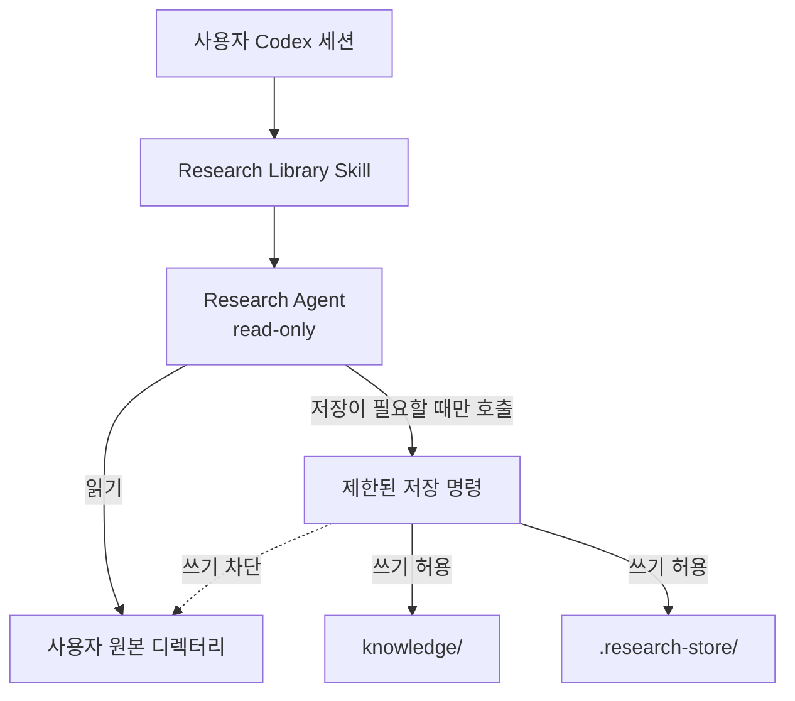
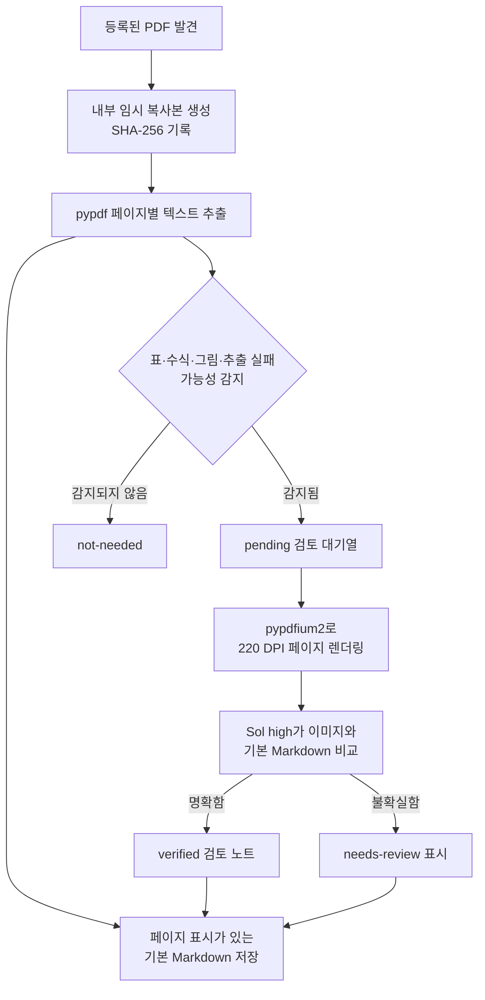
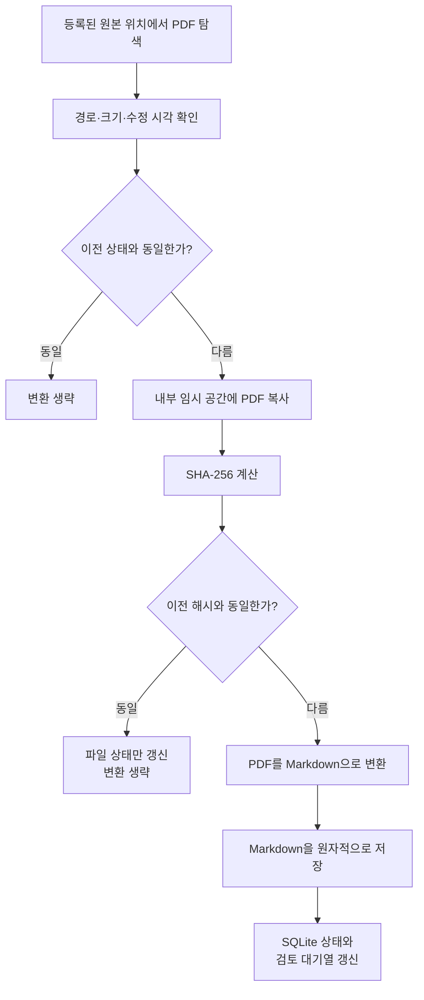
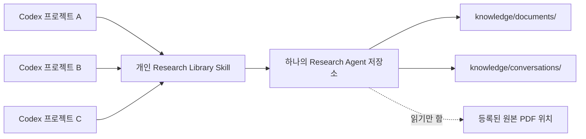
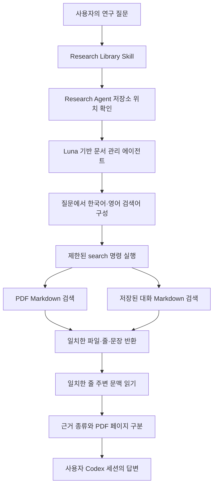
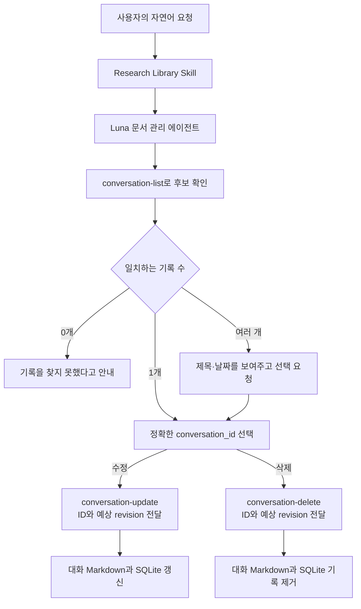

# Research Agent 기술 설계

[한국어](./README.md) | [English](./README.en.md)

[개발 로드맵](./ROADMAP.md)

이 문서는 Research Agent의 동작 원리와 설계 판단을 주제별로 기록한다.

## 목차

1. [사용자 원본 디렉터리 보호와 권한 관리](#1-사용자-원본-디렉터리-보호와-권한-관리)
2. [PDF 변환 과정과 결과의 신뢰성](#2-pdf-변환-과정과-결과의-신뢰성)
3. [저장 구조와 증분 동기화](#3-저장-구조와-증분-동기화)
4. [스킬 호출과 검색·근거 구성](#4-스킬-호출과-검색근거-구성)
5. [대화 저장과 연구 기억의 수명](#5-대화-저장과-연구-기억의-수명)

## 1. 사용자 원본 디렉터리 보호와 권한 관리

### 설계 목표

Research Agent는 사용자가 여러 위치에 보관한 PDF를 읽고, 검색 가능한
Markdown으로 변환한다. 이 과정에서 가장 중요한 원칙은 **사용자의 원본
디렉터리를 수정하지 않는 것**이다.

원본 PDF와 원본 디렉터리는 입력 자료로만 사용한다. 변환된 Markdown,
검색 상태, 임시 파일은 모두 Research Agent가 소유한 디렉터리에 저장한다.

### 권한 흐름



사용자 Codex 세션이 Research Agent를 호출하더라도 호출된 에이전트가 부모
세션의 권한을 그대로 사용하지 않도록 별도의 `read-only` 샌드박스 모드를
명시한다. 따라서 Research Agent는 원본 파일과 Research Agent 저장소를 직접
수정할 수 없다.

Markdown이나 SQLite 상태를 저장해야 할 때는 허용된 전용 명령만 호출한다.
이 명령은 다시 별도의 제한된 권한 프로필 안에서 실행된다.

| 위치 | 허용 권한 | 용도 |
| --- | --- | --- |
| 사용자 원본 디렉터리 | 읽기 | PDF 탐색과 변환 입력 |
| `knowledge/` | 읽기·쓰기 | 변환된 Markdown과 대화 기록 |
| `.research-store/` | 읽기·쓰기 | 설정, SQLite 상태, 임시 작업 파일 |
| 그 외 위치 | 읽기 또는 차단 | Research Agent의 저장 대상이 아님 |

### 보호 장치

원본 보호는 에이전트 지침 하나에 의존하지 않는다.

1. **에이전트 권한**
   문서 관리 에이전트와 PDF 시각 검토 에이전트는 모두 읽기 전용으로
   실행된다. 부모 Codex 세션에서 권한 설정을 생략해 상속하는 방식이 아니라,
   에이전트 설정에 읽기 전용 권한을 명시한다.

2. **저장 명령의 권한**
   에이전트는 파일을 직접 만들거나 수정하지 않는다. Research Agent 내부에만
   쓸 수 있는 전용 명령을 사용한다. 원본 디렉터리는 이 명령의 읽기 영역으로만
   포함된다.

3. **프로그램의 경로 검사**
   생성되는 파일이 Research Agent 내부에 있는지 다시 확인한다. 경로 이탈,
   심볼릭 링크, 하드 링크를 이용해 원본이나 외부 위치에 쓰는 동작을 거부한다.
   원본 PDF는 읽은 뒤 내부 임시 공간에서 처리하며, 처리 도중 원본이 바뀌면
   해당 결과를 폐기한다.

4. **기능 범위 제한**
   원본 파일을 편집하거나 이동하고, 이름을 바꾸거나 삭제하는 기능을 제공하지
   않는다. 원본 경로 등록을 해제해도 이후 탐색만 중단하며 원본과 기존 Markdown
   기록은 삭제하지 않는다.

### 부모 Codex 세션과의 관계

Research Agent의 권한과 Research Agent를 호출한 사용자 Codex 세션의 권한은
서로 다르다.

Research Agent에는 별도의 읽기 전용 권한이 적용되고, 저장 명령에도 제한된
권한 프로필이 적용된다. 부모 세션이 Full access여도 이 권한이 Research Agent에
자동으로 확대되지는 않는다.

하지만 Research Agent는 부모 Codex 세션의 권한을 낮출 수 없다. Full access를
가진 부모 세션은 Research Agent를 거치지 않고 다음 작업을 수행할 수 있다.

- 원본 파일을 직접 수정한다.
- Research Agent의 설치 파일이나 설정을 수정한다.
- Research Agent가 제공하지 않는 다른 명령을 실행한다.

이것은 Research Agent 작업의 권한 문제가 아니라 사용자 Codex 세션 전체의
권한 문제다. 권한이 더 작은 하위 에이전트가 자신을 호출한 상위 세션을 제한할
수는 없다.

### 보장 범위

현재 설계가 보장하는 내용은 다음과 같다.

> Research Agent를 통해 수행되는 작업은 사용자 원본 디렉터리에 쓰지 않는다.

현재 설계만으로 다음 내용까지 보장할 수는 없다.

> Full access를 가진 부모 Codex 세션을 포함해 컴퓨터에서 실행되는 모든 작업이
> 사용자 원본 디렉터리를 수정하지 않는다.

두 번째 수준의 보호가 필요하다면 Research Agent가 아니라 사용자 세션 전체에
원본 경로를 읽기 전용으로 만드는 권한 프로필을 적용해야 한다. 더 강한 격리가
필요한 환경에서는 운영체제 파일 권한, 별도 사용자 계정 또는 읽기 전용 마운트와
같은 외부 보호 장치가 필요하다.

### 검증 기준

권한 설계는 다음 동작으로 확인한다.

- 제한된 저장 명령이 `knowledge/`와 `.research-store/`에는 쓸 수 있다.
- 같은 명령으로 외부 원본 디렉터리에 쓰려고 하면 운영체제 샌드박스가 차단한다.
- 동기화 전후 원본 디렉터리의 파일 내용이 동일하다.
- Research Agent 밖을 가리키는 저장 경로와 링크를 프로그램이 거부한다.
- 원본 경로 등록과 해제는 Research Agent 내부 설정만 변경한다.
- Research Agent를 제거해도 등록했던 원본 파일은 그대로 남는다.

### 책임별 구현 파일

| 책임 | 구현 파일 |
| --- | --- |
| 개인 에이전트, 명령 규칙, 제한 권한 프로필 설치 | [`scripts/personal_registration.py`](../../scripts/personal_registration.py) |
| 읽기 전용 에이전트의 역할과 행동 제한 | [`research-library-manager.toml`](../../resources/agents/research-library-manager.toml), [`research-paper-converter.toml`](../../resources/agents/research-paper-converter.toml) |
| 제한된 저장 명령으로 다시 진입 | [`research-store` launcher](../../resources/skills/research-library/scripts/research-store) |
| 저장 경로와 원본 경로의 경계 검증 | [`config.py`](../../src/research_store/config.py), [`safety.py`](../../src/research_store/safety.py) |
| 설치 충돌과 실제 샌드박스 권한 검증 | [`test_personal_registration.py`](../../tests/test_personal_registration.py), [`test_install_security.py`](../../tests/test_install_security.py), [`test_permission_profile_integration.py`](../../tests/test_permission_profile_integration.py) |

## 2. PDF 변환 과정과 결과의 신뢰성

### 설계 목표

PDF 변환의 목적은 원본과 동일한 편집용 문서를 다시 만드는 것이 아니다.
Research Agent는 먼저 **검색과 내용 발견에 사용할 페이지별 텍스트 색인**을
만들고, 수식·표·그림처럼 정확성이 중요한 페이지만 이미지로 다시 확인한다.

기본 추출 결과와 시각 검토 결과를 구분해 보존하므로 사용자는 검색 결과가
단순 텍스트 추출에서 나온 것인지, 원본 페이지 이미지로 다시 확인된 것인지
판단할 수 있다.

### 변환 흐름



### 기본 텍스트 추출

`pypdf`가 PDF 안에 저장된 글자를 페이지별로 읽는다. 각 페이지 앞에는 다음과
같은 표시를 추가한다.

```markdown
<!-- page: 3 -->

페이지에서 추출한 텍스트
```

이 결과는 Markdown 문법으로 논문의 구조를 완전히 재구성한 문서가 아니다.
제목, 본문, 수식, 표를 의미 단위로 복원하기보다 검색 가능한 텍스트를 페이지
단위로 저장한 것이다.

텍스트가 들어 있는 일반 영문 PDF에서는 제목, 초록, 본문의 주요 용어를 찾는
용도로 사용할 수 있다. 다음 요소는 기본 추출만으로 신뢰하기 어렵다.

- 다단 문서의 정확한 읽기 순서
- 줄바꿈과 하이픈으로 나뉜 단어
- 수식의 위첨자, 아래첨자, 분수와 특수 기호
- 표의 행·열 관계와 병합된 셀
- 그림, 그래프, 범례와 축의 의미
- 특수 폰트로 인코딩된 글자
- 이미지로만 저장된 스캔 문서

### 시각 검토 대상 선별

기본 추출 단계는 다음 특징을 가진 페이지를 시각 검토 대상으로 등록한다.

- `Table`, `Figure`, `Equation` 또는 이에 대응하는 한국어 표현
- 수학 기호가 많은 페이지
- 등식 형태의 짧은 줄이 여러 개 있는 페이지
- PDF 내부 이미지가 포함된 페이지
- 추출된 텍스트가 매우 적은 페이지

이 선별은 규칙 기반 후보 탐지다. 검토가 필요 없는 페이지를 포함할 수 있고,
캡션이 없는 벡터 도표나 인식되지 않은 수식처럼 중요한 페이지를 놓칠 수도
있다. 따라서 `not-needed`는 정확성이 검증됐다는 뜻이 아니라 현재 규칙이 검토
필요성을 발견하지 못했다는 뜻이다.

### Sol high 시각 검토

검토 대상으로 선택된 페이지만 220 DPI PNG로 렌더링한다. 시각 검토 에이전트는
페이지 이미지와 기본 Markdown을 함께 보고 다음 정보를 검토 노트로 작성한다.

- 명확하게 읽히는 수식의 LaTeX 표현
- 구조가 단순한 표의 Markdown 표현
- 그림의 구성, 축, 범례와 확인 가능한 관계
- 기본 텍스트 추출에서 확인된 오류
- 끝까지 판독할 수 없는 기호, 셀 또는 배치

시각 검토 결과는 기본 추출문을 덮어쓰지 않고 `Visual verification notes`에
추가한다. 불명확한 값을 추측하지 않으며, 확신할 수 없으면 `needs-review`로
남긴다.

렌더링할 때 사용한 PDF와 결과를 저장할 때의 PDF가 같은지도 SHA-256으로
확인한다. 해시가 달라지면 오래된 페이지 이미지를 기준으로 만든 검토 결과를
저장하지 않는다.

### 검토 상태의 의미

| 상태 | 의미 |
| --- | --- |
| `not-needed` | 현재 선별 규칙이 검토 대상을 발견하지 못함 |
| `pending` | 시각 검토 대상으로 선택됐지만 아직 완료되지 않음 |
| `verified` | 선택된 페이지를 시각 검토 에이전트가 확인함 |
| `needs-review` | 시각 검토를 수행했지만 불확실성이 남아 있음 |

`verified`는 선택된 페이지에 대한 AI 검토 완료 상태다. 사람의 검증이나 수식과
수치의 수학적 동일성을 보장하는 인증은 아니다.

### 용도별 신뢰 범위

| 사용 목적 | 현재 판단 |
| --- | --- |
| 논문 제목, 주제, 초록과 일반 본문 검색 | 기본 추출 결과를 검색 색인으로 사용 가능 |
| 관련 내용이 있는 문서와 페이지 발견 | 페이지 표시를 이용해 원본으로 이동 가능 |
| 수식의 정확한 재사용 | 시각 검토 후에도 원본 페이지 확인 필요 |
| 표의 수치와 행·열 관계 인용 | 원본 페이지 확인 필요 |
| 그래프의 정확한 수치 판독 | 원본 페이지 확인 필요 |
| PDF를 동일한 구조의 Markdown으로 복원 | 현재 설계 목표가 아님 |

현재 구조는 연구 자료 검색과 내용 발견을 위한 프로토타입으로 적합하다. 정확한
과학적 수치, 수식, 표를 Markdown만 보고 그대로 사용하는 것은 현재 보장 범위를
벗어난다.

### 책임별 구현 파일

| 책임 | 구현 파일 |
| --- | --- |
| PDF 탐색, 임시 복사, 텍스트 추출, 후보 선별, 페이지 렌더링과 검토 결과 저장 | [`sync.py`](../../src/research_store/sync.py) |
| 문서 상태와 페이지별 검토 상태 관리 | [`state.py`](../../src/research_store/state.py) |
| 동기화와 시각 검토 에이전트 연결 | [`research-library-manager.toml`](../../resources/agents/research-library-manager.toml) |
| 이미지 해석 원칙과 불확실성 처리 | [`research-paper-converter.toml`](../../resources/agents/research-paper-converter.toml) |
| 사용자 요청을 동기화·검색·검토 흐름으로 연결 | [`research-library/SKILL.md`](../../resources/skills/research-library/SKILL.md) |
| 변환, 대기열, 해시 일치와 원본 보존 검증 | [`test_sync.py`](../../tests/test_sync.py) |

## 3. 저장 구조와 증분 동기화

### 설계 목표

Research Agent는 등록된 원본 위치를 다시 확인할 때마다 모든 PDF를 변환하지
않는다. 전체 위치에서 PDF의 존재와 기본 상태는 확인하되, 새로 발견됐거나 실제
내용이 변경된 문서만 다시 변환한다.

이 구조의 목적은 반복 작업 시간을 줄이고, 변경되지 않은 문서에 대한 불필요한
시각 검토와 구독 사용량을 만들지 않는 것이다. 원본 위치에는 상태 파일이나
색인을 만들지 않으며 동기화에 필요한 기록은 모두 Research Agent 내부에 둔다.

### 저장 영역의 역할

| 저장 영역 | 역할 |
| --- | --- |
| `knowledge/documents/` | Codex와 사용자가 검색하고 읽는 PDF별 Markdown |
| `.research-store/library.sqlite` | 문서 상태, 해시, 파서 버전과 검토 대기열을 기록하는 내부 원장 |
| `.research-store/tmp/` | 변환 중 사용하는 PDF 복사본과 페이지 이미지 |

Markdown은 검색하고 인용할 내용을 보존한다. SQLite는 사용자에게 보여 줄 본문을
저장하는 데이터베이스가 아니라, 같은 PDF를 다시 처리해야 하는지 판단하기 위한
상태 기록이다.

### 문서 식별 방식

각 PDF는 **원본 위치 ID와 그 위치 안에서의 상대 경로**를 조합해 식별한다.

```text
<source-id>:<relative-path>
```

예를 들어 `papers`로 등록한 위치 안의 `optics/laser.pdf`는
`papers:optics/laser.pdf`라는 문서 키를 가진다. 서로 다른 원본 위치에 같은
내용의 PDF가 있더라도 출처가 다르면 별개의 문서로 관리한다.

### 동기화 흐름



### 변경 판단 순서

첫 번째 단계에서는 파일 크기, 나노초 단위 수정 시각, 파서 버전, 이전 오류와
생성된 Markdown의 존재 여부를 비교한다. 모두 같으면 PDF를 다시 읽지 않고
`unchanged`로 처리한다.

기본 상태가 달라졌다면 원본 PDF를 Research Agent 내부 임시 공간으로 복사하고
SHA-256을 계산한다. 이는 프로세스나 저장소를 복제하는 fork가 아니라 변환에
사용할 일반적인 임시 파일 복사다. 해시가 이전 기록과 같으면 내용은 동일하다고
판단하고 크기와 수정 시각 같은 상태만 갱신한다. 임시 PDF 복사본은 이 확인이나
변환이 끝나면 삭제한다.

다음 조건에서는 실제 변환을 수행한다.

- 처음 발견한 PDF
- 이전 기록과 SHA-256이 다른 PDF
- PDF 파서 버전이 변경된 문서
- 생성된 Markdown이 사라진 문서
- 이전 변환에서 오류가 발생한 문서
- 저장 경로 마이그레이션이 필요한 문서

재변환하면 Markdown을 교체하고 해당 PDF의 시각 검토 후보도 현재 결과를
기준으로 다시 등록한다. 변경되지 않은 PDF는 기존 Markdown과 시각 검토 상태를
그대로 유지한다.

### 처리 중 원본 변경 방지

변환을 시작하기 전과 끝난 뒤 원본 PDF의 크기와 수정 시각을 비교한다. 처리하는
동안 원본 상태가 달라지면 결과를 저장하지 않고 오류로 기록한다. 기존 Markdown이
있다면 그대로 남기고 다음 동기화에서 다시 시도한다.

이 과정에서도 원본은 읽기 입력으로만 사용한다. PDF 해시 계산과 변환은 내부
복사본을 대상으로 수행하며 원본 경로에는 임시 파일을 만들지 않는다.

### 사라진 문서와 연결되지 않은 위치

정상적으로 탐색할 수 있는 원본 위치에서 이전 PDF가 발견되지 않으면 SQLite에
`missing` 상태와 발견 시각을 기록한다. 기존 Markdown과 검토 기록은 삭제하지
않는다.

원본 위치 자체가 없거나 읽을 수 없다면 그 위치의 모든 문서를 `missing`으로
바꾸지 않는다. 외장 디스크 분리나 일시적인 권한 문제를 문서 삭제로 오인하지
않도록 해당 위치만 `unavailable`로 보고한다.

### 대표적인 동작

| 상황 | 동작 |
| --- | --- |
| 새 PDF 추가 | Markdown 생성과 검토 후보 등록 |
| 변경 없이 다시 동기화 | 탐색만 수행하고 변환 생략 |
| 수정 시각만 변경 | 해시가 같으면 상태만 갱신 |
| PDF 내용 변경 | Markdown 재생성과 검토 후보 재등록 |
| 파서 버전 변경 | 현재 파서로 다시 변환 |
| 생성된 Markdown 삭제 | 원본에서 다시 생성 |
| 변환 실패 | 오류를 기록하고 다음 동기화에서 재시도 |
| 원본 PDF 삭제 | `missing`으로 표시하고 기존 Markdown 보존 |
| 원본 위치 연결 해제 | 위치 오류만 기록하고 문서는 `missing`으로 바꾸지 않음 |
| 사라졌던 PDF 복원 | 해시 확인 후 현재 상태로 복구 |

### 현재 범위와 한계

- 변경되지 않은 PDF의 변환은 생략하지만 등록된 위치의 PDF 탐색은 매번 수행한다.
- 파일 이름이나 상대 경로가 바뀌면 이전 문서는 `missing`, 새 경로는 새 문서로
  인식한다. 경로 이동을 같은 문서의 이동으로 자동 연결하지 않는다.
- 같은 PDF가 여러 원본 위치에 있으면 출처 보존을 위해 각각 저장한다. 따라서
  검색 결과가 중복될 수 있다.
- 빠른 변경 확인은 파일 크기와 수정 시각을 신뢰한다. 두 값이 모두 유지된 채
  내용만 바뀌는 비정상적인 변경까지 매번 해시로 확인하지는 않는다.

현재 방식은 개인 연구 자료 규모에서 반복 변환 비용을 줄이면서 원본 위치와
생성된 결과의 관계를 추적하기 위한 구조다. PDF 수가 크게 늘어나 탐색 자체가
느려질 때 별도의 파일 시스템 감시나 색인 방식이 필요한지 다시 검토한다.

### 책임별 구현 파일

| 책임 | 구현 파일 |
| --- | --- |
| PDF 탐색, 변경 판단, 임시 복사, 변환과 누락 상태 처리 | [`sync.py`](../../src/research_store/sync.py) |
| 문서 상태, 해시, 파서 버전과 검토 대기열 저장 | [`state.py`](../../src/research_store/state.py) |
| 원본 위치와 Research Agent 저장 위치 구성 | [`config.py`](../../src/research_store/config.py) |
| 안전한 경로 검사와 Markdown 원자적 저장 | [`safety.py`](../../src/research_store/safety.py) |
| 증분 처리와 원본 불변성 검증 | [`test_sync.py`](../../tests/test_sync.py) |

## 4. 스킬 호출과 검색·근거 구성

### 설계 목표

Research Agent는 특정 Codex 프로젝트 안에 설치되지 않는다. 사용자 홈에 등록한
개인 Research Library 스킬이 어느 Codex 프로젝트에서든 별도로 설치된 하나의
Research Agent 저장소를 찾고, 동기화된 PDF와 명시적으로 저장한 대화를 함께
검색한다.

검색의 목적은 바로 정답을 만드는 것이 아니라 질문과 관련된 Markdown 위치를
찾는 것이다. 문서 관리 에이전트가 일치한 위치 주변의 문맥을 다시 읽고, 정보의
종류와 PDF 페이지를 구분한 뒤 사용자 Codex 세션이 답변에 활용한다.

### 프로젝트와 Research Agent의 관계

기본 설치 안내는 Research Agent 본체를 `~/research-agent`에 둔다. 설치
스크립트는 실행된 저장소의 실제 위치를 개인 스킬과 에이전트 설정에 기록하므로,
다른 위치에 설치했다면 그 위치를 사용한다.



스킬은 현재 작업 디렉터리를 Research Agent로 가정하지 않는다. 설치된
`research-root` 실행 파일이 자신의 실제 위치에서 프로젝트 루트를 계산하고,
프로젝트 표시 파일을 확인한 뒤 저장소 경로를 반환한다. 따라서 사용자가 다른
프로젝트에서 작업해도 같은 개인 연구 저장소를 찾을 수 있다.

현재 구조는 Codex 프로젝트마다 별도의 Research Agent 저장소를 만들지 않는다.
어느 프로젝트에서 스킬을 호출하더라도 같은 `knowledge/`와 SQLite 상태를
사용한다. 이는 흩어진 연구 문서와 여러 세션에서 저장한 생각을 프로젝트 경계를
넘어 다시 찾기 위한 설계다.

### 검색 대상

검색 명령은 다음 두 위치의 Markdown을 재귀적으로 읽는다.

| 위치 | 검색 결과의 종류 |
| --- | --- |
| `knowledge/documents/` | PDF에서 생성한 문서 근거 |
| `knowledge/conversations/` | 사용자가 선택해 저장한 대화 기록 |

검색할 때 원본 PDF 전체를 다시 읽거나 변환하지 않는다. SQLite도 본문 검색에
사용하지 않는다. 아직 동기화하지 않은 PDF와 저장하지 않은 과거 대화는 검색할
수 없다.

### 검색 흐름



### 질문에서 검색어 구성

문서 관리 에이전트는 사용자의 자연어 질문에서 핵심 용어를 고른다. 영어 연구
문서를 찾을 수 있도록 한국어 질문에는 관련 영어 기술 용어도 함께 구성한다.

예를 들어 `광소자의 결합 효율`에 관한 질문은 다음과 같은 검색어로 확장될 수
있다.

```text
광소자
결합 효율
optical device
coupling efficiency
coupling loss
```

동의어 목록을 별도의 사전에 고정하지 않는다. Luna가 질문의 문맥에 따라 유용한
용어를 선택하고 한 번의 검색 명령에 함께 전달한다.

### 현재 검색 방식

현재 구현은 벡터나 임베딩을 사용하지 않는다. 각 Markdown 파일을 줄 단위로
읽고 대소문자를 구분하지 않는 문자열 포함 여부를 확인한다. 검색 결과에는 다음
정보가 포함된다.

- PDF 문서 또는 저장된 대화라는 결과 종류
- 일치한 Markdown의 프로젝트 내부 경로
- 일치한 줄 번호와 검색어
- 일치한 부분 주변의 짧은 문장

여러 검색어를 사용하면 각 검색어의 결과를 차례로 섞는다. 한 용어의 결과가
많더라도 다른 용어의 결과가 모두 밀려나지 않게 하기 위한 처리다.

검색 명령이 반환하는 짧은 문장은 최종 근거가 아니다. 문서 관리 에이전트가
해당 Markdown을 일치한 줄 주변에서 다시 읽고 질문과 관련된 문맥인지 판단한다.
미리 고정된 청크를 만들기보다 검색 결과에 따라 필요한 주변 범위를 읽는다.

### PDF 페이지와 시각 검토 근거

기본 PDF 추출문을 사용할 때는 검색 결과 주변의 가장 가까운 페이지 표시를
찾는다.

```markdown
<!-- page: 12 -->
```

답변에는 Markdown 경로, 설정에 기록된 원본 위치와 페이지 번호를 함께 사용할
수 있다. `Visual verification notes`의 내용을 사용한다면 일반 페이지 표시 대신
해당 노트의 제목과 시각 검토 표시를 따른다.

```markdown
### Pages 12

<!-- visual-review-pages: 12 -->
```

이를 통해 기본 텍스트 추출과 원본 페이지 이미지를 이용한 AI 검토 결과를
구분한다.

### 정보 종류의 구분

PDF와 저장된 대화는 함께 검색하지만 같은 종류의 근거로 취급하지 않는다.

| 정보 종류 | 답변에서의 의미 |
| --- | --- |
| PDF 근거 | PDF 기본 추출 또는 페이지 이미지 검토에서 가져온 내용 |
| 사용자 기록 | 사용자가 이전 대화에서 말하거나 결정한 내용 |
| 과거 Codex 설명 | 이전 AI 답변이며 논문 근거로 간주하지 않는 내용 |

저장된 대화에 포함된 Codex 설명을 PDF에서 확인된 사실로 바꾸어 표현하지 않는다.
사용자의 생각, 결정, 검증되지 않은 주장과 문서 근거의 구분을 유지한다.

### 여러 Codex 프로젝트의 데이터 구분

현재 PDF는 Codex 프로젝트가 아니라 원본 위치 ID와 상대 경로로 구분한다. 어느
프로젝트에서 PDF 위치를 등록했는지는 별도로 기록하지 않는다.

저장된 대화도 날짜, 제목, 저장 범위, 태그와 내용 해시로 식별하며 대화를 저장한
Codex 프로젝트 ID는 기록하지 않는다. 따라서 여러 프로젝트에서 저장한 대화는
`knowledge/conversations/`에 함께 보관되고 검색된다.

이 동작은 하나의 개인 연구 기억을 여러 프로젝트에서 공유하려는 현재 목적에
맞는다. 향후 서로 관련 없는 연구 주제가 많아져 구분이 필요하다면 저장소를 여러
개로 복제하기보다 PDF 위치와 대화에 `collection` 같은 논리적 분류를 추가하고,
전체 또는 특정 분류를 선택해 검색하는 방식을 검토한다.

### 현재 범위와 한계

- 질문의 의미와 관련된 용어를 검색어로 만들지 못하면 결과가 누락될 수 있다.
- PDF의 줄바꿈이나 하이픈으로 단어가 분리되면 문자열 검색이 놓칠 수 있다.
- 결과는 의미적 유사도나 근거의 중요도 순서로 정렬되지 않는다.
- 원본이 사라졌거나 검색 위치에서 해제된 문서의 기존 Markdown도 계속 검색된다.
- 저장하지 않은 대화와 아직 동기화하지 않은 PDF는 검색할 수 없다.
- 현재 Codex 프로젝트만 대상으로 검색하거나 프로젝트별로 대화를 필터링할 수
  없다.

현재 방식은 별도의 임베딩 모델 없이 개인 규모의 연구 자료에서 정확한 용어와
그 주변 문맥을 찾기 위한 프로토타입이다. 실제 자료를 이용해 누락, 중복과 검색
시간을 측정한 뒤 전문 검색 색인, 의미 검색 또는 collection 구분이 필요한지
결정한다.

### 검증 기준

- 어느 Codex 프로젝트에서 호출해도 등록된 하나의 Research Agent를 찾는다.
- Git에서 제외된 PDF Markdown과 대화 Markdown을 한 번에 검색할 수 있다.
- 한국어 질문에 유용한 영어 기술 용어를 함께 사용할 수 있다.
- 검색 결과를 PDF 근거, 사용자 기록과 과거 Codex 설명으로 구분한다.
- PDF 근거에는 Markdown 경로와 올바른 페이지 표시를 연결한다.
- 한 검색어의 결과가 많아도 다른 검색어의 결과가 모두 밀려나지 않는다.

### 책임별 구현 파일

| 책임 | 구현 파일 |
| --- | --- |
| 스킬 진입점, 검색어 확장과 근거 표시 원칙 | [`research-library/SKILL.md`](../../resources/skills/research-library/SKILL.md) |
| 저장소 위치 확인 | [`research-root`](../../resources/skills/research-library/scripts/research-root) |
| Luna 검색 작업과 문맥 판독 | [`research-library-manager.toml`](../../resources/agents/research-library-manager.toml) |
| Markdown 탐색, 문자열 일치와 결과 배분 | [`search.py`](../../src/research_store/search.py) |
| PDF와 대화의 통합 검색 검증 | [`test_search.py`](../../tests/test_search.py) |

## 5. 대화 저장과 연구 기억의 수명

### 설계 목표

저장된 대화는 원래 Codex 대화의 복사본이 아니라 사용자가 선택한 범위를
Research Agent의 검색 가능한 연구 기억으로 만든 기록이다. 사용자는 자연어로
기록을 찾고 검색용 정리 정보를 수정하거나 더 이상 필요하지 않은 기록을 삭제할
수 있어야 한다.

수정과 삭제는 Research Agent가 소유한 대화 기록에만 적용한다. 원본 PDF, PDF에서
생성된 Markdown, 다른 대화 기록과 Codex 앱의 실제 대화에는 영향을 주지 않는다.

### 사용자 요청과 내부 명령

사용자는 터미널 명령이나 대화 ID를 미리 알 필요가 없다. 어느 Codex 프로젝트에서든
다음과 같이 자연어로 요청한다.

```text
“저장한 대화 목록을 보여줘.”
“지난번 굴절률 보정 대화의 요약과 태그를 수정해줘.”
“레이저 실험 대화로 저장한 기억을 삭제해줘.”
```



`conversation-list`, `conversation-update`, `conversation-delete`는 스킬과 문서
관리 에이전트가 사용하는 내부 명령이다. 에이전트가 Markdown이나 SQLite를 직접
수정하지 않고, 경로와 파일 연결을 검사하는 제한된 명령을 통해서만 변경한다.

`conversation-list`는 별도 입력 없이 저장된 각 기록의 ID, 제목, 범위, 최초·최근
저장 시각, 개정 번호, 태그, 별칭과 내부 경로를 반환한다. 이 목록은 사용자에게
터미널 출력을 그대로 보여주기 위한 것이 아니라 자연어 요청에 맞는 후보를 정확히
고르기 위한 색인이다.

제목, 태그와 별칭만으로 사용자가 설명한 기록을 찾기 어려우면 통합 검색에서 대화
결과만 고른 뒤, 검색 결과의 경로를 목록의 경로와 대조해 정확한 ID를 얻는다.
필요하면 소수의 후보 Markdown 문맥을 읽는다. 검색 결과나 제목만 보고 ID를
추측하지 않는다.

후보가 하나면 사용자의 요청을 그대로 수행한다. 같은 제목이나 비슷한 설명의
후보가 여러 개일 때만 제목, 저장 시각과 ID를 보여주고 어느 기록인지 묻는다.
제목이나 파일 경로만으로 수정하거나 삭제하지 않는다.

### 대화 기록의 식별과 변경 이력

대화를 처음 저장할 때 내용에서 만든 고유한 `conversation_id`를 부여한다. 제목,
요약이나 태그를 수정해도 이 ID는 바뀌지 않는다. 여러 기록이 같은 제목을 가질 수
있으므로 이후의 수정과 삭제는 항상 이 ID를 기준으로 수행한다.

```yaml
id: conversation-20260921-...
created_at: 2026-09-21T10:00:00+09:00
updated_at: 2026-09-21T14:30:00+09:00
revision: 2
```

| 필드 | 의미 |
| --- | --- |
| `id` | 기록을 처음 만든 뒤 유지되는 안정적인 식별자 |
| `created_at` | 최초 저장 시각이며 수정하지 않음 |
| `updated_at` | 검색용 정리 정보를 마지막으로 수정한 시각 |
| `revision` | 최초 저장은 1이며 수정이 성공할 때마다 1씩 증가 |

목록 명령이 반환한 현재 `revision`은 동시에 실행되는 다른 Codex 작업으로부터
기록을 보호하는 조건으로도 사용한다. 문서 관리 에이전트는 수정과 삭제 명령에
사용자가 볼 필요 없는 `--expected-revision <N>` 값을 함께 전달한다.

두 작업이 같은 기록의 revision 2를 확인한 뒤 한 작업이 먼저 수정해 revision 3을
만들었다면, 다른 작업이 revision 2를 기준으로 보낸 수정이나 삭제는 거부된다.
Markdown과 SQLite 어느 쪽도 바꾸지 않는다. 에이전트는 목록과 기록을 다시 읽고
최신 값으로 요청을 구성해야 하며, 오래된 JSON이나 revision을 그대로 재사용하지
않는다. 이를 통해 한 프로젝트의 작업이 다른 프로젝트에서 방금 수정한 내용을
조용히 덮어쓰거나 삭제하는 일을 막는다.

### 수정할 수 있는 내용

수정은 저장된 원문을 다시 쓰는 기능이 아니라, 검색과 재사용을 위해 만든 정리
정보를 바로잡는 기능이다.

| 수정 가능 | 수정 불가 |
| --- | --- |
| 제목 | 선택 범위 원문 |
| 검색용 요약 | 저장 범위 `scope` |
| 태그와 별칭 | 최초 저장 시각 `created_at` |
| 사용자의 생각 | 대화 ID |
| 결정된 사항 | 원문 보존 상태와 누락 설명 |
| 검증되지 않은 생각 | 원본 PDF와 PDF Markdown |
| 미해결 질문 | Codex 앱의 실제 대화 |
| 관련 문서 정보 |  |

`conversation-update <conversation-id> --expected-revision <N>`은 표준 입력으로
모든 수정 가능 필드를 포함한 하나의 JSON 객체를 받는다. 사용자가 일부 항목만
바꾸라고 요청하면 문서 관리 에이전트가 목록에 반환된 내부 경로의 현재 Markdown을
읽어 변경하지 않을 필드까지 채운 완전한 객체를 만든다. 필드가 빠지거나 알 수
없는 필드 또는 원문·범위 같은 수정 불가 필드가 포함되면 명령은 변경 없이
거부한다.

정확한 키는 `title`, `summary`, `tags`, `aliases`, `user_points`, `decisions`,
`unverified`, `open_questions`, `related_documents` 아홉 개다.

변경된 Markdown은 안전하게 교체되고 SQLite의 제목·태그 같은 조회 정보도 이어서
갱신된다. 일반적인 쓰기 오류가 발생하면 가능한 범위에서 두 변경을 모두
원상복구한다. 따라서 성공한 수정의 제목과 요약은 다음 검색부터 바로 사용된다.

선택 범위나 원문을 잘못 저장했다면 기존 원문을 편집해 실제 대화와 다른 기록을
만들지 않는다. 해당 기록을 삭제하고 올바른 범위를 다시 저장한다.

### 삭제의 범위

`conversation-delete <conversation-id> --expected-revision <N>`은 정확한 ID와
목록에서 확인한 revision이 모두 일치할 때 다음 두 항목을 영구적으로 제거한다.

```text
knowledge/conversations/ 아래의 해당 Markdown
.research-store/library.sqlite 안의 해당 대화 기록
```

삭제하지 않는 항목은 다음과 같다.

- Codex 앱에 남아 있는 실제 대화 세션
- 원본 PDF와 원본 디렉터리
- PDF에서 생성된 Markdown과 시각 검토 기록
- 다른 저장 대화

현재 프로토타입은 삭제한 대화 기록을 보관하는 휴지통이나 실행 취소 기능을
제공하지 않는다. 대상 Markdown이 존재할 때 삭제 명령은 그 파일이 Research
Agent의 대화 저장 영역 안에 있고, SQLite 경로와 Markdown 내부 ID가 요청한 ID와
일치할 때만 실행된다.
심볼릭 링크, 하드 링크, 경로 이탈 또는 ID 불일치가 발견되면 아무것도 삭제하지
않고 오류를 반환한다.

목록이 `available: false`를 반환하면 Markdown은 이미 사라진 상태다. 이때 수정은
원문과 메타데이터를 검증할 수 없어 거부한다. 삭제는 안전한 대화 저장 경로,
정확한 ID와 revision이 일치하면 남은 SQLite 기록만 정리하고, 삭제할 Markdown이
이미 없었다는 사실을 결과에 표시한다.

### 현재 범위와 한계

- 저장하지 않은 과거 대화는 목록·수정·삭제할 수 없다.
- 실제 Codex 대화 세션을 수정하거나 삭제하는 기능이 아니다.
- 여러 Codex 프로젝트에서 저장한 대화가 하나의 저장소에 함께 있으므로 비슷한
  제목의 기록은 날짜와 ID로 구분해야 할 수 있다.
- 수정 이력은 현재 `revision`과 마지막 수정 시각만 보존하며, 이전 버전의 전체
  내용을 별도로 보관하지 않는다.
- 삭제에는 휴지통이나 복원 기능이 없다.
- 대화 원문의 일부만 고쳐 쓰는 기능은 제공하지 않는다. 원문이나 저장 범위가
  잘못됐다면 삭제 후 다시 저장한다.
- Markdown 파일과 SQLite는 하나의 ACID 트랜잭션이 아니다. 일반적인 오류에는
  보상 복구를 시도하고 revision 불일치를 감지하지만, 파일 교체나 삭제 도중
  프로세스 또는 컴퓨터가 갑자기 종료되면 둘의 상태가 어긋나거나 내부 삭제 준비
  파일이 남을 수 있다. 현재 프로토타입에는 자동 복구 명령이 없다.
- 최초 ID에는 처음 저장한 제목, 시각과 원문이 반영된다. 제목을 수정한 뒤 같은
  원문을 수정된 제목으로 다시 저장하면 별도 기록이 생길 수 있다.

### 검증 기준

- 자연어 요청으로 저장된 대화 목록을 확인할 수 있다.
- 하나의 후보가 명확하면 추가 선택 없이 정확한 ID로 수정하거나 삭제한다.
- 후보가 여러 개면 변경 전에 사용자가 정확한 기록을 선택할 수 있다.
- 수정해도 ID, 원문, 범위와 최초 저장 시각이 바뀌지 않는다.
- 수정할 때 `revision`이 증가하고 `updated_at`이 갱신된다.
- 수정된 정리 정보가 다음 검색 결과에 반영된다.
- 삭제하면 해당 Markdown과 SQLite 기록만 사라져 검색 결과에 나타나지 않는다.
- 수정과 삭제가 PDF 자료, 다른 대화와 실제 Codex 대화에 영향을 주지 않는다.
- 오래된 revision으로 보낸 수정과 삭제는 아무 변경 없이 거부된다.
- 지원하지 않는 미래 Markdown 버전과 Markdown·SQLite revision 불일치는 변경
  없이 거부된다.
- 조작된 경로, 링크와 ID 불일치는 변경 없이 거부한다.

### 책임별 구현 파일

| 책임 | 구현 파일 |
| --- | --- |
| 자연어 요청을 대화 목록·수정·삭제 흐름으로 연결 | [`research-library/SKILL.md`](../../resources/skills/research-library/SKILL.md) |
| Luna가 후보를 식별하고 제한된 명령을 호출하는 원칙 | [`research-library-manager.toml`](../../resources/agents/research-library-manager.toml) |
| 대화 저장 형식, 허용된 수정과 안전한 삭제 | [`conversations.py`](../../src/research_store/conversations.py) |
| 대화 조회·이력·삭제 상태 관리 | [`state.py`](../../src/research_store/state.py) |
| 내부 대화 관리 명령의 입력과 출력 | [`cli.py`](../../src/research_store/cli.py) |
| 대화 수명과 원본 보존 검증 | [`test_conversation_management.py`](../../tests/test_conversation_management.py) |
