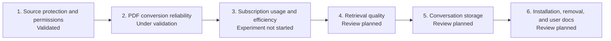

# Research Agent Development Roadmap

[한국어](./ROADMAP.md) | [English](./ROADMAP.en.md)

[Technical design](./README.en.md)

This document tracks the current state and next development outcome for each
area. The technical design records how the system works and why decisions were
made; this roadmap contains only status, limitations, and completion criteria.

## Overall Progress

| Area | Current state | Next development item |
| --- | --- | --- |
| Source protection and permissions | Validated | Maintain permission regression tests |
| PDF conversion and visual review | Under validation | Establish accuracy criteria with representative PDFs |
| Subscription usage and efficiency | Experiment not started | Measure identical workloads on Plus and Pro 5x |
| Retrieval | Implemented; design review pending | Validate retrieval quality and evidence labels |
| Conversation storage | Implemented; design review pending | Validate capture scope and retrieval usefulness |
| Installation and removal | Implemented; design review pending | Validate the installation experience for non-developers |
| User documentation | File structure only | Write the real usage flow and FAQ |

## Milestone 1. Source Protection and Permission Management

**Status: Validated**

### Completed Outcomes

- Research Agent custom agents run in read-only mode.
- The storage command can write only to `knowledge/` and `.research-store/`.
- A source path and the Research Agent store cannot contain one another.
- Writes through external paths, symbolic links, and hard links are rejected.
- A real constrained permission profile is tested to confirm that writes to an
  original source are denied.
- Full access in the parent Codex session is documented as outside the Research
  Agent guarantee.

### Maintenance Conditions

- Update both the constrained permission profile and path validation whenever a
  new storage path is introduced.
- Preserve the real sandbox integration test when the installation mechanism
  changes.
- Do not add a feature that modifies original files.

## Milestone 2. Validate PDF Conversion Reliability

**Status: Under validation**

### Current Implementation

- Page-level base text extraction with `pypdf`
- Markdown markers that preserve PDF page numbers
- Candidate selection for possible tables, equations, figures, and extraction
  failures
- 220 DPI rendering for selected pages
- Sol high visual review with explicit uncertainty states
- Rejection of stale review results when the PDF hash changes

### Confirmed Limitations

- Reading order in multi-column documents and specialized font encoding can
  break during extraction.
- Base extraction does not preserve equation structure, table relationships, or
  figure meaning.
- Rule-based page selection can miss an important page.
- `verified` records completion of AI review rather than human certification.
- Visual review for the current local samples is still in the `pending` state.

### Next Development Items

1. Select representative PDFs centered on ordinary prose, equations, and
   tables or figures.
2. Have a person label the pages that require visual review to create a
   comparison baseline.
3. Measure whether the current selection rules miss important pages.
4. Compare base extraction and Sol high review results with the original pages.
5. Check whether 220 DPI is insufficient for small equations or dense tables.
6. Use the results to decide whether OCR, better selection rules, or a parser
   replacement is necessary.

### Completion Criteria

- Titles, abstracts, and important terms are searchable in ordinary prose.
- Missed important equation, table, and figure pages are recorded for the
  evaluation set.
- The reliable scope and original-page verification requirement are documented
  for equations, tables, and figures.
- The meanings of `not-needed`, `verified`, and `needs-review` match observed
  behavior.
- A decision to retain or replace part of the pipeline is supported by evidence.

### Later Architecture Candidate

[`sync.py`](../../src/research_store/sync.py) currently owns PDF discovery,
conversion, page selection, rendering, and review result storage. Keeping the
flow together is useful at prototype scale. Split `parser`, `review detector`,
and `renderer` responsibilities only when accuracy work makes those stages
change frequently or difficult to test independently. Increasing the number of
files is not itself a milestone.

## Milestone 3. Validate Subscription Usage and Processing Efficiency

**Status: Experiment not started**

[Subscription usage experiment record](./experiments/subscription-usage.en.md)

### Current Assessment

- Research Agent consumes the user's Codex subscription allowance rather than
  an API key budget.
- The primary difference between Plus and Pro 5x is the available allowance,
  not the accuracy of an identical task.
- Actual usage depends on the model, reasoning effort, context, tool calls, and
  caching, so it cannot be calculated from PDF page count or prompt length
  alone.
- The project does not yet have task-level usage measurements.

### Next Development Items

1. Reuse the same document set selected for PDF accuracy validation.
2. Keep the model, reasoning effort, and task instructions identical on Plus and
   Pro 5x.
3. Record the five-hour and weekly limits from `/status` and the usage dashboard
   before and after each run.
4. Measure initial synchronization, unchanged resynchronization, partial change,
   retrieval, and conversation saving separately.
5. Separate Luna task counts from Sol visual review calls and reviewed pages.
6. Use the results to decide when the UX should disclose workload or split
   processing into smaller batches.

### Completion Criteria

- Repeat the same core scenarios on both Plus and Pro 5x.
- Record document count, total pages, and visual review pages alongside usage
  changes.
- Confirm that unchanged resynchronization creates no unnecessary model work.
- Describe an approximate usage range per PDF and per visually reviewed page.
- Decide whether low remaining allowance should complete only base extraction or
  defer visual review in smaller batches.
