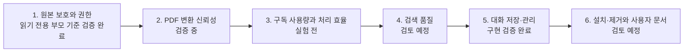

# Research Agent 개발 로드맵

[한국어](./ROADMAP.md) | [English](./ROADMAP.en.md)

[기술 설계](./README.md)

이 문서는 각 영역의 현재 상태와 다음 개발 목표를 관리한다. 동작 원리와 설계
근거는 기술 설계 문서에 기록하고, 이 문서에는 상태·한계·완료 기준만 남긴다.

## 전체 진행 상태

| 영역 | 현재 상태 | 다음 개발 항목 |
| --- | --- | --- |
| 원본 보호와 권한 | 읽기 전용 부모 기준 검증 완료 | 권한 회귀 테스트 유지 |
| PDF 변환과 시각 검토 | 검증 중 | 대표 PDF를 이용한 정확도 기준 확정 |
| 구독 사용량과 처리 효율 | 예비 측정 시작 | Plus·Pro 5x 동일 조건 사용량 측정 |
| 검색 | 구현됨·설계 검토 전 | 검색 품질과 근거 표시 검증 |
| 대화 저장·관리 | 구현 및 기술 검증 완료 | 자연어 UX와 실제 검색 활용성 검증 |
| 설치와 제거 | 빈 임시 HOME 검증 완료 | 실제 새 Mac의 비개발자 설치 경험 검증 |
| 사용자 설명서 | 파일 구조만 생성 | 실제 사용 흐름과 FAQ 작성 |

## 마일스톤 1. 원본 보호와 권한 관리

**상태: 읽기 전용 부모 기준 검증 완료**

### 완료된 결과

- Research Agent의 사용자 정의 에이전트는 읽기 전용 기본값을 선언한다. 부모의
  현재 권한 모드와 실행 중 변경이 우선하므로 부모 세션도 읽기 전용이어야 한다.
- 저장 명령은 `knowledge/`와 `.research-store/`에만 쓸 수 있다.
- 원본 경로와 Research Agent 저장 경로의 포함 관계를 거부한다.
- 외부 경로, 심볼릭 링크와 하드 링크를 통한 쓰기를 거부한다.
- 실제 제한 권한 프로필에서 내부 저장은 허용되고 원본·실행 코드 쓰기는 차단되며
  원본이 유지되는 것을 확인했다.
- 전용 `CODEX_HOME`과 작업 디렉터리로 설정 스택을 분리해 프로젝트의 기존
  `sandbox_mode`가 저장 permission profile을 무효화하지 않게 했다.
- 부모 Codex 세션이 Full access이면 같은 권한이 하위 에이전트에 다시 적용될 수
  있어 Research Agent가 원본 보호를 보장하지 않음을 문서화했다.

### 유지 조건

- 저장 경로가 추가될 때 제한 권한 프로필과 경로 검사를 함께 갱신한다.
- 설치 방식이 바뀔 때 실제 샌드박스 통합 테스트를 유지한다.
- 베타 permission profile과 하위 에이전트 권한 상속 동작이 Codex 업데이트에서
  바뀌는지 공식 문서와 실제 통합 테스트로 다시 확인한다.
- 원본을 수정하는 기능을 Research Agent에 추가하지 않는다.

## 마일스톤 2. PDF 변환 신뢰성 검증

**상태: 검증 중**

### 현재 구현

- `pypdf`를 이용한 페이지별 기본 텍스트 추출
- 페이지 번호를 보존하는 Markdown 표시
- 표·수식·그림·추출 실패 가능성이 있는 페이지 선별
- 선택된 페이지를 220 DPI 이미지로 렌더링
- Sol ultra를 이용한 시각 검토와 불확실성 표시
- PDF 해시가 바뀌면 오래된 검토 결과 저장 거부
- PDF 동기화와 페이지 검토 저장을 위한 `document_operations` 저널
- 동기화 실행 간 `sync.lock` 직렬화와 페이지 검토의 프로젝트 쓰기 잠금
- 하위 프로세스 `os._exit` 강제 종료 뒤 Markdown·SQLite 상태의 자동 이어서 완료
- 강제 종료로 남은 프로젝트 내부 PDF 임시 복사본을 다음 동기화에서 정리
- 저널과 다른 외부 파일·DB 상태는 덮어쓰지 않고 복구 중단

### 확인된 한계

- 다단 문서의 읽기 순서와 특수 폰트가 깨질 수 있다.
- 기본 추출은 수식 구조, 표의 행·열 관계와 그림 의미를 보존하지 않는다.
- 규칙 기반 페이지 선별이 중요한 페이지를 놓칠 수 있다.
- `verified`는 AI 검토 완료 상태이며 사람의 검증을 의미하지 않는다.
- 실제 Codex에서 주 세션 → Luna → 주 세션 → Sol → 주 세션 → Luna 흐름이
  완료됐다. Luna가 Sol을 중첩 호출하는 방식은 지원되지 않아 주 세션이 조정한다.
- 강제 종료 복구 검증은 하위 프로세스의 `os._exit` 주입까지 완료했으며, 실제 Mac
  전원 차단이나 저장 장치 장애는 아직 검증하지 않았다.

### 다음 개발 항목

1. 일반 본문, 수식, 표·그림 중심의 대표 PDF를 각각 선정한다.
2. 사람이 먼저 검토 필요 페이지를 표시해 비교 기준을 만든다.
3. 현재 선별 규칙이 중요한 페이지를 놓치는지 확인한다.
4. 기본 추출과 Sol ultra 검토 결과를 원본 페이지와 비교한다.
5. 220 DPI로 판독하기 어려운 수식과 작은 표가 있는지 확인한다.
6. 결과를 바탕으로 OCR, 선별 규칙 개선 또는 파서 교체 필요성을 결정한다.

### 완료 기준

- 일반 본문에서 제목, 초록과 핵심 용어를 검색할 수 있다.
- 평가 문서에서 중요한 수식·표·그림 페이지의 누락 여부를 기록한다.
- 수식, 표와 그림별로 신뢰 가능한 범위와 원본 확인 조건을 문서화한다.
- `not-needed`, `verified`, `needs-review`의 의미가 실제 결과와 일치한다.
- 현재 파이프라인을 유지할지, 일부 변환기를 교체할지 근거를 가지고 결정한다.

### 이후 구조 개선 후보

현재 [`sync.py`](../../src/research_store/sync.py)는 PDF 탐색, 변환, 페이지 선별,
렌더링과 검토 결과 저장을 함께 담당한다. 프로토타입에서는 흐름을 한곳에서
확인할 수 있다는 장점이 있다. 정확도 개선 과정에서 각 단계가 독립적으로 자주
변경되거나 테스트하기 어려워질 때 `parser`, `review detector`, `renderer` 역할을
분리한다. 파일 수를 늘리는 것 자체는 마일스톤의 목표로 삼지 않는다.

## 마일스톤 3. 구독 사용량과 처리 효율 검증

**상태: 예비 측정 시작**

[구독 사용량 실험 기록](./experiments/subscription-usage.md)

### 현재 판단

- Research Agent는 API 키가 아니라 사용자의 Codex 구독 사용량을 소비한다.
- Plus와 Pro 5x의 차이는 같은 작업의 정확도보다 사용할 수 있는 전체 한도에
  있다.
- 실제 사용량은 모델, 추론 수준, 컨텍스트, 도구 호출과 캐시에 따라 달라지므로
  PDF 페이지 수나 프롬프트 길이만으로 계산할 수 없다.
- 합성 진행 표시 통합 턴과 실제 1쪽 PDF 통합 경로의 작업 단위 토큰 수를 예비
  기록했지만, 실행 전후 구독 한도 변화와 Plus·Pro 비교 결과는 아직 없다.

### 다음 개발 항목

1. PDF 정확도 검증에 사용하는 동일한 문서 세트를 사용량 실험에도 사용한다.
2. Plus와 Pro 5x에서 모델, 추론 수준과 작업 지시를 동일하게 유지한다.
3. 실행 전후 `/status`와 사용량 대시보드의 5시간·주간 한도를 기록한다.
4. 첫 동기화, 변경 없는 재동기화, 일부 변경, 검색과 대화 저장을 분리해 측정한다.
5. Luna 작업과 Sol 시각 검토의 호출 수와 검토 페이지 수를 구분한다.
6. 측정 결과로 사용자에게 작업량을 언제 안내하고 나누어 처리할지 결정한다.

### 완료 기준

- Plus와 Pro 5x에서 동일한 핵심 시나리오를 각각 반복 측정한다.
- 문서 수, 전체 페이지 수와 시각 검토 페이지 수를 사용량 변화와 함께 기록한다.
- 변경 없는 재동기화가 불필요한 모델 작업을 만들지 않는지 확인한다.
- PDF 한 개와 시각 검토 페이지 한 개의 대략적인 사용량 범위를 설명할 수 있다.
- 남은 한도가 적을 때 기본 추출만 완료할지, 시각 검토를 나눌지 UX 원칙을
  결정한다.
