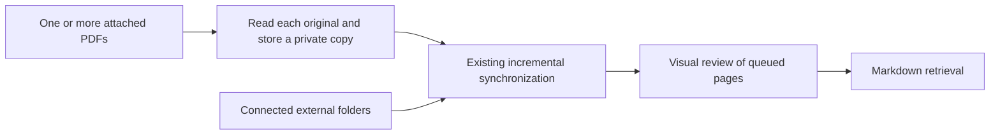

# PDF Attachment Storage and Installation Onboarding

[한국어](./attachment-import.md) | [English](./attachment-import.en.md) | [Technical design contents](./README.en.md)

Users can attach one or more PDFs to a Codex conversation and ask Research Agent
to organize them immediately. That request adds the PDFs to the existing search
library without registering a folder. A mere attachment or an explicitly
session-only question does not save anything. Connected folders continue to
track changes at their original locations.

## Storage Unit and Recovery

`import-pdf` stores `document.pdf` and `metadata.json` together under
`.research-store/imports/<SHA-256>/`. Metadata records the schema version, hash,
first filename, import time, size in bytes, and original path when supplied.
The original path is provenance, never a dependency for subsequent reads.
Imports from stdin do not record an original path.

Both files are written to a private staging directory before an atomic directory
rename publishes them. Imports and synchronization share a lock. An interrupted
unpublished copy is cleaned up by the next import or sync. A published copy
survives interruption. The existing synchronization journal handles subsequent
Markdown and SQLite updates.

After each import, `sync --imported-document <key>` converts only the returned
document, followed by review of its queued pages. Multiple attachments are
processed independently, so an invalid file does not discard successful ones.
A duplicate document key is synchronized only once. General `sync` includes
connected folders and all saved attachments. An attachment request does not
start unrelated library-wide reviews.

Copies are not registered in external `[[sources]]`. Dedicated internal source
objects integrate with synchronization, page rendering, and review completion
without relaxing external path restrictions. The document key is
`import-<SHA-256>:<first filename>`. Identical bytes reuse the first item; changed
bytes create a new item even with the same name. Deduplication does not merge
imports with documents discovered in external folders.

Markdown adds `source_kind: imported-pdf`, `original_filename`, `imported_at`,
`import_origin_path`, and `stored_pdf`. Cite the stored PDF and page rather than
assuming the temporary attachment still exists. Synchronization verifies the
content hash to reject modifications to a stored snapshot.

## Permissions and Input Transport

The existing command sandbox still permits writes only to `knowledge/` and
`.research-store/`. Ordinary accessible paths use `import-pdf <path>`. Host
attachments use a single invocation of the installed launcher with
`import-pdf --attachment <absolute path>`. A dedicated helper opens only the exact
PDF authorized for this task in read-only mode, checks its type and size, and
passes its bytes to the existing constrained command over stdin. Filenames are
arguments, never executable shell strings. It creates no adjacent copies and
adds no general temporary-directory permission to the profile.

The earlier `cat PDF | launcher` instructions assumed that the entire pipeline
would receive the launcher's allow decision. The pipeline failed with
`sandbox-exec: sandbox_apply: Operation not permitted`. Moving byte transfer
inside the launcher was insufficient: invoking the physical skill path in the
installed store reproduced the same error because the execution rule allowed
only the personal skill symlink path. Registration now permits those two exact
paths to the same owned launcher. It does not grant general write access or
write access to original folders.

Binary input ends at EOF rather than the conversation JSON sentinel. The
low-level `--stdin` interface remains supported, but agents are no longer
instructed to construct a shell pipeline. This mechanism must not be used to
circumvent a denied file read or user approval.

If the host exposes no readable file path, or the parent cannot access the file,
the workflow reports that it was not saved and asks for an accessible local PDF
path or folder connection. It never requests write access to the original.

## Installation Onboarding

After a successful first interactive macOS installation, a native dialog offers
**Later / Choose folders** (currently displayed in Korean). The latter opens the
existing multiple-folder picker. Cancellation, GUI errors, or registration
errors do not turn the completed installation into a failure. Automated runs
skip the dialog and print instructions for adding folders later.

## Current Scope and Validation

- Encrypted PDFs and attachments larger than 256 MiB are rejected. A stored
  copy is distinct from a completed conversion and visual review.
- Imports do not track later original-file changes. External removal or
  modification of a managed copy is reported; re-import does not silently
  repair or overwrite it.
- Full Research Agent removal includes imported copies. A command to delete
  individual imported PDFs is not yet provided.
- Automated tests cover original preservation, independent multi-PDF imports,
  duplicate and concurrent imports,
  process termination before/after publication, retrieval/render/review after
  attachment removal, and rejection of invalid files and links.
- An opt-in test uses the actual personal skill launcher and unchanged permission
  profile to check stdin import, denied direct temporary-file access, and denied
  original writes. This is command-level validation, not proof of attachment
  handling or model routing in every Codex UI.
- Dialogs are checked with mocked responses and macOS script compilation.
  Real installation screens and Codex attachment UX require a separate user test.

## Implementation Responsibilities

| Responsibility | File |
| --- | --- |
| Snapshots, metadata, deduplication, recovery | [imports.py](../../src/research_store/imports.py) |
| Authorized attachment bytes in one launcher call | [import_attachment.py](../../scripts/import_attachment.py) |
| Path and binary input commands | [cli.py](../../src/research_store/cli.py) |
| Integration with conversion and review | [sync.py](../../src/research_store/sync.py) |
| User intent and agent workflow | [SKILL.md](../../resources/skills/research-library/SKILL.md) |
| Post-installation flow | [install_onboarding.py](../../scripts/install_onboarding.py) |
| Native dialog and multiple-folder picker | [picker.py](../../src/research_store/picker.py) |
| Storage and recovery checks | [test_pdf_import.py](../../tests/test_pdf_import.py) |
| Actual launcher permissions | [test_import_permission_integration.py](../../tests/test_import_permission_integration.py) |
