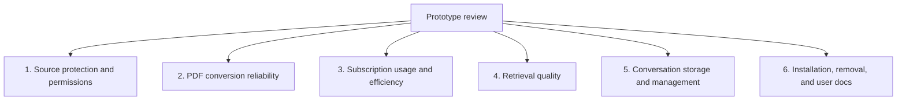

# Research Agent Development Roadmap

[한국어](../ko/ROADMAP.md) | [English](./ROADMAP.md)

[Technical design](../README.en.md)

This document tracks the current state and next development outcome for each
area. The technical design records how the system works and why decisions were
made; this roadmap contains only status, limitations, and completion criteria.
This roadmap is the authority for completion status. Dated measurements and
execution evidence belong in the
[experiment records](../README.en.md#related-designs-and-validation-records).

## Current work

The single [current-work checkpoint](../ko/ROADMAP.md#current-work) records the
latest agreed task, existing screenshots, missing captures, and the next action.
Read it and the latest user agreement before resuming work or proposing a new
priority. It is kept in one place to avoid competing progress records.

## Overall Progress

The table below owns current status. The diagram shows the areas under review.

| Area | Current state | Next development item |
| --- | --- | --- |
| Source protection and permissions | Constrained storage and read-only-parent workflow validated | Verify effective parent and child permissions by approval mode |
| PDF conversion and visual review | Under validation | Establish accuracy criteria with representative PDFs |
| Subscription usage and efficiency | Preliminary measurement started | Measure identical workloads on Plus and Pro 5x |
| Retrieval | Scope, diversity, continuation, and fixed development evaluation implemented | Expand validation with real research questions |
| Conversation storage and management | Implemented and technically validated | Validate natural-language UX and retrieval usefulness |
| Installation and removal | Validated with an empty temporary HOME | Validate the non-developer experience on a physically new Mac |
| User documentation | Korean README, English guide, and bilingual web guide published | Add real workflow captures and validate guidance with non-developers |
| Development docs and release boundaries | Development/runtime settings separated and topic docs organized | Observe focused document loading and missed-change/validation prevention in real development |

## Milestone 1. Source Protection and Permission Management

[Permission design](./permissions.md) · [Validation record](./experiments/safety-routing-validation.md)

**Status: Constrained storage and read-only-parent workflow validated; approval-mode checks pending**

### Completed Outcomes

- Research Agent custom agents declare read-only defaults, and installation
  sets `approval_policy = "never"`. Parent runtime settings can take precedence,
  so child defaults and launcher restrictions are documented separately.
- The usage policy allows Ask for approval and Approve for me and prohibits
  Full access. A read-only parent is an optional stronger restriction, not
  evidence that every approval mode has been validated.
- The storage command can write only to `knowledge/` and `.research-store/`.
- A source path and the Research Agent store cannot contain one another.
- Writes through external paths, symbolic links, and hard links are rejected.
- A real constrained permission profile confirmed that internal storage writes
  succeed while source and project-code writes are denied and source content
  remains unchanged.
- Dedicated `CODEX_HOME` and working directories isolate the configuration
  stack so a project's legacy `sandbox_mode` cannot disable the storage
  permission profile.
- A Full access parent can have that access reapplied to its subagent, so
  Research Agent does not guarantee source protection in that mode.

### Next Checks and Completion Criteria

- Record effective parent and child permissions under Ask for approval and
  Approve for me separately.
- Use temporary fixtures to distinguish direct child writes from launcher
  writes, confirming internal storage access and denied source writes. Cover
  sources inside and outside the parent workspace and distinguish approval
  exceptions.
- If effective permissions differ from expectations, adjust the implementation
  or supported conditions. Do not extend guarantees to untested modes.
- Confirm that source registration, listing, and disconnection agree with the
  delegation rules, and that registration and disconnection change only internal
  configuration while preserving originals and existing Markdown.

### Maintenance Conditions

- Update both the constrained permission profile and path validation whenever a
  new storage path is introduced.
- Preserve the real sandbox integration test when the installation mechanism
  changes.
- Recheck the beta permission-profile format and subagent inheritance behavior
  against official documentation and the live integration test after Codex
  upgrades.
- Do not add a feature that modifies original files.

## Milestone 2. Validate PDF Conversion Reliability

[Conversion and review design](./pdf-conversion.md) · [Attachment import](./attachment-import.md)

**Status: Under validation**

### Current Implementation

- PDF storage and retrieval registration through registered folders or conversation attachments
- Page-level base text extraction with `pypdf`
- Markdown markers that preserve PDF page numbers
- Candidate selection for possible tables, equations, figures, and extraction
  failures
- 220 DPI rendering for selected pages
- Sol high visual review with explicit uncertainty states
- Separate visual-review jobs after text storage, document scoping, and page-level resume
- Rejection of stale review results when the PDF hash changes
- Atomic storage of a nonempty final note and review state for the current document, page, and version
- A `document_operations` journal for PDF synchronization and page-review writes
- `sync.lock` serialization between synchronization runs and a project write
  lock for page reviews
- Automatic roll-forward of Markdown and SQLite state after injected
  child-process `os._exit`
- Cleanup on the next synchronization of project-owned PDF copies left by an
  abruptly exited process
- Fail-closed recovery when file or database state matches neither the
  journal's prior nor target state

### Confirmed Limitations

- Reading order in multi-column documents and specialized font encoding can
  break during extraction.
- Base extraction does not preserve equation structure, table relationships, or
  figure meaning.
- Rule-based page selection can miss an important page.
- `verified` records a stored final note and state for the current document, page,
  and version. Code does not prove semantic accuracy, actual image inspection,
  or human certification.
- An earlier direct-routing experiment completed primary → Luna → primary →
  Sol → primary → Luna. The current default starts an independent reviewer from
  the primary session because Luna could not invoke Sol as a nested agent.
- Detached execution and resume have been tested, while Sol high accuracy on
  real papers through this new path and Plus/Pro limit impact remain under review.
- Forced-exit recovery has been validated with injected child-process
  `os._exit`; a physical Mac power loss or storage-device failure has not been
  tested.

### Next Development Items

1. Select representative PDFs centered on ordinary prose, equations, and
   tables or figures.
2. Have a person label the pages that require visual review to create a
   comparison baseline.
3. Measure whether the current selection rules miss important pages.
4. Compare base extraction and Sol high review results with the original pages.
5. Check whether 220 DPI is insufficient for small equations or dense tables.
6. Use the results to decide whether OCR, better selection rules, or a parser
   replacement is necessary.

### Completion Criteria

- Titles, abstracts, and important terms are searchable in ordinary prose.
- Missed important equation, table, and figure pages are recorded for the
  evaluation set.
- The reliable scope and original-page verification requirement are documented
  for equations, tables, and figures.
- The meanings of `not-needed`, `verified`, and `needs-review` match observed
  behavior.
- A decision to retain or replace part of the pipeline is supported by evidence.

### Later Architecture Candidate

[`sync.py`](../../../src/research_store/sync.py) currently owns PDF discovery,
conversion, page selection, rendering, and review result storage. Keeping the
flow together is useful at prototype scale. Split `parser`, `review detector`,
and `renderer` responsibilities only when accuracy work makes those stages
change frequently or difficult to test independently. Increasing the number of
files is not itself a milestone.

## Milestone 3. Validate Subscription Usage and Processing Efficiency

**Status: Preliminary measurement started**

[Subscription usage experiment record](./experiments/subscription-usage.md)

### Current Assessment

- Research Agent consumes the user's Codex subscription allowance rather than
  an API key budget.
- The primary difference between Plus and Pro 5x is the available allowance,
  not the accuracy of an identical task.
- Actual usage depends on the model, reasoning effort, context, tool calls, and
  caching, so it cannot be calculated from PDF page count or prompt length
  alone.
- Preliminary task-level token counts now exist for one synthetic progress turn
  and one real one-page PDF integration path, but no before-and-after allowance
  measurement or Plus-to-Pro comparison exists yet.

### Next Development Items

1. Reuse the same document set selected for PDF accuracy validation.
2. Keep the model, reasoning effort, and task instructions identical on Plus and
   Pro 5x.
3. Record the five-hour and weekly limits from `/status` and the usage dashboard
   before and after each run.
4. Measure initial synchronization, unchanged resynchronization, partial change,
   retrieval, and conversation saving separately.
5. Separate Luna task counts from Sol visual review calls and reviewed pages.
6. Use the results to decide when the UX should disclose workload or split
   processing into smaller batches.

### Completion Criteria

- Repeat the same core scenarios on both Plus and Pro 5x.
- Record document count, total pages, and visual review pages alongside usage
  changes.
- Confirm that unchanged resynchronization creates no unnecessary model work.
- Describe an approximate usage range per PDF and per visually reviewed page.
- Decide whether low remaining allowance should complete only base extraction or
  defer visual review in smaller batches.

## Milestone 4. Retrieval Quality and Ongoing Evaluation

[Retrieval design and evidence use](./search.md)

**Status: Starvation regression fixes and fixed development evaluation implemented**

- Implemented PDF/conversation scopes, per-document candidate retention and
  diversity, passage grouping, and version-checked continuation while preserving
  original-path checks, recovery, and locking.
- Use the [synthetic dataset and runner](./experiments/search-evaluation.md) to
  compare identical queries, evidence labels, and result budgets.
- Next: a separate validation set from real research, Codex query selection, and
  large-library scan and lock latency. Development scores are not a general
  search-quality guarantee.
- Distinguish matching evidence crowded out of results from semantically related
  evidence with different wording. Evaluate hybrid keyword/vector retrieval when
  the latter recurs. Vectors, FTS5, and LangChain are not currently introduced.

## Milestone 5. Conversation Management and User Experience

**Status: Implementation and technical validation complete; natural-language UX remains to be validated**

[Conversation lifecycle and recovery](./conversation-memory.md) ·
[Safety and routing validation](./experiments/safety-routing-validation.md)

- Save-scope selection, listing and retrieval, revision-checked updates and
  deletion, and the operation journal are implemented.
- Fault-injection and actual concurrent-operation results belong in the
  experiment record. They do not establish natural-language accuracy or user
  comprehension.
- Next, check whether non-developers can select a save scope, distinguish records
  with similar titles, and understand the result of an update or deletion.
- Completion requires that real requests select the intended record and that
  combined PDF/conversation answers clearly distinguish evidence types and sources.

## Milestone 6. Installation, Removal, and User Guidance

**Status: Temporary-HOME installation/removal validated and guides published; the experience on a physically new Mac remains unverified**

[Uninstallation and source protection](./permissions.md#uninstallation-and-source-protection) ·
[Release and web-guide delivery](./releases.md)

- The Korean README, English usage guide, and bilingual web guide are published.
  The web guide provides feature-level navigation and marks unavailable captures
  as pending.
- Empty-HOME installation and removal checks ran on the current Mac. They do not
  establish the first-install experience on a physically new Mac or for a user
  unfamiliar with developer tools.
- Next, finish the installation captures in the [current-work checkpoint](../ko/ROADMAP.md#current-work),
  then add captures of actual PDF registration, attachment, retrieval, and
  conversation-management flows, then observe whether non-developers can install
  and reach their first search using only the guide.
- Completion requires screenshots and instructions that match current behavior,
  user understanding of source preservation, generated-data locations and removal
  scope, and consistent installation information across Korean and English guides.
