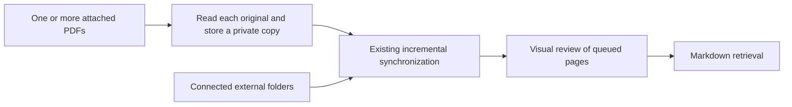

# PDF Attachment Storage and Installation Onboarding

[한국어](../ko/attachment-import.md) | [English](./attachment-import.md) | [Technical design contents](../README.en.md)

Users can attach one or more PDFs to a Codex conversation and ask Research Agent
to organize them immediately. That request adds the PDFs to the existing search
library without registering a folder. A mere attachment or an explicitly
session-only question does not save anything. Connected folders continue to
track changes at their original locations.

## Storage Unit and Recovery

`import-pdf` stores `document.pdf` and `metadata.json` together under
`.research-store/imports/<SHA-256>/`. Metadata records the schema version, hash,
first filename, import time, size in bytes, and original path when supplied.
The original path is provenance, never a dependency for subsequent reads.
Imports from stdin do not record an original path.

Both files are written to a private staging directory before an atomic directory
rename publishes them. Imports and synchronization share a lock. An interrupted
unpublished copy is cleaned up by the next import or sync. A published copy
survives interruption. The existing synchronization journal handles subsequent
Markdown and SQLite updates.

After each import, `sync --imported-document <key>` converts only the returned
document, followed by review of its queued pages. Multiple attachments are
processed independently, so an invalid file does not discard successful ones.
A duplicate document key is synchronized only once. General `sync` includes
connected folders and all saved attachments. An attachment request does not
start unrelated library-wide reviews.

Copies are not registered in external `[[sources]]`. Dedicated internal source
objects integrate with synchronization, page rendering, and review completion
without relaxing external path restrictions. The document key is
`import-<SHA-256>:<first filename>`. Identical bytes reuse the first item; changed
bytes create a new item even with the same name. Deduplication does not merge
imports with documents discovered in external folders.

Markdown adds `source_kind: imported-pdf`, `original_filename`, `imported_at`,
`import_origin_path`, and `stored_pdf`. Cite the stored PDF and page rather than
assuming the temporary attachment still exists. Synchronization verifies the
content hash to reject modifications to a stored snapshot.

## Permissions and Input Transport

The existing command sandbox still permits writes only to `knowledge/` and
`.research-store/`. Ordinary accessible paths use `import-pdf <path>`. Host
attachments use a single invocation of the installed launcher with
`import-pdf --attachment <absolute path>`. A dedicated helper opens only the exact
PDF authorized for this task in read-only mode, checks its type and size, and
passes its bytes to the existing constrained command over stdin. Filenames are
arguments, never executable shell strings. It creates no adjacent copies and
adds no general temporary-directory permission to the profile.

The earlier `cat PDF | launcher` instructions assumed that the entire pipeline
would receive the launcher's allow decision. The pipeline failed with
`sandbox-exec: sandbox_apply: Operation not permitted`. Moving byte transfer
inside the launcher was insufficient: invoking the physical skill path in the
installed store reproduced the same error because the execution rule allowed
only the personal skill symlink path. Registration now permits those two exact
paths to the same owned launcher. It does not grant general write access or
write access to original folders.

Binary input ends at EOF rather than the conversation JSON sentinel. The
low-level `--stdin` interface remains supported, but agents are no longer
instructed to construct a shell pipeline. This mechanism must not be used to
circumvent a denied file read or user approval.

If the host exposes no readable file path, or the parent cannot access the file,
the workflow reports that it was not saved and asks for an accessible local PDF
path or folder connection. It never requests write access to the original.

## Installation Onboarding

After a successful first interactive macOS installation, a native dialog offers
**Later / Choose folders**. The latter starts folder selection. Cancellation,
GUI errors, or registration errors do not turn the completed installation into
a failure. Automated runs skip the dialog and print instructions for adding
folders later.

Fresh v0.4.2 installations support the review list, reopening from Codex, and
Korean/English app-owned dialog text described below. Existing personal
installations are not updated automatically.

JXA's ObjC bridge displays a review list in an AppKit `NSAlert`.
**폴더 추가하기 / 폴더 더 추가하기** (Add folders / Add more folders) opens an
`NSOpenPanel` and collects the selected folders in that list. Unchecked rows are
excluded; only **연결하고 PDF 저장하기** (Connect and save PDFs) returns checked
paths. **목록에 추가** (Add to list) in the inner panel only adds to the draft.
Canceling that panel retains the list, while canceling the review list returns
an empty list. The draft exists only in memory; canceling the whole flow does
not register folders or write configuration.

The host keeps an existing `regular` or `accessory` policy. Otherwise it requests
`accessory` and checks the resulting policy, rather than the setter's Boolean:
reapplying the same policy can return `false` while the current policy remains
valid. A resulting prohibited or unknown policy still stops the flow. Native
modal handling allows multiple directories but disables file selection and
new-folder creation. No clicks are simulated; aborted presentation remains an error.

To reopen the picker from Codex, the primary session directly invokes the
registered skill launcher with `source-add`. Its `select_sources.py` helper opens
the host picker without changing the store, then passes confirmed absolute paths
as individual arguments after `--` to the existing constrained `source-add`.
Cancellation does not launch that command. Registration, duplicate handling, and
source protection stay in the existing CLI; no permission or allow rule is added.
The manager still handles exact-path registration and removal. Post-installation
onboarding and terminal launches use the same review list.

### Dialog Language — v0.4.2

The registered `source-add` launcher and host helpers accept
`--language auto|ko|en` per invocation. The installation bootstrap shell does not
accept this option; first-installation onboarding runs with `auto`. The default
`auto` uses the first Korean or English entry in macOS preferred languages. Unsupported preferences or
detection errors fall back to English. macOS preferences take priority over the
installer shell's `LC_ALL=C`. Explicit `ko` and `en` skip detection. System
language preferences are never changed.

The first installation dialog and subsequent folder picker/review list use the
same resolved language. English controls read **Later / Choose folders**,
**Add folders / Add more folders**, **Add to list**, and
**Connect and save PDFs / Cancel**. Empty states, selection counts, errors, and
post-installation processing messages use that language too. System-owned UI
such as Finder locations, sidebar labels, and search continues to follow macOS
language settings. Translation of all installer shell output is outside this change.

A request such as “Open the PDF folder connection window in English” directs the
skill to check `source-add --help` on the registered launcher and directly invoke
`source-add --language en` when supported. It does not change execution rules with
environment assignments or shell wrappers. Unsupported older launchers report the
limitation rather than automatically patching a personal installation. Language
is host presentation data; registration and storage receive only confirmed paths.

[Design and validation record](../ko/experiments/dialog-language-2026-10-06.md).

## Current Scope and Validation

- Encrypted PDFs and attachments larger than 256 MiB are rejected. A stored
  copy is distinct from a completed conversion and visual review.
- Imports do not track later original-file changes. External removal or
  modification of a managed copy is reported; re-import does not silently
  repair or overwrite it.
- Full Research Agent removal includes imported copies. A command to delete
  individual imported PDFs is not yet provided.
- Automated tests cover original preservation, independent multi-PDF imports,
  duplicate and concurrent imports,
  process termination before/after publication, retrieval/render/review after
  attachment removal, and rejection of invalid files and links.
- An opt-in test uses the actual personal skill launcher and unchanged permission
  profile to check stdin import, denied direct temporary-file access, and denied
  original writes. This is command-level validation, not proof of attachment
  handling or model routing in every Codex UI.
- Dialogs are checked with mocked responses, mocked JXA execution, and macOS
  script compilation. Mocked JXA checks activation policy and call order,
  directory-only multi-selection, disabled folder creation, selection results,
  cancellation, and errors; it does not verify actual window focus.
  Real installation screens and Codex attachment UX require a separate user test.

## Implementation Responsibilities

| Responsibility | File |
| --- | --- |
| Snapshots, metadata, deduplication, recovery | [imports.py](../../../src/research_store/imports.py) |
| Authorized attachment bytes in one launcher call | [import_attachment.py](../../../scripts/import_attachment.py) |
| Path and binary input commands | [cli.py](../../../src/research_store/cli.py) |
| Integration with conversion and review | [sync.py](../../../src/research_store/sync.py) |
| User intent and agent workflow | [SKILL.md](../../../resources/skills/research-library/SKILL.md) |
| Post-installation flow | [install_onboarding.py](../../../scripts/install_onboarding.py) |
| Host picker and constrained registration handoff | [select_sources.py](../../../scripts/select_sources.py) |
| Native review list and multiple-folder picker | [picker.py](../../../src/research_store/picker.py) |
| Storage and recovery checks | [test_pdf_import.py](../../../tests/test_pdf_import.py) |
| Actual launcher permissions | [test_import_permission_integration.py](../../../tests/test_import_permission_integration.py) |
