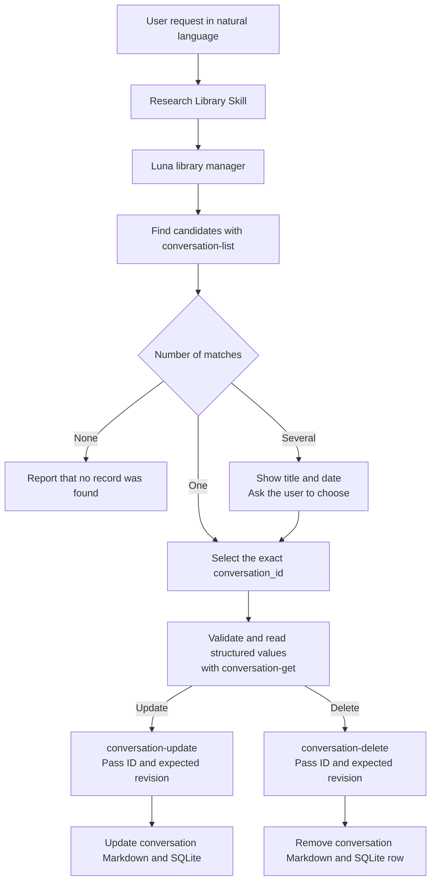
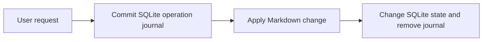

# Conversation Storage and the Research Memory Lifecycle

[한국어](../ko/conversation-memory.md) | [English](./conversation-memory.md) | [Technical design index](../README.en.md) · [Roadmap](./ROADMAP.md)

## Contents

- [Design Goal](#design-goal)
- [User Requests and Internal Commands](#user-requests-and-internal-commands)
- [Record Identity and Revision History](#record-identity-and-revision-history)
- [Editable Content](#editable-content)
- [Deletion Boundary](#deletion-boundary)
- [Conversation Operation Journal and Interrupted-Run Recovery](#conversation-operation-journal-and-interrupted-run-recovery)
- [Current Scope and Limitations](#current-scope-and-limitations)
- [Verification Criteria](#verification-criteria)
- [Implementation Responsibilities](#implementation-responsibilities)

## Design Goal

A saved conversation is not the original Codex conversation. It is a
user-selected range captured as searchable Research Agent memory. The user must
be able to find a record in natural language, correct its search-oriented
organization, and delete it when it is no longer wanted.

Updates and deletions apply only to conversation records owned by Research
Agent. They do not affect original PDFs, PDF-derived Markdown, other saved
conversations, or the actual conversation in the Codex app.

## User Requests and Internal Commands

The user does not need to know terminal commands or conversation IDs in
advance. They can make natural-language requests from any Codex project.

```text
“Show me my saved conversations.”
“Update the summary and tags for the conversation about refractive-index correction.”
“Delete the saved memory about the laser experiment.”
```



`conversation-list`, `conversation-get`, `conversation-update`, and
`conversation-delete` are internal commands used by the skill and library
manager. The agent never edits Markdown or SQLite directly. It reads and changes
records only through constrained commands that validate paths and file links.

`conversation-list` takes no additional input and returns each record's ID,
title, scope, creation and update times, revision, tags, aliases, and internal
path. This output is an index for resolving a natural-language request to an
exact record rather than terminal output that the user must interpret directly.

After choosing the exact ID, the manager calls `conversation-get
<conversation-id>` to validate the record again. The command checks that the
Markdown and SQLite path, ID, schema, revision, and timestamps agree, then
returns structured JSON containing:

- The complete nine-field `editable` object for a v3 record.
- The current `revision` and `updated_at`.
- Immutable scope, initial save time, and transcript-capture metadata.

It deliberately omits the captured transcript. The command opens SQLite in
read-only mode and changes neither the bytes nor modification time of the
Markdown or database. Partial updates therefore do not require the manager to
parse the Markdown body back into fields.

A v1 or v2 record has no structured editable source, so the response contains
`migration_required: true` and an `editable_candidate`. The old Markdown layout
cannot always distinguish several list items from several lines in one item.
The manager therefore shows all nine candidate fields to the user for
confirmation or correction, then performs the first v3 update with
`--confirm-legacy-promotion`. Without that review flag, a legacy update is
rejected without changing Markdown or SQLite.

If the legacy body is ambiguous or malformed enough that no candidate can be
reconstructed, updating and promotion stop. Only when the user requested
deletion does the manager immediately list the records again and pass the
revision from that fresh exact-ID entry to the delete command. Deletion checks
the Research Agent-owned path, immutable metadata, ID, and revision without
parsing editable legacy content, so an uninterpretable old record can still be
removed safely. This exception never applies to an update.

When title, tags, and aliases are not enough to locate the record described by
the user, the manager keeps only conversation results from unified search and
joins each result path back to the path and exact ID in the list. It may call
`conversation-get` for a small number of candidate IDs. It never guesses an ID
from a search result or title alone.

When one candidate is unambiguous, the requested operation proceeds. Only when
several records have the same or similar description does the skill show their
titles, saved times, and IDs and ask the user to choose. An update or deletion is
never selected by title or file path alone.

## Record Identity and Revision History

The initial save assigns a content-derived `conversation_id`. Updating a title,
summary, or tags does not change this ID. Because several records may share a
title, every later update and deletion uses the stable ID.

```yaml
id: conversation-20260921-...
created_at: 2026-09-21T10:00:00+09:00
updated_at: 2026-09-21T14:30:00+09:00
revision: 2
```

| Field | Meaning |
| --- | --- |
| `id` | Stable identifier retained after the record is created |
| `created_at` | Initial save time, which is immutable |
| `updated_at` | Time when search-oriented organization was last changed |
| `revision` | Starts at 1 and increases by one after each successful update |

The current `revision` returned by the get command also acts as a condition
that protects the record from another Codex task running at the same time. The
library manager passes an internal `--expected-revision <N>` value with every
update and deletion; the user never needs to see or supply this flag.

If two tasks both observe revision 2 and one updates the record to revision 3,
an update or deletion submitted by the other task with revision 2 is rejected.
Neither Markdown nor SQLite is changed. The manager must list and get the
structured record again, then rebuild the request from the latest values rather
than reusing stale JSON or a stale revision. This prevents one project from
silently overwriting or deleting a change just made from another project.

## Editable Content

An update corrects the organization created for retrieval and reuse. It does
not rewrite the captured transcript.

| Editable | Immutable |
| --- | --- |
| Title | Selected transcript |
| Search summary | Saved `scope` |
| Tags and aliases | Initial `created_at` |
| User points | Conversation ID |
| Decisions | Transcript capture status and omission note |
| Unverified ideas | Original PDFs and PDF-derived Markdown |
| Open questions | Actual conversation in the Codex app |
| Related-document references |  |

`conversation-update <conversation-id> --expected-revision <N>` reads one JSON
object containing every editable field from standard input. If the user asks to
change only some fields, the library manager starts with the `editable` object
returned by `conversation-get` and supplies a complete object, including fields
that should remain unchanged. For a legacy record it starts with the
user-confirmed `editable_candidate`. The command rejects the
operation without a change when a field is missing, an unknown field is present,
or an immutable field such as transcript or scope is supplied.

The exact nine keys are `title`, `summary`, `tags`, `aliases`, `user_points`,
`decisions`, `unverified`, `open_questions`, and `related_documents`.

The command safely replaces the Markdown and then updates SQLite lookup fields.
For ordinary write errors it attempts to restore both sides to their prior
state. A successful update makes the revised title and summary available to the
next search.

New records use Markdown schema v3. Its frontmatter contains an `editable`
object that preserves all nine fields exactly, including line breaks, while the
body remains readable and searchable. A SHA-256 value verifies the selected
transcript before an update, which then preserves the existing transcript text
block. Readable v1 and v2 records return a reconstruction candidate and are
promoted only after the user reviews every candidate field. A legacy body that
cannot be interpreted is never updated. For a deletion request, the manager
uses a freshly listed revision and the constrained delete command verifies
ownership and immutable data before removal.

If the selected range or transcript was saved incorrectly, Research Agent does
not edit the quoted text into a record that differs from the real conversation.
The user deletes that record and saves the correct range again.

## Deletion Boundary

`conversation-delete <conversation-id> --expected-revision <N>` permanently
removes the following two items only when both the exact ID and the revision
observed by `conversation-get` still match. For an uninterpretable legacy body,
it instead uses the revision from a list refreshed immediately before deletion:

```text
The corresponding Markdown under knowledge/conversations/
The corresponding conversation row in .research-store/library.sqlite
```

It does not delete:

- The actual conversation retained by the Codex app.
- Original PDFs or original source directories.
- PDF-derived Markdown or visual review records.
- Any other saved conversation.

The prototype has no trash or undo operation for a deleted conversation record.
When the Markdown exists, deletion proceeds only when it is inside Research
Agent's conversation storage, the SQLite path agrees with it, and the ID inside
the Markdown matches the requested ID. A symbolic link, hard link, path escape,
or ID mismatch causes the operation to fail without deleting anything.

If the list reports `available: false`, the Markdown is already missing. An
update is rejected because the transcript and metadata cannot be verified. A
deletion can still clean up the remaining SQLite row when the safe conversation
path, exact ID, and revision match; the result reports that no Markdown remained
to delete.

## Conversation Operation Journal and Interrupted-Run Recovery

A saved conversation exists both as human-readable, searchable Markdown and as
SQLite state containing its ID, path, and revision. These two stores cannot be
changed in one filesystem transaction, so an interrupted process could otherwise
leave them in different states.

Before a save, update, or deletion, Research Agent commits the operation intent
and its expected before-and-after states to SQLite.



If the process stops, the next conversation list, get, search, or mutation reads
the journal and rolls the approved operation forward. If the current Markdown or
SQLite state matches neither the recorded before state nor the intended result,
Research Agent treats it as an external change and refuses to overwrite it.

This follows the same broad principle as the
[Airflow metadata database](https://airflow.apache.org/docs/apache-airflow/stable/concepts/overview.html):
durable control state lets another process decide what should happen after a
restart. The scope is much narrower here. Airflow coordinates complete DAG and
task lifecycles, while this journal recovers one conversation operation spanning
Markdown and SQLite. Its implementation pattern is closer to an operation journal
or transactional outbox than to a complete workflow metadata system.

The cross-process lock prevents simultaneous conversation operations from
changing files together, while revision checks prevent a stale read from
overwriting the latest record. In a real concurrent test against one revision,
exactly one update succeeded and the other was rejected without a change.

## Current Scope and Limitations

- A past conversation that was never saved cannot be listed, updated, or
  deleted.
- This feature does not edit or delete the actual Codex conversation.
- Conversations saved from several Codex projects share one store, so records
  with similar titles may need to be distinguished by date and ID.
- Revision tracking currently retains only the revision number and latest
  update time, not a full copy of each previous version.
- Deleted records have no trash or recovery mechanism.
- Individual transcript passages cannot be rewritten. An incorrect transcript
  or scope must be deleted and saved again.
- Conversation storage uses `conversation_operations`, while PDF
  synchronization and visual-review storage use the separate
  `document_operations` journal. The next relevant read or mutation recovers
  the pending operation for its own lifecycle first.
- Forced-exit validation injected `os._exit` into a child process; it did not
  test a physical Mac power loss or storage-device failure.
- The initial ID incorporates the first title, timestamp, and transcript. If a
  record is retitled and the same transcript is saved again under that new
  title, a second record can be created.

## Verification Criteria

- A natural-language request can list saved conversations.
- One unambiguous candidate is updated or deleted by exact ID without another
  selection step.
- When several candidates match, the user can select the exact record before it
  changes.
- Updating preserves the ID, transcript, scope, and initial creation time.
- Reading a record changes neither the bytes nor modification time of Markdown
  or SQLite.
- In v3, multiline editable values and values resembling Markdown headings
  round-trip exactly.
- Stored transcripts preserve LF, CRLF, and lone-CR line endings byte for byte.
- A v1 or v2 record is never promoted automatically without the user-review
  flag.
- An uninterpretable v1 or v2 body is never updated; a requested deletion uses
  a freshly listed revision and the constrained deletion checks.
- Updating increments `revision` and refreshes `updated_at`.
- Revised organizational information appears in the next search.
- Deleting removes only the corresponding Markdown and SQLite record, so it no
  longer appears in search.
- Updates and deletions do not affect PDFs, other conversations, or the actual
  Codex conversation.
- An update or deletion using a stale revision is rejected without a change.
- Unsupported future Markdown versions and Markdown/SQLite revision mismatches
  are rejected without a change.
- Manipulated paths, links, and ID mismatches are rejected without a change.
- Injecting child-process `os._exit` before and after file application recovers
  save, update, and deletion to one consistent state on the next operation.
- Two concurrent updates to the same revision allow exactly one to succeed; the
  other is rejected as stale, and a read waiting for the conversation lock does
  not return a partial state.

## Implementation Responsibilities

| Responsibility | Source files |
| --- | --- |
| Conversation save, update, and deletion procedure | [`conversations.md`](../../../resources/skills/research-library/references/conversations.md) |
| Route natural-language requests to conversation listing, get, update, and deletion | [`research-library/SKILL.md`](../../../resources/skills/research-library/SKILL.md) |
| Select candidates and invoke constrained commands with Luna | [`research-library-manager.toml`](../../../resources/agents/research-library-manager.toml) |
| Define the saved format, editable fields, and safe deletion | [`conversations.py`](../../../src/research_store/conversations.py) |
| Manage the conversation operation journal and state | [`state.py`](../../../src/research_store/state.py) |
| Lock the conversation store across processes | [`locking.py`](../../../src/research_store/locking.py) |
| Define inputs and outputs for internal conversation commands | [`cli.py`](../../../src/research_store/cli.py) |
| Verify the conversation lifecycle and preservation of originals | [`test_conversation_management.py`](../../../tests/test_conversation_management.py) |
| Verify forced-exit recovery and real concurrency | [`test_conversation_recovery.py`](../../../tests/test_conversation_recovery.py), [`test_state_journal.py`](../../../tests/test_state_journal.py), [`test_sync_concurrency.py`](../../../tests/test_sync_concurrency.py) |
| Verify injected file-replacement and synchronization failures | [`test_safety_failures.py`](../../../tests/test_safety_failures.py) |
