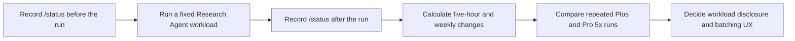

# Subscription Usage and Processing Efficiency Experiment

[한국어](../../ko/experiments/subscription-usage.md) | [English](./subscription-usage.md)

[Development roadmap](../ROADMAP.md)

**Status: Preliminary measurement started**

## Purpose

Measure how much of a user's Codex subscription allowance Research Agent
consumes. Run the same workload on Plus and Pro 5x and record how document
count, page count, and visual review volume affect observed usage.

The primary metric is the **change in subscription usage before and after a
run**, not raw token count. Record task-level token counts when Codex exposes
them, but do not infer unreported tokens from a usage percentage.

The user reports that reviewing about 240 pages with Sol high on Pro 5x moved
the displayed usage by about 3%. The usage window, page composition,
before-and-after captures, and possible concurrent work were not recorded.
Treat this as an **informal observation**, not a measured Plus result or a
per-page raw-token estimate.

## Current Plan Baseline

As of September 18, 2026, the official estimates for local messages per
five-hour window are:

| Model | Plus | Pro 5x |
| --- | ---: | ---: |
| GPT-5.6 Luna | 250–2,000 | 1,250–10,000 |
| GPT-5.6 Sol | 10–100 | 50–500 |

These are not fixed message limits. Actual usage varies with task complexity,
context, reasoning, tool calls, and caching, and an additional weekly limit may
apply. Recheck the [current OpenAI Codex pricing and usage documentation](https://learn.chatgpt.com/docs/pricing)
before starting the experiment.

## Measurement Flow

## Controlled Conditions

- Identical PDF files and file versions
- The same Research Agent commit
- The same model and reasoning effort
- The same task instruction and conversation starting condition
- No other Codex or ChatGPT Work activity during a run
- Consecutive before-and-after measurements within the same usage window when
  possible

Measure Plus and Pro 5x on separate accounts or environments that actually use
those plans. Do not multiply a Plus result by five and report it as a measured
Pro result.

## Experiment Scenarios

| ID | Scenario | Purpose |
| --- | --- | --- |
| S1 | Initial synchronization of a new prose-focused PDF | Measure base extraction and Luna management usage |
| S2 | Initial synchronization and Sol review of an equation, table, or figure-heavy PDF | Measure additional visual review usage |
| S3 | Full resynchronization with no changes | Confirm that no unnecessary model work occurs |
| S4 | Resynchronization after changing one PDF | Measure the benefit of incremental processing |
| S5 | Search saved documents and answer a question | Measure retrieval usage |
| S6 | Save a selected conversation range | Measure conversation organization usage |

Repeat each core scenario at least three times on each plan. If the displayed
usage resolution is too coarse to show a single run, execute a fixed batch and
calculate the average per task.

## Run Log

### Preliminary P0: Progress Delivery

On September 21, 2026, a separate read-only Luna xhigh Codex session ran one
synthetic JSONL progress stream exactly once. This was not a real PDF sync, a
Plus-to-Pro comparison, or a before-and-after subscription-limit measurement,
so it is not directly comparable to S1–S6.

| Metric | Observed value |
| --- | ---: |
| Input tokens | 93,174 |
| Cached input tokens | 65,280 |
| Output tokens | 2,315 |
| Reasoning output tokens | 1,720 |
| Command executions | 1 |

Phase `1/3` reached commentary before command completion. Phases `2/3`, `3/3`,
and completion arrived together immediately after the command ended. These
numbers cover the whole integration turn, including reading the long skill
instructions, and must not be interpreted as the cost of progress events
alone. They do show that even a simple progress UX validation can carry
substantial context and reasoning cost.

| Run ID | Date | Plan | Scenario | Model and reasoning | PDFs and pages | Visual review pages | Five-hour and weekly before | Five-hour and weekly after | Duration | Result or error |
| --- | --- | --- | --- | --- | --- | ---: | --- | --- | ---: | --- |
| P0 | 2026-09-21 | Not recorded | Synthetic progress display | Luna xhigh | No PDFs | 0 | Not measured | Not measured | Not measured | Partially live delivery |

### Preliminary P1: Live One-Page PDF Route

On September 21, 2026, an isolated installation synchronized one real page
containing equations and a figure from *Attention Is All You Need*. The primary
session used Luna low, the library manager used Luna xhigh, and the visual
reviewer used Sol ultra. The models and efforts were verified from each
isolated Codex session's `turn_context`, rather than from the self-reported
model marker in Markdown.

| Session | Input tokens | Cached input | Output tokens | Reasoning output | Uncached input + output |
| --- | ---: | ---: | ---: | ---: | ---: |
| Primary coordinator · Luna low | 514,739 | 472,832 | 1,595 | 192 | 43,502 |
| Library manager · Luna xhigh | 87,286 | 60,672 | 2,131 | 1,431 | 28,745 |
| Visual reviewer · Sol ultra | 267,066 | 209,280 | 3,744 | 1,979 | 61,530 |

Synchronization ran once. Page rendering and review storage also ran once
each. One PDF and one page were stored with a `verified` review and no remaining
queue. The source PDF's SHA-256, size, and modification time were identical
before and after the run.

`Uncached input + output` is a comparison value derived from the session logs.
It is not subscription-limit consumption, billable token usage, or a Plus/Pro
measurement. The primary CLI's final `tokens used` value of 43,502 also covers
only the coordinator session and must not be treated as the complete workflow's
subscription cost. Because the usage windows were not captured before and
after, P1 is still not a formal S1 or S2 result.

The one-document synchronization finished too quickly for a continuously
animated JSONL bar in the parent terminal. It showed the start, synchronization
completion, visual-review step, and final result instead. Storage completed in
about two and a half minutes, but one model-stream reconnect delayed the parent
session's completion to roughly 19 minutes. This shows that subagent context,
reasoning effort, and response retries can affect perceived latency and usage
as much as document count.

| Run ID | Date | Plan | Scenario | Model and reasoning | PDFs and pages | Visual review pages | Five-hour and weekly before | Five-hour and weekly after | Duration | Result or error |
| --- | --- | --- | --- | --- | --- | ---: | --- | --- | ---: | --- |
| P1 | 2026-09-21 | Not recorded | Live one-page PDF sync and visual review | Primary Luna low · manager Luna xhigh · reviewer Sol ultra | 1 PDF · 1 page | 1 | Not measured | Not measured | About 19 min | Passed · one response-stream reconnect |

If raw `/status` output or dashboard captures are retained, check that they do
not contain personal account information. Store only the comparison values and
reset times needed for the repository record.

## UX Decisions Informed by the Results

- Whether to show new PDF count and expected visual review pages before sync
- Whether to batch large visual review workloads automatically on Plus
- Whether low remaining allowance should finish base extraction and defer visual
  review
- How to show remaining and completed review work
- Whether the Luna and Sol role split produces a meaningful usage reduction

## Completion Criteria

- Repeated results exist for identical core scenarios on Plus and Pro 5x.
- PDF count, total pages, review pages, and usage changes are recorded together.
- The additional usage of unchanged resynchronization has been assessed.
- The default processing behavior is supported by both accuracy and usage data.
- Workload disclosure and batching principles have been decided.
