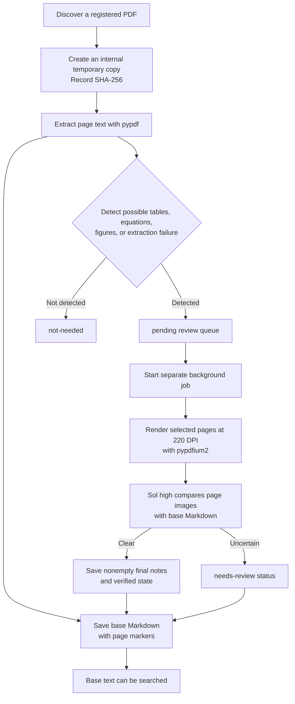
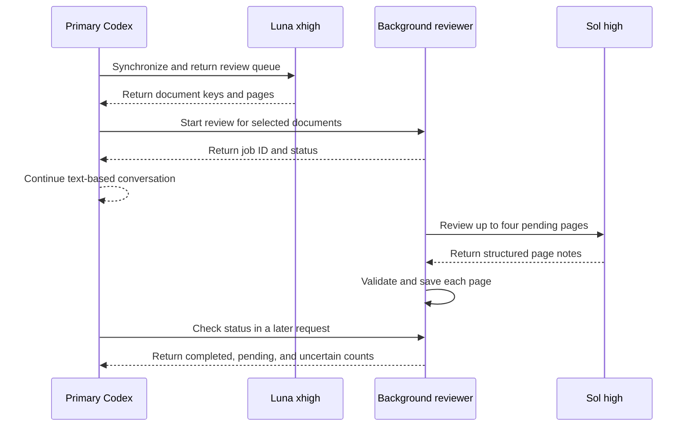

# PDF Conversion and Result Reliability

[한국어](../ko/pdf-conversion.md) | [English](./pdf-conversion.md) | [Technical design index](../README.en.md) · [Roadmap](./ROADMAP.md)

## Contents

- [Design Goal](#design-goal)
- [Conversion Flow](#conversion-flow)
- [Base Text Extraction](#base-text-extraction)
- [Selecting Pages for Visual Review](#selecting-pages-for-visual-review)
- [Sol High Visual Review](#sol-high-visual-review)
- [Visual-Review Storage Schema and the Current Queue](#visual-review-storage-schema-and-the-current-queue)
- [Roles of the Primary Codex Session and Background Reviewer](#roles-of-the-primary-codex-session-and-background-reviewer)
- [Meaning of Review States](#meaning-of-review-states)
- [Reliability by Use Case](#reliability-by-use-case)
- [Implementation Responsibilities](#implementation-responsibilities)

## Design Goal

PDF conversion is not intended to reproduce an editable document that is
structurally identical to the original. Research Agent first creates a
**page-level text index for search and discovery**, then visually checks only
the pages where equations, tables, figures, or extraction failures make accuracy
more important.

Base extraction and visual verification remain separate in the saved record. A
user can therefore tell whether a result came from plain text extraction or was
checked again against an image of the original page.

## Conversion Flow



## Base Text Extraction

`pypdf` reads the text stored inside the PDF one page at a time. Each page is
preceded by a marker such as:

```markdown
<!-- page: 3 -->

Text extracted from the page
```

The result is not a complete semantic reconstruction of the paper in Markdown.
It stores searchable text by page instead of rebuilding titles, body sections,
equations, and tables as structured Markdown elements.

For ordinary text-based English PDFs, the result is useful for finding titles,
abstracts, and important terms in the body. Base extraction alone is less
reliable for:

- The exact reading order of multi-column documents
- Words split by line breaks and hyphenation
- Superscripts, subscripts, fractions, and special mathematical symbols
- Table row and column relationships and merged cells
- The meaning of figures, plots, legends, and axes
- Characters encoded with specialized fonts
- Scanned documents stored only as images

## Selecting Pages for Visual Review

The base extraction stage registers a page for visual review when it detects:

- `Table`, `Figure`, `Equation`, or the corresponding Korean terms
- A high density of mathematical symbols
- Multiple short lines that resemble equations
- Images embedded in the PDF page
- Very little extracted text

This selection is a rule-based candidate detector. It can include pages that do
not require review and can miss important pages such as captionless vector
diagrams or equations whose fonts were not recognized. `not-needed` therefore
means that the current rules did not detect a need for review; it does not mean
that the page's accuracy was verified.

## Sol High Visual Review

The current visual-review default is Sol high. References to ultra in earlier experiments preserve the conditions used in those runs.

After text synchronization, `research-review start` launches a separate job
and the primary conversation remains available. The reviewer sends up to four
pages from one document, with images and extracted text, to Sol high. It
validates the response schema and page numbers before saving each page through
the existing `review-complete` command. An attachment request passes only the
keys just saved, so unrelated queued documents stay outside that request.
Requests arriving during a job merge their keys into its scope. A
`needs_review` page is not retried in an automatic loop.

Only selected pages are rendered as 220 DPI PNG images. The visual review agent
compares each page image with the base Markdown and records:

- LaTeX representations of equations that are visually clear
- Markdown representations of simple tables
- Confirmed figure structure, axes, legends, and relationships
- Errors confirmed in the base text extraction
- Symbols, cells, or layouts that remain unreadable

Visual review does not overwrite the base extraction. It appends a separate
`Visual verification notes` section. The reviewer must not guess an ambiguous
value and leaves the page as `needs-review` when uncertainty remains.

The system also compares the PDF's SHA-256 at rendering time and at review
completion. If the hashes differ, it rejects notes created from the outdated
page image.

## Visual-Review Storage Schema and the Current Queue

The fundamental storage unit for visual review is **one PDF page**. Several page
images may be rendered together or inspected together for context, but only one
page is passed to each `review-complete` call and each result is stored per
page. Matching the SQLite status-row unit to the Markdown review-block unit
allows one page to be corrected or reviewed again without splitting another
page's explanation.

| Storage location | Storage unit | Identifier or responsibility |
| --- | --- | --- |
| SQLite `documents` | One row per PDF document | `document_key` connects the document to its generated Markdown |
| `knowledge/documents/` | One Markdown file per PDF document | Preserves base page extraction and every visual-review block |
| SQLite `page_reviews` | One row per candidate page | `(document_key, page_number)` is the primary identity |
| Markdown visual-review block | One block per reviewed page | `visual-review-pages: N` identifies the page |
| Markdown frontmatter lists | Two lists per PDF document | Distinguish initial candidates from the current queue |

SQLite `page_reviews` manages selection reasons, `pending`, `verified`, or
`needs_review` state, review time, the model audit label, and optional internal
notes. SQLite is authoritative for the current work queue. The Markdown block
preserves the human-readable, searchable visual explanation and provenance such
as the PDF hash. Before saving, document identity and PDF version are checked
across the SQLite document row, Markdown frontmatter, and the current original
file's SHA-256.

A `verified` completion requires a **nonempty final Markdown review note** for
that page through `--visual-notes-stdin`. The short SQLite `--notes` memo cannot
replace it. For `verified`, `complete_reviews` rejects `visual_notes=None`, an
empty string, or whitespace-only notes before journal recovery or any storage
mutation. A note does not bypass the existing document, page, and current PDF
version checks.
The final note and page state are saved through the same journaled operation
described below.

Reviewing the same page again replaces that page's existing block while leaving
other page blocks unchanged. If an older document contains duplicate headings
for the same single page, the next correction collapses those blocks into one.
A joint block such as `[1, 2]` created before the page-level schema is preserved
because its prose cannot be divided safely. Attempting to correct one page in
such a legacy block leaves both Markdown and SQLite unchanged. Converting it
requires a separate migration that reviews each page again; the current
`review-complete` command does not split it automatically.

For a newly synchronized document with review candidates, synchronization
pre-creates an empty managed section at the end of the Markdown and binds its
boundaries to the current PDF SHA-256. Only content inside the unique begin and
end pair matching that hash is interpreted as Research Agent control data.
Strings such as `Visual verification notes`, `Pages`, or `visual-review-*`
inside base PDF extraction remain untrusted research text outside the managed
section. A pre-boundary document is wrapped only when every legacy block is
unambiguously authenticated by the current PDF SHA-256. Ambiguous legacy
content is preserved and requires an explicit migration.

Each `review-complete` call that passes input validation acquires the project
write lock before reading the Markdown. Concurrent completions against the same
store are therefore serialized, and SQLite commits the prepared journal state
before file replacement. The last file write cannot discard a review block for
a different page.

The interval in which synchronization replaces generated PDF Markdown and its
review-queue rows uses the same project write lock. PDF reading and conversion
remain outside the lock; only the Markdown replacement and SQLite update are
serialized. If an ordinary SQLite commit fails, the changed Markdown is
restored to its previous content.

PDF synchronization and page-review writes also use the SQLite
`document_operations` journal. Before changing Markdown, Research Agent commits
the prior state and the target Markdown, document row, and page-review rows. It
removes the journal only after both the file and SQLite reach the target state.
If the process stops in between, the next `sync`, `status`, `search`,
`review-list`, `render-review`, or `review-complete` call that passes input
validation rolls the operation forward. If the current file or database matches
neither the recorded prior state nor the target state, recovery treats it as an
external change and fails closed instead of overwriting it.

Markdown replacement and the SQLite state commit are sequential writes. The
journal and recovery protect consistency between the results; this is not one
transaction that physically changes both stores at the same instant.

Tests verified this behavior by stopping a child process with `os._exit`
immediately after Markdown replacement. They did not physically power off the
Mac or inject a storage-device failure.

The two page lists in document frontmatter serve different purposes.

| Field | Meaning |
| --- | --- |
| `visual_review_pages` | Initial candidates selected while converting the current PDF version; review completion does not change this list |
| `visual_review_pending_pages` | Current `pending` and `needs-review` pages that still require attention |

This preserves the initial selection record for the current PDF version while
making the current work queue visible from Markdown alone. If the PDF content
changes and is converted again, both lists are rebuilt from the new version's
selection result.

Each review block records begin and end boundaries, pages, the PDF SHA-256,
model name, status, and review time. SQLite stores the same status and review
time. The model name is a validated **audit label supplied by the caller**; it
is not cryptographic proof that the named model actually ran. Confirming the
Luna and Sol route also requires the Codex session record.

## Roles of the Primary Codex Session and Background Reviewer

The initial design asked the Luna library manager to invoke the Sol visual
reviewer after finding queued pages. In a live Codex run, Luna was itself a
custom subagent and did not receive the tool required to create another agent.
After that delegation failed, Luna attempted to continue the review with its
remaining image tool.

This was not prompt injection from document content. It was substitute execution,
or role drift, caused by assigning a goal whose required tool was unavailable
without defining a sufficiently explicit stop condition. Luna is now responsible
only for synchronization and returning the exact review queue. After that, the
primary Codex session starts the independent reviewer without waiting for it
to finish. The reviewer calls Sol high through the signed-in Codex CLI. The
model returns structured notes without running storage commands; the reviewer
validates and saves them.



Records from the earlier experiment confirmed Luna xhigh → Sol ultra → Luna xhigh and the tool work
performed by each agent. The current path differs: it uses a separate Codex CLI
call in the background. Role boundaries use the launcher profile and agent
instructions; Luna's image tool has not been removed
at the platform level. The experiment and its limits are recorded in
[Safety and agent-routing validation](./experiments/safety-routing-validation.md).

## Meaning of Review States

| State | Meaning |
| --- | --- |
| `not-needed` | The current selection rules found no review candidate |
| `pending` | Selected for visual review but not yet completed |
| `verified` | A nonempty final note and completed-review state were stored for this page of the current PDF version |
| `needs-review` | Visual review was performed, but uncertainty remains |

The current code enforces note presence, matching document, page, and version,
and completed storage for `verified`. It cannot prove the note's semantic
accuracy, that the reported model actually ran, or that an image was inspected.
It is also not human certification or a guarantee of mathematical identity for
equations and numeric values. Using a note as answer evidence follows
[PDF Pages and Visual Review Evidence](./search.md#pdf-pages-and-visual-review-evidence).

Records saved before this requirement may have a `verified` row without a
Markdown note. The code change does not automatically repair them. Auditing
stored data and any necessary migration or targeted page recheck are separate
operations.

The stored-data audit and regression evidence for the existing personal
installation are recorded in the
[2026-09-25 Review-Note Storage Audit](./experiments/safety-routing-validation.md#2026-09-25-review-note-storage-audit).

## Reliability by Use Case

| Use case | Current assessment |
| --- | --- |
| Search paper titles, topics, abstracts, and ordinary prose | Suitable as a search index |
| Locate a document and page containing relevant content | Page markers support returning to the original |
| Reuse an equation | Reuse a current-version verified note that supports that equation; recheck the original page for missing or ambiguous notation |
| Cite table values and row or column relationships | Reuse a verified note that explicitly supports those values and relationships; recheck the relevant page when they are missing |
| Read numeric values from a graph | Cite only values whose reading the verified note supports; do not present estimated or unconfirmed values as exact |
| Reproduce a PDF as structurally identical Markdown | Outside the current design goal |

The current architecture is suitable for a research discovery prototype. A
verified note matching the current PDF version and page can support a specific
claim without reopening the image. Base extraction or a `verified` label alone
does not establish the accuracy of an equation, value, or table. Missing or
uncertain evidence requires a targeted page recheck; the code does not guarantee
the semantic accuracy of stored notes.

Storage consistency and recovery limits are described in
[Visual-Review Storage Schema and the Current Queue](#visual-review-storage-schema-and-the-current-queue);
the guarantee provided by `verified` is defined in
[Meaning of Review States](#meaning-of-review-states).

## Implementation Responsibilities

| Responsibility | Source files |
| --- | --- |
| Targeted page inspection and review-note storage procedure | [`visual-review.md`](../../../resources/skills/research-library/references/visual-review.md) |
| Discover, convert, and render PDFs; validate notes and the current version and save reviews (`complete_reviews`) | [`sync.py`](../../../src/research_store/sync.py) |
| Journal and recover document Markdown and SQLite replacement | [`operations.py`](../../../src/research_store/operations.py) |
| Manage document state and page-level review state | [`state.py`](../../../src/research_store/state.py) |
| Start and inspect background review after primary-session synchronization | [`research-library/SKILL.md`](../../../resources/skills/research-library/SKILL.md) |
| Run independent jobs, scope and resume work, and validate Sol responses | [`background_review.py`](../../../scripts/background_review.py), [`research-review` launcher](../../../resources/skills/research-library/scripts/research-review) |
| Return synchronization, retrieval, and review-queue results | [`research-library-manager.toml`](../../../resources/agents/research-library-manager.toml) |
| Define image interpretation and uncertainty handling | [`research-paper-converter.toml`](../../../resources/agents/research-paper-converter.toml) |
| Verify conversion, queues, hash matching, and source preservation | [`test_sync.py`](../../../tests/test_sync.py) |
| Verify empty-note rejection before recovery without mutation, note replacement, legacy cleanup, and concurrent completion | [`test_review_notes.py`](../../../tests/test_review_notes.py), [`test_review_concurrency.py`](../../../tests/test_review_concurrency.py) |
| Verify child-process forced-exit recovery for synchronization and page review | [`test_document_recovery.py`](../../../tests/test_document_recovery.py), [`test_background_review.py`](../../../tests/test_background_review.py) |
