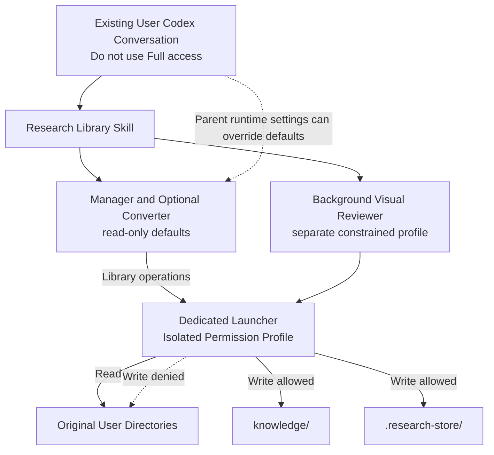
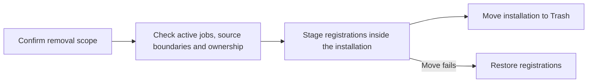

# Protecting Original User Directories and Managing Permissions

[한국어](../ko/permissions.md) | [English](./permissions.md) | [Technical design index](../README.en.md) · [Roadmap](./ROADMAP.md)

## Contents

- [Design Goal](#design-goal)
- [Usage Policy and Permission Flow](#usage-policy-and-permission-flow)
- [Protection Layers](#protection-layers)
- [Relationship to the Parent Codex Session](#relationship-to-the-parent-codex-session)
- [Allowed Work by Role](#allowed-work-by-role)
- [Isolating the Storage Command's Configuration Stack](#isolating-the-storage-commands-configuration-stack)
- [Scope of the Guarantee](#scope-of-the-guarantee)
- [Verification Criteria](#verification-criteria)
- [Uninstallation and Source Protection](#uninstallation-and-source-protection)
- [Implementation Responsibilities](#implementation-responsibilities)

## Design Goal

Research Agent reads PDF files stored across multiple user-selected locations
and converts them into searchable Markdown. The most important design principle
is to ensure that **Research Agent does not modify the user's original
directories**.

Original PDFs and their directories are used only as input sources. Converted
Markdown, search state, and temporary files are stored entirely within
directories owned by Research Agent.

## Usage Policy and Permission Flow

Research Agent is the installed store, skill, and tool bundle. The user invokes
Research Library from an existing Codex conversation, and the primary session
delegates library management and starts a separate visual-review job when
needed. No new user conversation is required.

The usage policy matches the top-level README: Ask for approval and Approve for
me are allowed; Full access is not. A read-only parent is an optional stronger
restriction, not an installation prerequisite. It is particularly useful when
originals are inside the parent's writable workspace. Approval-mode labels
alone do not establish filesystem access or prove that every mode was tested.

Both custom subagents declare `read-only` defaults, and personal registration also sets
`approval_policy = "never"`. When these settings apply, direct writes by the
agent are blocked; internal storage goes through the approved launcher. Parent
runtime settings can take precedence, so the child defaults and the launcher's
permission profile are distinct protection layers.

The following table describes **commands run through the dedicated launcher**.
It does not describe the parent Codex session as a whole or arbitrary commands
that bypass the launcher.

| Location | Permission | Purpose |
| --- | --- | --- |
| Original user directories | Read only | PDF discovery and conversion input |
| `knowledge/` | Read and write | Converted Markdown and saved conversations |
| `.research-store/` | Read and write | Configuration, SQLite state, and temporary files |
| Other locations | Read or denied | Not used as Research Agent storage |

Background visual review uses a separate `research-review-worker` profile. It
keeps original sources read-only while allowing model connectivity. Only the
Codex state files and temporary location needed to start the subscription CLI
receive additional write access under `~/.codex`. Registration rejects
`~/.codex` and any parent as an original source. Codex upgrades require a new
permission integration check for this narrow allowlist.

## Protection Layers

Original file protection does not depend on agent instructions alone.

1. **Agent permissions**
   Both the library management agent and the PDF visual review agent declare a
   read-only default; installation also sets `approval_policy = "never"`.
   The parent turn's active permission mode and live overrides can take
   precedence. These defaults are not an unconditional boundary independent
   of the parent.

2. **Storage command permissions**
   The agents do not create or modify files directly. They use a dedicated
   command that can write only within Research Agent. Original directories are
   included only as readable locations for this command.

3. **Application path validation**
   The application verifies that every generated file remains inside Research
   Agent. It rejects path traversal, symbolic links, and hard links that could
   redirect a write into an original directory or another external location.
   Original PDFs are read and then processed in internal temporary storage. If
   an original changes during processing, the result is discarded.

4. **Limited feature scope**
   Research Agent provides no feature for editing, moving, renaming, or deleting
   original files. Removing a registered source only stops future discovery. It
   does not delete the original files or existing Markdown records.

## Relationship to the Parent Codex Session

Research Agent is not a separate security principal that always has fewer
permissions than the parent Codex session. The official Codex documentation
says that subagents inherit the parent's current sandbox policy. Live changes
such as `/permissions` or `--yolo` are reapplied when a child is spawned even if
the custom-agent file specifies different defaults. A Full access parent can
therefore override the `read-only` value in the agent TOML.

A Full access parent session, and a subagent to which that permission is
reapplied, can perform the following actions:

- Modify an original file directly.
- Modify Research Agent installation files or configuration.
- Run other commands that Research Agent does not provide.

Even without Full access, originals inside the parent's workspace can remain
writable by the parent. Allowing Ask for approval and Approve for me is not a
guarantee that direct writes by the parent and every child are always blocked.
Choose read-only when the parent also needs to be restricted. Research Library
must never request source writes or broader source permissions in any mode;
access failures require stopping or deferring the work and reporting the cause.
See the official
[Codex subagent documentation](https://learn.chatgpt.com/docs/agent-configuration/subagents)
for the inheritance behavior.

## Allowed Work by Role

| Role | Allowed work | Mutation scope |
| --- | --- | --- |
| Primary Codex session | Understand the request, confirm conversation capture scope, delegate work, and present results | Delegate library changes through dedicated tools |
| Library manager | `source-list`, `source-add`, `source-remove`, sync, status, retrieval, and conversation save/list/get/update/delete | Internal configuration, knowledge, and state through the launcher |
| Paper converter | Explicit single-page correction or re-review | Internal images and review records through the launcher |
| Background reviewer | Review queued page batches and save results | Separate constrained profile, internal records, and required Codex runtime files |

Source registration records a user-supplied or user-selected path in internal
configuration. Disconnection stops future discovery while retaining the source
mapping, original files, and existing Markdown. It does not authorize deletion
of the original directory.

## Isolating the Storage Command's Configuration Stack

The command that writes Markdown and SQLite runs inside a named permission
profile, separate from ordinary agent file access. Permission profiles are
currently beta. The official
[Codex permissions documentation](https://learn.chatgpt.com/docs/permissions)
states that if any loaded configuration file contains the legacy
`sandbox_mode`, Codex can use the older sandbox settings instead of the
permission profile.

To prevent that conflict, the launcher fixes both `CODEX_HOME` and the Codex
working directory passed with `-C` to the Research Agent-owned
`~/.codex/research-library-sandbox` directory. Its dedicated configuration
selects the profile with top-level
`default_permissions = "research-store"`; the launcher also supplies
`-P research-store`, while the actual storage program is executed by absolute
path. A legacy `sandbox_mode` in the current project's
`.codex/config.toml` is therefore excluded from the storage command's
configuration stack. The development checkout's `.codex/config.toml` configures
development tasks. Product project settings have a separate source,
[`resources/codex.runtime.toml`](../../../resources/codex.runtime.toml), which the
release package places at the installation's `.codex/config.toml`. This keeps
development-setting changes out of the runtime package. Both project settings
are distinct from the installed launcher's constrained permission profile.
Because permission profiles are beta, Codex upgrades must revalidate this
isolation and the live integration test.

The background reviewer enters `research-review-worker` once at startup. Inside
that profile it invokes the project-owned `research-store` command directly
instead of creating a second macOS sandbox. Nested Seatbelt activation can
fail with `sandbox_apply: Operation not permitted`. The outer profile continues
to deny source writes, and the store command retains its path and ownership
checks.

## Scope of the Guarantee

When the dedicated launcher runs with its current constrained permission
profile and its installation and configuration remain intact, the confirmed
protection is:

> The storage command can write only to `knowledge/` and `.research-store/`.
> It cannot write to original directories.

Direct writes by a subagent depend on its effective sandbox policy. Read-only
agent defaults are already implemented, but parent runtime settings can replace
them. Neither these defaults nor the storage command's protection is a guarantee
covering the whole parent Codex session. Do not use Full access. Restricting
direct parent writes additionally requires a read-only parent task or
operating-system access controls.

Existing validation records cover the constrained storage command and workflows
with a read-only parent. They do not establish every child's effective
permissions or approval exceptions under both Ask for approval and Approve for
me. Mode-specific verification remains on the
[permission roadmap](./ROADMAP.md#milestone-1-source-protection-and-permission-management).

## Verification Criteria

The permission design is verified through the following behaviors:

- The constrained storage command can write to `knowledge/` and
  `.research-store/`.
- The operating-system sandbox blocks the same command from writing to an
  external original directory.
- The storage command uses its isolated permission profile even when the
  current project contains a legacy `sandbox_mode` setting.
- File contents in an original directory remain identical before and after
  synchronization.
- The application rejects output paths and links that point outside Research
  Agent.
- Registering or removing an original path changes only configuration owned by
  Research Agent.
- Removing Research Agent leaves every registered original file untouched.
- Further checks must distinguish parent and child effective permissions from
  launcher write boundaries under both Ask for approval and Approve for me.
  Untested combinations must remain marked as untested; the usage policy itself
  is not evidence of a passing test.

The first live permission E2E exposed a missing `default_permissions` selection
and a configuration-stack collision with the project's legacy `sandbox_mode`.
After adding the default profile and moving the sandbox working directory to
the dedicated configuration directory, the integration test allowed internal
storage writes while denying writes to the external source and project code;
the source content stayed unchanged. The discovery and regression result are
recorded in
[Safety and Agent-Routing Validation](./experiments/safety-routing-validation.md).

Installation and removal also passed with an empty temporary HOME on the
current Mac. This reproduces an unconfigured user environment; it does not yet
validate a non-developer's experience on a physically new Mac.

## Uninstallation and Source Protection

The public `uninstall.sh` command shows the installation path and data scope
before asking for confirmation. By default, it moves the owned Codex registrations
and the entire installation into a uniquely named folder in the user's Trash.
`--keep-files` unregisters only; `--yes` skips confirmation. The internal
`personal_registration.py uninstall` retains its registration-only behavior for
installation and registration checks.

Preflight reads the current configuration and legacy `config.toml`, including
disabled sources. It stops if a source overlaps the installation, registration
paths, or Trash, or if the configuration cannot be read safely. It never follows
links to delete their original targets. Arbitrary custom configuration files are
not inventoried; source-boundary checks cover the current and legacy default
configurations.

The storage launcher and direct CLI hold a shared lock on the installation
directory for the whole command. Removal holds an exclusive lock on that directory
alongside the existing sync and conversation locks, and stops when a library job
is active. Registration changes also use the existing user registration lock.
These locks do not cover installation updates or direct edits by external programs.

Only fixed, ownership-checked registration paths are staged, with a recovery
journal. A failed Trash move restores registrations. If the process exits while
staging registrations, rerunning removal recovers them before retrying. Conflicting
recovery destinations or damaged journals stop recovery rather than overwrite
files. Removal never recursively deletes the installation or falls back to a
cross-volume copy-and-delete operation. Currently, the installation must be on the
same volume as the home Trash; Finder's automatic Put Back feature is not provided.

Disposable installations with temporary HOME and Trash directories verify full
removal, cancellation, file retention, source preservation, ownership collisions,
concurrent operations, move failures, and retry after actual process termination.
Deleting one saved conversation with `conversation-delete` remains a separate
operation.

## Implementation Responsibilities

| Responsibility | Source files |
| --- | --- |
| Product project settings when opening a release installation directly | [`codex.runtime.toml`](../../../resources/codex.runtime.toml), [`runtime-files.txt`](../../../packaging/runtime-files.txt) |
| Install personal agents, command rules, and the constrained permission profile | [`scripts/personal_registration.py`](../../../scripts/personal_registration.py) |
| Remove an installation and recover failed removal | [`uninstall.sh`](../../../uninstall.sh), [`uninstall_project.py`](../../../scripts/uninstall_project.py), [`test_full_uninstall.py`](../../../tests/test_full_uninstall.py) |
| Exclude installation removal from active commands | [`operation_guard.py`](../../../src/research_store/operation_guard.py), [`test_operation_guard.py`](../../../tests/test_operation_guard.py) |
| Define each agent's read-only default and behavioral limits | [`research-library-manager.toml`](../../../resources/agents/research-library-manager.toml), [`research-paper-converter.toml`](../../../resources/agents/research-paper-converter.toml) |
| Re-enter through the constrained storage command | [`research-store` launcher](../../../resources/skills/research-library/scripts/research-store) |
| Validate storage and source boundaries | [`config.py`](../../../src/research_store/config.py), [`safety.py`](../../../src/research_store/safety.py) |
| Verify installation collisions and real sandbox permissions | [`test_personal_registration.py`](../../../tests/test_personal_registration.py), [`test_install_security.py`](../../../tests/test_install_security.py), [`test_permission_profile_integration.py`](../../../tests/test_permission_profile_integration.py) |
