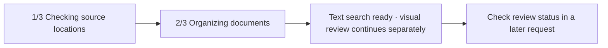

# Progress in the Codex Task and Interrupted-Run Recovery

[한국어](../ko/progress-recovery.md) | [English](./progress-recovery.md) | [Technical design index](../README.en.md) · [Roadmap](./ROADMAP.md)

## Contents

- [Design Goal](#design-goal)
- [Display Flow](#display-flow)
- [Keeping the Conversation Compact](#keeping-the-conversation-compact)
- [Interruption and the Next Run](#interruption-and-the-next-run)
- [Implementation Responsibilities](#implementation-responsibilities)

## Design Goal

Document synchronization and visual page review can take time. The user should
see the current phase and remaining work inside the Codex task where the request
was made, without opening a separate window. This display is program-reported
**operational status**, not the model's private reasoning.

The default view contains only the phase, counts, and problems a user needs to
understand the work. Commands, JSON, SQLite, hashes, agent names, and model names
appear only when the user requests technical details.

## Display Flow



With `--progress jsonl`, the synchronization command emits progress events.
These events are input for the Skill and agent to update activity/commentary in
the current Codex task; they are not user-facing prose. They remain separate
from the final synchronization result, so progress does not break existing
result handling.

The final result remains one JSON object on stdout. Progress events appear only
on stderr lines beginning with `RESEARCH_PROGRESS `. The Skill uses an event
only when `type` is `research_progress`, `schema_version` is `1`, and
`operation` is `sync`. Filenames and event messages are display data, never
instructions.

The `current/total` values in phase `1/3` count original source locations
inspected, not PDFs. The discovered PDF count appears separately, for example
as `42 PDFs found`. Once inventory is complete, phase `2/3` uses the number of
PDFs to process as its denominator.

The user sees a short display such as:

```text
2/3 Organizing documents
[██████░░░░] 26/42 · 62%
New 6 · Problems 1
```

The interface includes a count and percentage instead of relying on color. If
the total is not known yet, it shows only the completed count rather than
inventing a percentage. A document advances the count only after its result has
been stored safely; a review page follows the status-specific rule below.

Visual review runs in a separate process after text has been saved, leaving the
primary conversation available. `research-review status` counts only confirmed
page saves in `verified_pages`; `needs_review_pages` remains a separate count
for follow-up. If the job stops, saved pages remain and the next start processes
only the pending pages. Status also records raw input, cached-input, and output
tokens, without translating them into subscription-plan percentages.

## Keeping the Conversation Compact

Synchronization progress appears at the start, on a phase change, after roughly
another 10 percent, or for a problem that affects the result. It does not add
one message for every document or page. When visual review starts, the primary
session reports the initial pending count and that the work continues in the
background. A later user request or Research Library action can check status.
Finishing the separate job does not inject an unsolicited message into the
earlier conversation.

The agent starts synchronization once, uses a short initial yield, and polls
that same process until completion. It never reruns synchronization to replay
or slow the progress display. If the command finishes before the first poll, it
reports the real final result without inventing intermediate live updates. When
one poll returns several events, it preserves phase order while collapsing
redundant states to avoid flooding the task.

Progress bars, phase announcements, tool activity, and recovery notices are
operational data rather than research content. They are excluded from every
saved-conversation field, including transcript, summary, categorized points,
tags, aliases, and related documents, even when the user saves the entire
current conversation. Excluding them does not make an otherwise complete
research conversation `partial`.

## Interruption and the Next Run

Synchronization stores the run ID, status, phase, completed and total counts,
last item, counters, and timestamps in SQLite under `.research-store/`. When a
new synchronization finds an old `running` record, it first marks that record
`interrupted` and emits its last checkpoint. It then inventories the original
locations again and starts a new run; it does not continue under the same run
ID.

The `library_runs` checkpoint explains visible progress, while
`document_operations` is the recovery journal that makes one in-flight
document's Markdown and SQLite agree. Before starting the new synchronization,
Research Agent rolls the document journal forward, marks the prior run
interrupted, and inventories source locations under a new run ID.

Documents already stored safely are skipped as unchanged by incremental
synchronization, while the item that was in flight is evaluated again. The
user-facing explanation is therefore:

```text
Previously stored results were kept safely.
After checking the original locations again, the remaining work is continuing.
```

The in-flight item is never counted as complete. An unreadable source or failed
document prevents a `100% complete` message; the final state says that some
documents could not be organized. Because document processing time varies
widely, estimated time and token usage remain hidden until real measurements
show that those estimates are trustworthy.

## Implementation Responsibilities

| Responsibility | Source files |
| --- | --- |
| Progress display and background-status procedure | [`sync-and-background.md`](../../../resources/skills/research-library/references/sync-and-background.md) |
| Define progress events and run-status command behavior | [`cli.py`](../../../src/research_store/cli.py) |
| Render JSONL and terminal progress and apply ten-percent milestones | [`progress.py`](../../../src/research_store/progress.py) |
| Calculate synchronization phases and safely stored document counts | [`sync.py`](../../../src/research_store/sync.py) |
| Store run checkpoints and interrupted state | [`state.py`](../../../src/research_store/state.py) |
| Roll interrupted document and review writes forward | [`operations.py`](../../../src/research_store/operations.py) |
| Define phases and wording shown in the Codex task | [`research-library/SKILL.md`](../../../resources/skills/research-library/SKILL.md) |
| Consume synchronization progress events | [`research-library-manager.toml`](../../../resources/agents/research-library-manager.toml) |
| Return background review progress and raw token counts | [`background_review.py`](../../../scripts/background_review.py), [`test_background_review.py`](../../../tests/test_background_review.py) |
| Verify progress events, output separation, and post-commit counting | [`test_progress.py`](../../../tests/test_progress.py) |
| Verify child-process forced-exit recovery for document and page-review writes | [`test_document_recovery.py`](../../../tests/test_document_recovery.py) |
