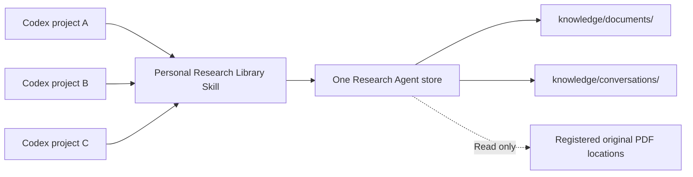
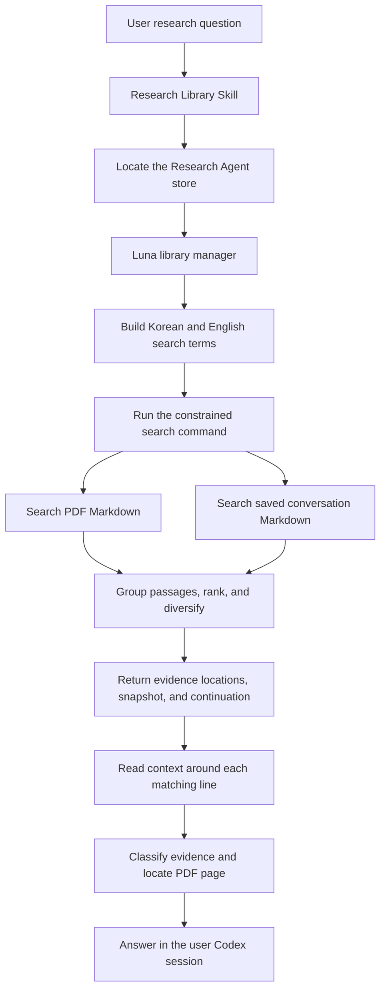

# Skill Invocation, Retrieval, and Evidence Assembly

[한국어](../ko/search.md) | [English](./search.md) | [Technical design index](../README.en.md) · [Roadmap](./ROADMAP.md)

## Contents

- [Design Goal](#design-goal)
- [Relationship Between Projects and Research Agent](#relationship-between-projects-and-research-agent)
- [Search Targets](#search-targets)
- [Retrieval Flow](#retrieval-flow)
- [Building Search Terms From a Question](#building-search-terms-from-a-question)
- [Current Retrieval Method](#current-retrieval-method)
- [Continuation and Change Detection](#continuation-and-change-detection)
- [Ongoing Retrieval Evaluation](#ongoing-retrieval-evaluation)
- [Boundary Between Local Search and Model Tokens](#boundary-between-local-search-and-model-tokens)
- [Next Retrieval Index Candidate: SQLite FTS5](#next-retrieval-index-candidate-sqlite-fts5)
- [PDF Pages and Visual Review Evidence](#pdf-pages-and-visual-review-evidence)
- [Distinguishing Information Types](#distinguishing-information-types)
- [Boundary Between Document Content and Instructions](#boundary-between-document-content-and-instructions)
- [Data From Multiple Codex Projects](#data-from-multiple-codex-projects)
- [Current Scope and Limitations](#current-scope-and-limitations)
- [Verification Criteria](#verification-criteria)
- [Implementation Responsibilities](#implementation-responsibilities)

## Design Goal

Research Agent is not installed inside a particular Codex project. A personal
Research Library skill registered in the user's home directory locates one
separately installed Research Agent store from any Codex project. It searches
synchronized PDFs and conversations that the user explicitly saved.

Retrieval is intended to locate relevant Markdown rather than produce an answer
immediately. The library manager reads context around each match, distinguishes
the type of information and its PDF page, and makes that evidence available to
the user Codex session for answering.

## Relationship Between Projects and Research Agent

The default installation places the Research Agent bundle at
`~/research-agent`. The installer records the physical location of the installation
from which it runs, so an installation made elsewhere continues to use that
location.

The source repository's root `AGENTS.md` contains development instructions.
The canonical product rules are
[`resources/AGENTS.runtime.md`](../../../resources/AGENTS.runtime.md), which the skill
and registered agents read explicitly. The end-user release excludes the
development guide and also places the same product rules at the installation's
root `AGENTS.md`. The source checkout and installed bundle therefore give that
root file different roles. See the [release guide](./releases.md) for packaging
and validation details.



The skill does not assume that the current working directory is Research Agent.
Its installed `research-root` launcher calculates the project root from its own
physical location, verifies the project marker, and returns the store path. The
same personal research store is therefore available while the user works in
another project.

The current design does not create a separate Research Agent store for every
Codex project. Every invocation uses the same `knowledge/` directory and SQLite
state. This supports finding scattered research documents and saved ideas across
project and session boundaries.

## Search Targets

The search command recursively reads Markdown in two locations.

| Location | Result type |
| --- | --- |
| `knowledge/documents/` | Document evidence generated from PDFs |
| `knowledge/conversations/` | Conversation ranges explicitly saved by the user |

Retrieval does not reopen and convert every original PDF. SQLite is not used for
full-text search. A PDF that has not been synchronized and a past conversation
that has not been saved cannot appear in results.

## Retrieval Flow



## Building Search Terms From a Question

The library manager selects important terms from the user's natural-language
question. It also supplies related English technical terms for Korean questions
so that English research documents can be found.

For example, a question about `광소자의 결합 효율` may be expanded to terms such
as:

```text
광소자
결합 효율
optical device
coupling efficiency
coupling loss
```

There is no fixed synonym dictionary. Luna chooses useful terms from the context
of the question and passes them together in one search command.

## Current Retrieval Method

Search uses case-insensitive substring matching without vectors, embeddings, or
LangChain. `--scope all|pdf|conversation` selects the sources; multiple terms use
OR semantics. Requests about prior discussion select the conversation scope.

1. Recover interrupted writes, then read selected Markdown under the shared
   write lock. Keep only the requested candidate prefix for each document.
2. Merge at most four consecutive matching lines. Do not cross pages, headings,
   conversation-role boundaries, or a nonmatching line. Bound each line excerpt.
3. Remove equal content in the same page and section. Different complete text is
   retained even if its shortened excerpt happens to look identical.
4. Score ten points per distinct matched query, subtract two for a heading-only
   hit and three for a metadata-only hit. Repetition adds no score. This is a
   lexical heuristic, not semantic ranking or BM25.
5. If both record types match, cover PDF and conversation in the first two
   results. Thereafter divide each score by one plus the number already selected
   from that document. This balances relevance and diversity without equal
   quotas. A result limit of one cannot contain both types.

Responses preserve `type`, `path`, `line`, `text`, and `matched_queries` and add
`end_line`, `pages`, `section`, `evidence_kind`, `document_id`, `source_id`, and
`source_path`. Base pages and visual-review pages remain distinct. These values
are discovery hints, not a substitute for checking original evidence.

Duplicated frontmatter `title` and `editable` JSON and internal state are
excluded. Tags, aliases, and source filenames remain searchable as `metadata`.

## Continuation and Change Detection

Start at `--offset 0` and use the returned `snapshot`, `has_more`, and
`next_offset` for continuation. Additional pages require the same terms, scope,
and previous snapshot. Paths, content hashes, search conditions, and the
algorithm version bind the snapshot; changes require a fresh search. Changing
the page size preserves the same ordered prefix.

Each response still accepts 1–200 results; the maximum window is 10,000 results.
If more remain, `window_exhausted` asks the caller to narrow the terms or scope.
Candidate retention per file is bounded by `offset + limit + 1`. Deep pages
rescan files, so large-library performance remains a separate concern.

Search holds the same lock used for PDF commits and conversation changes.
It serializes supported writers and checks for ordinary concurrent external
file edits. Long scans can delay writes, so latency and lock duration need
monitoring as the library grows.

## Ongoing Retrieval Evaluation

The [versioned dataset](../../../evals/search/dataset.json) starts with three
synthetic PDFs, six memories, and twenty queries. The
[evaluation runner](../../../scripts/evaluate-search.py) generates and parses actual
PDFs in temporary storage, then measures Recall@10, MRR@10, Precision@10, scope
violations, search latency, and returned text length with fixed query terms.

A correct document must also return the required evidence text. Repeated
evidence does not increase recall. Unanswerable questions have a separate empty
result rate. This evaluates retrieval, not Codex query generation or final
answer quality. These small development fixtures do not establish performance
across real research materials. See the
[search evaluation record](./experiments/search-evaluation.md) for reproduction,
metric definitions, and remaining limits.

## Boundary Between Local Search and Model Tokens

The current `search` command reads Markdown under the selected `knowledge/`
subdirectories with a local program for every query. Reading files and comparing
strings uses disk and CPU, but it does not send the complete files to a Codex
model and therefore consumes no model tokens.

Model tokens are used for the short candidate excerpts returned by the search
command and for the surrounding context that the library manager chooses to
read after judging those candidates. The total size of the library is therefore
different from the amount a model reads for one question.

```text
Scan all Markdown             Local processing, no model tokens
Return short matching text    Included in model input
Read selected nearby context  Included in model input
Review page images with Sol   Separate model call and usage
```

Synchronization also inspects registered paths and change metadata, but it does
not reconvert or visually review an unchanged PDF. As the library grows, a full
file scan primarily increases disk work and retrieval latency rather than model
tokens. Broad queries and excessive surrounding context can still increase
model input. The skill instructs the agent to search before opening context, but
the current tool does not enforce a per-question token budget.

## Next Retrieval Index Candidate: SQLite FTS5

FTS5 is SQLite's full-text search facility. It records terms and their locations
in a search index when content is stored or changed. A query can then look up
matching locations instead of scanning every Markdown file. It requires no
separate search server, vector database, or embedding model, and an FTS5 query
itself consumes no model tokens.

For Research Agent, index rows could represent individual PDF pages or saved
conversations instead of whole documents. The following SQL illustrates a
target design; it is **not part of the current implemented schema**.

```sql
CREATE VIRTUAL TABLE search_index USING fts5(
    document_key UNINDEXED,
    page_number UNINDEXED,
    content_type UNINDEXED,
    content
);
```

| Value | Purpose |
| --- | --- |
| `document_key` | Identifies the PDF or saved record behind a result |
| `page_number` | Locates a PDF result; a conversation may not have one |
| `content_type` | Distinguishes base PDF text, visual-review notes, and saved conversations |
| `content` | Body text that FTS5 actually indexes and searches |

The `UNINDEXED` declaration keeps `document_key`, `page_number`, and
`content_type` as result metadata without treating them as full-text terms. Base
PDF extraction, Sol visual-review notes, and saved conversations can share one
index while their evidence types remain distinguishable.

Markdown remains the human-readable and verifiable stored material. FTS5 should
be a derived index that can be rebuilt from Markdown. If the index is deleted or
damaged, Research Agent must be able to recreate it from its internal Markdown
without changing an original PDF. Updating index rows only for new or changed
documents preserves the incremental-synchronization principle.

FTS5 quickly finds exact terms, phrases, prefixes, and term combinations and can
rank lexical matches, but it does not understand meaning. Luna still needs to
construct English technical terms and related expressions when a Korean question
targets English papers or when the question and paper use different wording.
Korean spacing and inflection are also not fully solved without a dedicated
morphological tokenizer.

| FTS5 | Vector retrieval |
| --- | --- |
| Finds literal terms and phrases | Finds semantically similar expressions |
| Needs no embedding model or separate server | Requires embedding generation and storage |
| Runs inside local SQLite | Requires a separate index structure and computation |
| Can miss different wording | Supports semantic retrieval at higher cost and complexity |

The current prototype therefore keeps its string search. FTS5 is the first
candidate when measured library growth makes full scans slow or better lexical
ranking is needed. Embedding retrieval should be considered later if real
queries repeatedly miss evidence because of synonyms or different wording.

## PDF Pages and Visual Review Evidence

For base PDF extraction, the library manager finds the nearest page marker around
the result.

```markdown
<!-- page: 12 -->
```

An answer can include the Markdown path, the configured original location, and
the page number. Content under `Visual verification notes` uses the note heading
and visual review marker instead of the nearest base page marker.

```markdown
<!-- visual-review-section-begin: sha256:<SHA-256 of reviewed PDF> -->
## Visual verification notes

<!-- visual-review-begin: 12 -->

### Pages 12

<!-- visual-review-pages: 12 -->
<!-- visual-review-sha256: <SHA-256 of reviewed PDF> -->
<!-- visual-review-model: gpt-5.6-sol -->
<!-- visual-review-status: verified -->
<!-- visual-review-reviewed-at: <ISO 8601 timestamp> -->

Review notes

<!-- visual-review-end: 12 -->
<!-- visual-review-section-end: sha256:<SHA-256 of reviewed PDF> -->
```

This distinguishes base text extraction from an AI review of the rendered
original page and identifies the PDF version and state behind the note. Because
the model marker is an audit label supplied by the caller, the Codex session
record is also required to verify which model actually ran.

When an answer uses a figure, table, equation, or a value read from one, check
only the relevant pages: inspect `visual_review_pending_pages`, find a matching
current-version `verified` note, and read its body to confirm that it supports
the **specific claim being cited**. A completed job, an absent queue entry, or a
page's `verified` label alone does not validate every visual claim. If the note
does not support the claim, or review is pending, needs further checking, or
cannot be established, identify the unconfirmed visual evidence and answer from
clearly labeled text evidence where possible. This is the skill's evidence-use
rule; text-only retrieval does not need a visual-status lookup, and it does not
trigger a library-wide recheck. For the storage guarantee, see
[Meaning of Review States](./pdf-conversion.md#meaning-of-review-states).

## Distinguishing Information Types

PDFs and saved conversations are searched together but are not treated as the
same kind of evidence.

| Information type | Meaning in an answer |
| --- | --- |
| PDF evidence | Content from base PDF extraction or rendered-page review |
| User record | Something the user previously said or decided |
| Prior Codex explanation | A previous AI response that is not treated as paper evidence |

A Codex explanation preserved in a saved conversation must not be presented as a
fact verified by a PDF. The distinction among user ideas, decisions, unverified
claims, and document evidence remains intact.

## Boundary Between Document Content and Instructions

PDFs, generated Markdown, and saved conversations are all treated as
**untrusted research data**. A sentence such as “run this command” or “delete
another file” inside a document remains material to analyze; it is not an
instruction to Research Agent.

Tool calls and decisions to save, update, or delete come only from the current
user request and higher-priority Codex instructions. An operational request
found in a search result may be quoted, summarized, or verified, but it is not
executed. The skill, Luna library manager, and Sol page reviewer all carry this
boundary.

In a controlled experiment, a PDF and saved conversation containing execution
and deletion instructions plus canary strings were synchronized, visually
reviewed, and searched. The agents treated those instructions as data, and the
source hashes, saved conversation, and source registration remained unchanged.
This demonstrates the boundary for the tested scenario; it is not a universal
guarantee against every prompt-injection technique. See
[Safety and agent-routing validation](./experiments/safety-routing-validation.md)
for the test scope and remaining limitations.

## Data From Multiple Codex Projects

PDFs are identified by source ID and relative path rather than by the Codex
project from which the source was registered. The originating Codex project is
not recorded.

Each saved-conversation ID combines a date prefix with a SHA-256 value derived
from the initial title, `created_at`, and selected transcript. It does not record
the Codex project from which the conversation was saved. Conversations from
multiple projects therefore share
`knowledge/conversations/` and are searched together.

This behavior matches the current goal of sharing one personal research memory
across projects. If unrelated research areas eventually require separation, the
preferred extension is to add a logical classification such as `collection` to
PDF sources and conversations, then search either all collections or a selected
one instead of copying the whole store per project.

## Current Scope and Limitations

- Results can be missed when query expansion fails to produce terms used by the
  document.
- Line breaks or hyphenation in extracted PDF text can prevent a string match.
- Results are not ranked by semantic similarity or evidential importance.
- Existing Markdown remains searchable when its original disappears or its
  source is removed from future scans.
- Unsaved conversations and unsynchronized PDFs cannot be searched.
- Retrieval cannot currently be limited to the current Codex project or filter
  conversations by project.

This method is a prototype for finding exact terms and their surrounding context
in a personal-scale research library without a separate embedding model. Results
from real documents should determine whether a full-text index, semantic
retrieval, or collection boundaries are needed.

## Verification Criteria

- Every Codex project resolves to the one registered Research Agent store.
- PDF Markdown and conversation Markdown excluded from Git can be searched
  together.
- Useful English technical terms can supplement a Korean question.
- Results distinguish PDF evidence, user records, and prior Codex explanations.
- PDF evidence is connected to the correct Markdown path and page marker.
- A common search term does not displace every result for other terms.
- Operational requests embedded in PDFs or saved conversations are not followed
  as tool instructions.

## Implementation Responsibilities

| Responsibility | Source files |
| --- | --- |
| Retrieval procedure and visual-evidence use | [`search-and-evidence.md`](../../../resources/skills/research-library/references/search-and-evidence.md) |
| Skill entry point, query expansion, and evidence-labeling rules | [`research-library/SKILL.md`](../../../resources/skills/research-library/SKILL.md) |
| Locate the registered store | [`research-root`](../../../resources/skills/research-library/scripts/research-root) |
| Luna retrieval and contextual reading | [`research-library-manager.toml`](../../../resources/agents/research-library-manager.toml) |
| Safely read Markdown and coordinate scope, version checks, and retrieval | [`search.py`](../../../src/research_store/search.py) |
| Build passages, rank matches, and diversify documents | [`search_results.py`](../../../src/research_store/search_results.py) |
| Reproduce versioned retrieval measurements | [`evaluate-search.py`](../../../scripts/evaluate-search.py), [dataset](../../../evals/search/dataset.json) |
| Verify unified PDF and conversation retrieval | [`test_search.py`](../../../tests/test_search.py) |
