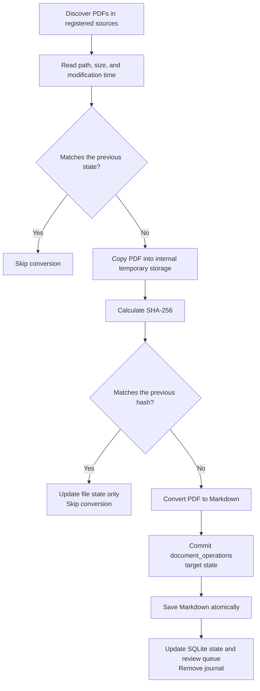

# Storage and Incremental Synchronization

[한국어](../ko/storage-sync.md) | [English](./storage-sync.md) | [Technical design index](../README.en.md) · [Roadmap](./ROADMAP.md)

## Contents

- [Design Goal](#design-goal)
- [Responsibilities of Each Storage Area](#responsibilities-of-each-storage-area)
- [Document Identity](#document-identity)
- [Synchronization Flow](#synchronization-flow)
- [Change Detection Order](#change-detection-order)
- [Detecting Changes During Processing](#detecting-changes-during-processing)
- [Missing Documents and Unavailable Sources](#missing-documents-and-unavailable-sources)
- [Representative Behavior](#representative-behavior)
- [Current Scope and Limitations](#current-scope-and-limitations)
- [Implementation Responsibilities](#implementation-responsibilities)

## Design Goal

Research Agent does not convert every PDF again whenever it revisits registered
source locations. It checks whether PDFs still exist and reads their basic file
state, but converts only newly discovered documents or documents whose content
has changed.

This design reduces repeated work and avoids unnecessary visual review and
subscription usage for unchanged documents. Research Agent writes no state file
or index into an original location. Every synchronization record remains inside
the Research Agent project.

## Responsibilities of Each Storage Area

| Storage area | Responsibility |
| --- | --- |
| `knowledge/documents/` | PDF-derived Markdown that Codex and the user search and read |
| `.research-store/library.sqlite` | Internal ledger of document state, hashes, parser versions, review queues, run checkpoints, and recovery journals |
| `.research-store/tmp/` | Temporary PDF copies and page images used during processing |

Markdown preserves content for search and citation. SQLite is not the database
for user-facing document text. It records the state needed to decide whether a
PDF must be processed again and to roll interrupted document storage forward
safely.

## Document Identity

Each PDF is identified by combining its **source ID and its relative path within
that source**.

```text
<source-id>:<relative-path>
```

For example, `optics/laser.pdf` inside a source registered as `papers` has the
document key `papers:optics/laser.pdf`. Identical PDFs in different source
locations remain separate documents because they have different provenance.

## Synchronization Flow



## Change Detection Order

The first step compares file size, nanosecond modification time, parser version,
the previous error state, and the presence of generated Markdown. When all of
these values match, the document is marked `unchanged` without reading the PDF
again.

When the basic state differs, Research Agent copies the original PDF into its
internal temporary storage and calculates SHA-256. This is an ordinary temporary
file copy, not a process or repository fork. If the hash matches the previous
record, the content is considered unchanged and only metadata such as size and
modification time is updated. The temporary PDF copy is deleted after the check
or conversion finishes. If an abrupt process exit leaves a copy behind, the next
synchronization removes only temporary directories owned by processes that are
no longer running.

Research Agent performs a full conversion when:

- It discovers a PDF for the first time.
- SHA-256 differs from the previous record.
- The PDF parser version has changed.
- Generated Markdown is missing.
- The previous conversion ended with an error.
- A storage-path migration requires regeneration.

After reconversion, Research Agent replaces the Markdown and rebuilds the visual
review candidates from the current PDF. An unchanged document keeps its existing
Markdown and visual review state.

## Detecting Changes During Processing

Research Agent compares the original PDF's size and modification time before and
after conversion. If the source changes while it is being processed, the new
result is rejected and the event is recorded as an error. Existing Markdown, if
any, remains in place so the next synchronization can retry safely.

The original remains a read-only input throughout this process. Hashing and
conversion operate on the internal copy, and no temporary file is created in the
original source location.

## Missing Documents and Unavailable Sources

When a previously recorded PDF is absent from a source that was scanned
successfully, SQLite records it as `missing` together with the time it was
noticed. Existing Markdown and review records are retained.

When an entire source is unavailable or unreadable, Research Agent does not mark
all of its documents as missing. It reports the source as `unavailable` so that a
disconnected external drive or a temporary permission failure is not mistaken
for document deletion.

## Representative Behavior

| Situation | Behavior |
| --- | --- |
| A new PDF appears | Generate Markdown and register review candidates |
| Synchronization runs with no changes | Scan the source and skip conversion |
| Only modification time changes | Update state without conversion when the hash matches |
| PDF content changes | Regenerate Markdown and rebuild review candidates |
| Parser version changes | Convert again with the current parser |
| Generated Markdown is deleted | Recreate it from the original PDF |
| Conversion fails | Record the error and retry during the next synchronization |
| An original PDF is deleted | Mark it `missing` and retain existing Markdown |
| A source is disconnected | Report a source error without marking its documents missing |
| A missing PDF returns | Check its hash and restore its current state |

## Current Scope and Limitations

- Conversion is skipped for unchanged PDFs, but every synchronization still
  scans registered sources for PDF files.
- Renaming a file or changing its relative path marks the old document as
  `missing` and creates a new document. The system does not automatically connect
  the two paths as a document move.
- Identical PDFs in multiple source locations are stored separately to preserve
  provenance, which can produce duplicate search results.
- The fast path trusts file size and modification time. It does not calculate a
  hash on every run to detect an unusual content change that preserves both
  values.
- Synchronization commits SQLite state after each PDF. A real concurrency test
  confirmed that a conversation write can proceed while the next PDF is in a
  long conversion. A separate `.research-store/sync.lock` allows only one
  synchronization run; a second run is rejected without disturbing the first.
  The lock does not hold the project conversation-write lock throughout
  conversion, so conversation saving remains available during a long PDF
  conversion.

This approach is intended to reduce repeated conversion costs while preserving
the relationship between original locations and generated results at a personal
research-library scale. If the number of PDFs grows enough for discovery itself
to become slow, filesystem monitoring or a separate indexing strategy should be
reconsidered.

## Implementation Responsibilities

| Responsibility | Source files |
| --- | --- |
| Discover PDFs, detect changes, create temporary copies, convert, and record missing documents | [`sync.py`](../../../src/research_store/sync.py) |
| Serialize synchronization runs and short project-write sections | [`locking.py`](../../../src/research_store/locking.py) |
| Journal and recover per-document Markdown and SQLite replacement | [`operations.py`](../../../src/research_store/operations.py) |
| Store document state, hashes, parser versions, and review queues | [`state.py`](../../../src/research_store/state.py) |
| Configure source locations and Research Agent storage paths | [`config.py`](../../../src/research_store/config.py) |
| Validate safe paths and save Markdown atomically | [`safety.py`](../../../src/research_store/safety.py) |
| Verify incremental behavior and source immutability | [`test_sync.py`](../../../tests/test_sync.py) |
| Verify synchronization serialization and conversation saving during conversion | [`test_sync_concurrency.py`](../../../tests/test_sync_concurrency.py) |
| Verify child-process forced-exit recovery during document storage | [`test_document_recovery.py`](../../../tests/test_document_recovery.py) |
