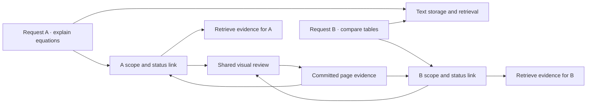
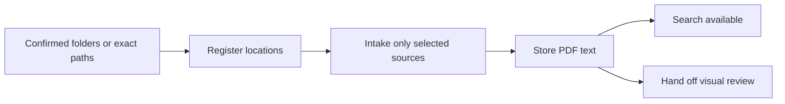

# Visual Review Jobs and Request Lifecycles

[한국어](../ko/visual-review-lifecycle.md) | [English](./visual-review-lifecycle.md) | [Technical index](../README.en.md) · [Development roadmap](./ROADMAP.md#current-work)

**Status: development implementation dated 2026-09-28. Not applied to the v0.3.0 release or existing personal installation.**
**Time/usage information is advisory; the user decides when to stop.** This
document describes the new lifecycle module's contracts and boundaries. See the
[validation record](./experiments/safety-routing-validation.md#visual-review-lifecycle-implementation-2026-09-28)
for evidence and limits, and the [roadmap](./ROADMAP.md#current-work) for current work.

## Contents

- [Goals and boundaries](#goals-and-boundaries)
- [Requests and shared review jobs](#requests-and-shared-review-jobs)
- [From folder confirmation to automatic storage](#from-folder-confirmation-to-automatic-storage)
- [From storage to confirmed startup](#from-storage-to-confirmed-startup)
- [Pause, cancellation, and resume](#pause-cancellation-and-resume)
- [Result commits and recovery](#result-commits-and-recovery)
- [Time and usage guidance](#time-and-usage-guidance)
- [State changes and notifications](#state-changes-and-notifications)
- [Expiration and deletion](#expiration-and-deletion)
- [Existing state and implementation boundaries](#existing-state-and-implementation-boundaries)
- [Acceptance criteria](#acceptance-criteria)

## Goals and boundaries

Text becomes searchable while slow visual review runs separately. A new PDF's
text import must not wait in the visual queue behind other documents. Final
writes may share a short storage lock, but model calls must not hold that lock.
Preserve read-only sources, constrained launchers, Luna xhigh management, and
Sol high visual review.

The job manager owns execution order, state, stopping, and recovery. Callbacks
notify the delivery component about persisted transitions; they are not the
only mechanism that advances the core pipeline. This change does not require a
new message broker, SSE server, or workflow platform.

## Requests and shared review jobs

**Preventing duplicate execution does not ensure that every request is handled.**
Repeated requests in one Codex task and requests from different tasks can target
the same library and document. An existing review must not cause the second
request to be discarded.

| Unit | Responsibility and identity |
| --- | --- |
| User request | `request_id`, originating task/message IDs when available, exact documents/pages, state, usage and advisory thresholds, expiration time |
| Document version | Existing document key + PDF SHA-256 + storage incarnation ID. Reimporting identical bytes after deletion does not restore old authority |
| Shared review | `review_id`, execution generation, per-page states, and request links for that version. Only one valid model execution per page at a time |
| Individual link | Request-to-review relationship, requested pages, active/paused/cancelled/evidence-ready/unresolved state |
| Document policy | Automatic-review eligibility, hold, cancellation, and expiration policy, stored separately from transient job history |

Do not automatically save the entire question as a research conversation. Keep
minimal operational metadata such as IDs and scope. The original question stays
in its Codex task; the work list is not a new conversation memory. Do not add
global content deduplication across different sources. Share work only within
the existing document identity and exact version.

One visual executor is sufficient for the prototype. Distinct review jobs queue
and report that they are waiting. If B requests some or all pages of a document
already being reviewed, link that scope. Queue additional pages without changing
A's scope or completion counts. Retrying the same request returns the same
receipt; a distinct user request gets a new request ID but shares execution.
Make this decision under a lock.
Freeze each bounded batch within one document version. New arrivals must not
continually expand the current batch; ready work gets a turn in intake order.

Each linked request exposes its own completion, failure, interruption,
cancellation, or expiration. Compute its outcome from its scope; another
request's failure must not overwrite it. Keep `needs_review` as an unresolved
outcome rather than automatically retrying indefinitely. Preserve per-document
outcomes in a multi-document request: partial failure/unresolved evidence is not
overall success, while other documents can continue. Shared evidence being
ready does not mean both A's equation question and B's table question have been
answered. **Evidence readiness, notification attempts, and answering the user
are separate facts.**

Each invocation returns its request ID, linked review, state, and evidence lookup
method. Without task IDs, use the request ID rather than guessing another task.
Automatically sending a new answer into a finished Codex task is outside this
contract. Mark pending visual evidence in the initial text response and use it
on a later user request. Preserve B's execution request and access to results
without promising an automatic follow-up answer.

## From folder confirmation to automatic storage

Installation onboarding and Codex folder-connection requests share
[`source_intake.py`](../../../scripts/source_intake.py). Confirming the list with
**연결하고 PDF 저장하기** (Connect and save PDFs) registers those locations and
continues to text storage and managed review intake. An exact-path connection
request uses the same route, without relying on a model to remember another save
command.

- `added` describes new/re-enabled registrations; `selected` is the exact source
  scope for this request, including already-connected folders selected again.
  Never expand it to every configured source.
- Cancellation and an empty list perform no registration or intake. Explicit
  connection-only/no-save requests use `--registration-only`.
- The host registers through the existing constrained launcher, then calls
  `key → prepare → submit`. It emits the fixed key/specification/request ID before
  text storage so an interrupted attempt can reuse that identity. No original
  source write permission is added.
- `processing` describes intake and errors. Its nested `request` is authoritative
  for actual review state; `submitted` does not mean running or complete. `retry`
  retains the immutable key, expiry, and exact specification.
- If installation cannot find the Codex executable, it performs only the existing
  registration step and reports storage as `deferred`. Installation success is
  distinct from storage success. A normal skill call never bypasses the missing
  constrained launcher with an internal command.
- An existing whole-library review hold persists. Text can be saved while visual
  review waits for the user's resume request. A storage failure does not undo
  successful registration; recover the intake instead of re-registering blindly.

[`select_sources.py`](../../../scripts/select_sources.py) owns path selection and
validation; [`install_onboarding.py`](../../../scripts/install_onboarding.py) owns
post-installation guidance; the [public launcher](../../../resources/skills/research-library/scripts/research-store)
owns the permission boundary. Internal `source-add` remains a registration
primitive; the public route composes automatic storage. This development change
is not included in the published v0.3.0 release.

The calling Codex task announces the open picker as progress and waits for the
same invocation's completed result. When its execution tool returns a session ID,
it continues that invocation instead of submitting again. The pre-storage
`RESEARCH_SOURCE_INTAKE_RECEIPT` is recovery data, not evidence of saved text.
The final reply distinguishes text-storage results from the actual visual-review
handoff, without waiting for every visual page. This does not append a later
answer to an already-ended task. The skill requires this conversation sequence;
it is not enforced by a host completion callback.
Ordinary user replies summarize storage results, review status, and any needed
action. Request IDs, retry keys, and input specifications remain in tool results
and agent-to-agent handoffs; show them only when the user asks for diagnostic or
recovery details. This does not delete or change the underlying recovery data.

## From storage to confirmed startup

Before intake, the caller persists an idempotency key with a fixed validity
deadline and reuses it on retry. Within a library, the same key and intake
specification return the existing request ID; the same key with a different
specification is rejected as a conflict. The specification includes per-input
identity, targets, review scope, and initial advisory thresholds. Later resume/threshold
changes are separate transitions and do not rewrite it. Identical file content
alone does not merge distinct user requests. If the caller cannot recover its
key, it looks up existing intake rather than automatically submitting a new one.
To cover a lost first response, the key must exist before that response.

Retries cannot change a key's original issue time or deadline, and accepted
validity has a maximum duration. Reject expired keys regardless of physical
cleanup. If document deletion or another action removes intake before its key
expires, keep only the key hash and expiration as a denial marker until that
deadline. The marker contains no question, path, result, or resume state and is
deleted after expiration.

1. Allocate a stable request ID and persist the authorized storage/review intent
   before processing. Distinguish a retry from a new request.
2. Store attachments individually and link the exact versions whose text
   conversion succeeded. Return per-document failures without discarding
   successes. Do not synchronize every source folder because of an attachment.
3. Reconcile recorded intent with committed documents, then create or join shared
   reviews. Recovery uses recorded intent, never global pending pages as consent.
4. Record `queued` and `starting`. Enter `running` only after the executor
   acknowledges the exact review ID and generation. A PID alone is not readiness.
5. If acknowledgement is not received within a short startup wait, return the
   preparing/unconfirmed state and lookup ID. Distinguish failure from uncertainty
   and release the conversation without waiting for all visual work.

If an input disappears or changes, report the changed scope. An old request must
not silently follow a new version. Recover intent → storage → review links even
when callbacks or notifications fail. Multi-file intake and document links must
follow the same request-level idempotency rule.
Link each input item ID to its storage journal/receipt so a crash immediately
after text commit still identifies the document version stored for that request.
Do not infer the link from a filename or today's pending list. If an attachment
disappears before storage, record a failure requiring reattachment; recover links
only to already committed internal copies/conversion results.

Before each call, persist a unique execution ID and verifiable process ownership.
Check creation time, owned process group, and execution acknowledgement rather
than only PID. A dead parent or released lock does not prove that model children
exited. Cover the spawn-before-record crash window with an execution lock and
handoff protocol. Do not dispatch another model call until prior owned processes
are confirmed gone. If this cannot be established, keep `unknown/stopping` and
report that recovery needs attention. Never terminate a process solely because
its PID matches. This prevents overlapping local execution, not exactly-once
remote model calls or refunds of already incurred tokens.

On macOS, `libproc`'s `proc_pidinfo` checks the PID, process group, and creation
time directly. It does not depend on launching the setuid `/bin/ps`, which can
be denied in a sandbox. Creation time includes microseconds; sandbox permissions
remain unchanged. Confirmed absence or exit is distinct from denied inspection
or an incomplete record. Unknown ownership cannot authorize a signal, release,
or replacement execution. Live identities recorded by the older method are not
guessed or rewritten into the new format; their exit must be confirmed first.

## Pause, cancellation, and resume

| User intent | Behavior |
| --- | --- |
| Pause/cancel only this request | Deactivate its links. Continue shared work required by other active requests, explaining why it continues |
| Stop/cancel review of this PDF itself | Stop that document's shared execution and record the effect on every linked request. Do not silently mark another request successful |
| Stop all visual review | Stop library visual execution; text import and retrieval remain usable |
| Resume review | Identify the exact request/document scope, check usage and version, and process unfinished pages |

A store-wide stop persists a dispatch hold. Concurrent and later intake can
store text, but visual work remains held. Ordinary sync, idempotent retries, and
document-only resume cannot clear it. Only an explicit request to resume the
library's visual review clears the hold and re-enables valid links blocked solely
for that reason. Independently paused/cancelled links do not
resume automatically. Document resume under a library hold explains the blocking
policy. Even after release, previous children must be confirmed stopped before
new dispatch.

When context identifies one scope, act without another confirmation. If multiple
targets make scope ambiguous, ask a short clarification. Do not interpret a
cost/time-driven “stop” as merely unsubscribing from notices: stop the relevant
shared execution and reflect that in other links. Only an explicit “cancel just
my request” uses link detachment.

Stop shared review when its last active link disappears. Paused/cancelled links
must not reactivate or receive completion notices because another request later
finishes the work. Committed evidence remains searchable. Document-wide
cancellation suppresses automatic review; ordinary sync or a new version must
not undo it. Only an explicit new review request authorizes the specified version.

Stopping proceeds through blocking new dispatch, revoking commit authority and
reconciling accepted writes, then confirming termination of owned child processes.
Distinguish `stop_requested/stopping` from `paused/cancelled`. Fencing writes while
a process remains alive is not a completed stop. Record termination failure and
retain temporary files. Do not promise to refund usage already incurred or
instantly terminate remote computation.

## Result commits and recovery

A result carries review ID, generation, document incarnation and SHA, page, and
execution ID. The initiating request ID is provenance, not sole commit authority.
Validate current review authority, version, page scope, and valid links requiring
that page. Cancelling/expiring A alone must not revoke the shared generation while
B still has a valid link; B's required result can still be saved. Do not relabel
A's ID as B. Reject new results for pages with no remaining valid link, including
pages B never requested. A missing shared job denies the write rather than
recreating authority. Never reuse IDs
or relabel an old result with a different job's current generation. Do not
overwrite verified pages without an explicit re-review request.

**A result is accepted when its document journal has been durably prepared after
authority checks under the storage lock.** Stopping acquires the same lock,
reconciles previously accepted journals, and revokes the generation. Recovery
must not newly accept an old result after stop acknowledgement. Resume from the
current version's per-page completed/unresolved states, not one numerical offset.

Fix one lock order before implementation and apply it everywhere. Existing paths
hold the control lock before invoking storage; adding storage → control elsewhere
can deadlock. The proposed order is control → storage. Hold neither during model
calls or child-process waits. Storage commands must not reacquire control and
must coordinate with authority changes made in that same order. Atomic JSON
replacement does not make Markdown, SQLite, and journals one transaction.
Preserve source and sandbox boundaries when implementing this contract.

Changes affecting commit authority, including link removal, expiration,
generation revocation, and document policy, acquire both locks in that order.
Delivery outcomes that do not affect authority need only control. Storage must
not acquire control to update request state/events while holding storage; after
the storage command returns, the manager reconciles in the defined order.

**Committed page results for the exact current document version are the source
of truth for evidence**; request/link evidence states are derived from them. On
link creation, restart, and status lookup, reconcile journals first, then compare
requested scope with page results to repair missing completed/unresolved states
and events. Use request ID and transition sequence for event identity so the
same evidence is not marked complete repeatedly. If B joins as the last page
commits, B immediately reuses that evidence. Conversely, completed job state
without committed notes is not verified evidence. Reconciliation must not undo
request cancellation or expiration.

When sync replaces a document version, revoke the old version's commit authority
and record the version change on affected links. Old evidence does not contribute
to new-version counts. Review of the new version requires a new explicit intent
and scope; an old request must not silently follow it.

## Time and usage guidance

**Time, page counts, and token usage never trigger an automatic policy stop.**
Report lengthy work and usage, leaving pause/cancel/continue decisions to the
user. Supersede the draft's automatic budget pause, budget-based batch trimming,
and extension-required resume rules. This is separate from user-requested stops,
source-access failure, revoked commit authority, and other execution errors;
lost authorization does not permit continued execution.

Cumulative visual execution time excludes queue/paused time and includes retries.
Page attempts count pages reserved for an execution, not just successful pages.
They may include an attempt that fails before model dispatch; they are not a
measurement of actual model input or billed usage.
Reserve/record attempts before dispatch and preserve accounting across resume or
restart. Show advisory thresholds with units/scope, and continue subsequent
batches even after crossing them. Do not claim an unset threshold is active. The
previously proposed 30 minutes/100 pages were not approved automatic limits and
are not applied as such.

Count actual shared usage once in library totals. Fix accounting participants at
call reservation. B joining an in-flight call reuses its result without
retroactive usage attribution; include B in subsequent calls. Cancelling or
expiring A does not transfer past costs to B. Distinguish per-request reference
figures from shared totals to avoid double-counting. Preserve active reservation
records until exit is confirmed even if request records are cleaned up.

The supervisor can check elapsed time between completion events and notify the
user about lengthy work. Limit notice frequency, for example once per threshold,
and explain how to request a stop. Delivery failure and threshold crossing do
not pause work. On a user stop request, block dispatch and supervise owned-process
termination as defined above. Report that additional usage may occur until actual
termination.

Token measurements may arrive after calls or be missing. Missing is unknown, not
zero. Retain reported completion-event measurements and count unmeasured
executions separately. Per-request figures cover calls sponsored at reservation;
library totals count each shared call once. Do not convert page/time counts to remaining subscription percentage or
present them as exact cost caps. Help the user decide using progress, elapsed
time, and available measured usage; leave stopping to the user.

## State changes and notifications

Persist state and its pending notification event atomically in the same durable
record. Existing file storage can support this; a new database/broker is not
required. A callback then wakes the notifier. If the callback is lost, the
persisted event remains discoverable. Event IDs and transition sequence numbers
limit duplicate processing; coalesce stale progress events to bound retention.
Event-capacity limits and callback exceptions must never prevent stopping.

When recording delivery outcomes, reload the latest record under the lock and
update only that event. Do not overwrite concurrent cancellation with a stale
copy of the whole state. OS delivery and its acknowledgement record are not one
transaction, so tolerate duplicates/loss and use bounded retries. A claimed event
or delivery attempt does not prove that the user saw it.

Initial invocations receive startup/waiting/failure through their tool result.
macOS notices can be coalesced per shared review, but cannot replace each request's
status and result access. Never send a message into an arbitrary active task.
Exclude cancelled/expired links from undelivered notices; shared failures must
remain visible to the remaining valid links.

## Expiration and deletion

**Thirty days after pausing is a proposed default**, to be implemented as policy.
Show the actual `expires_at` in pause receipts and status. Polling and another
request's progress do not extend it; explicit resume/extension can. Completed,
cancelled, and failed requests also have bounded transient-record retention.
Measure retention from entry into that state; do not apply a paused-request
expiration deadline to normally progressing active work.

Logical expiration is independent of cleanup. Lookup, resume, dispatch
reservation, result acceptance, and notification delivery check `expires_at`
under the lock and immediately exclude expired links from authorization.
Undeleted files do not extend permission. If the last valid link is lost, stop
execution first; unconfirmed process exit leaves cleanup pending.

| Data | Action at expiration |
| --- | --- |
| Expired request IDs, resume checkpoints, links, detailed logs, undelivered notices | Physically delete rather than merely hiding them; retain a minimal denial marker only until an intake key's remaining validity expires |
| Temporary images/model output needed only by that request | Delete after confirming process exit and reconciling accepted writes |
| Shared jobs/files needed by another valid request | Retain until the last reference is gone; remove only the expired request's link |
| PDF copies, base text, committed per-page review notes | Keep as research-library material until explicit document deletion |
| Document verification state and automatic-review suppression policy | Retain minimal document metadata, not unlimited resumable job history |

A new request checks current evidence under a new job ID and handles unfinished
pages. Looking up an expired old ID returns expired/invalid rather than silently
creating new work. Old recovery records and late model results must not resurrect
temporary state.

Cleanup can run on the next Research Agent operation; do not promise exact-time
deletion while the program is unused. Do not delete shared files or lock files
wholesale. Use job ownership manifests to validate paths, links, and live
references. Cleanup is restartable and checks process exit and journal recovery
before deleting artifacts.

Document deletion is separate. Revoke every relevant execution, confirm exit and
recovery, then remove only that document's internal copy, generated content,
index entries, and links. Preserve external originals and other documents. Keep
a collection exclusion for connected sources so the next sync cannot recreate a
deleted document; clear it only on explicit re-registration/import. Removing a
source connection does not mean its stored documents were deleted. Existing
`source-remove` behavior is unchanged.

## Existing state and implementation boundaries

Reuse current job/request/notification storage and locks without guessing a
mapping from v1's single job to individual requests. Do not apply the new lifecycle
to an active old worker. Block new intake and wait for confirmed old-worker exit
before an explicit format transition. Missing SHA, origin, or interruption time
stays unknown; invent neither historical consent nor retroactive expiration.
Keep stored documents and committed review notes.

| Responsibility | Implementation |
| --- | --- |
| Requests, shared reviews, authority, usage, retention | [review_lifecycle.py](../../../src/research_store/review_lifecycle.py): control lock and atomic state/outbox |
| Storage → review, acknowledgement, process exit | [background_lifecycle.py](../../../scripts/background_lifecycle.py): fixed small page batches and execution ownership |
| Read-only attachment transport | [review_intake_host.py](../../../scripts/review_intake_host.py), [import_attachment.py](../../../scripts/import_attachment.py): constrained prepare before the existing binary bridge |
| Separate macOS notice delivery | [background_notifier.py](../../../scripts/background_notifier.py): writes limited to the notice directory; no PDFs, storage-journal recovery, or model calls |
| Public sync → review entry points | [Store launcher](../../../resources/skills/research-library/scripts/research-store), [review launcher](../../../resources/skills/research-library/scripts/research-review), [CLI](../../../src/research_store/cli.py) |
| Page commit authority, intake receipts, journal recovery | [sync.py](../../../src/research_store/sync.py), [state.py](../../../src/research_store/state.py), [operations.py](../../../src/research_store/operations.py) |
| Source protection and installed behavior | [Runtime rules](../../../resources/AGENTS.runtime.md), [skill](../../../resources/skills/research-library/SKILL.md), [personal registration](../../../scripts/personal_registration.py) |

Operational state uses v2 `.research-store/visual-review/lifecycle.json`;
documents and intake receipts use SQLite schema v5. Lock order is control →
storage. `background_review.py` supplies existing rendering, output-validation,
and notification utilities; new public execution uses `background_lifecycle.py`.
The notice watcher never invokes document-journal recovery. A successful OS
send does not prove that a user saw the notification.

The public `research-review key` command generates
`vr2.<expiry epoch>.<random identifier>`. The calling Codex retains this tool
result and retries with the same key/specification. The separate expiry argument
must match the embedded value. Even after denial-marker cleanup, changing only
that argument cannot resurrect an expired key as new intake.

Implementation must review runtime rules, skill/agent instructions, the packaging
allowlist, and generated personal registrations together. Do not silently replace
another installation. Do not advertise pause, expiration cleanup, or related
new behavior in the README/web guide before implementation and validation.

## Acceptance criteria

These are **acceptance criteria**. The validation record distinguishes automated
evidence from remaining live-environment checks. Use disposable stores and fake
model processes; do not inject faults into real user data or subscription calls.

1. B can import/search text while A reviews images. Distinct jobs keep separate
   completion counts.
2. Same/different task requests, partial page overlap, and concurrent intake allow
   only one valid local execution of a page at a time while every request receives
   its ID, state, and evidence. This is not a lifetime ban on explicit retries.
3. Retrying a request returns its receipt; one failed file does not remove other
   successful links.
4. Crashes before/after storage, link creation, spawn, and acknowledgement recover
   only recorded authorization, without overlapping a local call whose exit is
   unconfirmed or falsely reporting `running`.
5. Cancelling A alone preserves B. Document-wide stopping affects both. Cover last
   link removal, a new request after cancellation, and evidence-ready vs answered.
6. Race commit acceptance, stopping, and journal recovery: no old result is newly
   accepted after stop acknowledgement. Reject stale generations, expired IDs,
   changed versions, and delete/reimport of identical PDFs.
7. Crossing time/page advisory thresholds continues execution. Resume, shared
   requests, and missing usage preserve accounting; delivery failure does not
   pause work. Explicit user stops still work.
8. Crash between state persistence, callback, OS send, and delivery recording;
   concurrent cancellation must survive. Coalesce stale events without blocking
   pause persistence when event capacity is full.
9. Expired A and active B sharing files, living children, interrupted cleanup,
   replaced links, and leftover images must clean only owned resources. Preserve
   originals, committed notes, and shared locks.
10. Validate v1 migration and prevent coexistence with old workers. Do not promise
    unmeasured duration/quota, automatic follow-up chat messages, or verified
    status for unreviewed pages.
11. Lose the first intake response, reuse a key with different input, and retry
    expired/early-deleted keys: no duplicate or resurrected intake. Recover links
    only to committed items when the original attachment disappears.
12. Save B's required result after A alone is cancelled/expired. Recover evidence,
    request state, and events after a crash immediately after commit and B joining
    concurrently. Do not reverse cancellation or expiration.
13. Kill a controller with a living model child; cover PID reuse and spawn/handoff
    crashes. Neither kill unrelated processes nor dispatch overlapping calls.
14. Joining B incurs no retroactive usage attribution. Threshold crossing does
    not pause links. Expired but not-yet-cleaned records confer no execution,
    commit, or notification authority.
15. A alone sponsors a reservation, B joins, and A cancels/expires: preserve
    reservation/accounting until exit. Do not transfer past costs to B or
    automatically stop for advisory thresholds.
16. Reverse the ordering of store-wide stop and B intake, then restart: preserve
    the hold. Document resume and idempotent retry cannot bypass it; library
    resume cannot override separate cancellation.
