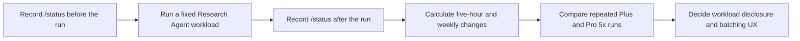

# Subscription Usage and Processing Efficiency Experiment

[한국어](./subscription-usage.md) | [English](./subscription-usage.en.md)

[Development roadmap](../ROADMAP.en.md)

**Status: Experiment not started**

## Purpose

Measure how much of a user's Codex subscription allowance Research Agent
consumes. Run the same workload on Plus and Pro 5x and record how document
count, page count, and visual review volume affect observed usage.

The primary metric is the **change in subscription usage before and after a
run**, not raw token count. Record task-level token counts when Codex exposes
them, but do not infer unreported tokens from a usage percentage.

## Current Plan Baseline

As of September 18, 2026, the official estimates for local messages per
five-hour window are:

| Model | Plus | Pro 5x |
| --- | ---: | ---: |
| GPT-5.6 Luna | 250–2,000 | 1,250–10,000 |
| GPT-5.6 Sol | 10–100 | 50–500 |

These are not fixed message limits. Actual usage varies with task complexity,
context, reasoning, tool calls, and caching, and an additional weekly limit may
apply. Recheck the [current OpenAI Codex pricing and usage documentation](https://learn.chatgpt.com/docs/pricing)
before starting the experiment.

## Measurement Flow

## Controlled Conditions

- Identical PDF files and file versions
- The same Research Agent commit
- The same model and reasoning effort
- The same task instruction and conversation starting condition
- No other Codex or ChatGPT Work activity during a run
- Consecutive before-and-after measurements within the same usage window when
  possible

Measure Plus and Pro 5x on separate accounts or environments that actually use
those plans. Do not multiply a Plus result by five and report it as a measured
Pro result.

## Experiment Scenarios

| ID | Scenario | Purpose |
| --- | --- | --- |
| S1 | Initial synchronization of a new prose-focused PDF | Measure base extraction and Luna management usage |
| S2 | Initial synchronization and Sol review of an equation, table, or figure-heavy PDF | Measure additional visual review usage |
| S3 | Full resynchronization with no changes | Confirm that no unnecessary model work occurs |
| S4 | Resynchronization after changing one PDF | Measure the benefit of incremental processing |
| S5 | Search saved documents and answer a question | Measure retrieval usage |
| S6 | Save a selected conversation range | Measure conversation organization usage |

Repeat each core scenario at least three times on each plan. If the displayed
usage resolution is too coarse to show a single run, execute a fixed batch and
calculate the average per task.

## Run Log

| Run ID | Date | Plan | Scenario | Model and reasoning | PDFs and pages | Visual review pages | Five-hour and weekly before | Five-hour and weekly after | Duration | Result or error |
| --- | --- | --- | --- | --- | --- | ---: | --- | --- | ---: | --- |
| Not run | — | — | — | — | — | — | — | — | — | Experiment not started |

If raw `/status` output or dashboard captures are retained, check that they do
not contain personal account information. Store only the comparison values and
reset times needed for the repository record.

## UX Decisions Informed by the Results

- Whether to show new PDF count and expected visual review pages before sync
- Whether to batch large visual review workloads automatically on Plus
- Whether low remaining allowance should finish base extraction and defer visual
  review
- How to show remaining and completed review work
- Whether the Luna and Sol role split produces a meaningful usage reduction

## Completion Criteria

- Repeated results exist for identical core scenarios on Plus and Pro 5x.
- PDF count, total pages, review pages, and usage changes are recorded together.
- The additional usage of unchanged resynchronization has been assessed.
- The default processing behavior is supported by both accuracy and usage data.
- Workload disclosure and batching principles have been decided.
