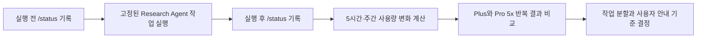

# 구독 사용량 및 처리 효율 실험

[한국어](./subscription-usage.md) | [English](./subscription-usage.en.md)

[개발 로드맵](../ROADMAP.md)

**상태: 예비 측정 시작**

## 목적

Research Agent가 사용자의 Codex 구독 한도를 얼마나 사용하는지 측정한다. 같은
작업을 Plus와 Pro 5x에서 실행해 PDF 수, 페이지 수와 시각 검토량이 실제 사용량에
어떤 영향을 주는지 기록한다.

이 실험의 기본 지표는 원시 토큰 수가 아니라 **실행 전후 구독 사용량의 변화**다.
Codex가 작업별 토큰 수를 제공하는 경우에는 함께 기록하지만, 표시되지 않은
토큰 수를 사용량 비율에서 역산하지 않는다.

## 현재 플랜 기준

2026년 9월 18일 공식 문서의 5시간당 로컬 메시지 추정치는 다음과 같다.

| 모델 | Plus | Pro 5x |
| --- | ---: | ---: |
| GPT-5.6 Luna | 250–2,000 | 1,250–10,000 |
| GPT-5.6 Sol | 10–100 | 50–500 |

이 수치는 고정 한도가 아니다. 작업 복잡도, 컨텍스트, 추론, 도구 호출과 캐시에
따라 실제 소모량이 달라지며 주간 한도가 추가로 적용될 수 있다. 실험을 시작하기
전에 [OpenAI의 현재 Codex 요금 및 사용량 문서](https://learn.chatgpt.com/ko-KR/docs/pricing)를
다시 확인한다.

## 측정 흐름

## 고정할 조건

- 동일한 PDF 파일과 동일한 파일 버전
- 동일한 Research Agent 커밋
- 동일한 모델과 추론 수준
- 동일한 작업 지시와 대화 시작 조건
- 실험 중 다른 Codex·ChatGPT Work 작업 중단
- 가능한 한 같은 사용량 창에서 실행 전후를 연속 측정

Plus와 Pro 5x는 서로 다른 계정 또는 해당 플랜을 실제로 사용하는 환경에서
측정한다. Pro의 한도를 단순히 Plus 결과의 다섯 배로 계산해 측정값처럼 기록하지
않는다.

## 실험 시나리오

| ID | 시나리오 | 확인 목적 |
| --- | --- | --- |
| S1 | 새 일반 본문 PDF 첫 동기화 | 기본 추출과 Luna 관리 작업의 사용량 |
| S2 | 수식·표·그림 중심 PDF 첫 동기화와 Sol 검토 | 시각 검토가 추가하는 사용량 |
| S3 | 변경 없는 전체 재동기화 | 불필요한 모델 호출이 없는지 확인 |
| S4 | PDF 하나만 변경한 재동기화 | 증분 처리 효과 확인 |
| S5 | 저장된 문서 검색과 답변 | 검색 작업의 사용량 |
| S6 | 선택한 대화 범위 저장 | 대화 정리 작업의 사용량 |

각 핵심 시나리오는 같은 플랜에서 최소 세 번 반복한다. 사용량 표시 해상도가
작아 한 번의 변화가 보이지 않으면 같은 작업을 고정된 횟수만큼 묶어 실행하고
작업당 평균을 계산한다.

## 실행 기록

### 예비 측정 P0: 진행 표시 전달

2026년 9월 21일 Luna xhigh의 별도 읽기 전용 Codex 세션에서 합성 JSONL 진행
이벤트를 정확히 한 번 실행했다. 실제 PDF 동기화, Plus·Pro 비교와 실행 전후 구독
한도 측정은 아니므로 S1–S6 결과와 직접 비교하지 않는다.

| 항목 | 측정값 |
| --- | ---: |
| 입력 토큰 | 93,174 |
| 입력 중 캐시 토큰 | 65,280 |
| 출력 토큰 | 2,315 |
| 추론 출력 토큰 | 1,720 |
| 명령 실행 횟수 | 1 |

`1/3`은 명령 완료 전에 commentary로 전달됐지만, `2/3`, `3/3`과 완료는 명령
종료 직후 한 묶음으로 전달됐다. 이 수치는 긴 스킬 지침을 읽는 통합 테스트의 전체
턴 사용량이며 진행 이벤트만의 비용으로 해석하면 안 된다. 그래도 간단한 진행 UX
검증에도 컨텍스트와 추론 비용이 클 수 있음을 보여준다.

| 실행 ID | 날짜 | 플랜 | 시나리오 | 모델·추론 | PDF·페이지 | 시각 검토 페이지 | 실행 전 5시간·주간 | 실행 후 5시간·주간 | 시간 | 결과·오류 |
| --- | --- | --- | --- | --- | --- | ---: | --- | --- | ---: | --- |
| P0 | 2026-09-21 | 미기록 | 합성 진행 표시 | Luna xhigh | PDF 없음 | 0 | 미측정 | 미측정 | 미측정 | 부분 실시간 전달 |

### 예비 측정 P1: 실제 1쪽 PDF 통합 경로

2026년 9월 21일 격리된 설치 사본에서 *Attention Is All You Need*의 수식과
그림이 있는 실제 페이지 한 쪽을 동기화했다. 주 세션은 Luna low, 저장소 관리자는
Luna xhigh, 시각 검토자는 Sol ultra로 실행됐다. 세 모델과 추론 수준은 Markdown의
자기 보고 값이 아니라 격리된 Codex 세션 기록의 `turn_context`로 확인했다.

| 세션 | 입력 토큰 | 캐시 입력 | 출력 토큰 | 추론 출력 | 캐시 제외 입력 + 출력 |
| --- | ---: | ---: | ---: | ---: | ---: |
| 주 조정 세션 · Luna low | 514,739 | 472,832 | 1,595 | 192 | 43,502 |
| 저장소 관리자 · Luna xhigh | 87,286 | 60,672 | 2,131 | 1,431 | 28,745 |
| 시각 검토자 · Sol ultra | 267,066 | 209,280 | 3,744 | 1,979 | 61,530 |

동기화 명령은 한 번, 페이지 렌더링과 검토 저장도 각각 한 번 실행됐다. PDF 1개와
1페이지가 저장됐고 검토 상태는 `verified`, 남은 대기 페이지는 0이었다. 원본
PDF의 SHA-256, 크기와 수정 시각은 실행 전후 동일했다.

`캐시 제외 입력 + 출력`은 세션 로그에서 계산한 비교용 수치다. 구독 한도 차감률,
청구 토큰 또는 Plus·Pro 사용량으로 해석하면 안 된다. 주 CLI가 마지막에 표시한
`tokens used` 43,502도 주 조정 세션만 나타내며 두 하위 에이전트 사용량을 포함한
전체 구독 소모량으로 간주할 수 없다. 실행 전후 사용량 창을 기록하지 않았으므로
P1 역시 S1·S2의 정식 결과가 아니다.

한 문서 동기화가 매우 빨라 JSONL 단계 이벤트는 관리자 작업 안에서 한꺼번에
완료됐고, 주 터미널에는 연속 애니메이션 대신 시작·동기화 완료·시각 검토·최종
결과가 표시됐다. 저장은 약 2분 30초 안에 끝났지만 이후 모델 응답 스트림이 한 번
재연결되면서 주 세션 종료까지 약 19분이 걸렸다. 이는 문서 수 외에도 하위 에이전트
컨텍스트, 추론 수준과 응답 재시도가 체감 시간과 사용량에 큰 영향을 줄 수 있음을
보여준다.

| 실행 ID | 날짜 | 플랜 | 시나리오 | 모델·추론 | PDF·페이지 | 시각 검토 페이지 | 실행 전 5시간·주간 | 실행 후 5시간·주간 | 시간 | 결과·오류 |
| --- | --- | --- | --- | --- | --- | ---: | --- | --- | ---: | --- |
| P1 | 2026-09-21 | 미기록 | 실제 1쪽 PDF 동기화·시각 검토 | 주 Luna low · 관리자 Luna xhigh · 검토자 Sol ultra | 1개 · 1쪽 | 1 | 미측정 | 미측정 | 약 19분 | 성공 · 응답 스트림 1회 재연결 |

각 실행의 `/status` 원문이나 대시보드 화면을 별도로 보관할 경우 개인 계정 정보가
포함되지 않았는지 확인한다. 저장소에는 비교에 필요한 수치와 초기화 시각만
기록한다.

## 결과로 결정할 UX

- 동기화 전에 새 PDF 수와 예상 시각 검토 페이지 수를 보여줄지
- Plus에서 검토 페이지가 많을 때 자동으로 작업을 나눌지
- 남은 한도가 적으면 기본 추출까지만 완료하고 시각 검토를 대기시킬지
- 사용자에게 남은 검토량과 완료된 검토량을 어떻게 표시할지
- Luna와 Sol의 역할 분리가 실제 사용량 절약으로 이어지는지

## 완료 조건

- Plus와 Pro 5x에서 동일한 핵심 시나리오의 반복 결과가 있다.
- PDF 수, 전체 페이지 수, 검토 페이지 수와 사용량 변화가 함께 기록돼 있다.
- 변경 없는 재동기화의 추가 사용량이 허용 가능한지 판단했다.
- 정확도와 사용량의 균형을 근거로 기본 처리 방식을 결정했다.
- 사용자에게 보여줄 작업량 안내와 분할 처리 원칙을 정했다.
