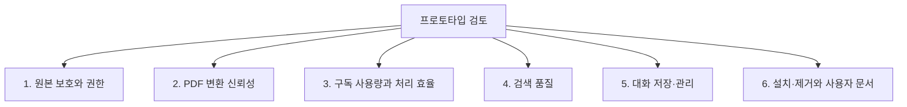

# Research Agent 개발 로드맵

[한국어](./ROADMAP.md) | [English](../en/ROADMAP.md)

[기술 설계](../README.md)

이 문서는 각 영역의 현재 상태와 다음 개발 목표를 관리한다. 동작 원리와 설계
근거는 기술 설계 문서에 기록하고, 이 문서에는 상태·한계·완료 기준만 남긴다.
완료 여부의 기준 문서는 이 로드맵이며, 날짜가 있는 측정과 실행 증거는
[실험 기록](../README.md#관련-설계와-검증-기록)에서 확인한다.

## 현재 작업 · 2026-09-26

**사용자와 합의한 다음 작업은 설치 웹 가이드 완성이다.** 작업을 재개할 때는
이 항목과 최신 대화부터 확인한다. 다른 마일스톤이 미완료라는 이유만으로 PDF
첨부 가이드나 하네스 확장 작업부터 새로 시작하지 않는다. 진행 기록은 이곳에서
갱신하고, 영문 로드맵은 이 항목을 참조한다.

- **작성 위치:** [웹 가이드](../../site/app.js), [영문 내용](../../site/content-en.js),
  [스타일](../../site/styles.css). 설치 명령은 [배포 설정](../../site/config.js)에 있다.
- **이미 반영된 화면:** [터미널 검색](../../site/assets/screenshots/spotlight-terminal-crop.png),
  [터미널 실행](../../site/assets/screenshots/terminal-ready-crop.png). 두 실제 캡처를
  시작하기 페이지에서 사용 중이다.
- **이번에 완료:** 터미널 열기 → 설치하기 → 폴더 선택 → Codex에서 확인의
  4단계 안내를 한·영으로 작성했다. 설치 명령은 2단계, 첫 질문 문장은 4단계에
  표시한다. v0.3.0의 버튼식 폴더 선택·나중에 하기·취소·Codex 재시작 흐름을
  반영했고, 영문 안내에도 실제 한국어 버튼 이름을 표시했다. 기존 흰 배경과
  대화 형식은 유지했다.
- **남은 실제 캡처:** 설치 완료 메시지, 폴더 선택 안내와 선택창, Codex의
  Research Agent 선택 및 첫 응답. 사용자가 캡처를 제공하면 개인 정보와
  무관한 영역을 제외하고 해당 위치에 반영한다. 확보 전에는 빈 프레임을 유지한다.
- **다음 재개 지점:** 설치 안내 2단계의 설치 완료 화면부터 실제 캡처를 이어
  받는다. 지금 필요한 화면은 터미널의 설치 완료 메시지 부분이다. 이미 설치한
  사용자에게 캡처만을 위해 삭제나 재설치를 요청하지 않는다. 다음에는 버튼식
  폴더 연결 안내와 Codex 호출 화면을 채운다.
- **확인한 범위:** 한·영 설치 명령 일치 검사, JavaScript 구문 검사와 변경
  파일 검사를 통과했다. 로컬 미리보기에서 단계 이동·언어 전환·단계 URL 직접
  접근·모바일 메뉴·기존 검색 화면을 확인했고 복사 버튼의 성공 응답을 확인했다.
  설치 동작은 v0.3.0 코드와 대조했으며 이번 작업에서 실제 설치를 다시 실행하거나
  새 Mac에서 테스트하지는 않았다.
- **완료 기준:** 실제 설치 동작과 안내가 일치하고, 한·영 전환과 명령 복사가
  동작하며, 남은 캡처와 검증하지 못한 항목을 구분한다.
- **배포 범위:** 2026-09-26 사용자 요청에 따라 개발 문서 정리와 설치 가이드
  변경을 함께 main에 커밋·푸시한다. 웹 가이드는 Pages 자동 배포 대상으로,
  설치용 v0.3.0 Release 파일은 별도 버전 출시 전까지 유지한다. 실제 반영
  여부는 해당 커밋의 GitHub Actions 결과로 확인한다.

## 전체 진행 상태

상태는 아래 표에서 관리한다. 그림은 점검할 영역을 보여준다.

| 영역 | 현재 상태 | 다음 개발 항목 |
| --- | --- | --- |
| 원본 보호와 권한 | 제한 저장 경로·읽기 전용 부모 기준 검증 완료 | 승인 모드별 부모·자식 실제 권한 확인 |
| PDF 변환과 시각 검토 | 검증 중 | 대표 PDF를 이용한 정확도 기준 확정 |
| 구독 사용량과 처리 효율 | 예비 측정 시작 | Plus·Pro 5x 동일 조건 사용량 측정 |
| 검색 | 범위·분배·추가 조회와 고정 개발 평가 구현 | 실제 연구 질문의 검증 세트 확장 |
| 대화 저장·관리 | 구현 및 기술 검증 완료 | 자연어 UX와 실제 검색 활용성 검증 |
| 설치와 제거 | 빈 임시 HOME 검증 완료 | 실제 새 Mac의 비개발자 설치 경험 검증 |
| 사용자 설명서 | 한글 README·영문 가이드와 한·영 웹 가이드 공개 | 기능별 실제 사용 캡처 보완과 비개발자 안내 검증 |
| 개발 문서와 배포 경계 | 개발·제품 설정 분리와 주제별 문서 구성 구현 | 실제 개발에서 필요한 문서만 읽는지, 변경·검증 누락이 줄어드는지 확인 |

## 마일스톤 1. 원본 보호와 권한 관리

[권한 설계](./permissions.md) · [검증 기록](./experiments/safety-routing-validation.md)

**상태: 제한 저장 경로·읽기 전용 부모 기준 검증 완료, 승인 모드별 추가 검증 필요**

### 완료된 결과

- Research Agent의 사용자 정의 에이전트는 읽기 전용 기본값을 선언하고, 설치 시
  `approval_policy = "never"`를 지정한다. 부모 런타임 설정이 기본값보다 우선할
  수 있으므로 자식 설정과 저장 실행기의 제한을 구분한다.
- 사용자 정책은 `Ask for approval`·`Approve for me` 사용 허용, Full access
  사용 금지다. 부모 읽기 전용은 추가 보호를 위한 선택이며 모드별 검증 완료를
  뜻하지 않는다.
- 저장 명령은 `knowledge/`와 `.research-store/`에만 쓸 수 있다.
- 원본 경로와 Research Agent 저장 경로의 포함 관계를 거부한다.
- 외부 경로, 심볼릭 링크와 하드 링크를 통한 쓰기를 거부한다.
- 실제 제한 권한 프로필에서 내부 저장은 허용되고 원본·실행 코드 쓰기는 차단되며
  원본이 유지되는 것을 확인했다.
- 전용 `CODEX_HOME`과 작업 디렉터리로 설정 스택을 분리해 프로젝트의 기존
  `sandbox_mode`가 저장 permission profile을 무효화하지 않게 했다.
- 부모 Codex 세션이 Full access이면 같은 권한이 하위 에이전트에 다시 적용될 수
  있어 Research Agent가 원본 보호를 보장하지 않음을 문서화했다.

### 다음 검증과 완료 기준

- `Ask for approval`·`Approve for me` 각각에서 실제 부모·자식 권한을 기록한다.
- 자식의 직접 쓰기와 전용 실행기의 쓰기를 분리해, 내부 저장 허용과 원본 쓰기
  거부를 임시 자료로 확인한다. 원본이 부모 작업공간 내부·외부에 있는 경우와
  승인 예외도 구분한다.
- 예상과 다른 권한 적용이 확인되면 구현이나 지원 조건을 수정하고, 검증하지 않은
  모드를 보호 보장에 포함하지 않는다.
- 자료원 등록·조회·해제의 위임과 허용 범위가 일치하고, 등록·해제가 내부 설정만
  바꾸며 원본과 기존 Markdown을 보존하는지 확인한다.

### 유지 조건

- 저장 경로가 추가될 때 제한 권한 프로필과 경로 검사를 함께 갱신한다.
- 설치 방식이 바뀔 때 실제 샌드박스 통합 테스트를 유지한다.
- 베타 permission profile과 하위 에이전트 권한 상속 동작이 Codex 업데이트에서
  바뀌는지 공식 문서와 실제 통합 테스트로 다시 확인한다.
- 원본을 수정하는 기능을 Research Agent에 추가하지 않는다.

## 마일스톤 2. PDF 변환 신뢰성 검증

[변환과 검토 설계](./pdf-conversion.md) · [첨부 PDF 저장](./attachment-import.md)

**상태: 검증 중**

### 현재 구현

- 폴더 등록 또는 대화 첨부를 통한 PDF 저장과 검색 등록
- `pypdf`를 이용한 페이지별 기본 텍스트 추출
- 페이지 번호를 보존하는 Markdown 표시
- 표·수식·그림·추출 실패 가능성이 있는 페이지 선별
- 선택된 페이지를 220 DPI 이미지로 렌더링
- Sol high를 이용한 시각 검토와 불확실성 표시
- 텍스트 저장 직후 별도로 시작하는 시각 검토 작업, 문서 범위 지정과 페이지별 재개
- PDF 해시가 바뀌면 오래된 검토 결과 저장 거부
- 현재 문서·페이지·버전의 비어 있지 않은 최종 노트와 검토 상태를 함께 저장
- PDF 동기화와 페이지 검토 저장을 위한 `document_operations` 저널
- 동기화 실행 간 `sync.lock` 직렬화와 페이지 검토의 프로젝트 쓰기 잠금
- 하위 프로세스 `os._exit` 강제 종료 뒤 Markdown·SQLite 상태의 자동 이어서 완료
- 강제 종료로 남은 프로젝트 내부 PDF 임시 복사본을 다음 동기화에서 정리
- 저널과 다른 외부 파일·DB 상태는 덮어쓰지 않고 복구 중단

### 확인된 한계

- 다단 문서의 읽기 순서와 특수 폰트가 깨질 수 있다.
- 기본 추출은 수식 구조, 표의 행·열 관계와 그림 의미를 보존하지 않는다.
- 규칙 기반 페이지 선별이 중요한 페이지를 놓칠 수 있다.
- `verified`는 현재 문서·페이지·버전의 최종 노트와 상태가 저장됐다는 뜻이다.
  노트의 의미상 정확성이나 실제 이미지 열람, 사람의 검증을 코드가 증명하지는 않는다.
- 이전 직접 호출 실험에서는 주 세션 → Luna → 주 세션 → Sol → 주 세션 → Luna
  흐름이 완료됐다. 현재 기본 흐름은 주 세션이 독립 검토기를 시작하는 방식이다.
  Luna가 Sol을 중첩 호출하는 방식은 지원되지 않았다.
- 백그라운드 검토기의 분리 실행과 재개는 시험했지만, 실제 논문에 대한 새 경로의
  Sol high 정확도와 Plus·Pro 한도 영향은 아직 검증 중이다.
- 강제 종료 복구 검증은 하위 프로세스의 `os._exit` 주입까지 완료했으며, 실제 Mac
  전원 차단이나 저장 장치 장애는 아직 검증하지 않았다.

### 다음 개발 항목

1. 일반 본문, 수식, 표·그림 중심의 대표 PDF를 각각 선정한다.
2. 사람이 먼저 검토 필요 페이지를 표시해 비교 기준을 만든다.
3. 현재 선별 규칙이 중요한 페이지를 놓치는지 확인한다.
4. 기본 추출과 Sol high 검토 결과를 원본 페이지와 비교한다.
5. 220 DPI로 판독하기 어려운 수식과 작은 표가 있는지 확인한다.
6. 결과를 바탕으로 OCR, 선별 규칙 개선 또는 파서 교체 필요성을 결정한다.

### 완료 기준

- 일반 본문에서 제목, 초록과 핵심 용어를 검색할 수 있다.
- 평가 문서에서 중요한 수식·표·그림 페이지의 누락 여부를 기록한다.
- 수식, 표와 그림별로 신뢰 가능한 범위와 원본 확인 조건을 문서화한다.
- `not-needed`, `verified`, `needs-review`의 의미가 실제 결과와 일치한다.
- 현재 파이프라인을 유지할지, 일부 변환기를 교체할지 근거를 가지고 결정한다.

### 이후 구조 개선 후보

현재 [`sync.py`](../../../src/research_store/sync.py)는 PDF 탐색, 변환, 페이지 선별,
렌더링과 검토 결과 저장을 함께 담당한다. 프로토타입에서는 흐름을 한곳에서
확인할 수 있다는 장점이 있다. 정확도 개선 과정에서 각 단계가 독립적으로 자주
변경되거나 테스트하기 어려워질 때 `parser`, `review detector`, `renderer` 역할을
분리한다. 파일 수를 늘리는 것 자체는 마일스톤의 목표로 삼지 않는다.

## 마일스톤 3. 구독 사용량과 처리 효율 검증

**상태: 예비 측정 시작**

[구독 사용량 실험 기록](./experiments/subscription-usage.md)

### 현재 판단

- Research Agent는 API 키가 아니라 사용자의 Codex 구독 사용량을 소비한다.
- Plus와 Pro 5x의 차이는 같은 작업의 정확도보다 사용할 수 있는 전체 한도에
  있다.
- 실제 사용량은 모델, 추론 수준, 컨텍스트, 도구 호출과 캐시에 따라 달라지므로
  PDF 페이지 수나 프롬프트 길이만으로 계산할 수 없다.
- 합성 진행 표시 통합 턴과 실제 1쪽 PDF 통합 경로의 작업 단위 토큰 수를 예비
  기록했지만, 실행 전후 구독 한도 변화와 Plus·Pro 비교 결과는 아직 없다.

### 다음 개발 항목

1. PDF 정확도 검증에 사용하는 동일한 문서 세트를 사용량 실험에도 사용한다.
2. Plus와 Pro 5x에서 모델, 추론 수준과 작업 지시를 동일하게 유지한다.
3. 실행 전후 `/status`와 사용량 대시보드의 5시간·주간 한도를 기록한다.
4. 첫 동기화, 변경 없는 재동기화, 일부 변경, 검색과 대화 저장을 분리해 측정한다.
5. Luna 작업과 Sol 시각 검토의 호출 수와 검토 페이지 수를 구분한다.
6. 측정 결과로 사용자에게 작업량을 언제 안내하고 나누어 처리할지 결정한다.

### 완료 기준

- Plus와 Pro 5x에서 동일한 핵심 시나리오를 각각 반복 측정한다.
- 문서 수, 전체 페이지 수와 시각 검토 페이지 수를 사용량 변화와 함께 기록한다.
- 변경 없는 재동기화가 불필요한 모델 작업을 만들지 않는지 확인한다.
- PDF 한 개와 시각 검토 페이지 한 개의 대략적인 사용량 범위를 설명할 수 있다.
- 남은 한도가 적을 때 기본 추출만 완료할지, 시각 검토를 나눌지 UX 원칙을
  결정한다.

## 마일스톤 4. 검색 품질과 지속 평가

[검색 설계와 근거 사용](./search.md)

**상태: 누락 회귀 수정과 고정 개발 평가 구현 완료**

- PDF·대화 범위 선택, 문서별 후보 보관과 분배, 구절 병합, 버전 확인 추가 조회를
  구현했다. 원본 경로 검사와 복구·잠금 흐름은 유지한다.
- [합성 평가 세트와 실행기](./experiments/search-evaluation.md)로 동일한 질문·근거·
  결과 제한을 유지하며 개선 전후를 비교한다.
- 다음 검증은 실제 연구 문서의 별도 질문 세트, Codex의 검색어 선택, 큰 저장소의
  검색·잠금 지연이다. 합성 개발 점수를 전체 검색 성능 보장으로 사용하지 않는다.
- 같은 단어가 있는데 밀리는 문제와 표현이 달라 못 찾는 문제를 구분한다. 후자가
  반복되면 키워드+벡터 실험을 같은 평가에 추가하며, 현재는 벡터·FTS5·LangChain을
  도입하지 않았다.

## 마일스톤 5. 대화 저장·관리와 사용 경험

**상태: 구현 및 기술 검증 완료, 자연어 사용 경험 검증 필요**

[대화 수명과 복구 설계](./conversation-memory.md) ·
[안전성과 라우팅 검증](./experiments/safety-routing-validation.md)

- 저장 범위 확인, 목록·상세 조회, revision을 확인하는 수정·삭제와 작업 저널을 구현했다.
- 장애 주입과 실제 동시 실행 검증 결과는 실험 기록에 남긴다. 이를 자연어 요청의
  정확도나 사용자 이해도 검증으로 확대하지 않는다.
- 다음 확인은 비개발자가 저장 범위를 고르고, 비슷한 제목의 기록을 구분하고,
  수정·삭제 결과를 이해할 수 있는지다.
- 완료 기준은 실제 사용 흐름에서 사용자 의도와 선택한 기록이 일치하고, 저장된
  대화와 PDF를 함께 검색했을 때 근거의 종류와 출처가 구분되는 것이다.

## 마일스톤 6. 설치·제거와 사용자 안내

**상태: 임시 HOME 설치·제거 검증 및 사용자 가이드 공개, 실제 새 Mac 사용 경험 확인 필요**

[설치 제거와 원본 보호](./permissions.md#설치-제거와-원본-보호) ·
[Release와 웹 가이드 배포](./releases.md)

- 한글 README, 영문 사용 안내와 한·영 웹 가이드를 공개했다. 웹 가이드는 기능별로
  이동할 수 있으며 아직 캡처가 준비되지 않은 화면은 준비 중으로 표시한다.
- 설치와 제거의 빈 임시 HOME 검증은 현재 Mac에서 실행한 결과다. 실제 새 Mac과
  개발 도구에 익숙하지 않은 사용자의 첫 설치까지 검증한 것은 아니다.
- 다음 작업은 [현재 작업](#current-work)에 기록한 설치 화면 캡처부터 보완한 뒤,
  실제 PDF 등록·첨부·검색·대화 관리 흐름의 캡처를 보완하고, 비개발자가
  안내만 보고 설치부터 첫 검색까지 수행하는지 확인하는 것이다.
- 완료 기준은 화면과 안내가 현재 제품 동작과 일치하고, 원본 보존·생성 자료의 위치·
  제거 범위를 사용자가 이해하며, 한글과 영문 안내의 설치 정보가 일치하는 것이다.
