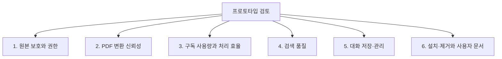

# Research Agent 개발 로드맵

[한국어](./ROADMAP.md) | [English](../en/ROADMAP.md)

[기술 설계](../README.md)

이 문서는 각 영역의 현재 상태와 다음 개발 목표를 관리한다. 동작 원리와 설계
근거는 기술 설계 문서에 기록하고, 이 문서에는 상태·한계·완료 기준만 남긴다.
완료 여부의 기준 문서는 이 로드맵이며, 날짜가 있는 측정과 실행 증거는
[실험 기록](../README.md#관련-설계와-검증-기록)에서 확인한다.

## 현재 작업 · 2026-10-06

**0.4.1 제품 사전 출시와 한글·영문 웹 가이드 배포를 완료했다. 공개 설치 배포본과 웹 설치 안내는 v0.4.1이며, 필수 가이드 캡처의 남은 작업은 없다. ALBERT 10쪽 추가 검토 결과 예시는 후속 웹 가이드 패치로 로컬 반영하고 브라우저 검증까지 완료했다. 이 후속 예시는 아직 커밋·푸시하지 않았다.**

- **ALBERT 10쪽 추가 검토 예시 보완 · 2026-10-06:** 사용자가 제공한 실제 요청·
  응답을 `추가 검토가 필요하다고 나오면?` 아래 기본 접힘 예시에 넣었다.
  PDF 첫 장부터 센 10쪽만 검증·저장한 결과이며 Table 10 열 순서와 UPM 행,
  RACE 열의 추출문 누락 대시와 OCR 교정을 시각 검토 노트에 기록했다고 설명한다.
  기본 추출 본문과 기존 검토 결과 유지, 앞선 9/10쪽 상태 기록과 BERT·VAE 예시는
  보존했다. 원본 PNG를 그대로 보관하고 요청·결과를 SVG 표시 영역으로 나눴으며,
  한영 안내에서 한국어 실제 캡처와 요청한 한 페이지의 완료 범위를 밝힌다.
  한영 데스크톱·모바일 4조합에서 이미지 2장 로딩, 가로 넘침 없음,
  기본 접힘과 복사 문장 일치를 확인했다. 정적 검사도 통과했다.
  이번 후속 변경은 아직 커밋·푸시하지 않았고 런타임·배포 버전 v0.4.1과
  공개 태그는 유지한다. 다음 게시 시 이 후속 패치의 커밋·푸시와 Pages 확인이 필요하다.
  개인 라이브러리·설치·모델은 조회하거나 실행하지 않았다.
  [캡처와 검증 기록](./experiments/guide-albert-page10-review-2026-10-06.md).

- **0.4.1 배포 완료 · 2026-10-06:** 최신 빈 폴더 초안과 다중 폴더 선택,
  연결 폴더 갱신, 시각 검토 저장·일시 정지·재개·상태 확인 캡처를 함께 게시했다.
  런타임 동작 변경 없이 가이드와 버전 메타데이터를 갱신했다. 로컬 전체 528개 중
  521개 통과·7개 제외, 실제 압축 3개 통과, 58개 제품 파일 내용·권한을 확인했다.
  원격 태그 전체 검사는 520개 통과·8개 제외(CI Codex CLI 미설치 포함), 실제 압축
  3개 통과 후 Prototype Release 게시까지 성공했다. 공개 파일의 확인 값·내용을
  검증한 뒤 같은 `03c3fa4` 커밋의 main을 푸시했고 main 검사·Pages가 성공했다.
  공개 웹 26개 파일은 소스와 일치하며 실제 브라우저에서 버전과 최신 선택창을
  확인했다. 기존 v0.4.0 태그와 개인 설치·자료는 유지한다.
  [검증과 게시 기록](./experiments/release-0.4.1.md). 다음 선택적 보완은 ALBERT 추가
  확인 결과와 실제 영문 캡처이며, 기존 설치의 업데이트 절차는 별도 제품 개발 범위다.

- **필수 웹 가이드 캡처와 최종 점검 완료 · 2026-10-06:** 최신 다중 폴더
  선택창을 시작하기 3단계와 연결 안내에 반영했다. 선택된 폴더 3개와
  “목록에 추가” 버튼을 한 화면에서 보여 주고 버튼 강조·크게 보기 링크를 제공한다.
  이전 목록 크롭/버튼 누락 설명은 한영 모두 제거했다. 빈 초안·폴더 갱신·시각
  검토 제어와 기존 모든 사용 캡처를 보존했으며 필수 캡처 누락은 0개다.
  한영 76개 캡처 연결의 독립 검토와 실제 브라우저 9개 경로×2개 언어×2개 폭
  36개 조합에서 이미지·빈 영역·가로 넘침 검사를 통과했다. JavaScript·가이드
  일치·변경 형식 검사도 통과했다. 한국어 실제 캡처와 한영 웹 설명은 게시 가능한
  상태로 검증한 뒤, 위 0.4.1 배포에서 커밋·푸시와 Pages 게시 확인을 완료했다.
  공개 v0.4.0 태그와 개인 자료는 변경하지 않았다.
  ALBERT 추가 확인 결과와 실제 영문 화면은 후속 보완으로 남긴다.
  [최종 캡처와 검증 기록](./experiments/guide-folder-picker-captures-2026-10-06.md).
- **빈 폴더 초안 최신 캡처 반영 · 2026-10-06:** 사용자가 제공한 최신
  빈 목록 1282×918 화면을 웹 시작하기 3단계와 폴더 연결 안내에 넣고 한영
  이전 버튼 문구 주석을 제거했다. 원본은 그대로 보존하며 폴더 추가하기 버튼
  강조 위치를 맞췄다. 이번 선택의 빈 초안임을 설명한다. 한영 모바일과 데스크톱
  표시·가로 넘침, 독립 자산·문구 검토 및 가이드/JavaScript 검사를 통과했다.
  기존 갱신·중단/재개 변경은 유지했다. 아직 로컬 반영 상태이며 푸시하지 않았다.
  당시 남았던 여러 폴더 선택과 “목록에 추가” 버튼 화면은 이후 제공받아
  위 완료 항목에 반영했다. 라이브러리·설치·모델은
  변경하거나 실행하지 않았다.
  [캡처와 검증 기록](./experiments/guide-folder-picker-captures-2026-10-06.md).
- **시각 검토 일시 정지·재개 캡처 반영 · 2026-10-06:** 사용자가 제공한
  ALBERT·ELECTRA·DeBERTa 요청·응답 8장을 웹 폴더 저장 안내의 별도 접힘 영역에
  넣었다. 저장/시작 → 지정 문서 일시 정지 → 남은 검토 재개 → 현재 상태 확인
  네 단계이며 각각 복사 문장과 실제 화면을 제공한다. 시간·액션 영역은 제외하고
  원본 PNG를 그대로 보관했다. 실제 중단 확인과 백그라운드 재개를 구분하며
  마지막 선정 페이지 기준 ALBERT 9/10쪽·추가 확인, ELECTRA 8/13쪽과 DeBERTa
  8/16쪽·진행/대기를 전체 완료로 설명하지 않는다. 한영 복사·이미지와 데스크톱/
  모바일 표시, 독립 원본·문구·렌더 검토를 통과했다. 로컬 반영 상태로 아직
  푸시하지 않았다. 개인 라이브러리·모델은 조회·실행하지 않았다.
  [캡처와 검증 기록](./experiments/guide-review-controls-2026-10-06.md).
  앞서 공식 PDF 3개를 바탕화면에 준비한 기록은
  [준비 기록](./experiments/guide-folder-refresh-2026-10-06.md#다음-캡처용-새-pdf-준비)에 유지한다.
- **연결 폴더 갱신 캡처 반영 · 2026-10-06:** 사용자가 제공한 실제 화면을
  웹 `폴더의 PDF 저장하기`의 `폴더에 PDF를 추가하거나 바꿨다면`에 요청·결과로
  나눠 넣었다. 작업 시간·액션 아이콘은 제외하고 원본 PNG는 그대로 보관했다.
  한글·영문 복사 문장과 설명에 신규 3개·기존 9개 유지, 현재 요청 범위의
  109쪽 검증 완료·8쪽 진행/대기를 구분했다. 한영 이미지·복사, 데스크톱·모바일
  가로 넘침과 독립 캡처 검토를 통과했다. 실제 저장소나 모델은 조회·실행하지
  않았다. 이 추가 캡처는 로컬 반영 상태이며 아직 푸시하지 않았다.
  시각 검토 중단·재개 캡처는 위 항목에 반영했고, 다음 남은 실제 캡처는 최신 폴더 선택창이다.
  [캡처와 검증 기록](./experiments/guide-folder-refresh-2026-10-06.md).
- **0.4.0 배포 완료 · 2026-10-06:** 사용자의 “이어서해” 요청에 따라 가이드 완성·
  버전업·재배포를 완료했다. 새 기능을 포함하므로 0.4.0으로 게시했다. 한글·영문
  웹과 README에서 구버전/개발본 분기를 제거하고 연결창 → 선택 목록 확인 →
  선택 범위 자동 저장 → 저장·시각 검토 상태 확인으로 맞췄다. 이후 새·변경 PDF의
  갱신 요청과 필요한 페이지만 재검토하는 요청을 별도로 둔다. Codex에서 재열기,
  빈 초안과 취소 범위, 전체 검토 보류 유지·명시적 재개, 알림과 대화 응답의 차이,
  새 설치 전용과 업데이트 미지원도 함께 안내한다.
- **이번 검증:** 전체 528개 중 521개 통과·7개 조건부 건너뜀. 버전/태그·한영웹
  설치 명령·JavaScript·변경 형식 검사와 독립 계약/캡처 검토를 통과했다. 실제
  제품 압축 58개 파일의 내용·권한·확인 값과 임시 HOME 설치·검색·제거 3개,
  실제 압축의 선택범위/재선택/전체 보류 6개 검사를 모두 통과했다. 구독 모델,
  개인 설치·연구 자료·원본 PDF를 사용하지 않았다. 웹 1280×720·390×844에서
  이미지·복사 문장·접힘 안내·가로 넘침을 확인했다. 영어 설명은 한국어 캡처를
  사용한다. [검증 범위와 한계](./experiments/release-0.4.0.md).
- **원격 게시 확인:** 커밋 `93ff3a4`의 `v0.4.0` 태그를 먼저 푸시했다.
  [태그 CI](https://github.com/LWH4Data/research-agent/actions/runs/37393749310)와
  [Prototype Release](https://github.com/LWH4Data/research-agent/releases/tag/v0.4.0)가
  완료됐다. 게시된 설치 파일·제품 압축·SHA256SUMS를 내려받아 확인 값과 제품
  58개 파일의 내용·권한을 검증한 다음 `main`을 푸시했다.
  [main CI](https://github.com/LWH4Data/research-agent/actions/runs/37394070856)와
  [Pages 배포](https://github.com/LWH4Data/research-agent/actions/runs/37394070895)가
  성공했다. 공개 웹 파일 5개가 소스와 일치하며, 브라우저에서 버전·결과 이미지·
  펼침 안내를 확인했다. 기존 사용자의 설치본이나 자료는 갱신·삭제하지 않았다.
- **남은 제품 범위:** 기존 설치의 업데이트·상태 이전 절차와 영문 화면 캡처는
  이번 배포 범위에 포함하지 않았다. 새 설치 전용 안내를 유지한다.

[구현 문서](./visual-review-lifecycle.md)에 요청별 접수·결과 연결과 공유 실행,
저장 후 검토 연결, 사용자 중단·재개·취소, 사용량 안내와 만료 정리를 기록했다.
별도 `codex/visual-review-lifecycle` 작업 공간에서 구현·저장소·독립 검증을 나눴고,
검증한 변경을 개발 프로젝트에 통합했다. 기존 웹 가이드 변경은 보존했다.
사용자가 승인한 재시험 준비로 개인 설치본과 등록을 최신 개발본으로 갱신했다.
기존 저장 자료·설정은 전체 백업으로 옮겼으며 원본 PDF와 공개 배포는 변경하지 않았다.

- **main 반영 묶음 · 2026-09-28:** 자동 저장·시각 검토 수명 관리, 실제 환경 오류
  수정, 소개 응답 지침과 최신 사용자 가이드 캡처를 함께 반영한다. 최종 로컬 검사에서
  전체 521개 중 513개 통과·8개 건너뜀, 버전·한/영/웹 가이드·JavaScript·변경 형식과
  제품 파일 58개 구성을 확인했다. 원본 PDF·개인 저장 자료는 포함하지 않는다.
  main 푸시는 웹 가이드 자동 배포와 CI 검증을 실행하며 새 설치용 Release를 만들지 않는다.
  [최종 검증 범위](./experiments/safety-routing-validation.md#prepush-2026-09-28).
- **최신 추가 요청 · 폴더 확인 후 자동 저장:** 최종 **연결하고 PDF 저장하기**에서
  선택한 자료원 등록 → 텍스트 저장 → 시각 검토 접수로 이어진다. 기존 위치 재선택도
  정확한 선택 범위에 포함하며 취소·미선택 위치는 처리하지 않는다. 설치에서 Codex를
  찾지 못하면 연결만 보관하고 저장 보류를 알린다. 명시적 저장 제외는
  `--registration-only`로 유지했다. 기존 전체 검토 보류는 자동 해제하지 않는다.
- **이번 검증:** 전체 493개 중 478개 통과·15개 건너뜀. 독립 집중 검증 86개,
  실제 제품 압축의 선택/재선택·보류 테스트, 제품 파일 58개 목록·내용 검사,
  버전·가이드·JavaScript 검사를 통과했다. [이번 검증 기록](./experiments/safety-routing-validation.md#folder-auto-storage-2026-09-28)을 참조한다.
  이 자동 검증에서는 실제 모델을 호출하지 않았다. 이후 사용자 승인에 따른
  개인 설치본 초기화·갱신 결과는 다음 항목에 기록한다.
- **사용자 승인 초기화·개발본 준비 완료 · 2026-09-28:** `~/research-agent`의
  이전 검토 종료와 작업 잠금 해제를 확인했다. 전체 설치본·자료·개인 등록을
  `~/Documents/Codex/research-agent-backups/2026-09-28-142420`에 백업하고
  내용 일치를 확인한 뒤, 데이터 디렉터리는 삭제 대신 백업으로 옮겼다.
  제품 목록 58개 중 57개는 개발본과 바이트 일치하며, 보호된 `.codex/config.toml`은
  권한 값이 같고 주석만 달라 기존 파일을 유지했다. 기존 Python 환경을 재사용했다.
  개인 등록 갱신 후 실제 공개 실행기로 자료원 0개와 요청 0개·실행 없음·보류 해제를
  확인했고, 문서/대화 0건·DB 스키마 5를 확인했다. 원본 4개 위치의 내용·메타데이터는
  그대로다. 원본 PDF 선택·저장·구독 모델 호출은 아직 시작하지 않았다.
- **실제 사용자 시험에서 시작 실패 발견·수정 · 2026-09-28:** 선택한 3개 폴더의
  PDF 9개는 저장됐지만 96쪽 시각 검토는 전부 대기였다. 실행기 프로세스 확인에서
  setuid `/bin/ps` 실행이 차단되는 호환성 결함이었다. macOS 기본 API로 같은
  프로세스 식별을 수행하고 조회 거부와 실제 종료를 구분하도록 수정했다. 권한
  프로필은 그대로다. 집중 27개·회귀 22개, 실제 제한 프로필 안의 감독 8개와
  원본 쓰기 차단을 검증했다. 독립 검토도 통과했다.
  [실험 기록](./experiments/safety-routing-validation.md#native-process-identity-2026-09-28).
  설치본 실행기 파일 하나를 백업 후 적용했다. 자료·원본·설정의 내용과
  메타데이터가 그대로임을 확인했고 설치본의 네이티브 조회도 통과했다.
- **사용자 요청으로 다시 빈 저장소 준비 · 2026-09-28:** 재개 대신 폴더 선택부터
  재시험하기로 했다. 활성 실행 없음과 작업 잠금 해제를 확인한 뒤 설치본의
  `.research-store/`와 `knowledge/`만
  `~/Documents/Codex/research-agent-backups/empty-library-20260928-150156`으로
  옮겼다. 공개 제한 실행기로 빈 설정·DB를 초기화하고 자료원·문서·대화·검토 요청
  0건, 실행 없음, 전체 보류 해제를 확인했다. 프로세스 조회 수정은 유지했고
  원본 PDF 폴더·설치 코드·개인 등록은 변경하지 않았다. 실제 모델은 호출하지 않았다.
- **사용자 재시험 · 2026-09-28:** 3개 폴더를 선택한 뒤 PDF 9개 저장과 실제
  시각 검토 실행을 확인했다. 확인 시점에는 96쪽 중 검증 완료 12쪽·추가 검토
  4쪽·대기 80쪽이었다. 호출한 Codex가 도구 완료 전에 ‘연결창을 열었다’는
  최종 답변을 보내 저장 결과·검토 시작 안내를 누락했다. 자동 저장 실패와 구분한다.
- **응답 누락 보완:** 스킬에 연결창 안내는 진행 메시지이며, 같은 도구 실행의
  완료 결과를 이어 받아 텍스트 저장과 검토 인계를 설명하도록 명시했다. 저장 전
  복구 영수증과 실제 완료 결과도 구분한다. 시각 검토 전체를 기다리거나 중복
  접수하지 않는다. 지침 변경이며 호스트가 완료 응답을 강제하는 장치는 아니다.
  독립 모의 검토에서 실행 중·접수만 출력·대기 인계·중단·취소 5가지의 후속 행동을
  확인했다. 가이드 일치·변경 형식·스킬 참조 경로와 기존 frontmatter 유지 검사를
  통과했다. 공용 `quick_validate.py`는 PyYAML 미설치로 실행하지 못했다.
- **사용자 요청으로 백업 추가 없이 초기화 · 2026-09-28:** 사용자가 처음부터
  다시 시험하기로 하여 기존 `empty-library-20260928-150156` 백업의 파일 해시와
  DB 무결성을 확인했다. 활성 실행과 잠금 점유가 없을 때 설치본의
  `.research-store/`·`knowledge/`만 삭제하고 공개 실행기로 빈 저장소를 초기화했다.
  새 백업은 만들지 않았다. 연결 폴더·검토 요청 0건, 실행 없음·전체 보류 해제를
  확인했다. 이전 백업에는 최신 시각 검토 결과가 없으며 이번 결과도 함께 삭제했다.
  원본 PDF와 설치 코드·개인 스킬 등록은 유지했다.
- **응답 재시험 캡처 확보 · 2026-09-28:** 사용자가 제공한 화면에서 폴더 3개 연결,
  PDF 9개 저장·실패 없음·백그라운드 검토 진행 안내가 최종 답변에 나온 것을 확인했다.
  이는 화면의 안내 확인이며 이 단계에서 검토 상태를 별도 조회하지 않았다.
  같은 답변에 요청 ID·재시도 키가 노출되어 일반 답변과 내부 복구 정보의 구분을
  스킬에 명시했다. 복구 값은 도구 결과와 에이전트 간 전달에 그대로 유지한다.
  독립 모의 검토에서 정상 저장·일부 실패·명시적 진단 요청의 답변을 확인했고,
  일반 안내에서 식별자를 제외해도 후속 작업용 값이 보존됨을 확인했다.
  참조 경로·기존 frontmatter·가이드 일치·변경 형식 검사를 통과했다.
- **다음 실제 확인:** 수정된 스킬을 새로 읽는 호출에서 내부 식별자 없이 저장 결과와
  검토 상태를 안내하는지 확인한다. 기존 저장 자료를 지우거나 다시 처리할 필요는 없다.
  이번 수정은 응답 지침만 변경하며 PDF 저장·검토 작업을 새로 시작하지 않는다.
- **최신 사용자 결정:** 시간·페이지·토큰 사용량으로 자동 중단하지 않는다.
  설정된 기준에서는 안내만 하고 계속 진행하며 중단은 사용자가 결정한다.
  자동 예산 중단·묶음 축소·증액 후 재개 경로를 제거했다. 기본 시간·페이지 상한은 없다.
- **앞선 시각 검토 수명 검증:** 전체 473개 중 458개 통과·15개 건너뜀. 그중 프로세스
  소유권 조건의 8개는 별도 실행에서 모두 통과했다. 배포 목록/실제 압축 내용
  검사와 버전·가이드 검사를 통과했다. 가짜 모델 프로세스와 폐기 가능한 저장소를
  사용했으며 구독 모델을 호출하지 않았다. 상세 범위·재현 명령·나머지 건너뜀은
  [실험 기록](./experiments/safety-routing-validation.md#visual-review-lifecycle-implementation-2026-09-28)에 있다.
- **검토에서 수정한 문제:** A 취소 시 B 결과 유실, 접수 중 조기 완료,
  연결 전 중단 누락, 살아 있는 모델 자식의 종료 확인, 기한 변경을 통한 키 재사용,
  삭제 후 재시도에 의한 자료 재생성, 완료 요청 재개에 의한 보관 기한 해제를 막았다.
- **호환성과 다음 확인:** SQLite v5와 작업 상태 v2를 사용한다. 구버전 검토가
  끝난 뒤 명시적 상태 전환이 필요하며, 새 설치본은 등록을 갱신해야 한다.
  실제 Codex 권한 통합·알림 수신·새 Mac 설치는 이번 변경에서 새로 입증하지 않았다.
  사용자 가이드를 재개할 때 현재 설치본으로 새 동작이 검증된 것처럼 캡처하지 않는다.
  이번에 승인된 초기화·갱신은 개발본 재시험 준비이며 일반 사용자용 업데이트 절차를
  검증한 것은 아니다.
- **유지한 경계:** 원본 읽기 전용, Luna xhigh / Sol high, 공개 제한 실행기.
  README의 새 제어 기능은 개발본 전용으로 표시했다. 배포 버전은 올리지 않았다.

**주요 한국어 사용 흐름의 캡처와 최신 기능 안내를 완성하고, 사용자의 버전업 재배포 요청에 따라 0.4.0을 게시했다.**
`compare`에 새 MobileBERT·ConSERT·DeCLUTR PDF 3개를 첨부한 요청과,
기존 DistilBERT·Sentence-BERT·SimCSE를 실제 출처로 연결한 비교 응답을 넣었다.
겹쳐 촬영한 두 장은 첫 장의 중복 응답 부분만 잘라 요청 → 결과 순서로 표시한다.
`attach`는 저장·요약·검토 진행 화면과 후속 결과 화면을 모두 확보했다.
후속 답변은 검토 대상으로 지정된 24쪽 완료와 자동 대상에서 제외된 4쪽을
구별한다. 확인 기록이 없는 4쪽까지 검증됐다고 표현하지 않고, 제외 이유를
추측하지 않는다. 필요한 문서·페이지를 명시해 추가 확인을 요청하도록 안내한다.
`organize` 하단에 ‘추가 검토가 필요하다고 나오면?’ 안내와 복사할 요청 문장을
추가했고, 사용자가 제공한 재검토·저장 결과 캡처로 후속 안내를 완성했다.
성공 사례와 별개로 확인하지 못한 부분이 남으면 이유를 확인하도록 안내한다.
대화에 PDF를 첨부해 저장하기와 연결한 폴더의 PDF 저장 결과 확인은
실제 캡처를 확보했다.
설치 안내 4단계와 `search`의 저장 PDF 검색 요청·답변도 확보했다.
`save`의 저장 결과와 현재 주제를 저장 범위로 선택한 응답을 확보했다.
선택 질문은 접혀 일부만 보이며 펼쳐진 전체 선택지를 보여주는 캡처는 아니다.
저장한 실험 계획·선택 기준을 관련 PDF와 함께 찾아 쓰는 예시도 `search`에 반영했다.
`manage`에 저장한 대화 목록과 제목·저장 시각으로 대상을 구분하는 안내를 반영했다.
같은 기록의 제목·태그 수정 요청과 재조회·보존 안내도 `manage`에 반영했다.
수정한 재검토 메모의 삭제 요청과 남은 목록도 별도 단계로 반영했다.
삭제 전에 복구 불가와 원본 보존 범위를 안내하고, 가이드 둘러보기에서 대화 관리로 이동할 수 있게 했다.
최신 기능 기준으로 폴더 선택 → 자동 저장 → 결과 확인과 시각 검토 제어 안내를
정리했고, 새 배포 가이드는 하나의 흐름으로 맞췄다. 웹·README·영문 안내와
제품 버전·잠금 파일·설치 명령·Release 설명도 갱신해 로컬 배포 검증을 마쳤다.
태그 CI와 제품 Release의 실제 설치 파일을 확인한 뒤 main CI와 공개 웹 배포까지
완료했다. 현재 공개 설치본과 웹 설치 명령은 v0.4.0이다.
영문 문구는 함께 맞추되 영문 캡처는 나중에 진행한다. 작업을
재개할 때는 이 항목과 최신 대화부터 확인한다. 다른 마일스톤이 미완료라는
이유만으로 작업 범위를 바꾸지 않는다. 진행 기록은 이곳에서 갱신하고,
영문 로드맵은 이 항목을 참조한다.

- **다음 배포 기준 합의 · 2026-10-02:** 사용자가 가이드를 완성한 뒤 버전을
  올려 재배포하기로 했다. 현재 설치본과 개발본의 차이를 계속 설명하는 대신,
  새 배포 기능 기준으로 폴더 확인 후 자동 저장·저장 결과 확인·검토 제어를
  안내한다. 웹과 README·영문 안내를 맞춘 뒤 버전·설치 명령·잠금 파일·배포
  설명을 함께 갱신하고 전체 검사와 실제 임시 배포본 검증을 진행한다.
  당시 버전 번호는 미확정이었다. 10월 6일 재개에서 새 기능 기준 0.4.0으로 준비했다.
  이전 가이드 묶음은 `a99ce7c`로 main에 푸시했고 CI와 Pages 배포가 성공했다.
  공개 스크립트·HTML·새 캡처 9개(총 12개 파일)의 바이트 일치와 실제 로드를
  확인했다. 이번 단계에서는 설치본·개인 자료·공개 Release를 변경하지 않았다.
- **대화 가이드 main 반영 묶음 · 2026-10-01:** 저장 범위 선택, 저장한 대화와
  PDF 통합 활용, 목록·제목·태그 수정·삭제 캡처 9장과 한·영 문구를 함께 반영한다.
  후속 단계별 복사 문장과 기존 검토 안내 호환을 유지했고, 원본 픽셀·독립 검토·
  JavaScript·가이드 일치·변경 형식과 데스크톱/모바일 화면을 확인했다.
  사용자 승인으로 main 푸시와 웹 가이드 자동 배포를 진행한다. 설치용 Release는
  v0.3.0을 유지하며, 다음은 한국어 가이드 최종 점검이다.
- **저장한 대화 삭제 캡처 · 2026-10-01:** 사용자 제공 1722×878 원본을
  요청(x=558, y=46, 1047×196)과 결과(x=112, y=408, 1498×335)로 나눴다.
  macOS 기본 도구로 원문 픽셀만 잘라 작업 시간·동작 아이콘을 제외했다.
  한·영 `manage`에 수정과 별개의 삭제 요청 문장·캡처를 추가하고, 요청 전에
  대상 확인·삭제 후 복구 불가·실제 Codex 대화와 원본 PDF 보존을 안내했다.
  삭제·보존·남은 원래 실험 계획 1건은 사용자 제공 응답의 보고다. 실제 저장소를
  새로 조회하거나 삭제하지 않았다. 기존 단일 후속 안내를 유지하며 여러 후속
  단계를 지원하도록 렌더러를 확장하고 둘러보기에 대화 관리 링크를 추가했다.
  원본 픽셀 일치·독립 캡처/한영 문구 검토·JavaScript 구문·가이드 일치·변경
  형식 검사를 통과했다. 한국어 1280px와 영어 390px에서 이미지 5장 로드,
  수정·삭제의 별도 문장과 기본 펼침, 가로 넘침 없음을 확인했다. 첨부·폴더의
  단일 후속 안내와 검색의 세 캡처 안내를 유지하고 둘러보기 링크도 확인했다.
  다음은 한국어 가이드 최종 점검이며 아직 푸시하지 않았다.
- **저장한 대화 제목·태그 수정 캡처 · 2026-10-01:** 사용자 제공 1592×814 원본을
  요청(x=498, y=45, 1045×286)과 결과(x=53, y=496, 1490×196)로 나눴다.
  macOS 기본 도구로 원문 픽셀만 잘라 작업 시간·동작 아이콘을 제외했다.
  목록 아래 한·영 수정 안내, 자기 기록에 맞게 바꿀 요청 문장과 두 캡처를 추가했다.
  제목·추가 태그와 원문·기존 요약·선택 기준·나머지 태그·저장 시각 보존은
  사용자 제공 응답이 보고한 내용이며 실제 저장소를 새로 조회·검증하지 않았다.
  원본 픽셀 일치와 독립 캡처·한영 문구 검토, JavaScript 구문·가이드 일치·변경
  형식 검사를 통과했다. 한국어 1280px와 영어 390px에서 이미지 3장 로드,
  수정 안내 기본 펼침과 가로 넘침 없음을 확인했다. 앞선 목록·저장·검색 변경을
  유지했다. 삭제 결과는 아직 필요하며 푸시하지 않았다.
- **저장한 대화 목록 캡처 · 2026-10-01:** 사용자 제공 1586×822 원본에서
  두 기록의 제목·한국 시간 기준 저장 시각과 원문 보존 안내를 남겼다
  (x=58, y=325, 1490×388). macOS 기본 도구로 원문 픽셀만 잘랐으며
  요청·작업 시간·동작 아이콘은 제외했다. 한·영 `manage`의 준비 중 영역을
  실제 목록 캡처로 채우고 제목·시각으로 대상을 구분한 뒤 변경 결과를 확인하도록
  안내했다. 원문 보존은 사용자 제공 응답의 보고이며 실제 저장소를 새로 조회하거나
  검증한 것은 아니다. 원본 픽셀 일치·독립 캡처/문구 검토와 JavaScript 구문·가이드
  일치·변경 형식 검사를 통과했다. 한국어 1280px와 영어 390px에서 목록 이미지
  로드와 가로 넘침 없음을 확인했다. 수정·삭제 결과 캡처는 아직 필요하다.
  아직 푸시하지 않았다.
- **저장 범위 선택 응답 캡처 · 2026-10-01:** 사용자 제공 1528×518 원본에서
  현재 주제를 선택한 응답 말풍선만 macOS 기본 도구로 잘랐다
  (x=466, y=92, 1046×151). 작업 시간·복사 아이콘·새로운 재확인 저장 결과는
  제외하고 원문 픽셀을 유지했다. 접힌 질문의 생략 표시는 원본부터 존재하며
  전체 선택지가 표시된 것처럼 안내하지 않는다. 선택 응답을 한·영 `save` 안내에
  추가하고, 앞선 원문 4개 저장 완료 화면은 별도 요청의 예시라고 구분했다.
  원본 픽셀 일치, 독립 캡처·한영 문구 검토, JavaScript 구문·가이드 일치·변경
  형식 검사를 통과했다. 한국어 기본 1280px와 영어 390px에서 두 이미지 로드와
  가로 넘침 없음을 확인했다. 실제 저장소 조회·수정·삭제는 하지 않았다.
  로컬 반영이며 아직 푸시하지 않았다.
- **저장한 대화·PDF 통합 활용 캡처 · 2026-10-01:** 사용자 제공 겹친 두 장을
  요청 → 저장한 선택 기준 → 실험 계획·논문 근거 순서로 `search`의 별도 예시에
  배치했다. 첫 원본 1674×1612에서 요청(x=524, y=30, 1056×154)과 기준 응답
  (x=78, y=350, 1508×308)을 남겼다. 두 번째 원본 1514×1410에서 실험 표부터
  논문 근거·비교 한계까지(x=16, y=20, 1498×1292) 남겨 겹친 표와 설명을 한 번만
  표시한다. 작업 시간·동작 아이콘은 제외하고 원문과 실제 화면의 강조 기호는
  수정하지 않았다. 여섯 실험 항목, 기준값·실험 조건 미정, 두 논문의 절 번호와
  동일 기기 측정 필요성을 유지했다. 한·영 문구를 맞추고 기존 검토 후속 안내의
  단일 캡처와 접힘 상태를 유지하면서 여러 캡처를 지원했다. 이 증거는 저장 기록을
  찾았다는 사용자 제공 응답이며 실제 저장소 조회·새 대화 여부·모델 우열·측정 성능을
  독립 검증한 것은 아니다. 원본 픽셀 일치와 독립 캡처·한영 문구·렌더러 검토,
  JavaScript 구문·가이드 일치·변경 형식 검사를 통과했다. 로컬 한국어 1200px와
  영어 390px에서 다섯 이미지 로드와 가로 넘침 없음을 확인했고, 기존 첨부·폴더
  후속 안내의 단일 캡처와 기본 접힘도 확인했다. 범위 선택 응답은 후속 항목에서 보완했다.
  아직 푸시하지 않았다.
- **main 반영 묶음 · 2026-10-01:** 저장 PDF 검색의 요청·근거 응답과 대화 저장
  완료 캡처, 한·영 가이드를 반영한다. 긴 대화 JSON의 PTY 입력 준비 표시·원문
  전달 수정과 제품 지침·기술 문서도 같은 묶음이다. 코드 변경은 앞선 집중 회귀
  78개 중 76개 통과·파일명 조건 2개 건너뜀으로 검증했고, 이번에는 버전·한영/웹
  가이드·JavaScript·변경 형식 검사와 독립 캡처·범위 검토를 통과했다. 개인 저장
  자료와 원본 PDF는 포함하지 않는다. main에 `0d5cf2a`로 푸시했으며 CI와 웹
  가이드 자동 배포가 성공했다. 공개 JavaScript와 새 저장 결과 이미지는 커밋의
  파일과 바이트 일치했다. 설치용 Release는 v0.3.0으로 유지했다.
- **대화 저장 재시도 결과 캡처 확보 · 2026-10-01:** 사용자가 제공한 응답은
  ‘DistilBERT·MobileBERT 모바일 문장 분류 비교 실험 계획과 선택 기준’으로 저장하고
  다시 조회해 완료를 확인했다고 보고한다. 선택 원문 4개와 요약, 정확도·응답 시간
  기준을 충족하는 구성 중 최대 RAM 최소화 및 초기 측정 후 구체적 기준 결정이
  포함됐다는 안내를 `save`에 반영했다. 원본 1588×622에서 x=48, y=350의
  1492×170 영역만 macOS 도구로 자르고, 복구용 요청·작업 시간·동작 아이콘은
  제외했다. 원문 텍스트와 화면에 그대로 노출된 강조 기호는 수정하지 않았다.
  정상 저장 요청과 범위 선택 절차의 한·영 문구를 맞췄으며 원문 4개를 제한으로
  설명하지 않는다. 이 증거는 사용자 제공 완료 응답이며 실제 저장소를 독립
  조회하거나 원문 완전성·후속 재활용을 검증한 것은 아니다. 범위 선택 캡처와
  저장한 대화의 후속 검색 캡처는 아직 없다. 원본 RGB 픽셀과 자른 영역의 일치,
  독립 캡처·문구 검토, 한·영 JavaScript 구문·가이드 일치·변경 형식 검사를
  통과했다. 1200px 한국어와 390px 영문 화면에서 이미지 로딩과 가로 넘침 없음을
  확인했다. 이 캡처 반영 단계에서는 가이드와 증거 기록만 갱신했고 아직 푸시하지 않았다.
- **대화 저장 시험에서 입력 전달 결함 확인 · 2026-10-01:** 사용자가 저장 범위를
  선택했지만 저장되지 않았다. 도구 기록에서 정확한 실행기는 시작됐고, 긴 JSON
  한 줄을 PTY에 보내는 단계에서 잘림과 BEL·대기가 발생했다. stdin을 유지하지
  않는 일반 실행은 빈 입력으로 종료됐으며, 이후 Node 하위 프로세스 재시도는
  중첩 샌드박스 시작에서 거부됐다. 실제 등록 규칙은 존재한다. 범위 선택 문제나
  권한 프로필 누락으로 단정하지 않는다. 입력 준비 표시를 확인한 뒤 긴 내용을
  전달하도록 CLI와 스킬 절차를 보완했다. stdin 집중 10개와 대화·제품 목록 회귀를
  통과했고, 임시 실제 제한 실행기에서 92,183바이트 원문 저장·터미널 설정 복구와
  외부 원본 쓰기 차단을 확인했다. 실행기·권한 프로필은 유지했다.
  [검증 기록](./experiments/safety-routing-validation.md#conversation-pty-2026-10-01). 개인 자료 저장은 직접 재시도하지 않았다.
  현재 설치본의 관련 코드·지침 5개를 백업 후 반영했고 연구 자료 45개는 내용·수정
  시각을 유지했다. 실제 Codex 입력 도구의 합성 저장도 통과했다. 최종 회귀는
  78개 중 76개 통과·대소문자 파일명 지원 조건 2개 건너뜀이다. 실제 사용자 대화는
  같은 범위로 저장을 다시 요청했고, 사용자 제공 응답에서 완료 보고를 확인했다.
  main 푸시는 아직 하지 않았다.
- **작성 위치:** [웹 가이드](../../site/app.js), [영문 내용](../../site/content-en.js),
  [스타일](../../site/styles.css). 설치 명령은 [배포 설정](../../site/config.js)에 있다.
- **저장된 PDF 검색 캡처 확보 · 2026-09-30:** 사용자 제공 원본(1688×1616)을
  macOS 기본 도구로 요청(1052×160)과 결과(1494×1126)로 잘랐다. 날짜·작업 시간과
  하단 동작 아이콘을 제외했고 원문·문서 및 페이지 근거·간접 인용 설명은 유지했다.
  `search`에 요청 → 결과 순서로 넣고 한·영 예시 요청을 BERT 경량화로 맞췄다.
  문서 링크는 저장된 텍스트 추출본이며 페이지는 PDF 첫 장부터 센 번호임을 안내한다.
  이 캡처는 저장된 PDF 검색 사례이며 저장한 대화 검색이나 시각 검토 상태까지
  입증하지 않는다. 실제 저장소 조회·새 처리·모델 호출은 하지 않았다.
  두 자르기의 RGB 픽셀 일치와 크기, JavaScript 구문·한영 가이드 일치·변경 형식
  검사를 통과했다. 독립 검토에서 원문·근거·간접 인용 설명과 변경 범위를 확인했다.
  한글 PC 1200px와 영문 모바일 390px에서 두 이미지 로딩·요청 문장·가로 넘침
  없음을 확인했고 한국어 미리보기로 복원했다. 로컬 반영이며 아직 푸시하지 않았다.
- **새·기존 PDF 비교 캡처 확보 · 2026-09-29:** 사용자 제공 화면 2장을
  `compare`에 요청 → 비교 결과 순서로 넣었다. 첫 원본(1684×884)은 macOS
  기본 도구로 첨부 목록·요청 영역 1080×578만 잘랐고, 둘째 원본(1610×1556)은
  바이트 그대로 사용했다. 새 문서 3개와 기존 문서 3개의 인용을 구분하는
  한·영 캡션·대체 텍스트와 요청 문장을 맞췄다. 완료 안내는 사용자 제공 응답의
  저장·텍스트 추출·검토 대상 페이지 확인 보고에 한정한다. 모든 페이지가
  검증됐거나 저장한 대화까지 활용된 사례로 확대하지 않으며, 표시된 7분 16초를
  일반 처리 시간으로 안내하지 않는다. 연구 저장소 조회·처리·모델 호출은 하지 않았다.
  기능별 여러 캡처를 지원하면서 기존 단일 캡처와 설치·후속 검토 경로를 유지했다.
  원본 픽셀/바이트, JavaScript 구문·가이드 일치·변경 형식 검사를 통과했고
  디자인 검사에는 항목이 없었다. 한·영 캡처 로딩, 1200px/390px 폭의 가로 넘침 없음,
  기존 첨부·설치 캡처 표시를 브라우저에서 확인했다. 두 비교 캡처에는 원본 크기로
  열 수 있는 링크를 추가했다. 아래 2026-09-29 가이드 반영 묶음에 포함한다.
- **비교 요청 캡처 자르기 수정 · 2026-09-29:** 사용자가 첫 PDF 잘림과 작업 시간
  노출을 확인했다. 초기 `sips` 옵션 순서로 중앙 자르기가 적용된 오류를 수정해
  원본의 x=565, y=26에서 1080×578을 남겼다. PDF 카드 3개와 요청 전체가
  보이고 작업 시간·전송 시각은 제외됨을 이미지 자체와 독립 검토로 확인했다.
  알파 채널에 가려진 차이를 놓치지 않도록 RGB 픽셀로 원본 영역과 비교했다.
  이미지 크기와 캐시 키를 갱신했다. 원본과 두 번째 비교 결과 캡처는 유지했다.
- **첨부 시각 검토 후속 결과 · 2026-09-28:** 사용자 제공 원본(1588×1066)을
  `attach` 하단 ‘시각 검토 결과 확인하기’에 넣고 결과 조회 문장을 함께 제공했다.
  검토 대상 24쪽 완료·대기와 판독 실패 없음이라는 보고와, Sentence-BERT 2쪽 및
  SimCSE 10–12쪽은 자동 대상에 포함되지 않아 확인 기록이 없다는 보고를 구분했다.
  제외 이유는 현재 기록으로 알 수 없으며, 네 페이지를 실패나 검증 완료로
  표시하지 않는다. 캡처에 근거한 안내로 실제 저장소 조회나 재검토는 실행하지 않았다.
  원본 바이트·크기(1588×1066), 한·영 브라우저 표시, 결과 조회 문장의 복사 대상을
  확인했다. JavaScript 구문·가이드 일치·변경 형식 검사를 통과했고 디자인 검사에는
  항목이 없었다. 아래 2026-09-29 가이드 반영 묶음에 포함한다.
- **첨부 저장·백그라운드 검토 캡처 교체 · 2026-09-28:** 사용자 제공 원본
  (1636×1666)을 가공 없이 사용해 기존 TinyBERT·MiniLM·DPR 대기 화면을 교체했다.
  새 화면은 DistilBERT·Sentence-BERT·SimCSE 저장·요약과 일부 시각 검토 진행을
  보여준다. 한·영 캡션과 대체 텍스트, 이미지 크기·캐시 키를 맞췄다. 이는 사용자
  제공 응답의 증거이며, 이 가이드 작업에서 저장소를 조회하거나 검토를 실행한
  것은 아니다. 후속 검토 결과 캡처도 이후 확보해 위 항목에 기록했다.
  원본 바이트 일치, 한·영 브라우저 이미지 로딩과 크기, JavaScript 구문·가이드
  일치·변경 형식 검사를 통과했다. 디자인 검사에는 항목이 없었다. 로컬 가이드에
  반영했고 아래 2026-09-29 가이드 반영 묶음에 포함한다.
- **가이드 main 반영 묶음 · 2026-09-29:** 첨부 PDF 저장·시각 검토 후속 결과,
  새·기존 PDF 비교 캡처와 첫 요청 화면 자르기 수정을 함께 반영한다. 독립 검토에서
  캡처 내용·크기·경로·한영 설명과 변경 범위를 확인했고 JavaScript·가이드 일치·
  버전·변경 형식 검사를 통과했다. 런타임·원본 PDF·개인 저장 자료는 포함하지 않는다.
  푸시 후 CI와 Pages 배포를 확인하며 설치용 버전과 Release는 변경하지 않는다.
- **요청 문장 표시 통일과 첨부 안내 보완 · 2026-09-28:** 모든 기능 페이지의
  고정 하단 입력창을 제거하고 설치 안내처럼 본문의 읽기·복사 영역으로 통일했다.
  기본 요청과 추가 검토 요청이 같은 페이지에 있어도 각 복사 버튼이 해당 문장만
  선택한다. 첨부 안내는 본문 저장 → 필요한 시각 검토 시작 → 대화 계속 → 결과
  확인 순서이며, 대기·시작 실패와 실행 중을 구별한다. 범위별 일시정지·재개는
  개발본 전용임을 접힌 도움말에 명시했다. 자동 백그라운드 검토 자체는 v0.3.0에도
  있어 개발본 전용으로 표시하지 않았다. 기존 첨부 캡처는 교체 예정이라고 알렸다.
  README 한·영 설명과 대조했고, 독립 읽기 검토에서 복사·렌더링 회귀나 버전
  설명 오류는 발견되지 않았다. 런타임 코드와 연구 자료는 변경하지 않았다.
  브라우저에서 첨부·폴더 저장·추가 검토·설치 명령의 복사 결과를 확인했다.
  한·영 390px 화면에서 가로 넘침이 없고 중복 ID나 하단 입력창이 없다.
  JavaScript 구문·가이드 일치·변경 형식 검사를 통과했고 디자인 검사에는
  항목이 없었다. 첨부 기능의 새 실제 캡처 확보를 다음 작업으로 남긴다.
- **추가 검토 후속 안내 · 2026-09-28:** 상태만 제시해 다음 행동이 없는 문제를
  보완했다. 자동 반복되지 않는 미해결 페이지에 대해 필요한 부분만 명시적으로
  재검토하고 저장하도록 요청하는 한·영 안내를 `organize` 하단의 접힌 영역에
  배치했다. 결과는 문서·페이지별 완료와 미해결 이유를 구분하며 전체 성공을
  약속하지 않는다. 사용자 제공 원본(1622×712)을 가공 없이 결과 프레임에 넣었다.
  캡처는 BERT 15쪽과 Auto-Encoding Variational Bayes 14쪽을 재검토·저장했고,
  대기·미해결·실패가 모두 0쪽이라고 보고한다. 캡처에 담긴 응답의 증거이며
  이 가이드 작업에서 실제 저장소를 다시 조회해 검증한 것은 아니다.
  제품의 재검토 로직과 데이터는 변경하지 않았고 구독 모델을 호출하지 않았다.
  접힌 안내 열기·한국어 요청 복사·한/영 문구·빈 결과 프레임을 브라우저에서 확인했다.
  1280px와 390px에서 가로 넘침이 없었고 구문·가이드·변경 형식 검사를 통과했다.
  기존 body 고정 레이아웃의 클리핑 경고는 자체 스크롤 영역과 내부 표시용 위치 지정에
  대한 오탐으로 판단해 해당 규칙을 `docs/site/index.html`에만 예외 처리했다.
  실행 중이라는 답변 뒤에는 결과를 다시 조회하도록 안내한다. 결과 캡처도 확보했다.
  결과 이미지의 원본 바이트와 크기(1622×712), 브라우저의 한·영 캡션과 이미지
  로딩을 확인했다. 구문·가이드·변경 형식 검사를 통과했고 디자인 검사에는
  항목이 없었다.
- **폴더 PDF 저장 상태 캡처 확보 · 2026-09-28:** 사용자 제공 원본(1614×648)을
  가공 없이 `organize`에 반영했다. 폴더 3개·PDF 9개 저장, 저장 실패 없음,
  시각 검토 7개 문서 완료·나머지 2개는 각각 1쪽 추가 검토 필요, 실행 중인 검토
  없음이라는 답변이다. 첫 저장 실행 화면이 아닌 저장 후 상태 조회 예시임을
  한·영 캡션에 명시했다. 전체 시각 검토 완료나 계속 처리 중인 상태로 표현하지
  않는다. 이 변경에서는 실제 자료 조회·변환·재검토를 실행하지 않았다.
  원본 이미지 바이트 일치·한/영 JavaScript 구문·가이드 일치·변경 형식 검사를
  통과했고 디자인 검사에는 항목이 없었다. 로컬 브라우저에서 한·영 캡션과
  실제·지정 이미지 크기(1614×648)를 확인했다.
- **소개 응답 구성 보완 · 2026-09-28:** 실제 새 응답에서 긴 기능 문단과 이미
  선택한 스킬의 재선택 안내가 나타났다. 소개는 한 줄 목적 → 기능 목록 → 바로
  보낼 요청 예시로 구성하고, 대화에서 확인된 저장 상황에 맞춰 다음 행동을
  제안하도록 지침을 보완했다. README와 기존 4단계 캡처는 유지했다.
  [독립 모의 응답 3건](./experiments/safety-routing-validation.md#usage-introduction-2026-09-28)에서
  소개·저장 후 다음 행동·특정 기능 답변을 확인했다. 평가 에이전트가 README를
  전체 읽은 제한은 별도 기록했다. 이후 사용자가 제공한 실제 재시험 캡처에서
  한 줄 소개·기능 목록·PDF 첨부 요청 예시와 재선택 안내 제거를 확인했다.
  이 원본 캡처(1584×722)로 설치 4단계 이미지를 교체하고 표시 크기와 캐시
  키를 갱신했다. 기존 한·영 캡션은 새 화면에도 맞아 유지했다. 원본 바이트
  일치·구문·가이드·변경 형식 검사를 통과했고 디자인 검사에는 항목이 없었다.
  로컬 브라우저에서 새 이미지 로딩과 실제·지정 크기(1584×722)를 확인했다. 도구 실행
  전체 기록이나 README 읽기 범위까지 이 화면으로 확인한 것은 아니다.
  개발 프로젝트와 현재 테스트 설치본에 지침을 반영했다. frontmatter·운영 지침
  유지, 참조 경로, 한·영·웹 설치 안내 일치와 변경 형식 검사를 통과했다.
  설치를 다시 하거나 연구 자료를 지울 필요는 없다. 아직 푸시·배포하지 않았다.
- **폴더 확인 화면 교체 · 2026-09-28:** 사용자가 제공한 최신 확인 목록 캡처
  (1280×1248)를 가공 없이 설치 3단계의 ‘확인하고 PDF 저장 시작하기’에 반영했다.
  새 ‘연결하고 PDF 저장하기’ 버튼과 자동 저장 안내가 보이며 한·영 캡션·대체 텍스트,
  이미지 크기·버튼 강조 좌표를 함께 갱신했다. 첫 빈 목록과 ‘목록에 추가’ 버튼이
  보이는 다중 선택 화면은 아직 최신 캡처가 필요하다. 캡처는 확인 전 화면이며
  저장·시각 검토 완료의 증거로 사용하지 않는다. 실제 저장 작업을 실행하지 않았다.
  원본 이미지 바이트 일치·JavaScript 구문·가이드 일치·변경 형식 검사를 통과했고,
  이번 변경 파일의 디자인 검사에는 항목이 없었다. 로컬 브라우저에서 새 이미지의
  자연 크기와 HTML 크기(1280×1248), 갱신된 한국어 캡션·대체 텍스트, 가로 넘침
  없음을 확인했다. 아직 커밋·푸시하지 않았다.
- **첨부 PDF 저장·요약 캡처 확보 · 2026-09-28:** 사용자가 제공한
  [새 캡처](../../site/assets/screenshots/pdf-attachments-save.png)를 원본 그대로
  `attach`에 반영했다(1652×1352, 바이트 일치 확인). TinyBERT·MiniLM·DPR
  세 파일의 첨부, 문서별 요약을 요청한 질문, 신규 저장·검색용 변환 완료와
  문서별 요약 응답을 보여준다. 수식·표·그림은 각 9쪽씩 총 27쪽이 대기 중이라는
  안내를 한·영 캡션에도 반영했다. 검토 작업 시작이나 전체 검증 완료의 증거로
  쓰지 않는다. 표시된 4분 39초는 해당 실행의 기록이며 처리 시간의 약속이 아니다.
  이번에는 가이드만 변경했으며 실제 라이브러리 조회·변환·검토를 실행하지 않았다.
  JavaScript 구문·가이드 일치·변경 파일 검사와 원본 이미지 바이트 비교를
  통과했다. 로컬 브라우저에서 이미지 로딩과 한·영 캡션을 확인했고, 390px
  화면에서 문서와 본문 영역의 가로 넘침이 없음을 확인했다. 아직 푸시하지 않았다.
- **첨부 가이드의 요청 범위 수정 · 2026-09-28:** `attach`는 첨부 PDF의
  저장·요약만 보여준다. 복사 문장은 이미 기존 자료 비교를 요청하지 않았지만,
  실제 캡처의 질문에는 기존 자료와 함께 정리하라는 요청이 남아 있었다.
  사용자 지적에 따라 해당 캡처를 페이지에서 제외하고 빈 프레임으로 되돌렸다.
  원본 캡처 파일은 보존했다. 한·영 복사 문장은 요약 대상이 첨부 문서임을
  명확히 했으며, `compare`의 기존 자료 활용 요청은 그대로 유지했다.
  이 변경은 가이드만 수정하며 PDF 처리나 시각 검토를 실행하지 않는다.
  한·영 화면의 빈 캡처 영역과 안내 문구, 실제 복사된 한국어 요청 문장을
  브라우저에서 확인했다. 구문·설치 명령 일치·변경 파일 검사를 통과했다.
  자동 디자인 점검에는 기존 body overflow 경고만 남아 있다.
- **저장 경로와 활용 사례 구분 · 2026-09-27:** `attach`는 첨부 파일 저장,
  `organize`는 연결된 폴더의 첫 변환·저장과 이후 갱신으로 문구를 명확히 했다.
  `compare`는 새 PDF를 저장한 뒤 기존 저장 자료와 함께 정리하는 별도 페이지다.
  설치 3단계 본문에 연결은 위치 등록임을 표시하고, 4단계 뒤에는 두 저장
  방법을 동등한 선택지로 제공한다. 두 방법을 모두 수행해야 한다는 순서는
  만들지 않는다. 폴더 저장과 새·기존 자료 통합 결과는 아직 캡처 준비 중이다.
  사용자는 실제 데이터 처리가 아니라 가이드 작성을 먼저 하려는 의도였지만,
  에이전트가 앞선 요청을 실행 요청으로 해석해 설치본을 1회 동기화했다.
  결과는 PDF 9개 신규 정리·3개 유지·변환 실패 0개이며 원본 위치 1곳은 없었다.
  시각 검토 96쪽은 대기 상태이고 새 검토 작업은 시작하지 않았다. 이 실행
  결과를 사용자 캡처처럼 만들거나 새 저장 사례로 재현하려고 데이터를 지우지 않는다.
  한·영 JavaScript 구문, 설치 명령 일치와 변경 파일 검사를 통과했다.
  제한된 독립 리뷰에서 새 경로·문구의 불일치는 발견되지 않았다. 브라우저에서
  설치 후 두 선택지와 폴더 저장 페이지 연결, 비교 페이지의 한·영 표시,
  폴더 저장·비교 요청 문장의 실제 복사 내용을 확인했다. 비교 페이지는
  1280px·390px에서 확인했으며 390px 가로 넘침이 없었다. 자동 디자인 점검의
  기존 body overflow 경고는 남아 있다. 두 새 결과 캡처는 여전히 준비 중이며
  이 가이드 변경은 아직 푸시하지 않았다.
- **PDF 3개 첨부 예시 · 2026-09-27:** 사용자가 제공한
  [저장·비교 응답](../../site/assets/screenshots/pdf-attachments-summary.png)을
  원본 그대로 첨부 가이드에 넣었다(1646×1770, 바이트 일치 확인).
  2026-09-28 요청 범위 불일치로 페이지 표시를 제외했으며 아래 내용은 당시 기록이다.
  DistilBERT·Sentence-BERT·SimCSE의 첨부, 저장·검색 등록과 24쪽 검토 완료를
  알리는 응답, 문서·페이지 출처와 비교 내용을 보여준다. 이는 화면에 표시된
  응답의 기록이며 내부 저장소를 별도로 검증한 결과는 아니다. 응답에서 기존
  PDF와 대화가 없었다고 밝혔으므로 세 새 문서만 비교한 예시임을 한·영 캡션에
  명시했다. 표시된 6분 29초는 이 사례의 시간이며 일반적인 처리 시간으로
  안내하지 않는다. 기존 자료와 새 자료를 함께 활용한 예시는 아직 미확보다.
  ‘PDF 폴더 연결하기’는 사이드바에서 제외하고 설치 안내와 첨부 페이지의
  보조 링크로 유지했다. 이후 아래 두 저장 방법을 구분하도록 설치 후 안내를
  수정했다.
  JavaScript 구문·설치 명령 일치·변경 파일 검사를 통과했다. 로컬 브라우저에서
  한·영 캡션과 이미지 로딩, 폴더 연결 보조 링크 이동 및 390px 폭의 가로 넘침
  없음을 확인했다. 자동 디자인 점검에는 기존 body overflow 경고가 남아 있다.
  이번에는 저장소 처리나 PDF 변환을 다시 실행하지 않았다.
- **설치 단계 복사 영역 · 2026-09-27:** 2·4단계의 하단 고정 입력 영역을 없애고
  설명 → 읽기 전용 복사 상자 → 결과 캡처 → 다음 단계 순서로 배치했다.
  설치 명령은 전체를 표시하며 줄바꿈되어 보여도 복사할 문자열은 그대로다.
  4단계의 VS Code·CLI 도움말은 복사 상자 아래로 이동했다. 다른 기능 페이지의
  기존 하단 입력 영역은 유지한다. 한·영 표시, 단계 이동, 실제 복사된 설치
  명령과 한·영 질문, 390px 화면의 가로 넘침 없음을 로컬 브라우저에서 확인했다.
  JavaScript 구문·가이드 설치 명령 일치·변경 파일 검사를 통과했다. 자동 디자인
  점검의 기존 body overflow 경고는 남아 있으나 새 상자의 잘림은 없었다.
  이 배치 변경은 웹 가이드만 대상으로 하며 설치용 Release에는 영향을 주지 않는다.
- **폴더 선택 복구 · 개발본 구현:** 최종 연결 전 체크 목록에서 제외·추가할 수
  있게 했다. 안쪽 선택창을 취소하면 목록을 유지하며, 전체 취소는 이번 선택을
  등록하지 않는다. 주 Codex가 경로 없는 `source-add`를 호출하면 호스트에서
  선택만 받고, 확정한 경로만 기존 제한 실행기로 등록한다. 취소 시 저장 명령을
  호출하지 않고, 권한 오류를 우회하지 않는다. 터미널 재입력 대신
  “PDF 폴더 연결창 다시 열어줘”라는 요청을 안내한다. 기존 연결을 관리·삭제하는
  화면은 아니며, 창 전체를 닫으면 미확정 목록은 버린다.
  자동 테스트 94개와 실제 배포 압축 검사 1개를 통과했다. 실제 AppKit 객체의
  비표시 구성은 확인했지만,
  당시 에이전트 점검에서는 미리보기 앱을 열 수 없었고 활성화 요청도 실패했다. 실제 클릭,
  창 배치, 설치 후 실행과 Codex에서의 재열기는 아직 검증하지 않았다.
  [검증 기록](./experiments/safety-routing-validation.md#2026-09-26-폴더-선택-취소복구와-실행-경계)
  사용자 미리보기에서 확인된 중복 초기화 오류도 수정했다. 이미 `accessory`인
  앱에 같은 정책을 요청하면 `false`가 반환되지만 실제 정책은 정상이다.
  현재 정책을 기준으로 초기화를 생략·검증하도록 바꾸고, 호스트에서 창 표시
  없이 연속 초기화 `2 → 1 → 1` 및 관련 테스트 40개를 확인했다. 이후 사용자
  캡처로 빈 확인 목록과 `research-agent-test1/2/3`이 모두 체크된 확인 목록이
  표시되는 것을 확인했다. 선택 수 3개와 연결·추가·취소 버튼이 보이지만,
  등록 성공의 증거는 아니다. 체크 해제·취소·최종 등록과
  Codex 재열기의 전체 흐름은 아직 별도 확인이 필요하다. 오류에 전체 실행
  스크립트가 노출되는 것도 막았다.
- **이미 반영된 화면:** [터미널 검색](../../site/assets/screenshots/spotlight-terminal-crop.png),
  [터미널 실행](../../site/assets/screenshots/terminal-ready-crop.png),
  [설치 완료](../../site/assets/screenshots/install-complete-crop.png),
  [세 폴더 선택](../../site/assets/screenshots/folder-selection-crop.png),
  [개발본의 빈 폴더 확인 목록](../../site/assets/screenshots/folder-draft-empty-crop.png),
  [개발본의 세 폴더 확인 목록](../../site/assets/screenshots/folder-draft-confirmation-crop.png),
  [Research Agent 선택과 소개 응답](../../site/assets/screenshots/codex-introduction.png).
  실제 캡처를 한·영 시작하기 페이지에서 사용 중이다. 터미널 검색 화면은 2026-09-26 사용자가
  다시 제공한 선택 표시 없는 캡처로 교체했다. 원본에서 검색창과 터미널 앱
  결과만 잘랐으며, 개인 바탕화면과 검색 기록은 포함하지 않았다.
  빈 폴더 확인 목록은 사용자가 제공한 원본에서 창 부분만 잘라 픽셀과 색상
  프로필을 보존했다. ‘폴더 추가하기’ 버튼의 강조는 이미지 수정 없이 웹에서
  테두리를 덧씌우며, 개발본 화면과 안내용 강조임을 캡션에 명시한다.
  새로 받은 세 폴더 확인 목록도 3단계 마지막 위치에 반영했다.
  ‘이 폴더들 연결하기’ 버튼의 테두리는 웹 안내용으로만 표시한다.
  빈 목록 캡처의 한·영 표시, 390px 폭에서 가로 넘침 없이 유지되는 강조 위치,
  구문·가이드 일치 검사를 확인했다. 기존 body overflow 관련 자동 점검 경고는
  남아 있지만 새 강조는 이미지 안에 표시되며 가려지지 않았다.
- **최신 가이드 구성:** 사용자 요청에 따라 이전 ‘폴더 선택하기’ 안내창과
  ‘선택’ 버튼 이미지는 화면에서 제외했다. 3단계는 ‘연결할 폴더’의 추가 버튼
  → 폴더 선택 → 목록 확인과 최종 연결 순서이며, 각 설명 바로 아래에 해당
  이미지를 둔다. 기존 세 폴더 선택 캡처는 목록 부분만 예시로 재사용하고,
  마지막 확인 목록에는 사용자가 제공한 세 폴더 선택 상태의 실제 캡처를 넣었다.
  이 화면을 연결 완료 화면으로 설명하지 않는다. 취소·잘못 선택·오류와
  공개 버전의 화면 차이는 맨 아래 접힌 ‘문제가 생겼나요?’에 모았다.
  현재 설치 명령이 받는 v0.3.0에 새 화면이 아직 없다는 점은 본문에도 짧게
  명시한다. 이전 캡처 파일은 보존하지만 새 흐름의 이미지로 표시하지 않는다.
  한·영에서 새 순서와 이전 이미지 제외, 도움말의 기본 접힘·펼침 및 390px 폭의
  가로 넘침 없음을 확인했다. 구문·가이드 일치·변경 파일 검사도 통과했다.
- **이번에 완료:** 터미널 열기 → 설치하기 → 폴더 선택 → Codex에서 확인의
  4단계 안내를 한·영으로 작성했다. 설치 명령은 2단계, 첫 질문 문장은 4단계에
  표시한다. v0.3.0의 버튼식 폴더 선택·나중에 하기·취소·Codex 재시작 흐름을
  반영했고, 영문 안내에도 실제 한국어 버튼 이름을 표시했다. 기존 흰 배경과
  대화 형식은 유지했다. 사용자가 제공한 v0.3.0 재설치 화면에서 설치 완료
  메시지와 버튼식 폴더 연결 안내를 원본 픽셀 그대로 잘라 2·3단계에 반영했다.
  사용자가 ⌘ 키를 누른 채 한 번씩 클릭하여 여러 폴더가 선택되는 것을 확인했다.
  선택창 자체에 키 위치 → 폴더 이름 한 번씩 클릭 → 선택 확인의 번호 안내를
  넣었고, 두 번 클릭하면 선택이 끝날 수 있음을 한·영 웹 가이드와 사용자 문서에도
  반영했다. 터미널 안내는 선택창 안의 설명을 따르도록 바꿨다.
  3단계의 다중 선택 영역(`folder-selection`)에는 사용자가 제공한 동일 화면에서
  세 폴더가 선택된 부분과 확인 버튼 부분만 각각 잘라 연결했다. 개인 폴더 이름,
  바탕화면과 뒤쪽 터미널은 제외했다. 두 이미지가 같은 화면의 일부임을 한·영으로
  표시하며, 좁은 화면에서는 세로로 배치한다. 폴더 등록 완료의 증거로 쓰지 않는다.
  한·영 화면의 이미지 표시와 390px 화면의 세로 배치·가로 넘침 없음을 확인했다.
  원본과 두 크롭의 픽셀·색상 프로필 일치 및 가이드 일관성 검사도 통과했다.
  배포본 사용자를 위한 선택창 수동 활성화 방법을 한·영 안내에 덧붙였다.
- **선택창 초점 문제 · 개발본 사용자 확인 완료:** 사용자는 선택창 위쪽을 한 번 클릭해야
  첫 폴더부터 ⌘ 다중 선택이 된다고 확인했다. `app.activate()`만 추가한
  개발본도 같은 문제가 발생하여 해당 시도는 되돌렸다. 현재 개발본은 AppKit
  `NSOpenPanel`을 직접 구성하고, 호스트 앱의 `accessory` 정책과 활성화 요청
  후 기본 모달 처리로 표시한다. 새 폴더 생성은 허용하지 않는다. 추가 설치
  의존성은 없다. 2026-09-26 사용자가 등록 없는 개발본 미리보기에서 창을
  미리 클릭하지 않고 ⌘ 키를 누른 첫 클릭부터 다중 선택되는 것을 확인했다.
  확인 범위는 해당 Mac의 직접 미리보기이며, 설치 직후 자동 실행과 다른 Mac은
  별도 확인이 필요하다. v0.3.0과 사용자 설치본에는 반영하지 않았다.
- **Codex 소개 화면 · 사용자 캡처 확보:** 2026-09-27 사용자가 Research Agent가
  선택된 질문과 기능·시작 방법 안내 응답을 제공했다. 원본 이미지를 그대로
  4단계에 넣었고 영문 페이지에는 한국어 실제 화면임을 명시했다. 이 캡처는
  선택된 항목과 소개 응답을 보여주며, 스킬 선택 메뉴 자체나 PDF 저장 성공을
  증명하지 않는다. 사용자는 표시된 작업 요약에 README.md 읽기만 나온다고
  확인했다. 소개 안내 경로에 부합하지만 전체 도구 실행 기록을 확인한 것은
  아니다. 표시된 작업 시간은 1분 10초이며 지연 원인은 확인하지 않았다.
  일반 ChatGPT Instant 화면과 혼동된 사례를 반영해
  Codex → 로컬(Local) → @research 검색 순서를 한·영 가이드와 사용자 문서에
  명시했다. 일반 채팅 지원은 후속 검토이며 이번 작업에 포함하지 않는다.
  원본 캡처와 저장한 파일의 바이트 일치, JavaScript 구문·설치 명령 일치·변경
  파일 검사를 통과했다. 로컬 브라우저에서 4단계 직접 접근, 한·영 전환과
  이미지 전체 표시를 확인했다. 기존 body overflow 경고는 남아 있으며 이번
  변경에서는 스타일을 수정하지 않았다.
- **선택적 추가 캡처:** 스킬 선택 메뉴 자체와
  개발본의 ‘목록에 추가’ 선택창은 선택적 교체 항목이다. 현재는 이전 캡처의
  선택된 폴더 목록 부분을 예시로 재사용한다. 폴더가 추가된 확인 목록은 확보했다.
  사용자가 캡처를 제공하면 개인 정보와
  무관한 영역을 제외하고 해당 위치에 반영한다. 확보 전에는 빈 프레임을 유지한다.
- **소개 질문의 읽기 범위 · 개발본과 설치본 반영:** 소개만 요청하면 README의
  관련 절만 읽고 답하도록 분기를 앞에 뒀다. 실제 개인 스킬이 가리키는 설치본도
  사용자 동의 범위에서 지침 6개만 업데이트했다. 설치본의 기본 지침은 430줄에서
  89줄로 줄었으며, 실행 코드·설정·연구 자료는 그대로다. 구버전에는 새 폴더
  선택 전달기가 없으므로 관련 지침은 기존 방식으로 안내한다. 등록·배포 참조
  테스트 14개와 가이드 일치 검사를 통과했다. 대화 이력을 넘기지 않은 별도
  에이전트가 설치된 스킬·루트 확인·README 두 절만 읽고 소개하는 것을 확인했다.
  실제 사용자 세션 전체나 기존 대화의 갱신까지 검증한 것은 아니다.
  [검증 범위와 기본 검사 도구의 미실행 사유](./experiments/safety-routing-validation.md#2026-09-26-소개-질문의-읽기-범위와-설치본-반영)를
  기록했다. 공개 v0.3.0에는 아직 반영하지 않았다.
- **다음 재개 지점:** `organize`의 저장 후 상태 조회와 추가 검토·저장 결과,
  `attach`의 저장·요약·백그라운드 검토 진행과 검토 후속 결과,
  `compare`의 새 PDF 저장·기존 PDF 인용 비교 응답까지 확보했다.
  다음은 저장된 자료의 문서·페이지 근거를 보여 주는 `search` 실제 응답이다.
  캡처를 위해 저장소를 삭제하거나 초기화하지 않는다. 설치 소개 응답과
  `organize`의 상태 조회·추가 검토 결과와 `attach`의 저장·검토 결과 캡처는 다시 요청하지 않는다.
  확인 목록의 체크 해제·안쪽 취소·전체 취소와
  최종 등록, Codex에서 다시 열기는 별도 실제 검증으로 남긴다.
  이미 확보한 설치 완료·폴더 연결 안내·세 폴더 확인 목록 캡처는 다시 요청하지 않는다.
  새 목록에서 안쪽 선택창의 버튼은 “목록에 추가”이므로 기존 “선택” 버튼
  캡처는 가이드에서 제외했다. 직접 picker 미리보기는 등록하지 않는다.
- **확인한 범위:** 한·영 설치 명령 일치 검사, JavaScript 구문 검사와 변경
  파일 검사를 통과했다. 로컬 미리보기에서 단계 이동·언어 전환·단계 URL 직접
  접근·모바일 메뉴·기존 검색 화면을 확인했고 복사 버튼의 성공 응답을 확인했다.
  설치 동작은 v0.3.0 코드와 대조했다. 사용자가 기존 Mac에서 직접 재설치한
  캡처에서 설치 완료와 버튼식 안내창을 확인했다. 두 새 이미지의 원본 픽셀
  일치와 한·영 가이드 표시를 확인했으며, 새 Mac 설치 테스트는 수행하지 않았다.
  선택창·설치 안내·자료원 다중 등록 테스트 44개와 macOS 스크립트 컴파일
  검사를 통과했다. 모의 JXA 테스트는 활성화 정책과 호출 순서, 폴더 전용
  다중 선택·새 폴더 생성 금지, 경로 반환과 취소·오류를 확인한다. 실제 앱
  활성화나 첫 클릭 성공의 증거는 아니다. 첫 클릭 성공은 위 사용자 확인으로
  별도 기록했다. 실제 AppKit 클래스·상수의 존재만
  창을 열지 않고 확인했으며, ObjC 상수와 응답은 숫자로 정규화하여 비교한다.
  수정한 한·영 웹 문구는 로컬 브라우저에서 확인했다. 사용자의 새 캡처에서
  번호 안내의 줄바꿈과 세 폴더 동시 선택 표시를 확인했고, 잘린 두 이미지의
  픽셀과 색상 프로필이 원본과 동일함을 검사했다. UI 자동 검사에는 기존
  body overflow 관련 경고 1건이 남았으며 이번 변경에는 스타일 수정이 없다.
  폴더 연결 안내 캡처의 색상 차이 보고도 미해결이다. 원본·잘린 이미지의 픽셀과
  색상 프로필은 일치하며, 웹 표시 단계의 추가 확인이 필요하다.
- **완료 기준:** 실제 설치 동작과 안내가 일치하고, 한·영 전환과 명령 복사가
  동작하며, 남은 캡처와 검증하지 못한 항목을 구분한다.
- **2026-09-27 푸시 전 확인:** 폴더 선택·경로 전달·설치 안내·개인 등록·배포
  참조 검사 74개를 실행해 통과했다(배포 압축을 지정해야 하는 2개는 제외).
  한·영·웹 설치 명령 일치, 버전 일치, JavaScript 구문과 변경 파일 검사도
  통과했다. 독립 코드 리뷰에서 푸시를 막을 회귀는 발견되지 않았다. 이번 확인은
  실제 사용자 데이터나 설치본을 변경하지 않았으며, 실제 UI 전체 흐름을 증명하지 않는다.
- **배포 범위:** 폴더 선택 개선, 소개 질문의 읽기 범위, 설치 가이드 캡처와 관련
  문서는 2026-09-27 `ccaad6d`로 main에 푸시했고 Pages 배포 성공을 확인했다.
  같은 날 2·4단계 복사 영역 배치 변경은 `575fce1`로 main에 푸시했고 Pages
  배포 성공을 확인했다. 이후 PDF 첨부 예시와 메뉴 정리는 아직 로컬 변경이다.
  설치용 새 Release는 만들지 않았다.
  2026-09-26 설치된 사용자 사본에는 소개 분기와 작업별 스킬 지침 6개만 별도로
  반영했다. 설치본의 실행 코드·설정·연구 자료와 설치용 v0.3.0 Release 파일은
  변경하지 않았다. 새 선택창과 개선된 스킬의 공개 다운로드 반영은 다음 버전
  배포가 필요하다. 로컬 가이드의 추가 변경은 다음 푸시 후 공개된다.

## 전체 진행 상태

상태는 아래 표에서 관리한다. 그림은 점검할 영역을 보여준다.

```mermaid
flowchart TD
    R[프로토타입 검토] --> M1[1. 원본 보호와 권한]
    R --> M2[2. PDF 변환 신뢰성]
    R --> M3[3. 구독 사용량과 처리 효율]
    R --> M4[4. 검색 품질]
    R --> M5[5. 대화 저장·관리]
    R --> M6[6. 설치·제거와 사용자 문서]
```

| 영역 | 현재 상태 | 다음 개발 항목 |
| --- | --- | --- |
| 원본 보호와 권한 | 제한 저장 경로·읽기 전용 부모 기준 검증 완료 | 승인 모드별 부모·자식 실제 권한 확인 |
| PDF 변환과 시각 검토 | 검증 중 | 대표 PDF를 이용한 정확도 기준 확정 |
| 구독 사용량과 처리 효율 | 예비 측정 시작 | Plus·Pro 5x 동일 조건 사용량 측정 |
| 검색 | 범위·분배·추가 조회와 고정 개발 평가 구현 | 실제 연구 질문의 검증 세트 확장 |
| 대화 저장·관리 | 구현 및 기술 검증 완료 | 자연어 UX와 실제 검색 활용성 검증 |
| 설치와 제거 | 빈 임시 HOME 검증 완료 | 실제 새 Mac의 비개발자 설치 경험 검증 |
| 사용자 설명서 | 한글 README·영문 가이드와 한·영 웹 가이드 공개 | 기능별 실제 사용 캡처 보완과 비개발자 안내 검증 |
| 개발 문서와 배포 경계 | 개발·제품 설정 분리와 주제별 문서 구성 구현 | 실제 개발에서 필요한 문서만 읽는지, 변경·검증 누락이 줄어드는지 확인 |

## 마일스톤 1. 원본 보호와 권한 관리

[권한 설계](./permissions.md) · [검증 기록](./experiments/safety-routing-validation.md)

**상태: 제한 저장 경로·읽기 전용 부모 기준 검증 완료, 승인 모드별 추가 검증 필요**

### 완료된 결과

- Research Agent의 사용자 정의 에이전트는 읽기 전용 기본값을 선언하고, 설치 시
  `approval_policy = "never"`를 지정한다. 부모 런타임 설정이 기본값보다 우선할
  수 있으므로 자식 설정과 저장 실행기의 제한을 구분한다.
- 사용자 정책은 `Ask for approval`·`Approve for me` 사용 허용, Full access
  사용 금지다. 부모 읽기 전용은 추가 보호를 위한 선택이며 모드별 검증 완료를
  뜻하지 않는다.
- 저장 명령은 `knowledge/`와 `.research-store/`에만 쓸 수 있다.
- 원본 경로와 Research Agent 저장 경로의 포함 관계를 거부한다.
- 외부 경로, 심볼릭 링크와 하드 링크를 통한 쓰기를 거부한다.
- 실제 제한 권한 프로필에서 내부 저장은 허용되고 원본·실행 코드 쓰기는 차단되며
  원본이 유지되는 것을 확인했다.
- 전용 `CODEX_HOME`과 작업 디렉터리로 설정 스택을 분리해 프로젝트의 기존
  `sandbox_mode`가 저장 permission profile을 무효화하지 않게 했다.
- 부모 Codex 세션이 Full access이면 같은 권한이 하위 에이전트에 다시 적용될 수
  있어 Research Agent가 원본 보호를 보장하지 않음을 문서화했다.

### 다음 검증과 완료 기준

- `Ask for approval`·`Approve for me` 각각에서 실제 부모·자식 권한을 기록한다.
- 자식의 직접 쓰기와 전용 실행기의 쓰기를 분리해, 내부 저장 허용과 원본 쓰기
  거부를 임시 자료로 확인한다. 원본이 부모 작업공간 내부·외부에 있는 경우와
  승인 예외도 구분한다.
- 예상과 다른 권한 적용이 확인되면 구현이나 지원 조건을 수정하고, 검증하지 않은
  모드를 보호 보장에 포함하지 않는다.
- 자료원 등록·조회·해제의 위임과 허용 범위가 일치하고, 등록·해제가 내부 설정만
  바꾸며 원본과 기존 Markdown을 보존하는지 확인한다.

### 유지 조건

- 저장 경로가 추가될 때 제한 권한 프로필과 경로 검사를 함께 갱신한다.
- 설치 방식이 바뀔 때 실제 샌드박스 통합 테스트를 유지한다.
- 베타 permission profile과 하위 에이전트 권한 상속 동작이 Codex 업데이트에서
  바뀌는지 공식 문서와 실제 통합 테스트로 다시 확인한다.
- 원본을 수정하는 기능을 Research Agent에 추가하지 않는다.

## 마일스톤 2. PDF 변환 신뢰성 검증

[변환과 검토 설계](./pdf-conversion.md) · [첨부 PDF 저장](./attachment-import.md)

**상태: 검증 중**

### 현재 구현

- 폴더 등록 또는 대화 첨부를 통한 PDF 저장과 검색 등록
- `pypdf`를 이용한 페이지별 기본 텍스트 추출
- 페이지 번호를 보존하는 Markdown 표시
- 표·수식·그림·추출 실패 가능성이 있는 페이지 선별
- 선택된 페이지를 220 DPI 이미지로 렌더링
- Sol high를 이용한 시각 검토와 불확실성 표시
- 텍스트 저장 직후 별도로 시작하는 시각 검토 작업, 문서 범위 지정과 페이지별 재개
- PDF 해시가 바뀌면 오래된 검토 결과 저장 거부
- 현재 문서·페이지·버전의 비어 있지 않은 최종 노트와 검토 상태를 함께 저장
- PDF 동기화와 페이지 검토 저장을 위한 `document_operations` 저널
- 동기화 실행 간 `sync.lock` 직렬화와 페이지 검토의 프로젝트 쓰기 잠금
- 하위 프로세스 `os._exit` 강제 종료 뒤 Markdown·SQLite 상태의 자동 이어서 완료
- 강제 종료로 남은 프로젝트 내부 PDF 임시 복사본을 다음 동기화에서 정리
- 저널과 다른 외부 파일·DB 상태는 덮어쓰지 않고 복구 중단

### 확인된 한계

- 다단 문서의 읽기 순서와 특수 폰트가 깨질 수 있다.
- 기본 추출은 수식 구조, 표의 행·열 관계와 그림 의미를 보존하지 않는다.
- 규칙 기반 페이지 선별이 중요한 페이지를 놓칠 수 있다.
- `verified`는 현재 문서·페이지·버전의 최종 노트와 상태가 저장됐다는 뜻이다.
  노트의 의미상 정확성이나 실제 이미지 열람, 사람의 검증을 코드가 증명하지는 않는다.
- 이전 직접 호출 실험에서는 주 세션 → Luna → 주 세션 → Sol → 주 세션 → Luna
  흐름이 완료됐다. 현재 기본 흐름은 주 세션이 독립 검토기를 시작하는 방식이다.
  Luna가 Sol을 중첩 호출하는 방식은 지원되지 않았다.
- 백그라운드 검토기의 분리 실행과 재개는 시험했지만, 실제 논문에 대한 새 경로의
  Sol high 정확도와 Plus·Pro 한도 영향은 아직 검증 중이다.
- 강제 종료 복구 검증은 하위 프로세스의 `os._exit` 주입까지 완료했으며, 실제 Mac
  전원 차단이나 저장 장치 장애는 아직 검증하지 않았다.

### 다음 개발 항목

1. 일반 본문, 수식, 표·그림 중심의 대표 PDF를 각각 선정한다.
2. 사람이 먼저 검토 필요 페이지를 표시해 비교 기준을 만든다.
3. 현재 선별 규칙이 중요한 페이지를 놓치는지 확인한다.
4. 기본 추출과 Sol high 검토 결과를 원본 페이지와 비교한다.
5. 220 DPI로 판독하기 어려운 수식과 작은 표가 있는지 확인한다.
6. 결과를 바탕으로 OCR, 선별 규칙 개선 또는 파서 교체 필요성을 결정한다.

### 완료 기준

- 일반 본문에서 제목, 초록과 핵심 용어를 검색할 수 있다.
- 평가 문서에서 중요한 수식·표·그림 페이지의 누락 여부를 기록한다.
- 수식, 표와 그림별로 신뢰 가능한 범위와 원본 확인 조건을 문서화한다.
- `not-needed`, `verified`, `needs-review`의 의미가 실제 결과와 일치한다.
- 현재 파이프라인을 유지할지, 일부 변환기를 교체할지 근거를 가지고 결정한다.

### 이후 구조 개선 후보

현재 [`sync.py`](../../../src/research_store/sync.py)는 PDF 탐색, 변환, 페이지 선별,
렌더링과 검토 결과 저장을 함께 담당한다. 프로토타입에서는 흐름을 한곳에서
확인할 수 있다는 장점이 있다. 정확도 개선 과정에서 각 단계가 독립적으로 자주
변경되거나 테스트하기 어려워질 때 `parser`, `review detector`, `renderer` 역할을
분리한다. 파일 수를 늘리는 것 자체는 마일스톤의 목표로 삼지 않는다.

## 마일스톤 3. 구독 사용량과 처리 효율 검증

**상태: 예비 측정 시작**

[구독 사용량 실험 기록](./experiments/subscription-usage.md)

### 현재 판단

- Research Agent는 API 키가 아니라 사용자의 Codex 구독 사용량을 소비한다.
- Plus와 Pro 5x의 차이는 같은 작업의 정확도보다 사용할 수 있는 전체 한도에
  있다.
- 실제 사용량은 모델, 추론 수준, 컨텍스트, 도구 호출과 캐시에 따라 달라지므로
  PDF 페이지 수나 프롬프트 길이만으로 계산할 수 없다.
- 합성 진행 표시 통합 턴과 실제 1쪽 PDF 통합 경로의 작업 단위 토큰 수를 예비
  기록했지만, 실행 전후 구독 한도 변화와 Plus·Pro 비교 결과는 아직 없다.

### 다음 개발 항목

1. PDF 정확도 검증에 사용하는 동일한 문서 세트를 사용량 실험에도 사용한다.
2. Plus와 Pro 5x에서 모델, 추론 수준과 작업 지시를 동일하게 유지한다.
3. 실행 전후 `/status`와 사용량 대시보드의 5시간·주간 한도를 기록한다.
4. 첫 동기화, 변경 없는 재동기화, 일부 변경, 검색과 대화 저장을 분리해 측정한다.
5. Luna 작업과 Sol 시각 검토의 호출 수와 검토 페이지 수를 구분한다.
6. 측정 결과로 사용자에게 작업량을 언제 안내하고 나누어 처리할지 결정한다.

### 완료 기준

- Plus와 Pro 5x에서 동일한 핵심 시나리오를 각각 반복 측정한다.
- 문서 수, 전체 페이지 수와 시각 검토 페이지 수를 사용량 변화와 함께 기록한다.
- 변경 없는 재동기화가 불필요한 모델 작업을 만들지 않는지 확인한다.
- PDF 한 개와 시각 검토 페이지 한 개의 대략적인 사용량 범위를 설명할 수 있다.
- 남은 한도가 적을 때 기본 추출만 완료할지, 시각 검토를 나눌지 UX 원칙을
  결정한다.

## 마일스톤 4. 검색 품질과 지속 평가

[검색 설계와 근거 사용](./search.md)

**상태: 누락 회귀 수정과 고정 개발 평가 구현 완료**

- PDF·대화 범위 선택, 문서별 후보 보관과 분배, 구절 병합, 버전 확인 추가 조회를
  구현했다. 원본 경로 검사와 복구·잠금 흐름은 유지한다.
- [합성 평가 세트와 실행기](./experiments/search-evaluation.md)로 동일한 질문·근거·
  결과 제한을 유지하며 개선 전후를 비교한다.
- 다음 검증은 실제 연구 문서의 별도 질문 세트, Codex의 검색어 선택, 큰 저장소의
  검색·잠금 지연이다. 합성 개발 점수를 전체 검색 성능 보장으로 사용하지 않는다.
- 같은 단어가 있는데 밀리는 문제와 표현이 달라 못 찾는 문제를 구분한다. 후자가
  반복되면 키워드+벡터 실험을 같은 평가에 추가하며, 현재는 벡터·FTS5·LangChain을
  도입하지 않았다.

## 마일스톤 5. 대화 저장·관리와 사용 경험

**상태: 구현 및 기술 검증 완료, 자연어 사용 경험 검증 필요**

[대화 수명과 복구 설계](./conversation-memory.md) ·
[안전성과 라우팅 검증](./experiments/safety-routing-validation.md)

- 저장 범위 확인, 목록·상세 조회, revision을 확인하는 수정·삭제와 작업 저널을 구현했다.
- 장애 주입과 실제 동시 실행 검증 결과는 실험 기록에 남긴다. 이를 자연어 요청의
  정확도나 사용자 이해도 검증으로 확대하지 않는다.
- 다음 확인은 비개발자가 저장 범위를 고르고, 비슷한 제목의 기록을 구분하고,
  수정·삭제 결과를 이해할 수 있는지다.
- 완료 기준은 실제 사용 흐름에서 사용자 의도와 선택한 기록이 일치하고, 저장된
  대화와 PDF를 함께 검색했을 때 근거의 종류와 출처가 구분되는 것이다.

## 마일스톤 6. 설치·제거와 사용자 안내

**상태: 임시 HOME 설치·제거 검증 및 사용자 가이드 공개, 실제 새 Mac 사용 경험 확인 필요**

[설치 제거와 원본 보호](./permissions.md#설치-제거와-원본-보호) ·
[Release와 웹 가이드 배포](./releases.md)

- 한글 README, 영문 사용 안내와 한·영 웹 가이드를 공개했다. 웹 가이드는 기능별로
  이동할 수 있으며 아직 캡처가 준비되지 않은 화면은 준비 중으로 표시한다.
- 설치와 제거의 빈 임시 HOME 검증은 현재 Mac에서 실행한 결과다. 실제 새 Mac과
  개발 도구에 익숙하지 않은 사용자의 첫 설치까지 검증한 것은 아니다.
- 가이드 재개 시 [현재 작업](#current-work)에 기록한 폴더 PDF 저장과 새·기존
  자료 통합 캡처부터 보완하고 검색·대화 관리 흐름도 안내한다. 비개발자가
  안내만 보고 설치부터 첫 검색까지 수행하는지 확인한다.
- 완료 기준은 화면과 안내가 현재 제품 동작과 일치하고, 원본 보존·생성 자료의 위치·
  제거 범위를 사용자가 이해하며, 한글과 영문 안내의 설치 정보가 일치하는 것이다.
