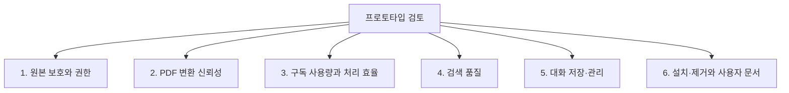

# Research Agent 개발 로드맵

[한국어](./ROADMAP.md) | [English](../en/ROADMAP.md)

[기술 설계](../README.md)

이 문서는 각 영역의 현재 상태와 다음 개발 목표를 관리한다. 동작 원리와 설계
근거는 기술 설계 문서에 기록하고, 이 문서에는 상태·한계·완료 기준만 남긴다.
완료 여부의 기준 문서는 이 로드맵이며, 날짜가 있는 측정과 실행 증거는
[실험 기록](../README.md#관련-설계와-검증-기록)에서 확인한다.

## 현재 작업 · 2026-09-27

**사용자와 합의한 다음 작업은 한글 설치 웹 가이드 완성이다.** 영문 캡처는
그다음에 진행한다. 작업을 재개할 때는
이 항목과 최신 대화부터 확인한다. 다른 마일스톤이 미완료라는 이유만으로 PDF
첨부 가이드나 하네스 확장 작업부터 새로 시작하지 않는다. 진행 기록은 이곳에서
갱신하고, 영문 로드맵은 이 항목을 참조한다.

- **작성 위치:** [웹 가이드](../../site/app.js), [영문 내용](../../site/content-en.js),
  [스타일](../../site/styles.css). 설치 명령은 [배포 설정](../../site/config.js)에 있다.
- **설치 단계 복사 영역 · 2026-09-27:** 2·4단계의 하단 고정 입력 영역을 없애고
  설명 → 읽기 전용 복사 상자 → 결과 캡처 → 다음 단계 순서로 배치했다.
  설치 명령은 전체를 표시하며 줄바꿈되어 보여도 복사할 문자열은 그대로다.
  4단계의 VS Code·CLI 도움말은 복사 상자 아래로 이동했다. 다른 기능 페이지의
  기존 하단 입력 영역은 유지한다. 한·영 표시, 단계 이동, 실제 복사된 설치
  명령과 한·영 질문, 390px 화면의 가로 넘침 없음을 로컬 브라우저에서 확인했다.
  JavaScript 구문·가이드 설치 명령 일치·변경 파일 검사를 통과했다. 자동 디자인
  점검의 기존 body overflow 경고는 남아 있으나 새 상자의 잘림은 없었다.
  이 배치 변경은 웹 가이드만 대상으로 하며 설치용 Release에는 영향을 주지 않는다.
- **폴더 선택 복구 · 개발본 구현:** 최종 연결 전 체크 목록에서 제외·추가할 수
  있게 했다. 안쪽 선택창을 취소하면 목록을 유지하며, 전체 취소는 이번 선택을
  등록하지 않는다. 주 Codex가 경로 없는 `source-add`를 호출하면 호스트에서
  선택만 받고, 확정한 경로만 기존 제한 실행기로 등록한다. 취소 시 저장 명령을
  호출하지 않고, 권한 오류를 우회하지 않는다. 터미널 재입력 대신
  “PDF 폴더 연결창 다시 열어줘”라는 요청을 안내한다. 기존 연결을 관리·삭제하는
  화면은 아니며, 창 전체를 닫으면 미확정 목록은 버린다.
  자동 테스트 94개와 실제 배포 압축 검사 1개를 통과했다. 실제 AppKit 객체의
  비표시 구성은 확인했지만,
  당시 에이전트 점검에서는 미리보기 앱을 열 수 없었고 활성화 요청도 실패했다. 실제 클릭,
  창 배치, 설치 후 실행과 Codex에서의 재열기는 아직 검증하지 않았다.
  [검증 기록](./experiments/safety-routing-validation.md#2026-09-26-폴더-선택-취소복구와-실행-경계)
  사용자 미리보기에서 확인된 중복 초기화 오류도 수정했다. 이미 `accessory`인
  앱에 같은 정책을 요청하면 `false`가 반환되지만 실제 정책은 정상이다.
  현재 정책을 기준으로 초기화를 생략·검증하도록 바꾸고, 호스트에서 창 표시
  없이 연속 초기화 `2 → 1 → 1` 및 관련 테스트 40개를 확인했다. 이후 사용자
  캡처로 빈 확인 목록과 `research-agent-test1/2/3`이 모두 체크된 확인 목록이
  표시되는 것을 확인했다. 선택 수 3개와 연결·추가·취소 버튼이 보이지만,
  등록 성공의 증거는 아니다. 체크 해제·취소·최종 등록과
  Codex 재열기의 전체 흐름은 아직 별도 확인이 필요하다. 오류에 전체 실행
  스크립트가 노출되는 것도 막았다.
- **이미 반영된 화면:** [터미널 검색](../../site/assets/screenshots/spotlight-terminal-crop.png),
  [터미널 실행](../../site/assets/screenshots/terminal-ready-crop.png),
  [설치 완료](../../site/assets/screenshots/install-complete-crop.png),
  [세 폴더 선택](../../site/assets/screenshots/folder-selection-crop.png),
  [개발본의 빈 폴더 확인 목록](../../site/assets/screenshots/folder-draft-empty-crop.png),
  [개발본의 세 폴더 확인 목록](../../site/assets/screenshots/folder-draft-confirmation-crop.png),
  [Research Agent 선택과 소개 응답](../../site/assets/screenshots/codex-introduction.png).
  실제 캡처를 한·영 시작하기 페이지에서 사용 중이다. 터미널 검색 화면은 2026-09-26 사용자가
  다시 제공한 선택 표시 없는 캡처로 교체했다. 원본에서 검색창과 터미널 앱
  결과만 잘랐으며, 개인 바탕화면과 검색 기록은 포함하지 않았다.
  빈 폴더 확인 목록은 사용자가 제공한 원본에서 창 부분만 잘라 픽셀과 색상
  프로필을 보존했다. ‘폴더 추가하기’ 버튼의 강조는 이미지 수정 없이 웹에서
  테두리를 덧씌우며, 개발본 화면과 안내용 강조임을 캡션에 명시한다.
  새로 받은 세 폴더 확인 목록도 3단계 마지막 위치에 반영했다.
  ‘이 폴더들 연결하기’ 버튼의 테두리는 웹 안내용으로만 표시한다.
  빈 목록 캡처의 한·영 표시, 390px 폭에서 가로 넘침 없이 유지되는 강조 위치,
  구문·가이드 일치 검사를 확인했다. 기존 body overflow 관련 자동 점검 경고는
  남아 있지만 새 강조는 이미지 안에 표시되며 가려지지 않았다.
- **최신 가이드 구성:** 사용자 요청에 따라 이전 ‘폴더 선택하기’ 안내창과
  ‘선택’ 버튼 이미지는 화면에서 제외했다. 3단계는 ‘연결할 폴더’의 추가 버튼
  → 폴더 선택 → 목록 확인과 최종 연결 순서이며, 각 설명 바로 아래에 해당
  이미지를 둔다. 기존 세 폴더 선택 캡처는 목록 부분만 예시로 재사용하고,
  마지막 확인 목록에는 사용자가 제공한 세 폴더 선택 상태의 실제 캡처를 넣었다.
  이 화면을 연결 완료 화면으로 설명하지 않는다. 취소·잘못 선택·오류와
  공개 버전의 화면 차이는 맨 아래 접힌 ‘문제가 생겼나요?’에 모았다.
  현재 설치 명령이 받는 v0.3.0에 새 화면이 아직 없다는 점은 본문에도 짧게
  명시한다. 이전 캡처 파일은 보존하지만 새 흐름의 이미지로 표시하지 않는다.
  한·영에서 새 순서와 이전 이미지 제외, 도움말의 기본 접힘·펼침 및 390px 폭의
  가로 넘침 없음을 확인했다. 구문·가이드 일치·변경 파일 검사도 통과했다.
- **이번에 완료:** 터미널 열기 → 설치하기 → 폴더 선택 → Codex에서 확인의
  4단계 안내를 한·영으로 작성했다. 설치 명령은 2단계, 첫 질문 문장은 4단계에
  표시한다. v0.3.0의 버튼식 폴더 선택·나중에 하기·취소·Codex 재시작 흐름을
  반영했고, 영문 안내에도 실제 한국어 버튼 이름을 표시했다. 기존 흰 배경과
  대화 형식은 유지했다. 사용자가 제공한 v0.3.0 재설치 화면에서 설치 완료
  메시지와 버튼식 폴더 연결 안내를 원본 픽셀 그대로 잘라 2·3단계에 반영했다.
  사용자가 ⌘ 키를 누른 채 한 번씩 클릭하여 여러 폴더가 선택되는 것을 확인했다.
  선택창 자체에 키 위치 → 폴더 이름 한 번씩 클릭 → 선택 확인의 번호 안내를
  넣었고, 두 번 클릭하면 선택이 끝날 수 있음을 한·영 웹 가이드와 사용자 문서에도
  반영했다. 터미널 안내는 선택창 안의 설명을 따르도록 바꿨다.
  3단계의 다중 선택 영역(`folder-selection`)에는 사용자가 제공한 동일 화면에서
  세 폴더가 선택된 부분과 확인 버튼 부분만 각각 잘라 연결했다. 개인 폴더 이름,
  바탕화면과 뒤쪽 터미널은 제외했다. 두 이미지가 같은 화면의 일부임을 한·영으로
  표시하며, 좁은 화면에서는 세로로 배치한다. 폴더 등록 완료의 증거로 쓰지 않는다.
  한·영 화면의 이미지 표시와 390px 화면의 세로 배치·가로 넘침 없음을 확인했다.
  원본과 두 크롭의 픽셀·색상 프로필 일치 및 가이드 일관성 검사도 통과했다.
  배포본 사용자를 위한 선택창 수동 활성화 방법을 한·영 안내에 덧붙였다.
- **선택창 초점 문제 · 개발본 사용자 확인 완료:** 사용자는 선택창 위쪽을 한 번 클릭해야
  첫 폴더부터 ⌘ 다중 선택이 된다고 확인했다. `app.activate()`만 추가한
  개발본도 같은 문제가 발생하여 해당 시도는 되돌렸다. 현재 개발본은 AppKit
  `NSOpenPanel`을 직접 구성하고, 호스트 앱의 `accessory` 정책과 활성화 요청
  후 기본 모달 처리로 표시한다. 새 폴더 생성은 허용하지 않는다. 추가 설치
  의존성은 없다. 2026-09-26 사용자가 등록 없는 개발본 미리보기에서 창을
  미리 클릭하지 않고 ⌘ 키를 누른 첫 클릭부터 다중 선택되는 것을 확인했다.
  확인 범위는 해당 Mac의 직접 미리보기이며, 설치 직후 자동 실행과 다른 Mac은
  별도 확인이 필요하다. v0.3.0과 사용자 설치본에는 반영하지 않았다.
- **Codex 소개 화면 · 사용자 캡처 확보:** 2026-09-27 사용자가 Research Agent가
  선택된 질문과 기능·시작 방법 안내 응답을 제공했다. 원본 이미지를 그대로
  4단계에 넣었고 영문 페이지에는 한국어 실제 화면임을 명시했다. 이 캡처는
  선택된 항목과 소개 응답을 보여주며, 스킬 선택 메뉴 자체나 PDF 저장 성공을
  증명하지 않는다. 사용자는 표시된 작업 요약에 README.md 읽기만 나온다고
  확인했다. 소개 안내 경로에 부합하지만 전체 도구 실행 기록을 확인한 것은
  아니다. 표시된 작업 시간은 1분 10초이며 지연 원인은 확인하지 않았다.
  일반 ChatGPT Instant 화면과 혼동된 사례를 반영해
  Codex → 로컬(Local) → @research 검색 순서를 한·영 가이드와 사용자 문서에
  명시했다. 일반 채팅 지원은 후속 검토이며 이번 작업에 포함하지 않는다.
  원본 캡처와 저장한 파일의 바이트 일치, JavaScript 구문·설치 명령 일치·변경
  파일 검사를 통과했다. 로컬 브라우저에서 4단계 직접 접근, 한·영 전환과
  이미지 전체 표시를 확인했다. 기존 body overflow 경고는 남아 있으며 이번
  변경에서는 스타일을 수정하지 않았다.
- **선택적 추가 캡처:** 스킬 선택 메뉴 자체와
  개발본의 ‘목록에 추가’ 선택창은 선택적 교체 항목이다. 현재는 이전 캡처의
  선택된 폴더 목록 부분을 예시로 재사용한다. 폴더가 추가된 확인 목록은 확보했다.
  사용자가 캡처를 제공하면 개인 정보와
  무관한 영역을 제외하고 해당 위치에 반영한다. 확보 전에는 빈 프레임을 유지한다.
- **소개 질문의 읽기 범위 · 개발본과 설치본 반영:** 소개만 요청하면 README의
  관련 절만 읽고 답하도록 분기를 앞에 뒀다. 실제 개인 스킬이 가리키는 설치본도
  사용자 동의 범위에서 지침 6개만 업데이트했다. 설치본의 기본 지침은 430줄에서
  89줄로 줄었으며, 실행 코드·설정·연구 자료는 그대로다. 구버전에는 새 폴더
  선택 전달기가 없으므로 관련 지침은 기존 방식으로 안내한다. 등록·배포 참조
  테스트 14개와 가이드 일치 검사를 통과했다. 대화 이력을 넘기지 않은 별도
  에이전트가 설치된 스킬·루트 확인·README 두 절만 읽고 소개하는 것을 확인했다.
  실제 사용자 세션 전체나 기존 대화의 갱신까지 검증한 것은 아니다.
  [검증 범위와 기본 검사 도구의 미실행 사유](./experiments/safety-routing-validation.md#2026-09-26-소개-질문의-읽기-범위와-설치본-반영)를
  기록했다. 공개 v0.3.0에는 아직 반영하지 않았다.
- **다음 재개 지점:** 4단계의 실제 소개 응답까지 채운 설치 가이드를 사용자와
  확인한다. 이후 사용자와 다음 기능 가이드의 촬영 순서를 정한다. 소개 응답
  캡처는 다시 요청하지 않는다. 확인 목록의 체크 해제·안쪽 취소·전체 취소와
  최종 등록, Codex에서 다시 열기는 별도 실제 검증으로 남긴다.
  이미 확보한 설치 완료·폴더 연결 안내·세 폴더 확인 목록 캡처는 다시 요청하지 않는다.
  새 목록에서 안쪽 선택창의 버튼은 “목록에 추가”이므로 기존 “선택” 버튼
  캡처는 가이드에서 제외했다. 직접 picker 미리보기는 등록하지 않는다.
- **확인한 범위:** 한·영 설치 명령 일치 검사, JavaScript 구문 검사와 변경
  파일 검사를 통과했다. 로컬 미리보기에서 단계 이동·언어 전환·단계 URL 직접
  접근·모바일 메뉴·기존 검색 화면을 확인했고 복사 버튼의 성공 응답을 확인했다.
  설치 동작은 v0.3.0 코드와 대조했다. 사용자가 기존 Mac에서 직접 재설치한
  캡처에서 설치 완료와 버튼식 안내창을 확인했다. 두 새 이미지의 원본 픽셀
  일치와 한·영 가이드 표시를 확인했으며, 새 Mac 설치 테스트는 수행하지 않았다.
  선택창·설치 안내·자료원 다중 등록 테스트 44개와 macOS 스크립트 컴파일
  검사를 통과했다. 모의 JXA 테스트는 활성화 정책과 호출 순서, 폴더 전용
  다중 선택·새 폴더 생성 금지, 경로 반환과 취소·오류를 확인한다. 실제 앱
  활성화나 첫 클릭 성공의 증거는 아니다. 첫 클릭 성공은 위 사용자 확인으로
  별도 기록했다. 실제 AppKit 클래스·상수의 존재만
  창을 열지 않고 확인했으며, ObjC 상수와 응답은 숫자로 정규화하여 비교한다.
  수정한 한·영 웹 문구는 로컬 브라우저에서 확인했다. 사용자의 새 캡처에서
  번호 안내의 줄바꿈과 세 폴더 동시 선택 표시를 확인했고, 잘린 두 이미지의
  픽셀과 색상 프로필이 원본과 동일함을 검사했다. UI 자동 검사에는 기존
  body overflow 관련 경고 1건이 남았으며 이번 변경에는 스타일 수정이 없다.
  폴더 연결 안내 캡처의 색상 차이 보고도 미해결이다. 원본·잘린 이미지의 픽셀과
  색상 프로필은 일치하며, 웹 표시 단계의 추가 확인이 필요하다.
- **완료 기준:** 실제 설치 동작과 안내가 일치하고, 한·영 전환과 명령 복사가
  동작하며, 남은 캡처와 검증하지 못한 항목을 구분한다.
- **2026-09-27 푸시 전 확인:** 폴더 선택·경로 전달·설치 안내·개인 등록·배포
  참조 검사 74개를 실행해 통과했다(배포 압축을 지정해야 하는 2개는 제외).
  한·영·웹 설치 명령 일치, 버전 일치, JavaScript 구문과 변경 파일 검사도
  통과했다. 독립 코드 리뷰에서 푸시를 막을 회귀는 발견되지 않았다. 이번 확인은
  실제 사용자 데이터나 설치본을 변경하지 않았으며, 실제 UI 전체 흐름을 증명하지 않는다.
- **배포 범위:** 폴더 선택 개선, 소개 질문의 읽기 범위, 설치 가이드 캡처와 관련
  문서는 2026-09-27 `ccaad6d`로 main에 푸시했고 Pages 배포 성공을 확인했다.
  같은 날 사용자가 위의 2·4단계 복사 영역 배치 변경도 main에 푸시하도록 요청했다.
  설치용 새 Release는 만들지 않았다.
  2026-09-26 설치된 사용자 사본에는 소개 분기와 작업별 스킬 지침 6개만 별도로
  반영했다. 설치본의 실행 코드·설정·연구 자료와 설치용 v0.3.0 Release 파일은
  변경하지 않았다. 새 선택창과 개선된 스킬의 공개 다운로드 반영은 다음 버전
  배포가 필요하다. 로컬 가이드의 추가 변경은 다음 푸시 후 공개된다.

## 전체 진행 상태

상태는 아래 표에서 관리한다. 그림은 점검할 영역을 보여준다.

```mermaid
flowchart TD
    R[프로토타입 검토] --> M1[1. 원본 보호와 권한]
    R --> M2[2. PDF 변환 신뢰성]
    R --> M3[3. 구독 사용량과 처리 효율]
    R --> M4[4. 검색 품질]
    R --> M5[5. 대화 저장·관리]
    R --> M6[6. 설치·제거와 사용자 문서]
```

| 영역 | 현재 상태 | 다음 개발 항목 |
| --- | --- | --- |
| 원본 보호와 권한 | 제한 저장 경로·읽기 전용 부모 기준 검증 완료 | 승인 모드별 부모·자식 실제 권한 확인 |
| PDF 변환과 시각 검토 | 검증 중 | 대표 PDF를 이용한 정확도 기준 확정 |
| 구독 사용량과 처리 효율 | 예비 측정 시작 | Plus·Pro 5x 동일 조건 사용량 측정 |
| 검색 | 범위·분배·추가 조회와 고정 개발 평가 구현 | 실제 연구 질문의 검증 세트 확장 |
| 대화 저장·관리 | 구현 및 기술 검증 완료 | 자연어 UX와 실제 검색 활용성 검증 |
| 설치와 제거 | 빈 임시 HOME 검증 완료 | 실제 새 Mac의 비개발자 설치 경험 검증 |
| 사용자 설명서 | 한글 README·영문 가이드와 한·영 웹 가이드 공개 | 기능별 실제 사용 캡처 보완과 비개발자 안내 검증 |
| 개발 문서와 배포 경계 | 개발·제품 설정 분리와 주제별 문서 구성 구현 | 실제 개발에서 필요한 문서만 읽는지, 변경·검증 누락이 줄어드는지 확인 |

## 마일스톤 1. 원본 보호와 권한 관리

[권한 설계](./permissions.md) · [검증 기록](./experiments/safety-routing-validation.md)

**상태: 제한 저장 경로·읽기 전용 부모 기준 검증 완료, 승인 모드별 추가 검증 필요**

### 완료된 결과

- Research Agent의 사용자 정의 에이전트는 읽기 전용 기본값을 선언하고, 설치 시
  `approval_policy = "never"`를 지정한다. 부모 런타임 설정이 기본값보다 우선할
  수 있으므로 자식 설정과 저장 실행기의 제한을 구분한다.
- 사용자 정책은 `Ask for approval`·`Approve for me` 사용 허용, Full access
  사용 금지다. 부모 읽기 전용은 추가 보호를 위한 선택이며 모드별 검증 완료를
  뜻하지 않는다.
- 저장 명령은 `knowledge/`와 `.research-store/`에만 쓸 수 있다.
- 원본 경로와 Research Agent 저장 경로의 포함 관계를 거부한다.
- 외부 경로, 심볼릭 링크와 하드 링크를 통한 쓰기를 거부한다.
- 실제 제한 권한 프로필에서 내부 저장은 허용되고 원본·실행 코드 쓰기는 차단되며
  원본이 유지되는 것을 확인했다.
- 전용 `CODEX_HOME`과 작업 디렉터리로 설정 스택을 분리해 프로젝트의 기존
  `sandbox_mode`가 저장 permission profile을 무효화하지 않게 했다.
- 부모 Codex 세션이 Full access이면 같은 권한이 하위 에이전트에 다시 적용될 수
  있어 Research Agent가 원본 보호를 보장하지 않음을 문서화했다.

### 다음 검증과 완료 기준

- `Ask for approval`·`Approve for me` 각각에서 실제 부모·자식 권한을 기록한다.
- 자식의 직접 쓰기와 전용 실행기의 쓰기를 분리해, 내부 저장 허용과 원본 쓰기
  거부를 임시 자료로 확인한다. 원본이 부모 작업공간 내부·외부에 있는 경우와
  승인 예외도 구분한다.
- 예상과 다른 권한 적용이 확인되면 구현이나 지원 조건을 수정하고, 검증하지 않은
  모드를 보호 보장에 포함하지 않는다.
- 자료원 등록·조회·해제의 위임과 허용 범위가 일치하고, 등록·해제가 내부 설정만
  바꾸며 원본과 기존 Markdown을 보존하는지 확인한다.

### 유지 조건

- 저장 경로가 추가될 때 제한 권한 프로필과 경로 검사를 함께 갱신한다.
- 설치 방식이 바뀔 때 실제 샌드박스 통합 테스트를 유지한다.
- 베타 permission profile과 하위 에이전트 권한 상속 동작이 Codex 업데이트에서
  바뀌는지 공식 문서와 실제 통합 테스트로 다시 확인한다.
- 원본을 수정하는 기능을 Research Agent에 추가하지 않는다.

## 마일스톤 2. PDF 변환 신뢰성 검증

[변환과 검토 설계](./pdf-conversion.md) · [첨부 PDF 저장](./attachment-import.md)

**상태: 검증 중**

### 현재 구현

- 폴더 등록 또는 대화 첨부를 통한 PDF 저장과 검색 등록
- `pypdf`를 이용한 페이지별 기본 텍스트 추출
- 페이지 번호를 보존하는 Markdown 표시
- 표·수식·그림·추출 실패 가능성이 있는 페이지 선별
- 선택된 페이지를 220 DPI 이미지로 렌더링
- Sol high를 이용한 시각 검토와 불확실성 표시
- 텍스트 저장 직후 별도로 시작하는 시각 검토 작업, 문서 범위 지정과 페이지별 재개
- PDF 해시가 바뀌면 오래된 검토 결과 저장 거부
- 현재 문서·페이지·버전의 비어 있지 않은 최종 노트와 검토 상태를 함께 저장
- PDF 동기화와 페이지 검토 저장을 위한 `document_operations` 저널
- 동기화 실행 간 `sync.lock` 직렬화와 페이지 검토의 프로젝트 쓰기 잠금
- 하위 프로세스 `os._exit` 강제 종료 뒤 Markdown·SQLite 상태의 자동 이어서 완료
- 강제 종료로 남은 프로젝트 내부 PDF 임시 복사본을 다음 동기화에서 정리
- 저널과 다른 외부 파일·DB 상태는 덮어쓰지 않고 복구 중단

### 확인된 한계

- 다단 문서의 읽기 순서와 특수 폰트가 깨질 수 있다.
- 기본 추출은 수식 구조, 표의 행·열 관계와 그림 의미를 보존하지 않는다.
- 규칙 기반 페이지 선별이 중요한 페이지를 놓칠 수 있다.
- `verified`는 현재 문서·페이지·버전의 최종 노트와 상태가 저장됐다는 뜻이다.
  노트의 의미상 정확성이나 실제 이미지 열람, 사람의 검증을 코드가 증명하지는 않는다.
- 이전 직접 호출 실험에서는 주 세션 → Luna → 주 세션 → Sol → 주 세션 → Luna
  흐름이 완료됐다. 현재 기본 흐름은 주 세션이 독립 검토기를 시작하는 방식이다.
  Luna가 Sol을 중첩 호출하는 방식은 지원되지 않았다.
- 백그라운드 검토기의 분리 실행과 재개는 시험했지만, 실제 논문에 대한 새 경로의
  Sol high 정확도와 Plus·Pro 한도 영향은 아직 검증 중이다.
- 강제 종료 복구 검증은 하위 프로세스의 `os._exit` 주입까지 완료했으며, 실제 Mac
  전원 차단이나 저장 장치 장애는 아직 검증하지 않았다.

### 다음 개발 항목

1. 일반 본문, 수식, 표·그림 중심의 대표 PDF를 각각 선정한다.
2. 사람이 먼저 검토 필요 페이지를 표시해 비교 기준을 만든다.
3. 현재 선별 규칙이 중요한 페이지를 놓치는지 확인한다.
4. 기본 추출과 Sol high 검토 결과를 원본 페이지와 비교한다.
5. 220 DPI로 판독하기 어려운 수식과 작은 표가 있는지 확인한다.
6. 결과를 바탕으로 OCR, 선별 규칙 개선 또는 파서 교체 필요성을 결정한다.

### 완료 기준

- 일반 본문에서 제목, 초록과 핵심 용어를 검색할 수 있다.
- 평가 문서에서 중요한 수식·표·그림 페이지의 누락 여부를 기록한다.
- 수식, 표와 그림별로 신뢰 가능한 범위와 원본 확인 조건을 문서화한다.
- `not-needed`, `verified`, `needs-review`의 의미가 실제 결과와 일치한다.
- 현재 파이프라인을 유지할지, 일부 변환기를 교체할지 근거를 가지고 결정한다.

### 이후 구조 개선 후보

현재 [`sync.py`](../../../src/research_store/sync.py)는 PDF 탐색, 변환, 페이지 선별,
렌더링과 검토 결과 저장을 함께 담당한다. 프로토타입에서는 흐름을 한곳에서
확인할 수 있다는 장점이 있다. 정확도 개선 과정에서 각 단계가 독립적으로 자주
변경되거나 테스트하기 어려워질 때 `parser`, `review detector`, `renderer` 역할을
분리한다. 파일 수를 늘리는 것 자체는 마일스톤의 목표로 삼지 않는다.

## 마일스톤 3. 구독 사용량과 처리 효율 검증

**상태: 예비 측정 시작**

[구독 사용량 실험 기록](./experiments/subscription-usage.md)

### 현재 판단

- Research Agent는 API 키가 아니라 사용자의 Codex 구독 사용량을 소비한다.
- Plus와 Pro 5x의 차이는 같은 작업의 정확도보다 사용할 수 있는 전체 한도에
  있다.
- 실제 사용량은 모델, 추론 수준, 컨텍스트, 도구 호출과 캐시에 따라 달라지므로
  PDF 페이지 수나 프롬프트 길이만으로 계산할 수 없다.
- 합성 진행 표시 통합 턴과 실제 1쪽 PDF 통합 경로의 작업 단위 토큰 수를 예비
  기록했지만, 실행 전후 구독 한도 변화와 Plus·Pro 비교 결과는 아직 없다.

### 다음 개발 항목

1. PDF 정확도 검증에 사용하는 동일한 문서 세트를 사용량 실험에도 사용한다.
2. Plus와 Pro 5x에서 모델, 추론 수준과 작업 지시를 동일하게 유지한다.
3. 실행 전후 `/status`와 사용량 대시보드의 5시간·주간 한도를 기록한다.
4. 첫 동기화, 변경 없는 재동기화, 일부 변경, 검색과 대화 저장을 분리해 측정한다.
5. Luna 작업과 Sol 시각 검토의 호출 수와 검토 페이지 수를 구분한다.
6. 측정 결과로 사용자에게 작업량을 언제 안내하고 나누어 처리할지 결정한다.

### 완료 기준

- Plus와 Pro 5x에서 동일한 핵심 시나리오를 각각 반복 측정한다.
- 문서 수, 전체 페이지 수와 시각 검토 페이지 수를 사용량 변화와 함께 기록한다.
- 변경 없는 재동기화가 불필요한 모델 작업을 만들지 않는지 확인한다.
- PDF 한 개와 시각 검토 페이지 한 개의 대략적인 사용량 범위를 설명할 수 있다.
- 남은 한도가 적을 때 기본 추출만 완료할지, 시각 검토를 나눌지 UX 원칙을
  결정한다.

## 마일스톤 4. 검색 품질과 지속 평가

[검색 설계와 근거 사용](./search.md)

**상태: 누락 회귀 수정과 고정 개발 평가 구현 완료**

- PDF·대화 범위 선택, 문서별 후보 보관과 분배, 구절 병합, 버전 확인 추가 조회를
  구현했다. 원본 경로 검사와 복구·잠금 흐름은 유지한다.
- [합성 평가 세트와 실행기](./experiments/search-evaluation.md)로 동일한 질문·근거·
  결과 제한을 유지하며 개선 전후를 비교한다.
- 다음 검증은 실제 연구 문서의 별도 질문 세트, Codex의 검색어 선택, 큰 저장소의
  검색·잠금 지연이다. 합성 개발 점수를 전체 검색 성능 보장으로 사용하지 않는다.
- 같은 단어가 있는데 밀리는 문제와 표현이 달라 못 찾는 문제를 구분한다. 후자가
  반복되면 키워드+벡터 실험을 같은 평가에 추가하며, 현재는 벡터·FTS5·LangChain을
  도입하지 않았다.

## 마일스톤 5. 대화 저장·관리와 사용 경험

**상태: 구현 및 기술 검증 완료, 자연어 사용 경험 검증 필요**

[대화 수명과 복구 설계](./conversation-memory.md) ·
[안전성과 라우팅 검증](./experiments/safety-routing-validation.md)

- 저장 범위 확인, 목록·상세 조회, revision을 확인하는 수정·삭제와 작업 저널을 구현했다.
- 장애 주입과 실제 동시 실행 검증 결과는 실험 기록에 남긴다. 이를 자연어 요청의
  정확도나 사용자 이해도 검증으로 확대하지 않는다.
- 다음 확인은 비개발자가 저장 범위를 고르고, 비슷한 제목의 기록을 구분하고,
  수정·삭제 결과를 이해할 수 있는지다.
- 완료 기준은 실제 사용 흐름에서 사용자 의도와 선택한 기록이 일치하고, 저장된
  대화와 PDF를 함께 검색했을 때 근거의 종류와 출처가 구분되는 것이다.

## 마일스톤 6. 설치·제거와 사용자 안내

**상태: 임시 HOME 설치·제거 검증 및 사용자 가이드 공개, 실제 새 Mac 사용 경험 확인 필요**

[설치 제거와 원본 보호](./permissions.md#설치-제거와-원본-보호) ·
[Release와 웹 가이드 배포](./releases.md)

- 한글 README, 영문 사용 안내와 한·영 웹 가이드를 공개했다. 웹 가이드는 기능별로
  이동할 수 있으며 아직 캡처가 준비되지 않은 화면은 준비 중으로 표시한다.
- 설치와 제거의 빈 임시 HOME 검증은 현재 Mac에서 실행한 결과다. 실제 새 Mac과
  개발 도구에 익숙하지 않은 사용자의 첫 설치까지 검증한 것은 아니다.
- 다음 작업은 [현재 작업](#current-work)에 기록한 설치 화면 캡처부터 보완한 뒤,
  실제 PDF 등록·첨부·검색·대화 관리 흐름의 캡처를 보완하고, 비개발자가
  안내만 보고 설치부터 첫 검색까지 수행하는지 확인하는 것이다.
- 완료 기준은 화면과 안내가 현재 제품 동작과 일치하고, 원본 보존·생성 자료의 위치·
  제거 범위를 사용자가 이해하며, 한글과 영문 안내의 설치 정보가 일치하는 것이다.
