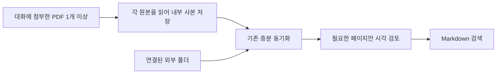

# 첨부 PDF 저장과 설치 안내

[한국어](./attachment-import.md) | [English](../en/attachment-import.md) | [기술 설계 목차](../README.md)

사용자는 PDF 한 개 또는 여러 개를 대화에 첨부하고 Research Agent에 바로
정리를 요청할 수 있다. 이 요청은 폴더 등록 없이 해당 PDF를 기존 검색 저장소에
추가하는 뜻이다. 단순 첨부나 명시적인 일회성 질문은 저장하지 않는다. 폴더
연결은 기존처럼 원본 위치의 변경을 확인하는 방식이다.

## 저장 단위와 복구

`import-pdf`는 `.research-store/imports/<SHA-256>/` 안에 `document.pdf`와
`metadata.json`을 함께 저장한다. 메타데이터는 형식 버전, 해시, 최초 파일 이름,
저장 시각, 바이트 크기, 제공된 경우 원래 경로를 기록한다. 원래 경로는 이력이며
다시 읽는 위치가 아니다. stdin으로 가져온 첨부에는 원래 경로를 기록하지 않는다.

임시 폴더에 두 파일을 기록하고 디렉터리 이름을 원자적으로 바꾸어 공개한다.
가져오기와 동기화는 같은 잠금을 사용한다. 공개 전 강제 종료된 임시 사본은
다음 가져오기 또는 동기화 때 정리한다. 공개 후 중단됐다면 완성된 사본을 그대로
사용한다. Markdown과 SQLite 갱신은 기존 동기화 저널이 담당한다.

각 첨부 저장 직후에는 반환된 문서 키로 `sync --imported-document <key>`를
호출하여 해당 PDF만 정리하고 검토한다. 여러 첨부는 서로 독립적으로 처리하며
한 파일이 유효하지 않아도 다른 파일의 결과는 유지한다. 같은 내용으로 중복된
문서 키는 한 번만 동기화한다. 일반 `sync`는 연결 폴더와 저장한 첨부를 모두
확인한다. 첨부 요청으로 관련 없는 전체 검토를 시작하지 않는다.

저장 사본은 외부 `[[sources]]`에 등록하지 않는다. 내부 전용 자료로 합쳐
동기화·페이지 렌더링·검토 결과 저장에 사용하며 기존 외부 경로 제한을 유지한다.
문서 키는 `import-<SHA-256>:<최초 파일 이름>`이다. 같은 내용은 최초 항목을
재사용하고, 다른 내용은 같은 이름이어도 새 항목이 된다. 외부 폴더 문서와
첨부 사본 사이에는 내용 기준 중복 제거를 적용하지 않는다.

Markdown에는 `source_kind: imported-pdf`, `original_filename`, `imported_at`,
`import_origin_path`, `stored_pdf`를 추가한다. 첨부 자료를 인용할 때는 내부
보관 PDF와 페이지를 근거로 사용한다. 임시 원본 경로가 존재한다고 가정하지 않는다.
사본이 조용히 변경되는 것을 막기 위해 동기화 때 내용 해시를 확인한다.

## 권한과 전달

기존 명령 샌드박스의 쓰기 범위는 `knowledge/`와 `.research-store/`로 유지한다.
일반 경로는 `import-pdf <path>`로 읽는다. 호스트 첨부는 설치된 실행기의
`import-pdf --attachment <절대 경로>`를 하나의 명령으로 호출한다. 전용
전달기가 사용자가 지정하고 현재 작업에서 읽도록 허용한 PDF 하나만 읽기 전용으로
열어 크기와 형식을 검사하고, 그 바이트를 기존 제한 명령의 stdin으로 전달한다.
파일 이름은 인자로 전달하며 셸 문자열로 실행하지 않는다. 원본 옆에 사본을
만들거나, 임시 디렉터리 전체 접근 권한을 설정에 추가하지 않는다.

이전 `cat PDF | 실행기` 지침은 실행 규칙이 파이프 전체를 하나의 허용 명령으로
처리한다고 가정했다. 파이프 방식은
`sandbox-exec: sandbox_apply: Operation not permitted`로 실패했다. 파일
전달을 실행기 내부로 옮긴 뒤에도 설치된 스킬의 **실제 리소스 경로**로 호출하면
같은 오류가 재현되었다. 설치 규칙은 당시 개인 스킬 링크 경로만 허용했기
때문이다. 이제 동일한 소유 실행기에 도달하는 개인 링크와 실제 리소스 경로
각각을 정확한 명령 접두사로 등록한다. 일반 경로나 원본 폴더의 쓰기 권한은
추가하지 않는다.

바이너리 입력은 EOF로 종료하며 대화 JSON의 텍스트 종료 표식을 쓰지 않는다.
낮은 수준의 `--stdin` 인터페이스는 유지하지만 에이전트에게 셸 파이프 조합을
생성하도록 지시하지 않는다. 이미 거부된 파일 읽기나 사용자 승인 거부를
우회하는 용도로 사용해서는 안 된다.

호스트가 읽을 수 있는 파일 경로를 노출하지 않거나 부모도 접근할 수 없다면
저장 성공을 주장하지 않는다. 접근 가능한 로컬 PDF 경로나 폴더 연결을 안내한다.
원본에 대한 쓰기 권한은 요청하지 않는다.

## 설치 안내

첫 대화형 macOS 설치가 성공한 뒤 **나중에 하기 / 폴더 선택하기** 안내창을
보여 준다. 폴더 선택은 기존 다중 선택 기능을 사용한다. 창 취소, GUI 오류,
폴더 등록 오류로 이미 끝난 설치가 실패로 바뀌지 않는다. 자동 실행에서는
창을 띄우지 않고 나중에 폴더를 추가하는 방법을 출력한다.

## 현재 범위와 검증

- 암호화된 PDF와 256 MiB 초과 첨부는 거부한다. 저장만 완료된 상태와
  변환·시각 검토가 끝난 상태는 구분한다.
- 원본의 이후 변경은 자동 반영하지 않는다. 내부 사본을 외부에서 삭제하거나
  변조하면 실패로 알리며, 재가져오기로 임의 복구하거나 덮어쓰지 않는다.
- Research Agent 전체 제거에는 내부 첨부 사본도 포함된다. 첨부 항목만
  따로 지우는 명령은 아직 제공하지 않는다.
- 자동 테스트는 원본 보존, 여러 첨부의 독립 처리, 중복·동시 저장, 공개 전후 강제 종료 복구,
  첨부 경로 소멸 뒤 검색·렌더링·검토, 잘못된 파일과 링크 거부를 확인한다.
- 별도 선택 실행 테스트는 실제 개인 스킬 실행기와 기존 권한 프로필로 stdin
  가져오기, 임시 경로 직접 접근 차단, 원본 쓰기 차단을 확인한다. 이는 명령
  수준 검증이며 모든 Codex UI의 실제 첨부 전달이나 모델 호출을 검증하지 않는다.
- 안내창은 모의 응답과 macOS 스크립트 컴파일로 검사한다. 실제 설치 화면과
  Codex 첨부 UX 확인은 별도 사용자 시험이다.

## 책임별 구현 파일

| 책임 | 파일 |
| --- | --- |
| 첨부 사본과 메타데이터, 중복 처리·복구 | [imports.py](../../../src/research_store/imports.py) |
| 단일 호출에서 허용된 첨부 바이트 전달 | [import_attachment.py](../../../scripts/import_attachment.py) |
| 경로·바이너리 입력 명령 | [cli.py](../../../src/research_store/cli.py) |
| 기존 변환·검토와 연결 | [sync.py](../../../src/research_store/sync.py) |
| 사용자 의도와 에이전트 작업 안내 | [SKILL.md](../../../resources/skills/research-library/SKILL.md) |
| 설치 이후 선택 흐름 | [install_onboarding.py](../../../scripts/install_onboarding.py) |
| macOS 버튼과 다중 폴더 선택 | [picker.py](../../../src/research_store/picker.py) |
| 저장·복구 검증 | [test_pdf_import.py](../../../tests/test_pdf_import.py) |
| 실제 실행기 권한 검증 | [test_import_permission_integration.py](../../../tests/test_import_permission_integration.py) |
