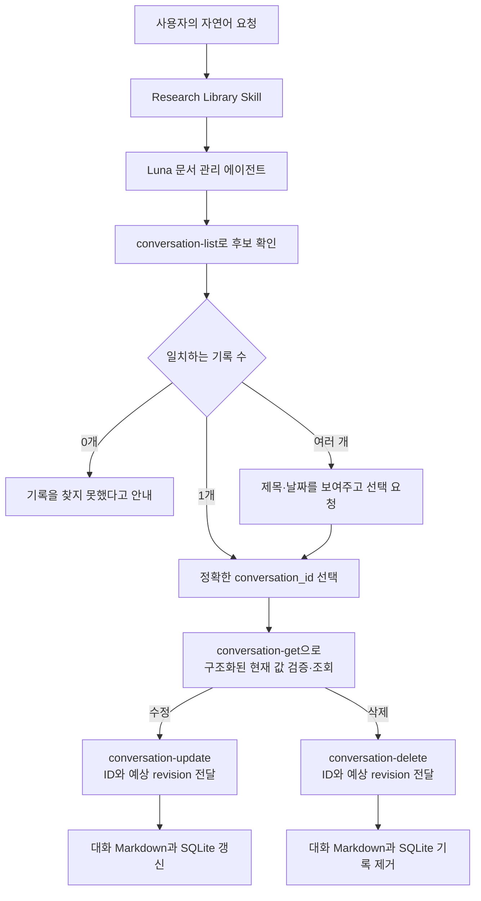
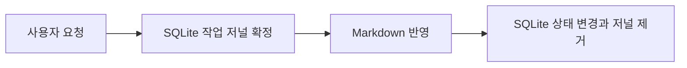

# 대화 저장과 연구 기억의 수명

[한국어](./conversation-memory.md) | [English](../en/conversation-memory.md) | [기술 설계 목차](../README.md) · [개발 로드맵](./ROADMAP.md)

## 목차

- [설계 목표](#설계-목표)
- [사용자 요청과 내부 명령](#사용자-요청과-내부-명령)
- [대화 기록의 식별과 변경 이력](#대화-기록의-식별과-변경-이력)
- [수정할 수 있는 내용](#수정할-수-있는-내용)
- [삭제의 범위](#삭제의-범위)
- [대화 작업 저널과 중단 복구](#대화-작업-저널과-중단-복구)
- [현재 범위와 한계](#현재-범위와-한계)
- [검증 기준](#검증-기준)
- [책임별 구현 파일](#책임별-구현-파일)

## 설계 목표

저장된 대화는 원래 Codex 대화의 복사본이 아니라 사용자가 선택한 범위를
Research Agent의 검색 가능한 연구 기억으로 만든 기록이다. 사용자는 자연어로
기록을 찾고 검색용 정리 정보를 수정하거나 더 이상 필요하지 않은 기록을 삭제할
수 있어야 한다.

수정과 삭제는 Research Agent가 소유한 대화 기록에만 적용한다. 원본 PDF, PDF에서
생성된 Markdown, 다른 대화 기록과 Codex 앱의 실제 대화에는 영향을 주지 않는다.

## 사용자 요청과 내부 명령

사용자는 터미널 명령이나 대화 ID를 미리 알 필요가 없다. 어느 Codex 프로젝트에서든
다음과 같이 자연어로 요청한다.

```text
“저장한 대화 목록을 보여줘.”
“지난번 굴절률 보정 대화의 요약과 태그를 수정해줘.”
“레이저 실험 대화로 저장한 기억을 삭제해줘.”
```



`conversation-list`, `conversation-get`, `conversation-update`,
`conversation-delete`는 스킬과 문서 관리 에이전트가 사용하는 내부 명령이다.
에이전트가 Markdown이나 SQLite를 직접 수정하지 않고, 경로와 파일 연결을
검사하는 제한된 명령을 통해서만 조회하고 변경한다.

`conversation-list`는 별도 입력 없이 저장된 각 기록의 ID, 제목, 범위, 최초·최근
저장 시각, 개정 번호, 태그, 별칭과 내부 경로를 반환한다. 이 목록은 사용자에게
터미널 출력을 그대로 보여주기 위한 것이 아니라 자연어 요청에 맞는 후보를 정확히
고르기 위한 색인이다.

정확한 ID를 고른 뒤 `conversation-get <conversation-id>`으로 그 기록을 다시
검증한다. 이 명령은 Markdown과 SQLite의 경로, ID, 스키마, revision과 시각이
서로 맞는지 확인하고 다음 내용을 구조화된 JSON으로 반환한다.

- v3 기록의 수정 가능한 아홉 필드 전체인 `editable`
- 현재 `revision`과 `updated_at`
- 변경할 수 없는 범위, 최초 저장 시각과 원문 보존 정보

선택 범위 원문은 반환하지 않는다. 조회는 SQLite를 읽기 전용 모드로 열며
Markdown이나 데이터베이스의 내용과 수정 시각을 바꾸지 않는다. 따라서 부분
수정에 필요한 현재 값을 얻기 위해 Markdown 본문을 다시 해석할 필요가 없다.

v1·v2 기록은 구조화된 수정 원본이 없으므로 `migration_required: true`와
`editable_candidate`를 반환한다. 이전 Markdown은 여러 목록 항목과 한 항목의
여러 줄을 항상 구분할 수 없다. 따라서 에이전트는 아홉 필드 후보 전체를
사용자에게 보여주고 확인하거나 고치게 한 뒤에만
`--confirm-legacy-promotion`으로 첫 v3 수정을 수행한다. 확인 플래그가 없는 이전
형식 수정은 파일과 SQLite를 바꾸지 않고 거부한다.

이전 본문의 구조가 모호하거나 잘못되어 정리 후보조차 만들 수 없으면 수정과
승격은 중단한다. 사용자가 그 기록의 삭제를 요청한 경우에만 목록을 즉시 다시
읽고, 정확한 ID에 표시된 최신 revision을 삭제 명령에 전달한다. 삭제 명령은 수정
가능한 본문을 해석하지 않고도 Research Agent가 소유한 경로, 변경 불가 메타데이터,
ID와 revision을 다시 검사하므로 해석할 수 없는 이전 기록도 안전하게 정리할 수
있다. 이 예외 흐름은 수정에는 사용하지 않는다.

제목, 태그와 별칭만으로 사용자가 설명한 기록을 찾기 어려우면 통합 검색에서 대화
결과만 고른 뒤, 검색 결과의 경로를 목록의 경로와 대조해 정확한 ID를 얻는다.
필요하면 소수의 후보 ID에 `conversation-get`을 호출한다. 검색 결과나 제목만
보고 ID를 추측하지 않는다.

후보가 하나면 사용자의 요청을 그대로 수행한다. 같은 제목이나 비슷한 설명의
후보가 여러 개일 때만 제목, 저장 시각과 ID를 보여주고 어느 기록인지 묻는다.
제목이나 파일 경로만으로 수정하거나 삭제하지 않는다.

## 대화 기록의 식별과 변경 이력

대화를 처음 저장할 때 내용에서 만든 고유한 `conversation_id`를 부여한다. 제목,
요약이나 태그를 수정해도 이 ID는 바뀌지 않는다. 여러 기록이 같은 제목을 가질 수
있으므로 이후의 수정과 삭제는 항상 이 ID를 기준으로 수행한다.

```yaml
id: conversation-20260921-...
created_at: 2026-09-21T10:00:00+09:00
updated_at: 2026-09-21T14:30:00+09:00
revision: 2
```

| 필드 | 의미 |
| --- | --- |
| `id` | 기록을 처음 만든 뒤 유지되는 안정적인 식별자 |
| `created_at` | 최초 저장 시각이며 수정하지 않음 |
| `updated_at` | 검색용 정리 정보를 마지막으로 수정한 시각 |
| `revision` | 최초 저장은 1이며 수정이 성공할 때마다 1씩 증가 |

조회 명령이 반환한 현재 `revision`은 동시에 실행되는 다른 Codex 작업으로부터
기록을 보호하는 조건으로도 사용한다. 문서 관리 에이전트는 수정과 삭제 명령에
사용자가 볼 필요 없는 `--expected-revision <N>` 값을 함께 전달한다.

두 작업이 같은 기록의 revision 2를 확인한 뒤 한 작업이 먼저 수정해 revision 3을
만들었다면, 다른 작업이 revision 2를 기준으로 보낸 수정이나 삭제는 거부된다.
Markdown과 SQLite 어느 쪽도 바꾸지 않는다. 에이전트는 목록과 구조화된 기록을
다시 조회해 최신 값으로 요청을 구성하며, 오래된 JSON이나 revision을 재사용하지
않는다. 이를 통해 한 프로젝트의 작업이 다른 프로젝트에서 방금 수정한 내용을
조용히 덮어쓰거나 삭제하는 일을 막는다.

## 수정할 수 있는 내용

수정은 저장된 원문을 다시 쓰는 기능이 아니라, 검색과 재사용을 위해 만든 정리
정보를 바로잡는 기능이다.

| 수정 가능 | 수정 불가 |
| --- | --- |
| 제목 | 선택 범위 원문 |
| 검색용 요약 | 저장 범위 `scope` |
| 태그와 별칭 | 최초 저장 시각 `created_at` |
| 사용자의 생각 | 대화 ID |
| 결정된 사항 | 원문 보존 상태와 누락 설명 |
| 검증되지 않은 생각 | 원본 PDF와 PDF Markdown |
| 미해결 질문 | Codex 앱의 실제 대화 |
| 관련 문서 정보 |  |

`conversation-update <conversation-id> --expected-revision <N>`은 표준 입력으로
모든 수정 가능 필드를 포함한 하나의 JSON 객체를 받는다. 사용자가 일부 항목만
바꾸라고 요청하면 문서 관리 에이전트가 `conversation-get`이 반환한 `editable`
객체에서 시작해 변경하지 않을 필드까지 채운 완전한 객체를 만든다. 이전 형식은
사용자가 확인한 `editable_candidate`에서 시작한다. 필드가 빠지거나 알 수 없는
필드 또는 원문·범위 같은 수정 불가 필드가 포함되면 명령은 변경 없이 거부한다.

정확한 키는 `title`, `summary`, `tags`, `aliases`, `user_points`, `decisions`,
`unverified`, `open_questions`, `related_documents` 아홉 개다.

변경된 Markdown은 안전하게 교체되고 SQLite의 제목·태그 같은 조회 정보도 이어서
갱신된다. 일반적인 쓰기 오류가 발생하면 가능한 범위에서 두 변경을 모두
원상복구한다. 따라서 성공한 수정의 제목과 요약은 다음 검색부터 바로 사용된다.

새 기록은 Markdown 스키마 v3으로 저장된다. v3 frontmatter의 `editable` 객체가
아홉 필드를 줄바꿈까지 정확히 보존하며, 본문은 사람이 읽고 검색하기 위한 표현을
유지한다. 선택 범위 원문에는 SHA-256을 기록해 수정 전 검증하고, 업데이트할 때는
기존 원문 텍스트 블록을 그대로 보존한다. 읽을 수 있는 v1·v2 기록은 정리 후보를
반환하며, 사용자가 전체 후보를 확인한 첫 수정이 성공하면 v3으로 승격된다. 본문
구조 자체가 해석 불가능한 이전 기록은 수정하지 않는다. 삭제 요청에는 방금 다시
읽은 목록의 revision을 사용하고, 제한된 삭제 명령이 소유권과 변경 불가 정보를
검증한 뒤 삭제할 수 있다.

선택 범위나 원문을 잘못 저장했다면 기존 원문을 편집해 실제 대화와 다른 기록을
만들지 않는다. 해당 기록을 삭제하고 올바른 범위를 다시 저장한다.

## 삭제의 범위

`conversation-delete <conversation-id> --expected-revision <N>`은 정확한 ID와
`conversation-get`에서 확인한 revision이 모두 일치할 때 다음 두 항목을 영구적으로
제거한다. 본문을 해석할 수 없는 이전 기록에 한해서는 삭제 직전에 다시 읽은 목록의
revision을 사용한다.

```text
knowledge/conversations/ 아래의 해당 Markdown
.research-store/library.sqlite 안의 해당 대화 기록
```

삭제하지 않는 항목은 다음과 같다.

- Codex 앱에 남아 있는 실제 대화 세션
- 원본 PDF와 원본 디렉터리
- PDF에서 생성된 Markdown과 시각 검토 기록
- 다른 저장 대화

현재 프로토타입은 삭제한 대화 기록을 보관하는 휴지통이나 실행 취소 기능을
제공하지 않는다. 대상 Markdown이 존재할 때 삭제 명령은 그 파일이 Research
Agent의 대화 저장 영역 안에 있고, SQLite 경로와 Markdown 내부 ID가 요청한 ID와
일치할 때만 실행된다.
심볼릭 링크, 하드 링크, 경로 이탈 또는 ID 불일치가 발견되면 아무것도 삭제하지
않고 오류를 반환한다.

목록이 `available: false`를 반환하면 Markdown은 이미 사라진 상태다. 이때 수정은
원문과 메타데이터를 검증할 수 없어 거부한다. 삭제는 안전한 대화 저장 경로,
정확한 ID와 revision이 일치하면 남은 SQLite 기록만 정리하고, 삭제할 Markdown이
이미 없었다는 사실을 결과에 표시한다.

## 대화 작업 저널과 중단 복구

저장된 대화는 사람이 읽고 검색하는 Markdown과 대화 ID·경로·revision을 관리하는
SQLite에 함께 기록된다. 두 저장소는 하나의 파일 시스템 트랜잭션으로 변경할 수
없으므로, 파일 변경 도중 프로세스가 종료되면 두 상태가 달라질 수 있다.

Research Agent는 저장·수정·삭제 전에 SQLite에 작업 의도와 변경 전후 상태를
확정한다.



작업 도중 프로세스가 종료되면 다음 대화 목록·조회·검색·변경 작업이 남은 저널을
확인하고 승인된 작업을 앞으로 이어서 완료한다. 현재 Markdown이나 SQLite가
기록된 변경 전후 상태와 모두 다르면 외부 변경으로 판단해 자동으로 덮어쓰지
않는다.

이 구조는 실행 상태를 DB에 영구적으로 남긴다는 점에서
[Airflow 메타데이터 DB](https://airflow.apache.org/docs/apache-airflow/stable/concepts/overview.html)와
같은 원리를 사용한다. 다만 DAG와 Task 전체를 조정하는 Airflow와 달리, Research
Agent의 저널은 Markdown과 SQLite 사이의 대화 작업 한 건을 복구하기 위한 작은
작업 의도 기록이다. 구현 패턴으로는 전체 워크플로 메타데이터 시스템보다 작업
저널이나 transactional outbox에 가깝다.

프로세스 간 잠금은 같은 저장소에서 대화 작업이 동시에 파일을 변경하지 못하게
하고, revision 검사는 오래된 조회 결과로 최신 기록을 덮어쓰지 못하게 한다. 같은
revision을 대상으로 한 실제 동시 수정에서는 하나만 성공하고 다른 하나는 변경
없이 거부됐다.

## 현재 범위와 한계

- 저장하지 않은 과거 대화는 목록·수정·삭제할 수 없다.
- 실제 Codex 대화 세션을 수정하거나 삭제하는 기능이 아니다.
- 여러 Codex 프로젝트에서 저장한 대화가 하나의 저장소에 함께 있으므로 비슷한
  제목의 기록은 날짜와 ID로 구분해야 할 수 있다.
- 수정 이력은 현재 `revision`과 마지막 수정 시각만 보존하며, 이전 버전의 전체
  내용을 별도로 보관하지 않는다.
- 삭제에는 휴지통이나 복원 기능이 없다.
- 대화 원문의 일부만 고쳐 쓰는 기능은 제공하지 않는다. 원문이나 저장 범위가
  잘못됐다면 삭제 후 다시 저장한다.
- 대화 저장은 `conversation_operations`, PDF 동기화와 시각 검토 저장은
  `document_operations`라는 별도 저널을 사용한다. 각 기능의 다음 읽기·변경 명령이
  자신에게 남은 작업을 먼저 복구한다.
- 강제 종료 검증은 하위 프로세스에 `os._exit`를 주입한 범위이며 실제 Mac 전원
  차단이나 저장 장치 장애를 검증한 것은 아니다.
- 최초 ID에는 처음 저장한 제목, 시각과 원문이 반영된다. 제목을 수정한 뒤 같은
  원문을 수정된 제목으로 다시 저장하면 별도 기록이 생길 수 있다.

## 검증 기준

- 자연어 요청으로 저장된 대화 목록을 확인할 수 있다.
- 하나의 후보가 명확하면 추가 선택 없이 정확한 ID로 수정하거나 삭제한다.
- 후보가 여러 개면 변경 전에 사용자가 정확한 기록을 선택할 수 있다.
- 수정해도 ID, 원문, 범위와 최초 저장 시각이 바뀌지 않는다.
- 조회가 Markdown과 SQLite의 바이트 및 수정 시각을 바꾸지 않는다.
- v3에서는 여러 줄과 Markdown 제목처럼 보이는 수정 값도 조회 시 정확히 복원된다.
- LF, CRLF와 단독 CR이 섞인 저장 원문도 바이트 단위 줄바꿈을 보존한다.
- v1·v2 기록은 사용자 확인 플래그 없이 자동 승격되지 않는다.
- 해석할 수 없는 v1·v2 본문은 수정하지 않으며, 삭제 요청에는 최신 목록 revision과
  제한된 삭제 검증을 사용한다.
- 수정할 때 `revision`이 증가하고 `updated_at`이 갱신된다.
- 수정된 정리 정보가 다음 검색 결과에 반영된다.
- 삭제하면 해당 Markdown과 SQLite 기록만 사라져 검색 결과에 나타나지 않는다.
- 수정과 삭제가 PDF 자료, 다른 대화와 실제 Codex 대화에 영향을 주지 않는다.
- 오래된 revision으로 보낸 수정과 삭제는 아무 변경 없이 거부된다.
- 지원하지 않는 미래 Markdown 버전과 Markdown·SQLite revision 불일치는 변경
  없이 거부된다.
- 조작된 경로, 링크와 ID 불일치는 변경 없이 거부한다.
- 파일 반영 전후 하위 프로세스에 `os._exit`를 주입해도 다음 작업에서
  저장·수정·삭제가 한 상태로 복구된다.
- 같은 revision을 대상으로 동시에 수정하면 하나만 성공하고 다른 하나는 오래된
  revision으로 거부된다. 대화 잠금 대기 중 조회가 부분 상태를 반환하지 않는다.

## 책임별 구현 파일

| 책임 | 구현 파일 |
| --- | --- |
| 대화 저장·수정·삭제 절차 | [`conversations.md`](../../../resources/skills/research-library/references/conversations.md) |
| 자연어 요청을 대화 목록·조회·수정·삭제 흐름으로 연결 | [`research-library/SKILL.md`](../../../resources/skills/research-library/SKILL.md) |
| Luna가 후보를 식별하고 제한된 명령을 호출하는 원칙 | [`research-library-manager.toml`](../../../resources/agents/research-library-manager.toml) |
| 대화 저장 형식, 허용된 수정과 안전한 삭제 | [`conversations.py`](../../../src/research_store/conversations.py) |
| 대화 작업 저널과 상태 관리 | [`state.py`](../../../src/research_store/state.py) |
| 프로세스 간 대화 저장소 잠금 | [`locking.py`](../../../src/research_store/locking.py) |
| 내부 대화 관리 명령의 입력과 출력 | [`cli.py`](../../../src/research_store/cli.py) |
| 대화 수명과 원본 보존 검증 | [`test_conversation_management.py`](../../../tests/test_conversation_management.py) |
| 강제 종료 복구와 실제 동시 실행 검증 | [`test_conversation_recovery.py`](../../../tests/test_conversation_recovery.py), [`test_state_journal.py`](../../../tests/test_state_journal.py), [`test_sync_concurrency.py`](../../../tests/test_sync_concurrency.py) |
| 파일 교체·동기화 실패 주입 검증 | [`test_safety_failures.py`](../../../tests/test_safety_failures.py) |
