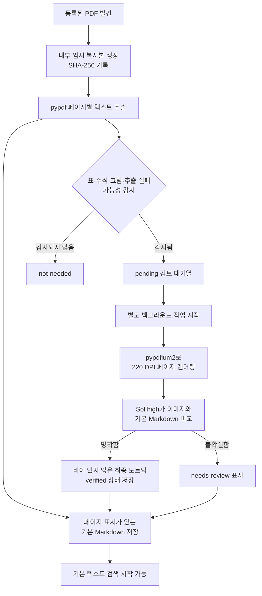
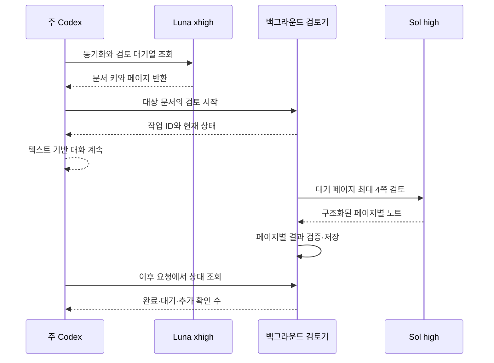

# PDF 변환 과정과 결과의 신뢰성

[한국어](./pdf-conversion.md) | [English](../en/pdf-conversion.md) | [기술 설계 목차](../README.md) · [개발 로드맵](./ROADMAP.md)

## 목차

- [설계 목표](#설계-목표)
- [변환 흐름](#변환-흐름)
- [기본 텍스트 추출](#기본-텍스트-추출)
- [시각 검토 대상 선별](#시각-검토-대상-선별)
- [Sol high 시각 검토](#sol-high-시각-검토)
- [검토 결과 저장 스키마와 현재 대기열](#검토-결과-저장-스키마와-현재-대기열)
- [주 Codex와 백그라운드 검토기의 역할](#주-codex와-백그라운드-검토기의-역할)
- [검토 상태의 의미](#검토-상태의-의미)
- [용도별 신뢰 범위](#용도별-신뢰-범위)
- [책임별 구현 파일](#책임별-구현-파일)

## 설계 목표

PDF 변환의 목적은 원본과 동일한 편집용 문서를 다시 만드는 것이 아니다.
Research Agent는 먼저 **검색과 내용 발견에 사용할 페이지별 텍스트 색인**을
만들고, 수식·표·그림처럼 정확성이 중요한 페이지만 이미지로 다시 확인한다.

기본 추출 결과와 시각 검토 결과를 구분해 보존하므로 사용자는 검색 결과가
단순 텍스트 추출에서 나온 것인지, 원본 페이지 이미지로 다시 확인된 것인지
판단할 수 있다.

## 변환 흐름



## 기본 텍스트 추출

`pypdf`가 PDF 안에 저장된 글자를 페이지별로 읽는다. 각 페이지 앞에는 다음과
같은 표시를 추가한다.

```markdown
<!-- page: 3 -->

페이지에서 추출한 텍스트
```

이 결과는 Markdown 문법으로 논문의 구조를 완전히 재구성한 문서가 아니다.
제목, 본문, 수식, 표를 의미 단위로 복원하기보다 검색 가능한 텍스트를 페이지
단위로 저장한 것이다.

텍스트가 들어 있는 일반 영문 PDF에서는 제목, 초록, 본문의 주요 용어를 찾는
용도로 사용할 수 있다. 다음 요소는 기본 추출만으로 신뢰하기 어렵다.

- 다단 문서의 정확한 읽기 순서
- 줄바꿈과 하이픈으로 나뉜 단어
- 수식의 위첨자, 아래첨자, 분수와 특수 기호
- 표의 행·열 관계와 병합된 셀
- 그림, 그래프, 범례와 축의 의미
- 특수 폰트로 인코딩된 글자
- 이미지로만 저장된 스캔 문서

## 시각 검토 대상 선별

기본 추출 단계는 다음 특징을 가진 페이지를 시각 검토 대상으로 등록한다.

- `Table`, `Figure`, `Equation` 또는 이에 대응하는 한국어 표현
- 수학 기호가 많은 페이지
- 등식 형태의 짧은 줄이 여러 개 있는 페이지
- PDF 내부 이미지가 포함된 페이지
- 추출된 텍스트가 매우 적은 페이지

이 선별은 규칙 기반 후보 탐지다. 검토가 필요 없는 페이지를 포함할 수 있고,
캡션이 없는 벡터 도표나 인식되지 않은 수식처럼 중요한 페이지를 놓칠 수도
있다. 따라서 `not-needed`는 정확성이 검증됐다는 뜻이 아니라 현재 규칙이 검토
필요성을 발견하지 못했다는 뜻이다.

## Sol high 시각 검토

현재 이미지 검수 기본값은 Sol high다. 아래의 과거 실험에서 사용한 ultra 기록은 당시 조건을 보존한다.

텍스트 동기화가 끝나면 `research-review start`가 별도 작업을 시작하며 주 대화는
곧바로 사용할 수 있다. 검토기는 같은 문서에서 최대 4쪽씩 이미지와 추출문을 Sol
high에 보내고, 응답 형식과 페이지 번호를 검증한 뒤 기존 `review-complete`로 한
쪽씩 저장한다. 첨부 PDF 요청은 방금 저장한 문서 키만 넘겨 다른 자료의 대기열을
함께 처리하지 않는다. 실행 중 새 요청이 오면 해당 문서 키를 작업 범위에 합친다.
`needs_review`는 자동 반복하지 않고 추가 확인 대상으로 남긴다.

검토 대상으로 선택된 페이지만 220 DPI PNG로 렌더링한다. 시각 검토 에이전트는
페이지 이미지와 기본 Markdown을 함께 보고 다음 정보를 검토 노트로 작성한다.

- 명확하게 읽히는 수식의 LaTeX 표현
- 구조가 단순한 표의 Markdown 표현
- 그림의 구성, 축, 범례와 확인 가능한 관계
- 기본 텍스트 추출에서 확인된 오류
- 끝까지 판독할 수 없는 기호, 셀 또는 배치

시각 검토 결과는 기본 추출문을 덮어쓰지 않고 `Visual verification notes`에
추가한다. 불명확한 값을 추측하지 않으며, 확신할 수 없으면 `needs-review`로
남긴다.

렌더링할 때 사용한 PDF와 결과를 저장할 때의 PDF가 같은지도 SHA-256으로
확인한다. 해시가 달라지면 오래된 페이지 이미지를 기준으로 만든 검토 결과를
저장하지 않는다.

## 검토 결과 저장 스키마와 현재 대기열

시각 검토의 기본 저장 단위는 **PDF 페이지 하나**다. 여러 페이지 이미지를 한 번에
렌더링하거나 문맥을 위해 함께 볼 수는 있지만, `review-complete`에는 페이지를
하나만 전달하고 결과도 페이지별로 저장한다. 이 규칙은 SQLite 상태 행과
Markdown 검토 블록의 단위를 일치시켜 한 페이지만 수정하거나 다시 검토할 때 다른
페이지의 설명을 분리할 필요가 없게 한다.

| 저장 위치 | 저장 단위 | 식별자 또는 역할 |
| --- | --- | --- |
| SQLite `documents` | PDF 문서 하나당 한 행 | `document_key`로 문서와 생성된 Markdown 연결 |
| `knowledge/documents/` | PDF 문서 하나당 Markdown 한 파일 | 기본 페이지 추출문과 모든 시각 검토 블록 보존 |
| SQLite `page_reviews` | 검토 후보 페이지 하나당 한 행 | `(document_key, page_number)`가 기본 식별자 |
| Markdown 시각 검토 블록 | 검토한 페이지 하나당 한 블록 | `visual-review-pages: N`으로 페이지 식별 |
| Markdown frontmatter 목록 | PDF 문서 하나당 두 목록 | 최초 후보와 현재 대기 페이지 구분 |

SQLite의 `page_reviews`는 검토 이유, `pending`·`verified`·`needs_review` 상태,
검토 시각, 모델 감사 라벨과 선택적인 내부 노트를 관리한다. 현재 대기열의 기준은
SQLite다. Markdown 블록은 사람이 읽고 검색할 수 있는 실제 시각 검토 설명과
PDF 해시 등의 출처 정보를 보존한다. 문서 정체성과 PDF 버전은 SQLite 문서 행,
Markdown frontmatter와 현재 원본의 SHA-256이 서로 일치하는지 저장 전에 검증한다.

`verified`로 완료하려면 `--visual-notes-stdin`으로 해당 페이지의 **비어 있지 않은
최종 Markdown 검토 노트**를 제출해야 한다. SQLite에 남기는 짧은 `--notes` 메모는
이를 대신하지 못한다. `complete_reviews`는 `verified` 요청의 `visual_notes=None`,
빈 문자열 또는 공백만 있는 노트를 저널 복구나 저장 변경보다 먼저 거부한다.
노트가 있어도 기존의 문서·페이지 식별과 현재 PDF 버전 검사는 그대로 통과해야
하며, 최종 노트와 페이지 상태는 아래의 같은 저널 작업으로 저장한다.

같은 페이지를 다시 검토하면 기존 페이지 블록을 새 결과로 교체하고 다른 페이지
블록은 보존한다. 이전 형식에서 같은 단일 페이지 제목이 여러 번 추가된 문서는
다음 교정 때 중복 블록을 하나로 합친다. 페이지 단위 스키마 이전에 만들어진
`[1, 2]` 같은 공동 블록은 설명을 자동으로 나눌 근거가 없으므로 그대로 보존하며,
그중 한 페이지를 수정하려는 요청은 Markdown과 SQLite를 바꾸지 않고 거부한다.
이 레거시 기록을 페이지별로 바꾸려면 각 페이지를 다시 검토하는 별도
마이그레이션 기능이 필요하며, 현재 `review-complete`만으로 자동 변환하지 않는다.

동기화는 시각 검토 후보가 있는 새 Markdown 끝에 현재 PDF SHA-256과 결합한 빈
관리 구역을 미리 만든다. 이 해시와 정확히 일치하는 시작·종료 표식 한 쌍 안의
내용만 Research Agent가 관리하는 검토 블록으로 해석한다. PDF 기본 추출문 안에
`Visual verification notes`, `Pages` 또는 `visual-review-*`와 같은 문자열이
있어도 관리 구역 밖이면 연구 자료로 그대로 보존한다. 관리 구역이 없던 이전
문서는 모든 블록이 현재 PDF SHA-256으로 명확히 확인될 때만 새 경계로 감싼다.
진위를 확인할 수 없는 이전 형식은 내용을 바꾸지 않고 명시적인 마이그레이션을
요구한다.

입력 검증을 통과한 `review-complete` 호출은 Markdown을 읽기 전에 프로젝트 쓰기
잠금을 얻는다.
같은 저장소를 대상으로 동시에 온 검토 완료 요청은 하나씩 실행되며, 파일을
교체하기 전에는 SQLite에 저널 준비 상태를 확정한다. 따라서 서로 다른 페이지의
검토 노트가 마지막 파일 쓰기에 의해 사라지지 않는다.

동기화가 새 PDF Markdown과 검토 대기 행을 교체하는 구간도 같은 프로젝트 쓰기
잠금을 사용한다. PDF 읽기와 변환은 잠금 밖에서 수행하고, 생성된 Markdown 교체와
SQLite 반영만 직렬화한다. 일반적인 SQLite 커밋 실패가 발생하면 바뀐 Markdown을
이전 내용으로 복구한다.

PDF 동기화와 페이지 검토 저장은 SQLite의 `document_operations` 저널도 사용한다.
Markdown을 바꾸기 전에 기존 상태와 목표 Markdown·문서 행·페이지 검토 행을 먼저
확정하고, 파일과 SQLite가 모두 목표 상태가 된 뒤 저널을 지운다. 프로세스가 그
사이에 중단되면 다음 `sync`, `status`, `search`, `review-list`, `render-review`
또는 입력 검증을 통과한 `review-complete`가 남은 작업을 목표 상태로 이어서
완료한다. 현재 파일이나 DB가 저널의 기존 상태 또는 목표 상태와 모두 다르면 외부
변경으로 판단해 자동으로 덮어쓰지 않는다.

Markdown 교체와 SQLite 상태 커밋은 순차적인 쓰기다. 저널과 복구가 두 결과의
일관성을 보호하며, 두 저장소를 물리적으로 동시에 바꾸는 단일 트랜잭션은 아니다.

이 복구는 Markdown 교체 직후 하위 프로세스를 `os._exit`로 종료하는 테스트로
확인했다. 실제 Mac 전원 차단이나 저장 장치 장애를 일으킨 검증은 아니다.

문서 frontmatter의 두 목록은 목적이 다르다.

| 필드 | 의미 |
| --- | --- |
| `visual_review_pages` | 현재 PDF 버전을 변환할 때 처음 선별한 후보 페이지. 검토 완료로 바뀌지 않음 |
| `visual_review_pending_pages` | 현재 다시 확인해야 하는 `pending`과 `needs-review` 페이지 |

따라서 현재 PDF 버전의 최초 선별 근거를 보존하면서도 현재 작업 대기열을
Markdown만 읽어 확인할 수 있다. PDF 내용이 바뀌어 재변환하면 두 목록 모두 새
버전의 선별 결과를 기준으로 다시 만들어진다.

각 검토 블록에는 시작·종료 경계와 페이지, PDF SHA-256, 모델 이름, 상태, 검토
시각을 표시한다. SQLite에도 같은 검토 시각과 상태를 기록한다. 모델 이름은
`review-complete`를 호출한 쪽이 전달한 **감사 라벨**이며, 실제로 그 모델이
실행됐음을 암호학적으로 증명하는 값은 아니다. 실제 Luna·Sol 호출 여부는 Codex
세션 기록과 함께 확인해야 한다.

## 주 Codex와 백그라운드 검토기의 역할

초기 설계는 Luna 문서 관리 에이전트가 검토 대기 페이지를 발견하면 Sol 시각
검토 에이전트를 직접 호출하는 방식이었다. 실제 Codex 실행에서는 사용자 정의
에이전트로 호출된 Luna에 하위 에이전트를 생성하는 도구가 제공되지 않았다.
Luna는 호출 실패 뒤 자신에게 남아 있던 이미지 도구로 검토를 계속하려 했다.

이는 문서의 악성 지시를 따른 프롬프트 주입이 아니라, 맡은 목표에 필요한 도구가
없고 실패 시 중단 조건이 충분히 명시되지 않아 발생한 대체 수행 또는 역할 이탈
사례다. 현재 Luna의 책임은 동기화와 정확한 검토 대기열 반환까지로 제한한다.
주 Codex는 동기화가 끝나면 독립 실행기를 시작하고, 해당 작업이 끝날 때까지
기다리지 않는다. 실행기는 구독에 로그인된 Codex CLI로 Sol high를 호출한다.
모델은 저장 명령을 실행하지 않고 구조화된 결과만 반환하며, 검토기만 결과를
검증해 저장한다.



이전 실험의 실제 세션 기록에서 Luna xhigh → Sol ultra → Luna xhigh 순서와 각 에이전트의
도구 실행을 확인했다. 현재 흐름은 그 실험과 다르며 별도 Codex CLI 호출을 사용한다.
역할 경계는 실행기 권한과 에이전트 지침으로 적용되며,
Luna의 이미지 도구 자체를 플랫폼 수준에서 제거한 것은 아니다. 실험 과정과
검증 범위는 [안전성과 에이전트 라우팅 검증](./experiments/safety-routing-validation.md)에
기록한다.

## 검토 상태의 의미

| 상태 | 의미 |
| --- | --- |
| `not-needed` | 현재 선별 규칙이 검토 대상을 발견하지 못함 |
| `pending` | 시각 검토 대상으로 선택됐지만 아직 완료되지 않음 |
| `verified` | 현재 PDF 버전의 해당 페이지에 비어 있지 않은 최종 노트와 검토 완료 상태가 저장됨 |
| `needs-review` | 시각 검토를 수행했지만 불확실성이 남아 있음 |

현재 코드가 강제하는 `verified`의 조건은 노트의 존재, 문서·페이지·버전 일치와
저장 완료다. 노트의 의미상 정확성, 실제 모델 실행이나 이미지 열람 여부를 코드가
증명하지는 못한다. 사람의 검증이나 수식과 수치의 수학적 동일성을 보장하는 인증도
아니다. 답변에서 노트를 근거로 사용할 때의 확인은
[PDF 페이지와 시각 검토 근거](./search.md#pdf-페이지와-시각-검토-근거)를 따른다.

이 조건을 추가하기 전에 저장된 `verified` 행에는 Markdown 노트가 없을 수 있다.
코드 수정만으로 기존 기록을 자동 교정하지 않으며, 저장 데이터 감사와 필요한
마이그레이션 또는 해당 페이지 재검토는 별도 작업이다.

기존 개인 설치본의 저장 일관성 감사와 회귀 검증 결과는
[2026-09-25 검토 노트 저장 감사](./experiments/safety-routing-validation.md#2026-09-25-검토-노트-저장-감사)에 기록한다.

## 용도별 신뢰 범위

| 사용 목적 | 현재 판단 |
| --- | --- |
| 논문 제목, 주제, 초록과 일반 본문 검색 | 기본 추출 결과를 검색 색인으로 사용 가능 |
| 관련 내용이 있는 문서와 페이지 발견 | 페이지 표시를 이용해 원본으로 이동 가능 |
| 수식의 재사용 | 현재 버전의 검증 노트가 해당 수식을 뒷받침하면 재사용. 누락되거나 불명확한 기호는 해당 원본 페이지 재검토 |
| 표의 수치와 행·열 관계 인용 | 검증 노트에 해당 값과 관계가 명확하면 재사용. 필요한 내용이 없으면 해당 원본 페이지 재검토 |
| 그래프의 수치 판독 | 검증 노트가 그 수치의 판독을 뒷받침하는 경우에만 인용. 추정하거나 확인되지 않은 값을 확정하지 않음 |
| PDF를 동일한 구조의 Markdown으로 복원 | 현재 설계 목표가 아님 |

현재 구조는 연구 자료 검색과 내용 발견을 위한 프로토타입으로 적합하다. 현재 PDF
버전과 페이지가 일치하는 검증 노트가 구체적인 주장을 뒷받침하면 이미지를 다시 열지
않고 활용한다. 기본 추출문이나 `verified` 표시만으로 수식·수치·표의 정확성을
확정하지 않는다. 필요한 근거가 없거나 불확실하면 해당 페이지만 다시 검토하며,
검토 노트의 의미상 정확성까지 코드가 보장하는 것은 아니다.

저장 일관성과 복구 범위는
[검토 결과 저장 스키마와 현재 대기열](#검토-결과-저장-스키마와-현재-대기열),
`verified`가 보장하는 범위는 [검토 상태의 의미](#검토-상태의-의미)에 정리한다.

## 책임별 구현 파일

| 책임 | 구현 파일 |
| --- | --- |
| 페이지 지정 재검토와 검토 노트 저장 절차 | [`visual-review.md`](../../../resources/skills/research-library/references/visual-review.md) |
| PDF 탐색·변환·렌더링과 검토 노트·현재 버전 검증 및 저장 (`complete_reviews`) | [`sync.py`](../../../src/research_store/sync.py) |
| 문서 Markdown·SQLite 교체 저널과 중단 복구 | [`operations.py`](../../../src/research_store/operations.py) |
| 문서 상태와 페이지별 검토 상태 관리 | [`state.py`](../../../src/research_store/state.py) |
| 주 Codex가 동기화 뒤 백그라운드 검토를 시작·조회하는 절차 | [`research-library/SKILL.md`](../../../resources/skills/research-library/SKILL.md) |
| 독립 작업, 범위·상태·재개와 Sol 응답 검증 | [`background_review.py`](../../../scripts/background_review.py), [`research-review` launcher](../../../resources/skills/research-library/scripts/research-review) |
| 동기화·검색 범위와 검토 대기열 반환 | [`research-library-manager.toml`](../../../resources/agents/research-library-manager.toml) |
| 이미지 해석 원칙과 불확실성 처리 | [`research-paper-converter.toml`](../../../resources/agents/research-paper-converter.toml) |
| 변환, 대기열, 해시 일치와 원본 보존 검증 | [`test_sync.py`](../../../tests/test_sync.py) |
| 빈 최종 노트의 복구 전 무변경 거부, 노트 교체·이전 형식 정리와 동시 완료 검증 | [`test_review_notes.py`](../../../tests/test_review_notes.py), [`test_review_concurrency.py`](../../../tests/test_review_concurrency.py) |
| 동기화·페이지 검토의 하위 프로세스 강제 종료 복구 검증 | [`test_document_recovery.py`](../../../tests/test_document_recovery.py), [`test_background_review.py`](../../../tests/test_background_review.py) |
