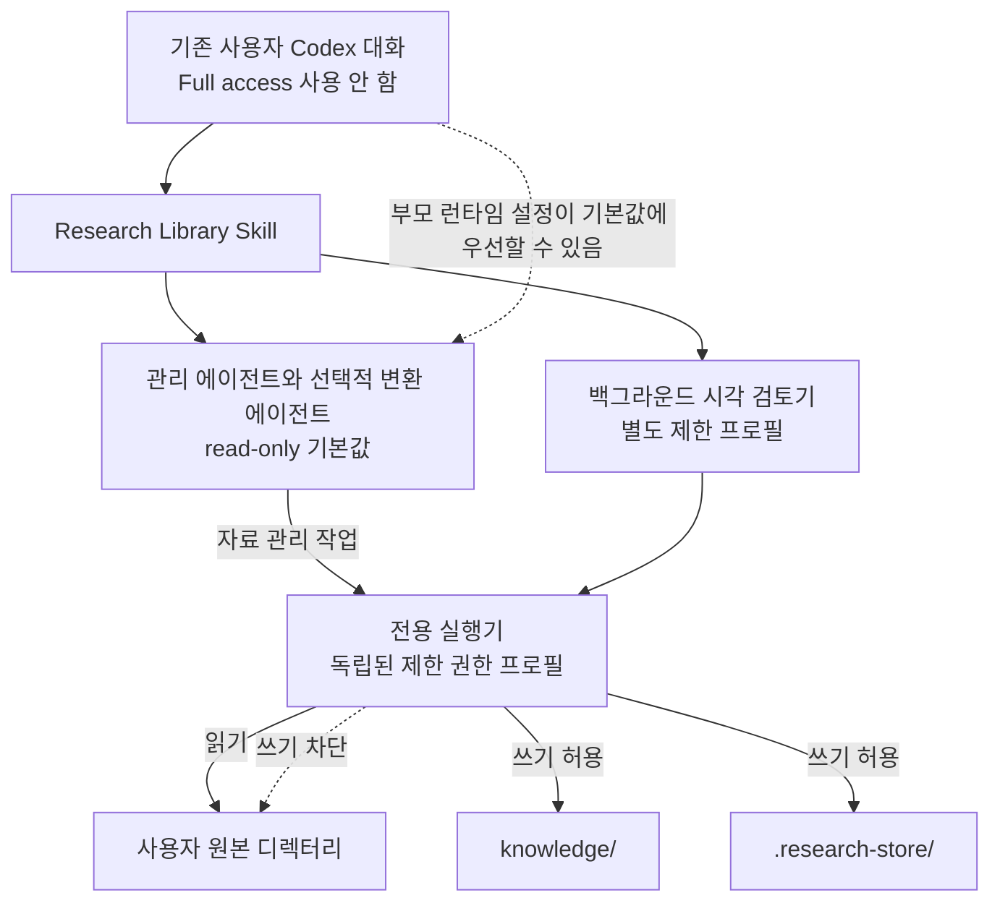
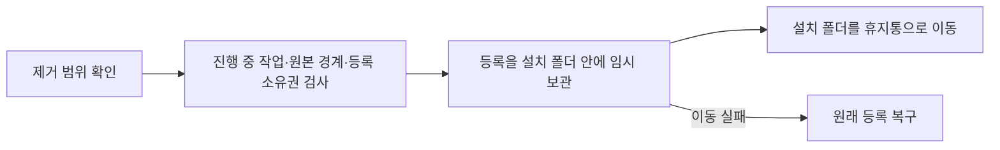

# 사용자 원본 디렉터리 보호와 권한 관리

[한국어](./permissions.md) | [English](../en/permissions.md) | [기술 설계 목차](../README.md) · [개발 로드맵](./ROADMAP.md)

## 목차

- [설계 목표](#설계-목표)
- [사용 정책과 권한 흐름](#사용-정책과-권한-흐름)
- [보호 장치](#보호-장치)
- [부모 Codex 세션과의 관계](#부모-codex-세션과의-관계)
- [역할별 허용 작업](#역할별-허용-작업)
- [저장 명령의 설정 스택 격리](#저장-명령의-설정-스택-격리)
- [보장 범위](#보장-범위)
- [검증 기준](#검증-기준)
- [설치 제거와 원본 보호](#설치-제거와-원본-보호)
- [책임별 구현 파일](#책임별-구현-파일)

## 설계 목표

Research Agent는 사용자가 여러 위치에 보관한 PDF를 읽고, 검색 가능한
Markdown으로 변환한다. 이 과정에서 가장 중요한 원칙은 **사용자의 원본
디렉터리를 수정하지 않는 것**이다.

원본 PDF와 원본 디렉터리는 입력 자료로만 사용한다. 변환된 Markdown,
검색 상태, 임시 파일은 모두 Research Agent가 소유한 디렉터리에 저장한다.

## 사용 정책과 권한 흐름

Research Agent는 저장소·스킬·도구 묶음의 이름이다. 사용자는 기존 Codex 대화에서
Research Library를 호출하고, 주 세션이 문서 관리를 위임한 뒤 필요하면 별도
시각 검토 작업을 시작한다.
사용자가 새 대화를 열 필요는 없다.

사용 정책은 최상위 README와 같다. `Ask for approval`과 `Approve for me`는
사용할 수 있고, Full access는 사용하지 않는다. 부모 읽기 전용은 필수 설치
조건이 아니라 보호를 강화하는 선택이다. 특히 원본이 부모 작업공간 안에 있다면
부모가 가진 쓰기 권한도 제한할 수 있다. 승인 모드 이름만으로 실제 파일 접근
범위나 모든 실행 모드의 검증 완료를 판단하지 않는다.

두 사용자 정의 하위 에이전트는 `read-only` 기본값을 선언하며, 개인 등록 시에는
`approval_policy = "never"`도 지정한다. 이 설정이 적용되는 에이전트의 직접
쓰기는 차단되고, 내부 저장은 허용된 전용 실행기를 통해 수행한다. 다만 부모의
런타임 설정이 에이전트 기본값보다 우선할 수 있으므로, 자식 기본값과 실행기의
권한 프로필을 서로 구분한다.

아래 표는 **전용 실행기로 실행한 저장 명령의 권한**이다. 부모 Codex 세션
전체나 실행기를 거치지 않은 임의 명령에 적용되는 권한표가 아니다.

| 위치 | 허용 권한 | 용도 |
| --- | --- | --- |
| 사용자 원본 디렉터리 | 읽기 | PDF 탐색과 변환 입력 |
| `knowledge/` | 읽기·쓰기 | 변환된 Markdown과 대화 기록 |
| `.research-store/` | 읽기·쓰기 | 설정, SQLite 상태, 임시 작업 파일 |
| 그 외 위치 | 읽기 또는 차단 | Research Agent의 저장 대상이 아님 |

백그라운드 시각 검토는 별도의 `research-review-worker` 프로필을 사용한다. 원본은
읽기 전용으로 두면서 모델 연결을 허용한다. Codex CLI의 실행에 필요한
`~/.codex`의 일부 상태 파일과 임시 위치만 추가로 쓸 수 있다. 따라서
`~/.codex`나 그 상위 폴더는 원본 자료원으로 등록하지 못하게 검사한다.
이 좁은 허용 목록은 Codex 업데이트 뒤 권한 통합 시험으로 다시 확인해야 한다.

## 보호 장치

원본 보호는 에이전트 지침 하나에 의존하지 않는다.

1. **에이전트 권한**
   문서 관리 에이전트와 PDF 시각 검토 에이전트 설정에는 읽기 전용 기본값을
   명시하고, 설치된 설정에는 `approval_policy = "never"`도 지정한다. 부모 턴의
   현재 권한 모드와 실행 중 변경이 기본값보다 우선할 수 있으므로, 이를 부모와
   독립된 무조건적 보호 경계로 설명하지 않는다.

2. **저장 명령의 권한**
   에이전트는 파일을 직접 만들거나 수정하지 않는다. Research Agent 내부에만
   쓸 수 있는 전용 명령을 사용한다. 원본 디렉터리는 이 명령의 읽기 영역으로만
   포함된다.

3. **프로그램의 경로 검사**
   생성되는 파일이 Research Agent 내부에 있는지 다시 확인한다. 경로 이탈,
   심볼릭 링크, 하드 링크를 이용해 원본이나 외부 위치에 쓰는 동작을 거부한다.
   원본 PDF는 읽은 뒤 내부 임시 공간에서 처리하며, 처리 도중 원본이 바뀌면
   해당 결과를 폐기한다.

4. **기능 범위 제한**
   원본 파일을 편집하거나 이동하고, 이름을 바꾸거나 삭제하는 기능을 제공하지
   않는다. 원본 경로 등록을 해제해도 이후 탐색만 중단하며 원본과 기존 Markdown
   기록은 삭제하지 않는다.

## 부모 Codex 세션과의 관계

Research Agent는 부모 Codex 세션보다 항상 작은 권한으로 실행되는 별도 보안
주체가 아니다. 공식 Codex 문서에 따르면 하위 에이전트는 부모의 현재 샌드박스
정책을 상속하며, `/permissions`나 `--yolo` 같은 실행 중 권한 변경은 사용자 정의
에이전트 파일에 다른 기본값이 있어도 다시 적용된다. 따라서 Full access 부모가
호출하면 에이전트 TOML의 `read-only`만으로 원본 보호를 보장할 수 없다.

Full access를 가진 부모 세션과 그 권한을 다시 적용받은 하위 에이전트는 다음
작업을 수행할 수 있다.

- 원본 파일을 직접 수정한다.
- Research Agent의 설치 파일이나 설정을 수정한다.
- Research Agent가 제공하지 않는 다른 명령을 실행한다.

Full access를 피하더라도 부모 작업공간 안의 원본은 부모의 쓰기 영역에 포함될
수 있다. `Ask for approval`과 `Approve for me` 사용을 허용하는 정책은 부모와
모든 하위 에이전트의 직접 쓰기까지 항상 차단된다는 보장이 아니다. 부모까지
제한해야 하는 경우 읽기 전용을 선택하고, Research Library는 어떤 모드에서도
원본 쓰기나 권한 확대를 요청하지 않는다. 접근 실패는 중단·보류와 원인 안내로
처리한다. 권한 상속의 근거는 공식
[Codex 하위 에이전트 문서](https://learn.chatgpt.com/docs/agent-configuration/subagents)다.

## 역할별 허용 작업

| 담당 | 허용 작업 | 변경 범위 |
| --- | --- | --- |
| 주 Codex 세션 | 요청 이해, 저장 범위 확인, 관리·변환 작업 위임, 결과 전달 | 자료 변경은 전용 도구로 위임 |
| 관리 에이전트 | `source-list`, `source-add`, `source-remove`, 동기화·상태 조회, 검색, 대화 저장·조회·수정·삭제 | 전용 실행기를 통한 내부 설정·자료·상태 |
| 변환 에이전트 | 명시적인 개별 페이지 수정·재검토 | 전용 실행기를 통한 내부 이미지·검토 기록 |
| 백그라운드 검토기 | 대기 페이지 묶음의 시각 검토와 결과 저장 | 별도 제한 프로필, 내부 기록과 필요한 Codex 런타임 파일 |

폴더 등록은 사용자가 지정하거나 선택한 경로를 내부 설정에 기록한다. 연결
해제는 이후 탐색을 중단하며 원본 경로 매핑, 원본 파일과 기존 Markdown을
보존한다. 원본 폴더 삭제 권한을 뜻하지 않는다.

## 저장 명령의 설정 스택 격리

Markdown과 SQLite를 기록하는 저장 명령은 에이전트의 일반 파일 권한과 별도로
이름 있는 permission profile 안에서 실행된다. 이 기능은 현재 베타이며, 공식
[Codex 권한 프로필 문서](https://learn.chatgpt.com/docs/permissions)에 따르면
불러온 설정 파일 중 하나라도 기존 `sandbox_mode`를 포함하면 Codex가 permission
profile 대신 기존 샌드박스 설정을 사용할 수 있다.

이 충돌을 피하기 위해 launcher는 `CODEX_HOME`과 Codex의 작업 디렉터리 `-C`를
Research Agent가 소유한 `~/.codex/research-library-sandbox`로 함께 고정한다.
전용 설정은 최상위 `default_permissions = "research-store"`로 프로필을 선택하며,
launcher도 `-P research-store`를 명시하고 실제 저장 프로그램은 절대 경로로
실행한다. 따라서 현재 프로젝트의
`.codex/config.toml`에 기존 `sandbox_mode`가 있어도 그 프로젝트 설정을 저장
명령의 설정 스택에 불러오지 않는다. 개발 저장소의 `.codex/config.toml`은 개발
작업의 프로젝트 설정이다. 제품 설정은 별도 원본
[`resources/codex.runtime.toml`](../../../resources/codex.runtime.toml)에서 관리하며,
Release를 만들 때 설치 폴더의 `.codex/config.toml`로 배치한다. 개발 설정 변경이
그대로 사용자 배포본에 들어가지 않도록 분리한 것이다. 두 프로젝트 설정 모두
설치된 실행기의 제한 권한 프로필과는 별개다.
permission profile 형식이 베타인 동안에는 Codex 버전 변경 때 이 격리와 실제
권한 통합 테스트를 다시 확인해야 한다.

백그라운드 검토기는 시작할 때 `research-review-worker` 프로필에 한 번 들어간다.
그 안에서는 `research-store`의 프로젝트 소유 명령을 직접 실행하며 두 번째
macOS 샌드박스를 만들지 않는다. 중첩된 Seatbelt 실행은
`sandbox_apply: Operation not permitted`로 차단될 수 있기 때문이다. 원본 쓰기
차단은 바깥 프로필이 계속 적용하고, 저장 명령의 경로·소유권 검사도 유지된다.

## 보장 범위

전용 실행기가 현재의 제한 권한 프로필로 정상 실행되고, 설치·설정이 유지되는
조건에서 확인한 보호 범위는 다음과 같다.

> 저장 명령은 `knowledge/`와 `.research-store/`에만 쓰고 원본 디렉터리에는
> 쓰지 못한다.

하위 에이전트의 직접 쓰기는 실제 적용된 샌드박스 정책의 영향을 받는다. 에이전트
파일의 읽기 전용 기본값은 이미 구현되어 있지만, 부모 런타임 설정으로 대체될 수
있다. 이 기본값이나 저장 명령의 보호를 부모 Codex 세션 전체에 대한 보장으로
확대해서 설명하지 않는다. Full access는 사용하지 않으며, 부모의 직접 쓰기까지
제한하려면 부모 작업의 읽기 전용 설정이나 운영체제 접근 제한이 추가로 필요하다.

기존 검증 기록은 제한된 저장 명령과 읽기 전용 부모를 사용한 흐름에 관한 것이다.
`Ask for approval`·`Approve for me` 각각에서 자식에게 실제 적용되는 권한과
승인 예외까지 모두 검증했다는 뜻은 아니다. 모드별 확인은
[권한 관리 로드맵](./ROADMAP.md#마일스톤-1-원본-보호와-권한-관리)에 남긴다.

## 검증 기준

권한 설계는 다음 동작으로 확인한다.

- 제한된 저장 명령이 `knowledge/`와 `.research-store/`에는 쓸 수 있다.
- 같은 명령으로 외부 원본 디렉터리에 쓰려고 하면 운영체제 샌드박스가 차단한다.
- 현재 프로젝트에 기존 `sandbox_mode` 설정이 있어도 저장 명령은 격리된 permission
  profile을 사용한다.
- 동기화 전후 원본 디렉터리의 파일 내용이 동일하다.
- Research Agent 밖을 가리키는 저장 경로와 링크를 프로그램이 거부한다.
- 원본 경로 등록과 해제는 Research Agent 내부 설정만 변경한다.
- Research Agent를 제거해도 등록했던 원본 파일은 그대로 남는다.
- 추가 검증에서는 `Ask for approval`과 `Approve for me` 각각의 부모·자식 실제
  권한과 실행기 쓰기 범위를 나누어 확인하고, 확인하지 않은 조합은 미검증으로
  기록한다. 문서의 사용 정책만으로 테스트 통과를 선언하지 않는다.

첫 실제 권한 E2E에서 `default_permissions` 누락과 프로젝트의 기존
`sandbox_mode`가 함께 불리는 설정 스택 문제를 발견했다. 기본 프로필 지정과
전용 작업 디렉터리 분리를 적용한 뒤 다시 실행한 통합 테스트에서는 Research
Agent 내부 저장은 허용되고, 외부 원본 파일과 프로젝트 실행 코드 쓰기는
차단되며 원본 내용이 유지됐다. 자세한 발견과 회귀 결과는
[안전성과 에이전트 라우팅 검증](./experiments/safety-routing-validation.md)에
기록했다.

빈 임시 HOME을 사용한 현재 Mac의 설치·제거도 통과했다. 이는 설치 흔적이 없는
환경을 재현한 결과이며, 실제 새 Mac에서 비개발자가 겪는 설치 UX까지 검증했다는
뜻은 아니다.

## 설치 제거와 원본 보호

공개 제거 명령 `uninstall.sh`는 제거할 설치 경로와 자료 범위를 보여 주고 확인을
받는다. 기본 동작은 소유권이 확인된 Codex 등록과 설치 폴더 전체를 사용자
휴지통의 고유한 하위 폴더로 옮기는 것이다. `--keep-files`는 등록만 해제하고,
`--yes`는 확인을 생략한다. 내부 `personal_registration.py uninstall`은
설치·등록 검증용으로 기존의 등록 해제 동작을 유지한다.

현재 설정과 이전 형식의 `config.toml`에서 비활성 자료원까지 검사한다. 원본
경로가 설치 폴더·등록 경로·휴지통과 겹치거나 설정을 안전하게 읽을 수 없으면
중단한다. 링크 대상의 원본 파일을 따라가서 삭제하지 않는다. 별도로 작성한
사용자 지정 설정 파일들을 모두 발견하는 기능은 없으므로, 경계 검사는 기본
설정과 이전 기본 설정에 기록된 자료원을 대상으로 한다.

저장 실행기와 직접 CLI는 명령 전체에 설치 디렉터리의 공유 잠금을 유지한다.
제거는 같은 디렉터리의 배타 잠금과 기존 동기화·대화 잠금을 함께 확보하므로
라이브러리 작업과 겹치면 중단한다. 등록 변경에는 기존 사용자 등록 잠금도
사용한다. 설치 업데이트나 외부 프로그램의 직접 파일 편집까지 막는 잠금은 아니다.

등록은 소유권을 확인한 고정 경로만 임시 보관하고 복구 기록을 남긴다. 휴지통
이동에 실패하면 등록을 되돌린다. 등록 이동 중 프로세스가 종료된 경우에는 같은
제거 명령을 다시 실행해 복구한 뒤 재시도한다. 복구 경로에 다른 파일이 생겼거나
복구 기록이 손상되면 덮어쓰지 않고 중단한다. 설치 폴더를 재귀 삭제하거나
다른 볼륨으로 복사한 뒤 지우는 대체 동작은 없다. 현재는 홈 휴지통과 같은 볼륨의
설치만 지원하며 Finder의 자동 원위치 복원 기능은 제공하지 않는다.

임시 설치 사본과 임시 HOME·휴지통에서 전체 제거, 취소, 자료 보관, 원본 보존,
소유권 충돌, 동시 실행, 이동 실패 복구, 실제 프로세스 종료 후 재시도를 검증한다.
개별 대화 기록을 삭제하는 `conversation-delete`의 동작은 이 설치 제거와 별개다.

## 책임별 구현 파일

| 책임 | 구현 파일 |
| --- | --- |
| 배포본을 직접 열 때의 제품 프로젝트 설정 | [`codex.runtime.toml`](../../../resources/codex.runtime.toml), [`runtime-files.txt`](../../../packaging/runtime-files.txt) |
| 개인 에이전트, 명령 규칙, 제한 권한 프로필 설치 | [`scripts/personal_registration.py`](../../../scripts/personal_registration.py) |
| 설치 전체 제거와 실패 복구 | [`uninstall.sh`](../../../uninstall.sh), [`uninstall_project.py`](../../../scripts/uninstall_project.py), [`test_full_uninstall.py`](../../../tests/test_full_uninstall.py) |
| 작업 실행과 설치 제거의 동시 접근 제한 | [`operation_guard.py`](../../../src/research_store/operation_guard.py), [`test_operation_guard.py`](../../../tests/test_operation_guard.py) |
| 에이전트의 읽기 전용 기본값과 행동 제한 | [`research-library-manager.toml`](../../../resources/agents/research-library-manager.toml), [`research-paper-converter.toml`](../../../resources/agents/research-paper-converter.toml) |
| 제한된 저장 명령으로 다시 진입 | [`research-store` launcher](../../../resources/skills/research-library/scripts/research-store) |
| 저장 경로와 원본 경로의 경계 검증 | [`config.py`](../../../src/research_store/config.py), [`safety.py`](../../../src/research_store/safety.py) |
| 설치 충돌과 실제 샌드박스 권한 검증 | [`test_personal_registration.py`](../../../tests/test_personal_registration.py), [`test_install_security.py`](../../../tests/test_install_security.py), [`test_permission_profile_integration.py`](../../../tests/test_permission_profile_integration.py) |
