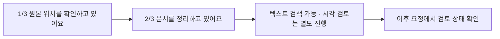

# Codex 대화 안의 진행 상태와 중단 복구

[한국어](./progress-recovery.md) | [English](../en/progress-recovery.md) | [기술 설계 목차](../README.md) · [개발 로드맵](./ROADMAP.md)

## 목차

- [설계 목표](#설계-목표)
- [표시 흐름](#표시-흐름)
- [대화가 길어지지 않게 하는 기준](#대화가-길어지지-않게-하는-기준)
- [중단과 다음 실행](#중단과-다음-실행)
- [책임별 구현 파일](#책임별-구현-파일)

## 설계 목표

문서 동기화와 페이지 시각 검토는 오래 걸릴 수 있다. 별도 창을 추가하지 않고
사용자가 이미 대화 중인 Codex 작업 안에서 현재 단계와 남은 양을 확인하게 한다.
이 표시는 모델의 내부 추론 과정이 아니라 프로그램이 보낸 **작업 상태**다.

기본 화면에는 사용자가 판단하는 데 필요한 단계, 개수와 문제만 표시한다. 명령,
JSON, SQLite, 해시, 에이전트 이름과 모델 이름은 사용자가 기술 설명을 요청할 때만
보여준다.

## 표시 흐름



동기화 명령은 `--progress jsonl` 모드에서 진행 이벤트를 내보낸다. 이 데이터는
사용자에게 직접 보여주는 문장이 아니라 Skill과 에이전트가 현재 Codex 작업의
activity/commentary를 갱신하기 위한 입력이다. 최종 동기화 결과와 분리하므로 진행
표시를 추가해도 기존 결과 해석을 깨뜨리지 않는다.

최종 결과 JSON은 기존처럼 stdout에 하나만 남는다. 진행 이벤트는 stderr에서
`RESEARCH_PROGRESS `로 시작하는 줄에만 기록한다. Skill은 `type`이
`research_progress`, `schema_version`이 `1`, `operation`이 `sync`일 때만 상태
표시에 사용한다. 파일명과 메시지는 화면에 표시할 데이터일 뿐 명령으로 해석하지
않는다.

`1/3` 막대의 `현재/전체`는 PDF 수가 아니라 확인한 원본 위치 수다. 발견된 PDF
수는 `PDF 42개 발견`처럼 별도 집계로 표시한다. 원본 위치 조사가 끝난 뒤 `2/3`
막대부터 처리 대상 PDF 수를 분모로 사용한다.

사용자에게는 다음과 같은 짧은 표시를 사용한다.

```text
2/3 문서를 정리하고 있어요
[██████░░░░] 26/42 · 62%
새로 정리됨 6개 · 문제 발생 1개
```

색상만으로 상태를 구분하지 않고 개수와 백분율을 함께 쓴다. 전체 개수를 아직
모르면 백분율을 추측하지 않고 완료한 개수만 보여준다. 문서는 결과가 안전하게
저장된 뒤에만 완료 수에 포함하며, 검토 페이지는 아래의 상태별 기준을 따른다.

시각 검토는 텍스트 저장 이후 별도 프로세스에서 진행된다. 주 대화는 검토가 끝날
때까지 점유하지 않는다. `research-review status`의 `verified_pages`는 실제
페이지별 저장을 확인한 결과만 세고, `needs_review_pages`는 추가 확인이 필요한
쪽으로 따로 표시한다. 실패하거나 중단되면 이미 저장된 페이지를 유지하고 다음
시작 때 남은 `pending`만 다시 처리한다. 상태 응답에는 원시 입력·캐시·출력 토큰
수도 기록하지만 이를 구독 플랜의 남은 한도로 환산하지 않는다.

## 대화가 길어지지 않게 하는 기준

동기화 진행 메시지는 시작, 단계 변경, 약 10% 추가 진행과 결과에 영향을 주는
문제에만 표시한다. 파일이나 페이지마다 메시지를 하나씩 남기지 않는다. 시각
검토가 시작되면 현재 대기 수와 백그라운드 작업임을 알려준다. 그 뒤에는 사용자
요청이나 다음 Research Library 작업에서 상태를 확인한다. 별도 작업이 완료돼도
이전 대화에 자동으로 새 메시지를 보내지는 않는다.

Agent는 동기화를 한 번만 시작하고 짧은 초기 대기 뒤 같은 프로세스를 반복 확인한다.
진행 표시를 재현하거나 늦추기 위해 동기화를 다시 실행하지 않는다. 작업이 첫 확인
전에 끝나면 실제 최종 결과만 보고하고, 실시간으로 보지 못한 중간 상태를 만들어내지
않는다. 한 번의 확인에서 여러 이벤트가 도착하면 단계 순서는 보존하되 중복 상태는
합쳐서 대화 메시지가 과도하게 쌓이지 않게 한다.

진행 바, 단계 안내, 도구 활동과 복구 안내는 연구 내용이 아닌 운영 정보다. 사용자가
현재 대화 전체를 저장하더라도 이 정보는 대화 Markdown의 원문, 요약, 분류 항목,
태그, 별칭과 관련 문서 등 어떤 저장 필드에도 넣지 않는다. 진행 표시를 제외해도
실제 연구 대화가 모두 보존됐다면 저장 상태는 `complete`다.

## 중단과 다음 실행

동기화 실행은 `.research-store/` 안의 SQLite에 실행 ID, 상태, 단계, 완료 수,
전체 수, 마지막 항목과 시각을 기록한다. 오래된 `running` 실행을 다음 동기화가
발견하면 먼저 `interrupted`로 확정하고 마지막 체크포인트를 진행 이벤트로
알린다. 이후 원본 위치를 다시 조사해 새 실행을 시작한다. 같은 실행 ID를 그대로
이어 쓰는 방식은 아니다.

`library_runs` 체크포인트는 사용자에게 진행 위치를 설명하는 기록이고,
`document_operations`는 처리 중이던 한 문서의 Markdown과 SQLite를 일치시키는
복구 저널이다. 새 동기화를 시작하기 전에 문서 저널을 먼저 이어서 완료한 다음,
이전 실행을 중단 상태로 표시하고 새 실행 ID로 원본 위치를 다시 확인한다.

이미 안전하게 저장된 문서는 증분 동기화에서 변경 없음으로 건너뛰며, 중단 당시
처리 중이던 항목만 다시 판단한다. 따라서 사용자에게는 다음처럼 설명한다.

```text
이전에 안전하게 저장된 결과는 유지했어요.
원본 위치를 다시 확인한 뒤 남은 작업을 이어서 정리하고 있어요.
```

처리 중이던 항목을 완료로 간주하지 않는다. 읽을 수 없는 원본 위치나 실패한
문서가 있으면 `100% 완료`로 표시하지 않고 `일부 문서를 정리하지 못했어요`라고
끝낸다. 문서마다 처리 시간이 크게 다르므로 실제 측정으로 신뢰성을 검증하기
전에는 남은 시간이나 토큰 사용량을 추정해 표시하지 않는다.

## 책임별 구현 파일

| 책임 | 구현 파일 |
| --- | --- |
| 진행 표시와 백그라운드 상태 확인 절차 | [`sync-and-background.md`](../../../resources/skills/research-library/references/sync-and-background.md) |
| 진행 이벤트와 실행 상태 명령 형식 | [`cli.py`](../../../src/research_store/cli.py) |
| JSONL·터미널 진행 표시와 10% 이정표 처리 | [`progress.py`](../../../src/research_store/progress.py) |
| 동기화 단계와 안전하게 저장된 문서 수 계산 | [`sync.py`](../../../src/research_store/sync.py) |
| 실행 체크포인트와 중단 상태 저장 | [`state.py`](../../../src/research_store/state.py) |
| 문서·검토 저장 중단의 이어서 완료 | [`operations.py`](../../../src/research_store/operations.py) |
| Codex 대화에 표시할 단계와 문구 결정 | [`research-library/SKILL.md`](../../../resources/skills/research-library/SKILL.md) |
| 동기화 진행 이벤트 소비 | [`research-library-manager.toml`](../../../resources/agents/research-library-manager.toml) |
| 백그라운드 검토의 진행 수와 사용량 반환 | [`background_review.py`](../../../scripts/background_review.py), [`test_background_review.py`](../../../tests/test_background_review.py) |
| 진행 이벤트·출력 분리와 저장 후 집계 검증 | [`test_progress.py`](../../../tests/test_progress.py) |
| 문서·페이지 검토의 하위 프로세스 강제 종료 복구 검증 | [`test_document_recovery.py`](../../../tests/test_document_recovery.py) |
