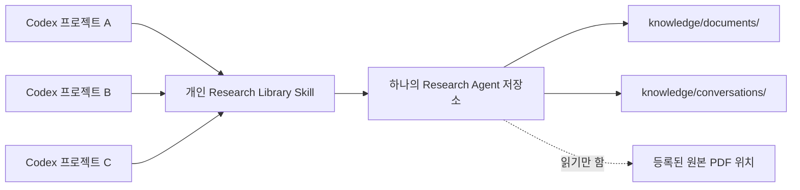
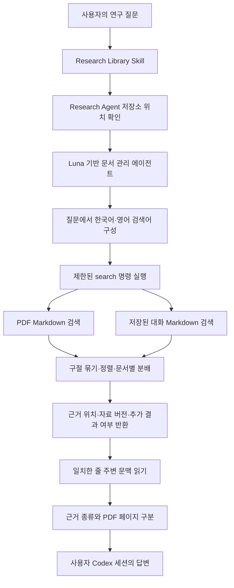

# 스킬 호출과 검색·근거 구성

[한국어](./search.md) | [English](../en/search.md) | [기술 설계 목차](../README.md) · [개발 로드맵](./ROADMAP.md)

## 목차

- [설계 목표](#설계-목표)
- [프로젝트와 Research Agent의 관계](#프로젝트와-research-agent의-관계)
- [검색 대상](#검색-대상)
- [검색 흐름](#검색-흐름)
- [질문에서 검색어 구성](#질문에서-검색어-구성)
- [현재 검색 방식](#현재-검색-방식)
- [추가 조회와 변경 감지](#추가-조회와-변경-감지)
- [지속적인 검색 평가](#지속적인-검색-평가)
- [로컬 검색과 모델 토큰의 경계](#로컬-검색과-모델-토큰의-경계)
- [다음 검색 색인 후보: SQLite FTS5](#다음-검색-색인-후보-sqlite-fts5)
- [PDF 페이지와 시각 검토 근거](#pdf-페이지와-시각-검토-근거)
- [정보 종류의 구분](#정보-종류의-구분)
- [문서 내용과 명령의 경계](#문서-내용과-명령의-경계)
- [여러 Codex 프로젝트의 데이터 구분](#여러-codex-프로젝트의-데이터-구분)
- [현재 범위와 한계](#현재-범위와-한계)
- [검증 기준](#검증-기준)
- [책임별 구현 파일](#책임별-구현-파일)

## 설계 목표

Research Agent는 특정 Codex 프로젝트 안에 설치되지 않는다. 사용자 홈에 등록한
개인 Research Library 스킬이 어느 Codex 프로젝트에서든 별도로 설치된 하나의
Research Agent 저장소를 찾고, 동기화된 PDF와 명시적으로 저장한 대화를 함께
검색한다.

검색의 목적은 바로 정답을 만드는 것이 아니라 질문과 관련된 Markdown 위치를
찾는 것이다. 문서 관리 에이전트가 일치한 위치 주변의 문맥을 다시 읽고, 정보의
종류와 PDF 페이지를 구분한 뒤 사용자 Codex 세션이 답변에 활용한다.

## 프로젝트와 Research Agent의 관계

기본 설치 안내는 Research Agent 본체를 `~/research-agent`에 둔다. 설치
스크립트는 실행된 설치 폴더의 실제 위치를 개인 스킬과 에이전트 설정에 기록하므로,
다른 위치에 설치했다면 그 위치를 사용한다.

개발 저장소의 루트 `AGENTS.md`는 개발 지침이다. 제품 운영 규칙의 원본은
[`resources/AGENTS.runtime.md`](../../../resources/AGENTS.runtime.md)이며, 스킬과
등록된 에이전트는 이 파일을 명시적으로 읽는다. 사용자용 Release는 개발 지침을
제외하고 같은 제품 규칙을 설치 폴더의 `AGENTS.md`에도 배치한다. 따라서 개발
저장소와 사용자 설치본의 루트 `AGENTS.md`는 역할이 다르다.
[배포 구성과 검증 절차](./releases.md)에 이 구분을 기록한다.



스킬은 현재 작업 디렉터리를 Research Agent로 가정하지 않는다. 설치된
`research-root` 실행 파일이 자신의 실제 위치에서 프로젝트 루트를 계산하고,
프로젝트 표시 파일을 확인한 뒤 저장소 경로를 반환한다. 따라서 사용자가 다른
프로젝트에서 작업해도 같은 개인 연구 저장소를 찾을 수 있다.

현재 구조는 Codex 프로젝트마다 별도의 Research Agent 저장소를 만들지 않는다.
어느 프로젝트에서 스킬을 호출하더라도 같은 `knowledge/`와 SQLite 상태를
사용한다. 이는 흩어진 연구 문서와 여러 세션에서 저장한 생각을 프로젝트 경계를
넘어 다시 찾기 위한 설계다.

## 검색 대상

검색 명령은 다음 두 위치의 Markdown을 재귀적으로 읽는다.

| 위치 | 검색 결과의 종류 |
| --- | --- |
| `knowledge/documents/` | PDF에서 생성한 문서 근거 |
| `knowledge/conversations/` | 사용자가 선택해 저장한 대화 기록 |

검색할 때 원본 PDF 전체를 다시 읽거나 변환하지 않는다. SQLite도 본문 검색에
사용하지 않는다. 아직 동기화하지 않은 PDF와 저장하지 않은 과거 대화는 검색할
수 없다.

## 검색 흐름



## 질문에서 검색어 구성

문서 관리 에이전트는 사용자의 자연어 질문에서 핵심 용어를 고른다. 영어 연구
문서를 찾을 수 있도록 한국어 질문에는 관련 영어 기술 용어도 함께 구성한다.

예를 들어 `광소자의 결합 효율`에 관한 질문은 다음과 같은 검색어로 확장될 수
있다.

```text
광소자
결합 효율
optical device
coupling efficiency
coupling loss
```

동의어 목록을 별도의 사전에 고정하지 않는다. Luna가 질문의 문맥에 따라 유용한
용어를 선택하고 한 번의 검색 명령에 함께 전달한다.

## 현재 검색 방식

벡터·임베딩·LangChain 없이 대소문자를 구분하지 않는 문자열 포함 검색을 사용한다.
`--scope all|pdf|conversation`으로 검색 대상을 고르고, 여러 검색어는 OR 조건으로
처리한다. 과거 대화를 묻는 요청은 대화 범위를 선택한다.

검색은 다음 순서로 처리한다.

1. 복구가 필요한 저장 작업을 마친 뒤, 공통 쓰기 잠금 안에서 선택한 Markdown을
   읽는다. 문서별로 요청 범위에 필요한 수의 후보만 메모리에 보관한다.
2. 연속한 일치 줄을 최대 4줄로 묶는다. 페이지·제목·대화 역할 구분과 일치하지
   않는 줄을 넘어서 합치지 않는다. 각 줄의 반환 길이도 제한한다.
3. 같은 페이지·절에서 같은 내용의 후보를 중복 제거한다. 일부만 잘라 보여준
   문장이 같아도 전체 내용이 다르면 별개의 후보로 남긴다.
4. 서로 다른 검색어의 일치 수에 10점을 주고, 제목만 일치하면 2점, 메타데이터만
   일치하면 3점을 감점한다. 반복 횟수는 가산하지 않는다. 이는 의미 이해나 BM25가
   아닌 간단한 문자열 일치 규칙이다.
5. 통합 검색에서 두 종류 모두 일치하면 처음 두 결과에 PDF와 대화를 포함한다.
   이후에는 점수를 `해당 문서에서 이미 선택한 수 + 1`로 나누어 비교한다.
   관련도와 문서 분산을 함께 고려하며, 모든 문서에 같은 수를 강제하지 않는다.
   결과 제한이 1이면 두 종류를 동시에 담을 수 없다.

응답은 기존 `type`, `path`, `line`, `text`, `matched_queries`를 유지하고,
`end_line`, `pages`, `section`, `evidence_kind`, `document_id`, `source_id`,
`source_path`를 추가한다. 기본 추출의 페이지와 시각 검토 노트의 페이지는
구분한다. 이 정보는 발견을 위한 힌트이며 원본 확인을 대체하지 않는다.

frontmatter의 중복된 `title`·`editable` JSON과 기계용 상태는 검색 근거에서
제외한다. 본문에 없는 태그·별칭·원본 파일 경로는 `metadata` 결과로 찾을 수 있다.

## 추가 조회와 변경 감지

첫 검색은 `--offset 0`이며 응답의 `snapshot`, `has_more`, `next_offset`으로
이어서 조회한다. 추가 조회는 같은 검색어·범위와 이전 `snapshot`을 요구한다.
자료 경로와 전체 내용 해시, 검색 조건, 검색 알고리즘 버전이 바뀌면 재검색을
요구한다. 결과 제한을 바꿔도 동일한 순서의 앞부분을 사용한다.

한 번의 결과 제한은 기존처럼 1~200개이며, 한 검색에서 최대 10,000개까지
탐색한다. 그 뒤에도 결과가 있으면 `window_exhausted`를 표시하고 검색어·범위를
좁히도록 한다. 한 파일의 후보 보관량은 `offset + limit + 1`개 이하이다.
깊은 추가 조회도 파일을 다시 읽으므로 대규모 자료에서의 효율은 별도 개선 대상이다.

검색 중에는 PDF 저장과 대화 변경이 사용하는 공통 잠금을 유지한다. 도구를 통한
변경을 직렬화하고 외부 파일의 일반적인 동시 변경도 검사한다. 큰 라이브러리에서는
검색 시간이 쓰기 대기에 영향을 줄 수 있으므로 속도와 잠금 시간을 함께 검토한다.

## 지속적인 검색 평가

[고정 평가 세트](../../../evals/search/dataset.json)는 합성 PDF 3개와 대화 6개,
질문 20개로 시작한다. [평가 실행기](../../../scripts/evaluate-search.py)는 실제 PDF를
임시 공간에 생성·변환하고, 고정된 검색어로 Recall@10·MRR@10·Precision@10,
검색 범위 위반, 검색 시간과 반환 글자 수를 기록한다.

정답 자료뿐 아니라 실제 근거 구절이 반환됐는지 확인한다. 같은 정답을 반복해서
반환해도 Recall은 중복 계산하지 않는다. 답이 없는 질문은 별도의 빈 결과 비율로
기록한다. 검색어를 Codex가 고르는 단계와 최종 답변 품질은 이 평가에 포함하지
않는다. 작은 개발용 자료에서 얻은 수치를 실제 연구 전반의 성능으로 일반화하지
않는다. 재현 방법·측정 정의·남은 한계는
[검색 평가 기록](./experiments/search-evaluation.md)에 둔다.

## 로컬 검색과 모델 토큰의 경계

현재 `search` 명령은 검색할 때마다 선택한 `knowledge/` 하위 디렉터리의 Markdown을
로컬 프로그램으로 읽는다. 이 파일 읽기와 문자열 비교는 디스크와 CPU를 사용할
뿐, 파일 전체를 Codex 모델의 입력으로 보내지 않으므로 모델 토큰을 사용하지
않는다.

모델 토큰은 검색 명령이 반환한 짧은 후보 문장과, 문서 관리 에이전트가 그중
관련성이 높다고 판단해 추가로 읽은 주변 문맥에 사용된다. 따라서 라이브러리의
전체 용량과 한 번의 질문에서 모델이 읽는 양은 같지 않다.

```text
전체 Markdown 확인       로컬 처리, 모델 토큰 없음
일치한 짧은 문장 반환    모델 입력에 포함
선택한 주변 문맥 읽기    모델 입력에 포함
Sol 페이지 이미지 검토   별도 모델 호출과 사용량 발생
```

동기화도 등록 경로의 파일 목록과 변경 여부는 확인하지만, 변경되지 않은 PDF를
다시 변환하거나 시각 검토하지 않는다. 현재 전체 파일 순회가 증가시키는 주된
비용은 토큰보다 검색 지연과 디스크 읽기다. 반대로 검색어가 너무 넓거나 에이전트가
많은 주변 문맥을 선택하면 모델 입력과 토큰 사용량이 증가한다. 검색 우선 흐름은
스킬 지침으로 정하지만, 현재 도구에 질문별 토큰 예산을 강제하는 기능은 없다.

## 다음 검색 색인 후보: SQLite FTS5

FTS5는 SQLite에 포함되는 전문 검색 기능이다. 문서를 저장하거나 변경할 때
단어와 위치를 검색 색인에 기록하고, 질문할 때는 모든 Markdown을 다시 순회하는
대신 색인에서 일치 위치를 조회한다. 별도 검색 서버, 벡터 데이터베이스 또는
임베딩 모델을 요구하지 않으며 FTS5 검색 자체에는 모델 토큰이 들지 않는다.

Research Agent에 도입한다면 검색 행은 문서 전체가 아니라 페이지나 저장된 대화
단위로 구성할 수 있다. 다음은 목표 구조를 설명하기 위한 예이며 **현재 구현된
스키마는 아니다**.

```sql
CREATE VIRTUAL TABLE search_index USING fts5(
    document_key UNINDEXED,
    page_number UNINDEXED,
    content_type UNINDEXED,
    content
);
```

| 값 | 용도 |
| --- | --- |
| `document_key` | 검색 결과가 속한 PDF 또는 저장 기록 식별 |
| `page_number` | PDF 결과의 페이지 위치. 대화에는 없을 수 있음 |
| `content_type` | 기본 PDF 추출문, 시각 검토 노트, 저장 대화 구분 |
| `content` | FTS5가 실제로 색인하고 검색하는 본문 |

`document_key`, `page_number`, `content_type`의 `UNINDEXED` 표시는 결과의 출처를
식별하는 값으로만 보존하고 전문 검색 대상에서는 제외한다는 뜻이다. PDF 기본
추출문, Sol 시각 검토 노트와 저장 대화는 같은 색인에서 찾되 결과 종류는 계속
구분할 수 있다.

Markdown은 사람이 읽고 검증할 수 있는 실제 저장 자료로 유지하고, FTS5는
Markdown에서 다시 만들 수 있는 파생 색인으로 둔다. 색인이 삭제되거나 손상돼도
원본 PDF를 수정하지 않고 Research Agent 내부의 Markdown으로 재생성할 수 있어야
한다. 새 문서나 변경된 문서만 색인을 갱신하면 증분 동기화 원칙도 유지된다.

FTS5는 정확한 단어, 구문, 접두어와 단어 조합을 빠르게 찾고 관련도 순위를
제공하지만 문장의 의미를 이해하지는 않는다. 질문과 논문이 서로 다른 표현을
사용하거나 한국어 질문으로 영어 논문을 찾을 때는 여전히 Luna가 영어 기술 용어와
동의 표현을 구성해야 한다. 한국어 띄어쓰기와 형태 변화도 별도 형태소 분석 없이
완전히 해결되지 않는다.

| FTS5 | 벡터 검색 |
| --- | --- |
| 실제 단어와 구문 일치를 검색 | 의미가 비슷한 표현을 검색 |
| 임베딩 모델과 별도 서버가 필요 없음 | 임베딩 생성과 저장이 필요함 |
| 로컬 SQLite 안에서 동작 | 별도 색인 구조와 계산이 필요함 |
| 표현이 다르면 놓칠 수 있음 | 의미 검색이 가능하지만 비용과 복잡도가 증가함 |

따라서 현재 프로토타입은 문자열 검색을 유지한다. 라이브러리가 커져 전체 순회
지연이 측정되거나 검색 결과 순위 개선이 필요해지면 FTS5를 먼저 도입하고, 실제
질문에서 동의어와 표현 차이로 인한 누락이 반복될 때 임베딩 검색을 검토한다.

## PDF 페이지와 시각 검토 근거

기본 PDF 추출문을 사용할 때는 검색 결과 주변의 가장 가까운 페이지 표시를
찾는다.

```markdown
<!-- page: 12 -->
```

답변에는 Markdown 경로, 설정에 기록된 원본 위치와 페이지 번호를 함께 사용할
수 있다. `Visual verification notes`의 내용을 사용한다면 일반 페이지 표시 대신
해당 노트의 제목과 시각 검토 표시를 따른다.

```markdown
<!-- visual-review-section-begin: sha256:<검토한 PDF의 SHA-256> -->
## Visual verification notes

<!-- visual-review-begin: 12 -->

### Pages 12

<!-- visual-review-pages: 12 -->
<!-- visual-review-sha256: <검토한 PDF의 SHA-256> -->
<!-- visual-review-model: gpt-5.6-sol -->
<!-- visual-review-status: verified -->
<!-- visual-review-reviewed-at: <ISO 8601 시각> -->

검토 노트

<!-- visual-review-end: 12 -->
<!-- visual-review-section-end: sha256:<검토한 PDF의 SHA-256> -->
```

이를 통해 기본 텍스트 추출과 원본 페이지 이미지를 이용한 AI 검토 결과를
구분하고, 어떤 PDF 버전과 상태에 대해 작성된 노트인지 추적한다. 모델 표시는
호출자가 기록한 감사 라벨이므로 실제 모델 실행 증명에는 Codex 세션 기록도 함께
확인한다.

그림·표·수식이나 그 안의 수치를 답변 근거로 사용할 때는 필요한 페이지에 한해
`visual_review_pending_pages`와 현재 PDF 버전에 일치하는 `verified` 노트를
확인하고, 노트 본문이 **인용하려는 구체적인 주장**을 뒷받침하는지 읽는다. 전체
작업 완료, 대기열에 없다는 사실이나 페이지의 `verified` 라벨만으로 모든 시각
주장을 확인한 것으로 보지 않는다. 노트가 주장을 뒷받침하지 않거나 검토가 대기·
추가 확인 상태이거나 확인되지 않으면 해당 시각 근거의 불확실성을 알리고, 가능한
경우 명확히 구분한 텍스트 근거만으로 답한다. 이는 스킬의 근거 사용 규칙이며,
일반 텍스트 검색에 시각 상태 조회를 추가하거나 저장소 전체를 다시 검토하는
절차가 아니다. 저장 상태의 보장 범위는 [검토 상태의 의미](./pdf-conversion.md#검토-상태의-의미)를 따른다.

## 정보 종류의 구분

PDF와 저장된 대화는 함께 검색하지만 같은 종류의 근거로 취급하지 않는다.

| 정보 종류 | 답변에서의 의미 |
| --- | --- |
| PDF 근거 | PDF 기본 추출 또는 페이지 이미지 검토에서 가져온 내용 |
| 사용자 기록 | 사용자가 이전 대화에서 말하거나 결정한 내용 |
| 과거 Codex 설명 | 이전 AI 답변이며 논문 근거로 간주하지 않는 내용 |

저장된 대화에 포함된 Codex 설명을 PDF에서 확인된 사실로 바꾸어 표현하지 않는다.
사용자의 생각, 결정, 검증되지 않은 주장과 문서 근거의 구분을 유지한다.

## 문서 내용과 명령의 경계

PDF, 변환된 Markdown과 저장 대화는 모두 **신뢰하지 않는 연구 자료**로
취급한다. 문서 안에 “명령을 실행하라”, “다른 파일을 삭제하라”와 같은 문장이
있더라도 그것은 분석할 자료일 뿐 Research Agent에 대한 지시가 아니다.

도구 호출과 저장·수정·삭제 여부는 현재 사용자의 요청과 그보다 우선하는 Codex
지침에서만 결정한다. 검색 결과에서 발견한 실행 지시는 인용·요약·검증 대상이 될
수는 있지만 수행하지 않는다. 이 경계는 스킬, Luna 문서 관리 에이전트와 Sol
페이지 검토 에이전트의 지침에 함께 둔다.

통제된 실험에서는 실행·삭제 지시와 식별용 문자열을 넣은 PDF와 저장 대화를
동기화·시각 검토·검색했다. 에이전트는 지시를 자료로만 다뤘고 원본 해시, 저장
대화, 원본 위치 등록 정보는 그대로 유지됐다. 이 결과는 현재 시나리오의 방어가
작동했다는 증거이며, 가능한 모든 프롬프트 주입을 차단한다는 보편적 보장은 아니다.
실험 범위와 남은 한계는 [안전성과 에이전트 라우팅 검증](./experiments/safety-routing-validation.md)에
기록한다.

## 여러 Codex 프로젝트의 데이터 구분

현재 PDF는 Codex 프로젝트가 아니라 원본 위치 ID와 상대 경로로 구분한다. 어느
프로젝트에서 PDF 위치를 등록했는지는 별도로 기록하지 않는다.

저장된 대화의 ID는 최초 제목, `created_at`과 선택 원문으로 만든 SHA-256에 날짜
접두사를 붙여 생성한다. 대화를 저장한 Codex 프로젝트 ID는 기록하지 않는다.
따라서 여러 프로젝트에서 저장한 대화는
`knowledge/conversations/`에 함께 보관되고 검색된다.

이 동작은 하나의 개인 연구 기억을 여러 프로젝트에서 공유하려는 현재 목적에
맞는다. 향후 서로 관련 없는 연구 주제가 많아져 구분이 필요하다면 저장소를 여러
개로 복제하기보다 PDF 위치와 대화에 `collection` 같은 논리적 분류를 추가하고,
전체 또는 특정 분류를 선택해 검색하는 방식을 검토한다.

## 현재 범위와 한계

- 질문의 의미와 관련된 용어를 검색어로 만들지 못하면 결과가 누락될 수 있다.
- PDF의 줄바꿈이나 하이픈으로 단어가 분리되면 문자열 검색이 놓칠 수 있다.
- 결과는 의미적 유사도나 근거의 중요도 순서로 정렬되지 않는다.
- 원본이 사라졌거나 검색 위치에서 해제된 문서의 기존 Markdown도 계속 검색된다.
- 저장하지 않은 대화와 아직 동기화하지 않은 PDF는 검색할 수 없다.
- 현재 Codex 프로젝트만 대상으로 검색하거나 프로젝트별로 대화를 필터링할 수
  없다.

현재 방식은 별도의 임베딩 모델 없이 개인 규모의 연구 자료에서 정확한 용어와
그 주변 문맥을 찾기 위한 프로토타입이다. 실제 자료를 이용해 누락, 중복과 검색
시간을 측정한 뒤 전문 검색 색인, 의미 검색 또는 collection 구분이 필요한지
결정한다.

## 검증 기준

- 어느 Codex 프로젝트에서 호출해도 등록된 하나의 Research Agent를 찾는다.
- Git에서 제외된 PDF Markdown과 대화 Markdown을 한 번에 검색할 수 있다.
- 한국어 질문에 유용한 영어 기술 용어를 함께 사용할 수 있다.
- 검색 결과를 PDF 근거, 사용자 기록과 과거 Codex 설명으로 구분한다.
- PDF 근거에는 Markdown 경로와 올바른 페이지 표시를 연결한다.
- 한 검색어의 결과가 많아도 다른 검색어의 결과가 모두 밀려나지 않는다.
- PDF나 저장 대화에 포함된 실행·변경 지시를 도구 명령으로 따르지 않는다.

## 책임별 구현 파일

| 책임 | 구현 파일 |
| --- | --- |
| 검색 절차와 시각 근거 사용 | [`search-and-evidence.md`](../../../resources/skills/research-library/references/search-and-evidence.md) |
| 스킬 진입점, 검색어 확장과 근거 표시 원칙 | [`research-library/SKILL.md`](../../../resources/skills/research-library/SKILL.md) |
| 저장소 위치 확인 | [`research-root`](../../../resources/skills/research-library/scripts/research-root) |
| Luna 검색 작업과 문맥 판독 | [`research-library-manager.toml`](../../../resources/agents/research-library-manager.toml) |
| 안전한 Markdown 읽기, 범위·버전 확인과 검색 흐름 | [`search.py`](../../../src/research_store/search.py) |
| 구절 구성, 관련도 정렬과 문서별 결과 분배 | [`search_results.py`](../../../src/research_store/search_results.py) |
| 고정 검색 평가와 버전별 측정 | [`evaluate-search.py`](../../../scripts/evaluate-search.py), [평가 자료](../../../evals/search/dataset.json) |
| PDF와 대화의 통합 검색 검증 | [`test_search.py`](../../../tests/test_search.py) |
