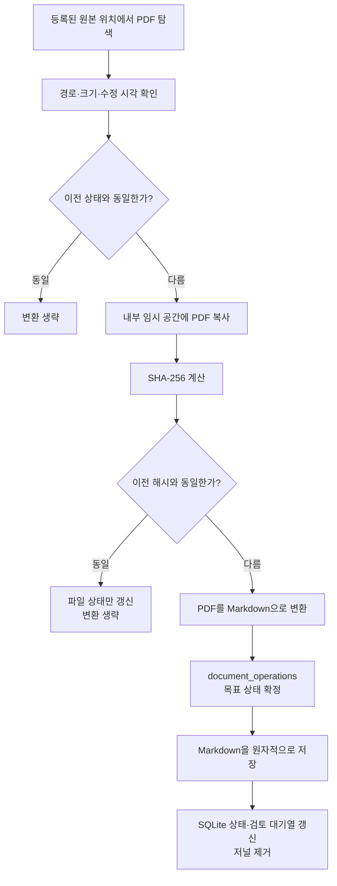

# 저장 구조와 증분 동기화

[한국어](./storage-sync.md) | [English](../en/storage-sync.md) | [기술 설계 목차](../README.md) · [개발 로드맵](./ROADMAP.md)

## 목차

- [설계 목표](#설계-목표)
- [저장 영역의 역할](#저장-영역의-역할)
- [문서 식별 방식](#문서-식별-방식)
- [동기화 흐름](#동기화-흐름)
- [변경 판단 순서](#변경-판단-순서)
- [처리 중 원본 변경 방지](#처리-중-원본-변경-방지)
- [사라진 문서와 연결되지 않은 위치](#사라진-문서와-연결되지-않은-위치)
- [대표적인 동작](#대표적인-동작)
- [현재 범위와 한계](#현재-범위와-한계)
- [책임별 구현 파일](#책임별-구현-파일)

## 설계 목표

Research Agent는 등록된 원본 위치를 다시 확인할 때마다 모든 PDF를 변환하지
않는다. 전체 위치에서 PDF의 존재와 기본 상태는 확인하되, 새로 발견됐거나 실제
내용이 변경된 문서만 다시 변환한다.

이 구조의 목적은 반복 작업 시간을 줄이고, 변경되지 않은 문서에 대한 불필요한
시각 검토와 구독 사용량을 만들지 않는 것이다. 원본 위치에는 상태 파일이나
색인을 만들지 않으며 동기화에 필요한 기록은 모두 Research Agent 내부에 둔다.

## 저장 영역의 역할

| 저장 영역 | 역할 |
| --- | --- |
| `knowledge/documents/` | Codex와 사용자가 검색하고 읽는 PDF별 Markdown |
| `.research-store/library.sqlite` | 문서 상태, 해시, 파서 버전, 검토 대기열, 실행 체크포인트와 복구 저널을 기록하는 내부 원장 |
| `.research-store/tmp/` | 변환 중 사용하는 PDF 복사본과 페이지 이미지 |

Markdown은 검색하고 인용할 내용을 보존한다. SQLite는 사용자에게 보여 줄 본문을
저장하는 데이터베이스가 아니라, 같은 PDF를 다시 처리해야 하는지 판단하고 중단된
문서 저장을 안전하게 이어서 완료하기 위한 상태 기록이다.

## 문서 식별 방식

각 PDF는 **원본 위치 ID와 그 위치 안에서의 상대 경로**를 조합해 식별한다.

```text
<source-id>:<relative-path>
```

예를 들어 `papers`로 등록한 위치 안의 `optics/laser.pdf`는
`papers:optics/laser.pdf`라는 문서 키를 가진다. 서로 다른 원본 위치에 같은
내용의 PDF가 있더라도 출처가 다르면 별개의 문서로 관리한다.

## 동기화 흐름



## 변경 판단 순서

첫 번째 단계에서는 파일 크기, 나노초 단위 수정 시각, 파서 버전, 이전 오류와
생성된 Markdown의 존재 여부를 비교한다. 모두 같으면 PDF를 다시 읽지 않고
`unchanged`로 처리한다.

기본 상태가 달라졌다면 원본 PDF를 Research Agent 내부 임시 공간으로 복사하고
SHA-256을 계산한다. 이는 프로세스나 저장소를 복제하는 fork가 아니라 변환에
사용할 일반적인 임시 파일 복사다. 해시가 이전 기록과 같으면 내용은 동일하다고
판단하고 크기와 수정 시각 같은 상태만 갱신한다. 임시 PDF 복사본은 이 확인이나
변환이 끝나면 삭제한다. 프로세스가 강제로 종료되어 복사본이 남으면, 다음 동기화가
종료된 프로세스가 소유한 임시 폴더만 확인해 삭제한다.

다음 조건에서는 실제 변환을 수행한다.

- 처음 발견한 PDF
- 이전 기록과 SHA-256이 다른 PDF
- PDF 파서 버전이 변경된 문서
- 생성된 Markdown이 사라진 문서
- 이전 변환에서 오류가 발생한 문서
- 저장 경로 마이그레이션이 필요한 문서

재변환하면 Markdown을 교체하고 해당 PDF의 시각 검토 후보도 현재 결과를
기준으로 다시 등록한다. 변경되지 않은 PDF는 기존 Markdown과 시각 검토 상태를
그대로 유지한다.

## 처리 중 원본 변경 방지

변환을 시작하기 전과 끝난 뒤 원본 PDF의 크기와 수정 시각을 비교한다. 처리하는
동안 원본 상태가 달라지면 결과를 저장하지 않고 오류로 기록한다. 기존 Markdown이
있다면 그대로 남기고 다음 동기화에서 다시 시도한다.

이 과정에서도 원본은 읽기 입력으로만 사용한다. PDF 해시 계산과 변환은 내부
복사본을 대상으로 수행하며 원본 경로에는 임시 파일을 만들지 않는다.

## 사라진 문서와 연결되지 않은 위치

정상적으로 탐색할 수 있는 원본 위치에서 이전 PDF가 발견되지 않으면 SQLite에
`missing` 상태와 발견 시각을 기록한다. 기존 Markdown과 검토 기록은 삭제하지
않는다.

원본 위치 자체가 없거나 읽을 수 없다면 그 위치의 모든 문서를 `missing`으로
바꾸지 않는다. 외장 디스크 분리나 일시적인 권한 문제를 문서 삭제로 오인하지
않도록 해당 위치만 `unavailable`로 보고한다.

## 대표적인 동작

| 상황 | 동작 |
| --- | --- |
| 새 PDF 추가 | Markdown 생성과 검토 후보 등록 |
| 변경 없이 다시 동기화 | 탐색만 수행하고 변환 생략 |
| 수정 시각만 변경 | 해시가 같으면 상태만 갱신 |
| PDF 내용 변경 | Markdown 재생성과 검토 후보 재등록 |
| 파서 버전 변경 | 현재 파서로 다시 변환 |
| 생성된 Markdown 삭제 | 원본에서 다시 생성 |
| 변환 실패 | 오류를 기록하고 다음 동기화에서 재시도 |
| 원본 PDF 삭제 | `missing`으로 표시하고 기존 Markdown 보존 |
| 원본 위치 연결 해제 | 위치 오류만 기록하고 문서는 `missing`으로 바꾸지 않음 |
| 사라졌던 PDF 복원 | 해시 확인 후 현재 상태로 복구 |

## 현재 범위와 한계

- 변경되지 않은 PDF의 변환은 생략하지만 등록된 위치의 PDF 탐색은 매번 수행한다.
- 파일 이름이나 상대 경로가 바뀌면 이전 문서는 `missing`, 새 경로는 새 문서로
  인식한다. 경로 이동을 같은 문서의 이동으로 자동 연결하지 않는다.
- 같은 PDF가 여러 원본 위치에 있으면 출처 보존을 위해 각각 저장한다. 따라서
  검색 결과가 중복될 수 있다.
- 빠른 변경 확인은 파일 크기와 수정 시각을 신뢰한다. 두 값이 모두 유지된 채
  내용만 바뀌는 비정상적인 변경까지 매번 해시로 확인하지는 않는다.
- 동기화는 PDF 한 개의 상태를 저장할 때마다 SQLite 변경을 확정한다. 다음 PDF의
  긴 변환을 기다리는 동안 대화 저장·수정 같은 다른 쓰기를 진행할 수 있음을
  실제 동시 실행 테스트로 확인했다. 별도의 `.research-store/sync.lock`은 동기화
  작업을 하나씩 실행하며 두 번째 동기화는 기존 작업을 방해하지 않고 거부한다.
  이 잠금은 변환 전체에 대화 저장용 프로젝트 쓰기 잠금을 잡고 있지 않으므로 긴
  PDF 변환 중에도 대화 저장을 진행할 수 있다.

현재 방식은 개인 연구 자료 규모에서 반복 변환 비용을 줄이면서 원본 위치와
생성된 결과의 관계를 추적하기 위한 구조다. PDF 수가 크게 늘어나 탐색 자체가
느려질 때 별도의 파일 시스템 감시나 색인 방식이 필요한지 다시 검토한다.

## 책임별 구현 파일

| 책임 | 구현 파일 |
| --- | --- |
| PDF 탐색, 변경 판단, 임시 복사, 변환과 누락 상태 처리 | [`sync.py`](../../../src/research_store/sync.py) |
| 동기화 단일 실행과 짧은 프로젝트 쓰기 구간 잠금 | [`locking.py`](../../../src/research_store/locking.py) |
| 문서별 Markdown·SQLite 교체 저널과 복구 | [`operations.py`](../../../src/research_store/operations.py) |
| 문서 상태, 해시, 파서 버전과 검토 대기열 저장 | [`state.py`](../../../src/research_store/state.py) |
| 원본 위치와 Research Agent 저장 위치 구성 | [`config.py`](../../../src/research_store/config.py) |
| 안전한 경로 검사와 Markdown 원자적 저장 | [`safety.py`](../../../src/research_store/safety.py) |
| 증분 처리와 원본 불변성 검증 | [`test_sync.py`](../../../tests/test_sync.py) |
| 동기화 직렬화와 변환 중 대화 저장 검증 | [`test_sync_concurrency.py`](../../../tests/test_sync_concurrency.py) |
| 문서 저장 중 하위 프로세스 강제 종료 복구 검증 | [`test_document_recovery.py`](../../../tests/test_document_recovery.py) |
