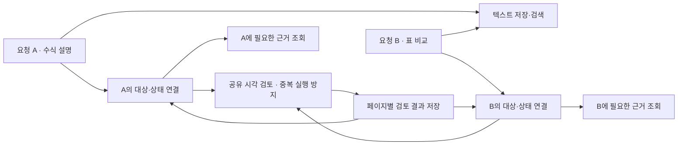
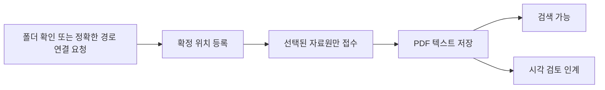

# 시각 검토 작업과 요청의 수명

[한국어](./visual-review-lifecycle.md) | [English](../en/visual-review-lifecycle.md) | [기술 설계 목차](../README.md) · [개발 로드맵](./ROADMAP.md#current-work)

**상태: 2026-09-28 개발 구현. 기존 v0.3.0 배포본·개인 설치본에는 적용되지 않았다.**
**시간·사용량은 안내만 하고, 중단은 사용자가 결정한다.** 이 문서는 새 작업 관리
모듈의 계약과 구현 경계를 설명한다. 검증 결과와 남은 제한은
[실험 기록](./experiments/safety-routing-validation.md#visual-review-lifecycle-implementation-2026-09-28)에,
현재 작업과 다음 단계는 [로드맵](./ROADMAP.md#current-work)에 기록한다.

## 목차

- [목표와 경계](#목표와-경계)
- [요청과 공유 검토 작업](#요청과-공유-검토-작업)
- [폴더 확인부터 자동 저장까지](#폴더-확인부터-자동-저장까지)
- [저장부터 실제 시작까지](#저장부터-실제-시작까지)
- [중단·취소·재개](#중단취소재개)
- [결과 저장과 복구의 경계](#결과-저장과-복구의-경계)
- [시간·사용량 안내](#시간사용량-안내)
- [상태 변경과 알림](#상태-변경과-알림)
- [만료와 삭제](#만료와-삭제)
- [기존 상태와 구현 경계](#기존-상태와-구현-경계)
- [수용 기준](#수용-기준)

## 목표와 경계

텍스트 저장이 끝나면 검색·대화가 가능해야 한다. 오래 걸리는 시각 검토는 별도
실행하며, 다른 문서의 시각 검토를 기다리느라 새 PDF의 텍스트 작업을 대기열에
넣지 않는다. 최종 저장의 짧은 잠금은 공유할 수 있지만 모델 호출 중에는 보유하지
않는다. 원본 읽기 전용, 기존 제한 실행기, Luna xhigh 관리와 Sol high 검토를 유지한다.

작업 관리 모듈은 실행 순서·상태·중단·복구를 책임진다. 콜백은 저장된 상태 변경을
알림 전달 부분에 알린다. 콜백이 다음 핵심 단계를 실행하도록 의존하지 않는다.
새 메시지 서버·SSE 서버·워크플로 플랫폼을 이번 변경의 전제로 추가하지 않는다.

## 요청과 공유 검토 작업

**중복 실행 방지와 개별 요청 처리 보장은 별개의 책임이다.** 같은 세션의 반복
요청이나 서로 다른 Codex 세션의 요청이 같은 저장소·문서를 가리킬 수 있다.
이미 검토 중이라는 이유로 두 번째 요청을 버리지 않는다.

| 단위 | 책임과 식별 기준 |
| --- | --- |
| 사용자 요청 | `request_id`, 요청이 온 작업/메시지 식별자(제공될 때), 정확한 대상 문서·페이지, 상태, 사용량·안내 기준, 보관 만료 시각 |
| 문서 버전 | 기존 문서 키 + PDF SHA-256 + 저장 항목의 생성 식별자. 삭제 후 같은 바이트를 재등록해도 이전 실행 권한은 재사용하지 않음 |
| 공유 검토 | 해당 문서 버전에 대한 `review_id`, 실행 세대, 페이지별 처리 상태와 요청 연결. 동일 페이지의 유효한 모델 실행은 하나만 허용 |
| 개별 연결 | 요청과 공유 검토의 관계, 요청한 페이지 집합, 활성/일시정지/취소/근거 준비/미해결 상태 |
| 문서 정책 | 자동 검토 허용·보류·취소·만료 상태. 임시 작업 기록과 분리해 보관 |

문서의 질문 전체를 연구 대화로 자동 저장하지 않는다. 작업 식별자와 범위 등 최소
운영 정보만 보관한다. 본래 질문은 해당 Codex 대화에 있고, 작업 목록은 새 연구
기억이 아니다. 서로 다른 출처의 동일 바이트 PDF를 하나로 합치는 전역 중복 제거는
도입하지 않는다. 원래 문서 식별 규칙 안에서 같은 항목·같은 버전만 공유한다.

프로토타입의 시각 실행기는 하나여도 된다. 서로 다른 공유 검토는 순서대로 실행하고
대기 중임을 알린다. 요청 B가 이미 진행 중인 문서의 일부/전체 페이지를 요구하면
해당 범위를 연결한다. 새로운 페이지는 별도 대기로 추가하되 A의 범위·완료 수를
늘리지 않는다. 동일 요청의 재시도는 같은 접수 결과를 반환하고, 별개의 사용자
요청은 새 요청 ID를 갖되 검토 실행만 공유한다. 이 결정은 잠금 아래에서 이루어진다.
호출 묶음은 한 문서 버전 안에서 제한된 페이지로 고정한다. 새 요청이 들어왔다고
현재 묶음을 계속 늘리지 않으며, 준비된 작업은 접수 순서로 차례를 얻는다.

완료·실패·중단·취소·만료는 연결된 각 요청에서 조회할 수 있어야 한다. 요청 완료는
자기 범위에 따라 계산하며 다른 요청의 실패로 덮어쓰지 않는다. `needs_review`는
미해결 결과로 남기고 자동 반복 검토하지 않는다. 여러 문서를 포함한 요청은 문서별
결과를 보존하며, 일부 실패·미해결이 있으면 전체 성공으로 표시하지 않는다. 다른
문서의 진행은 계속할 수 있다. 준비된 공통 근거가 A의 수식 설명과
B의 표 비교를 모두 답했다는 뜻은 아니다. **근거 준비, 알림 전달 시도, 사용자에게
답변함을 같은 상태로 취급하지 않는다.**

각 호출에는 자기 요청 ID·연결된 검토·현재 상태·근거 조회 방법을 반환한다.
세션 식별자가 없으면 요청 ID로 조회하며 다른 세션을 추측해 선택하지 않는다.
끝난 대화에 자동으로 새 답변을 보내는 기능은 이번 계약에 포함하지 않는다.
초기 텍스트 답변에서 시각 근거 대기를 표시하고, 이후 사용자의 요청에서 해당
근거를 사용한다. 따라서 B의 실행 요청과 결과 접근은 보존하지만 자동 후속 답변까지
보장한다고 설명하지 않는다.

## 폴더 확인부터 자동 저장까지

설치 안내와 Codex의 폴더 연결 요청은 같은
[`source_intake.py`](../../../scripts/source_intake.py)를 사용한다. 사용자가 확인
목록에서 **연결하고 PDF 저장하기**를 누르면, 확정한 폴더를 등록하고 그 자료원의
텍스트 저장·검토 접수로 이어진다. 별도 저장 요청이나 모델의 두 번째 명령 기억에
의존하지 않는다. 경로를 직접 지정한 연결 요청도 같은 경로를 사용한다.

- `added`는 새 연결·재활성화 결과이고, `selected`는 이번에 처리할 정확한 자료원
  목록이다. 이미 연결한 폴더를 다시 골라도 `selected`에는 포함된다. 그 외 자료원은
  자동으로 추가하지 않는다.
- 취소·빈 목록은 등록과 접수를 실행하지 않는다. 사용자가 연결만 요청하고 저장을
  원하지 않는다고 명시하면 `--registration-only`를 사용한다.
- 호스트는 기존 제한 실행기로 등록하고 `key → prepare → submit`을 호출한다.
  접수 키·고정 명세·요청 ID를 텍스트 저장 전에 출력하며, 저장 중 실패해도 같은
  식별자로 복구한다. 원본 쓰기 권한을 추가하지 않는다.
- 응답의 `processing`은 접수 여부와 오류를 설명한다. 실제 검토 상태는 그 안의
  `request`를 따른다. `submitted`를 검토 실행 중이나 완료로 설명하지 않는다.
  `retry`는 재시도용 동일 키·기한·명세다.
- 설치 중 Codex 실행기를 찾지 못하면 기존 등록 단계까지만 수행하고 저장을
  `deferred`로 안내한다. 설치 성공과 PDF 저장 성공을 구분한다. 일반 스킬 호출은
  제한 실행기 없이 내부 명령으로 우회하지 않는다.
- 앞서 설정한 전체 검토 보류는 유지한다. 텍스트 저장은 가능하지만 시각 검토를
  시작하려면 사용자의 재개 요청이 필요하다. 연결 성공 후 저장 실패도 연결을
  되돌리지 않으며, 전체를 다시 등록하는 대신 남은 접수 상태를 확인한다.

[`select_sources.py`](../../../scripts/select_sources.py)는 경로 선택과 입력 검증,
[`install_onboarding.py`](../../../scripts/install_onboarding.py)는 설치 후 안내,
[공개 실행기](../../../resources/skills/research-library/scripts/research-store)는
권한과 호출 경계를 맡는다. 내부 `source-add`는 위치 등록만 하는 기본 명령으로
유지하고, 공개 연결 경로에서 자동 저장을 조합한다. 이 동작은 개발본 변경이며
현재 v0.3.0 릴리스에는 포함되지 않는다.

폴더 창을 호출한 Codex는 창이 열렸다는 안내를 진행 메시지로 보내고, 같은 실행의
완료 결과까지 기다린다. 실행 도구가 세션 ID를 반환하면 해당 실행을 이어서
조회하며 다시 접수하지 않는다. 저장 전 출력하는 `RESEARCH_SOURCE_INTAKE_RECEIPT`는
복구용이므로 저장 성공으로 해석하지 않는다. 최종 응답은 텍스트 저장 결과와
실제 시각 검토 인계 상태를 구분해 설명하며, 전체 이미지 검토 완료까지 기다리지는
않는다. 종료된 대화에 나중에 답변을 자동 추가하는 기능은 아니다.
이 대화 순서는 스킬 지침으로 요구하며 호스트가 강제하는 완료 콜백은 아니다.
일반 사용자 답변에는 저장 결과·검토 상태와 필요한 조치만 안내한다. 요청 ID와
재시도 키·입력 명세는 도구 결과와 에이전트 간 전달에 유지하고, 사용자가 진단이나
복구 세부 정보를 요청할 때만 표시한다. 복구 데이터 자체를 삭제하거나 바꾸지는 않는다.

## 저장부터 실제 시작까지

접수 전에 호출 측이 멱등 키와 고정된 유효 기한을 저장하고 재시도에 같은 키를
사용한다. 같은 저장소에서 같은 키·같은 입력 명세는 기존 요청 ID를 반환하고,
같은 키·다른 명세는 충돌로 거부한다. 명세는 입력별 식별자, 대상, 검토 범위와
최초 안내 기준을 포함한다. 이후 재개·안내 기준 변경은 별도의 상태 변경이며 최초 명세를
덮어쓰지 않는다. 파일 내용의 동일성만으로 별개의 사용자 요청을 합치지 않는다.
호출 측에서 키를 복구할 수 없다면 새 접수로 자동 재시도하지 않고 기존 접수를
조회한다. 최초 응답 유실까지 다루려면 키가 서버 응답 이후에만 생겨서는 안 된다.

키의 최초 발급 시각과 유효 기한은 재시도로 바꾸지 않으며 허용하는 최대 기간을
제한한다. 기한이 지난 키는 기록 정리 여부와 무관하게 거부한다. 문서 삭제 등으로
키의 기한 전에 접수 기록을 지우면 키의 해시와 만료 시각만 갖는 거부 표시를 그
기한까지 남긴다. 이 표시는 질문·경로·결과·재개 정보를 포함하지 않고 기한 후 지운다.

공개 `research-review key` 명령이 `vr2.<만료 시각>.<임의 식별자>` 형태의 키를
만든다. 호출한 Codex는 그 도구 응답을 보존하고 같은 키·명세로 재시도한다.
별도로 전달하는 만료 시각은 키 안의 값과 일치해야 한다. 따라서 거부 표시가
정리된 뒤에도 옛 키의 만료 시각만 늘려 새 접수로 부활시킬 수 없다.

1. 한 번의 작업 접수에 안정적인 요청 ID를 부여하고, 사용자가 요청한 범위의
   저장·검토 의도를 먼저 기록한다. 재시도와 새 요청을 구분한다.
2. 첨부는 각각 저장하고 텍스트 변환에 성공한 정확한 문서 버전만 연결한다. 일부
   실패는 문서별 결과로 반환한다. 첨부 작업 때문에 다른 폴더를 전체 동기화하지 않는다.
3. 기록된 의도와 실제 저장 결과를 대조해 공유 검토를 만들거나 기존 검토에 연결한다.
   중단 복구는 기록된 의도만 사용하며 전역 pending 목록을 새로운 허가로 해석하지 않는다.
4. `queued`와 `starting`을 기록하고 실행기가 **해당 검토 ID·세대**를 인수했다는
   응답을 받은 뒤 `running`으로 전환한다. PID 생성만으로 시작했다고 말하지 않는다.
5. 짧은 시작 확인 대기 안에 응답이 없으면 준비/확인 중 상태와 조회 ID를 반환한다.
   실제 실패와 미확인을 구분하며, 사용자 대화를 검토 완료까지 붙잡지 않는다.

입력 파일이 사라졌거나 버전이 달라졌다면 범위가 달라졌음을 알린다. 오래된 요청이
새 버전을 조용히 따라가지 않는다. 콜백·알림이 없어도 의도→저장→검토 연결의 복구는
작동해야 한다. 다중 파일 접수·문서 연결 갱신도 같은 요청의 멱등 처리를 사용한다.
입력별 항목 ID를 저장 저널/접수 결과와 연결해, 텍스트 저장 직후 종료되어도 어떤
문서 버전이 이 요청에서 저장되었는지 대조한다. 같은 파일 이름이나 현재 pending
목록으로 그 연결을 추측하지 않는다. 저장 전 사라진 첨부는 재첨부가 필요한 실패로
남기며, 이미 확정된 내부 사본·변환 결과의 연결만 복구할 수 있다.

각 호출 전 고유한 실행 ID와 프로세스 소유 정보를 기록한다. PID만이 아니라 생성
시각·소유한 프로세스 그룹·실행 인수 확인 등을 함께 검증한다. 제어 부모의 종료나
잠금 해제만으로 모델 자식까지 종료됐다고 판단하지 않는다. 생성 직후 기록 전에
종료되는 구간도 전용 실행 잠금/인수 절차로 복구 대상에 포함해야 한다. 이전 소유
프로세스의 종료를 확인하기 전에는 다음 모델 호출을 시작하지 않는다. 확인할 수
없으면 `unknown/stopping`과 복구 조치가 필요한 상태로 남긴다. 다른 프로세스를
PID 숫자만 보고 종료하지 않는다. 로컬 중복 실행을 막는 계약이며 원격 모델 호출의
정확히 한 번 실행이나 이미 사용한 토큰의 회수까지 보장하지 않는다.

macOS의 프로세스 식별은 `libproc`의 `proc_pidinfo`로 PID·그룹·생성 시각을
확인한다. 제한 환경에서 실행이 거부될 수 있는 setuid `/bin/ps`에 의존하지
않는다. 생성 시각은 마이크로초까지 기록하며 샌드박스 권한은 그대로 유지한다.
프로세스가 없거나 종료된 경우와 조회 권한이 없거나 기록이 불완전한 경우를
구분한다. 후자는 종료 확인으로 취급하지 않고 신호 전송·실행 해제·다음 작업을
보류한다. 이전 방식으로 기록된 살아 있는 프로세스의 식별자는 새 값으로
추측해 교체하지 않으며 종료를 확인한 뒤 갱신한다.

## 중단·취소·재개

| 요청 의미 | 처리 |
| --- | --- |
| 이번 요청만 일시정지/취소 | 그 요청의 활성 연결 해제. 다른 활성 요청이 필요로 하는 공유 검토는 계속하며, 계속 실행되는 이유를 알려줌 |
| 이 PDF의 검토 자체를 중단/취소 | 해당 문서의 공유 실행을 중단하고 모든 연결 요청에 영향을 기록. 한 요청이 다른 요청을 조용히 성공/완료 처리하지 않음 |
| 전체 시각 검토 중단 | 저장소의 시각 실행을 중단. 텍스트 저장·검색은 계속 사용 가능 |
| 이어서 검토 | 정확한 요청/문서 범위를 선택하고 사용량·버전을 확인한 뒤 미검토 페이지만 진행 |

전체 중단은 저장소의 지속되는 실행 보류로 기록한다. 동시에 들어오거나 이후에
들어오는 요청도 텍스트는 저장하되 시각 검토는 보류한다. 일반 동기화·멱등 재시도·
개별 문서 재개가 이를 해제하지 않는다. “저장소의 시각 검토 재개”라는 명시적 요청만
전체 보류를 해제하며, 그 이유로만 보류된 유효한 연결을 다시 진행 대상으로 삼는다.
사용자가 별도로 취소/일시정지한 연결은 자동 재개하지 않는다.
전체 보류 중 문서 재개 요청에는 저장소 보류가 먼저 해제되어야 함을 알려준다.
해제 뒤에도 이전 자식의 종료 확인을 거쳐야 새 호출을 시작한다.

범위가 문맥상 하나면 추가 확인 없이 처리한다. 여러 후보가 있고 범위를 판단할 수
없으면 짧게 대상을 확인한다. 시간·사용량 때문에 “멈춰”라고 한 요청을 단순 알림
구독 해제로 축소하지 않는다. 해당 공유 실행의 중단으로 해석하고, 다른 연결에도
중단 상태를 반영한다. “내 요청만 취소”라는 명시적인 경우에만 연결 해제를 사용한다.

마지막 활성 요청이 해제되면 공유 검토도 중단한다. 일시정지/취소된 연결은 나중에
다른 요청이 작업을 완료해도 자동 활성화되거나 완료 알림의 수신 대상으로 복귀하지
않는다. 이미 저장된 근거는 검색할 수 있다. 문서 전체 취소는 자동 검토 정책을
보류하며, 일반 동기화나 새 버전 발견만으로 취소를 해제하지 않는다. 새 명시적 검토
요청만 지정한 버전의 재검토를 허용한다.

중단 처리 순서는 새 호출 차단 → 저장 권한 회수 및 접수된 저장 정리 → 소유한 자식
프로세스 종료 확인이다. `stop_requested/stopping`과 `paused/cancelled`를 구분한다.
저장 차단만 성공하고 프로세스가 살아 있으면 “중단 완료”라고 하지 않는다. 종료에
실패한 실행은 별도 오류로 남기고 임시 파일을 지우지 않는다. 이미 발생한 사용량의
취소·환급이나 원격 계산의 즉시 종료까지 보장하지 않는다.

## 결과 저장과 복구의 경계

결과에는 검토 ID, 세대, 문서 생성 식별자·SHA, 페이지, 실행 ID가 있어야 한다.
시작 요청 ID는 출처 정보이며 공유 결과의 유일한 저장 권한이 아니다. 저장 시
현재 검토의 권한·문서 버전·페이지 범위와 그 페이지를 필요로 하는 유효한 연결을
함께 검증한다. A만 취소·만료되어도 B의 연결이 유효하면 공유 세대를 회수하지
않으며 B에게 필요한 결과는 저장할 수 있다. A의 ID를 B로 바꿔 제출하지 않는다.
B가 필요로 하지 않고 유효한 연결이 사라진 페이지의 결과는 새로 접수하지 않는다.
사라진 공유 작업은 허가로 복구하지
않고 저장을 거부한다. ID를 재사용하지 않으며, 다른 공유 작업의 현재 세대로 옛
결과를 바꿔서 제출하지 않는다. 이미 검증한 페이지는 명시적 재검토 없이 덮어쓰지 않는다.

**저장 잠금 아래에서 권한 검사 후 문서 저널을 내구성 있게 준비한 시점**을 그
페이지 결과의 접수 시점으로 정의한다. 중단도 같은 잠금을 얻어 이전에 접수된 저널을
정리하고 세대를 회수한다. 중단 완료 후 복구가 새롭게 이전 결과를 접수해서는 안 된다.
offset 하나 대신 현재 버전의 페이지별 완료·미해결 상태를 재개 기준으로 사용한다.

잠금 순서는 구현 전 고정하고 모든 호출 경로에 적용한다. 현재 control 잠금을 잡고
저장 명령을 부르는 경로에 저장 잠금→control 잠금을 추가하면 교착이 생길 수 있다.
권장 순서는 control→저장 잠금이며, 모델 호출/자식 대기 동안 둘 다 해제한다.
저장 명령은 control을 다시 얻지 않고, 같은 순서로 실행되는 권한 변경과 조정한다.
연결 해제·만료 적용·세대 회수·문서 정책처럼 저장 권한에 영향을 주는 변경은 두
잠금 아래에서 수행한다. 알림 전송 결과처럼 권한을 바꾸지 않는 수정은 control만
사용한다. 저장 명령이 저장 잠금을 가진 채 요청 상태나 알림을 갱신하려고 control을
얻지 않으며, 결과 반환 후 관리자가 정해진 순서로 상태를 대조한다.
상태 JSON의 원자적 교체가 Markdown·SQLite·저널까지 하나의 트랜잭션으로 만든다고
가정하지 않는다. 원본 쓰기나 샌드박스 우회로 이 경계를 해결하지 않는다.

문서 저널로 확정된 **현재 버전의 페이지 결과가 근거의 기준**이고, 요청/연결 상태는
그 결과에서 계산한다. 연결 생성·재시작 복구·상태 조회 때 저널을 먼저 정리한 뒤
요청 범위와 페이지 결과를 대조해 누락된 완료/미해결 상태와 이벤트를 복구한다.
이벤트 키는 요청 ID와 전이 순번을 사용해 같은 근거를 중복 완료 처리하지 않는다.
마지막 페이지 저장과 B의 합류가 겹쳐도 B는 이미 저장된 근거를 즉시 재사용한다.
반대로 상태 파일에만 완료가 있고 확정된 노트가 없으면 검증 완료로 취급하지 않는다.
취소·만료 등 요청의 생명주기는 근거 재계산으로 되돌리지 않는다.

동기화가 문서 버전을 바꾸면 이전 버전의 저장 권한을 회수하고 관련 연결에 버전
변경을 기록한다. 이전 근거는 새 버전의 완료 수에 포함하지 않는다. 새 버전의 검토는
새로운 명시적 의도와 범위로 접수하며, 기존 요청이 조용히 새 버전을 따라가지 않는다.

## 시간·사용량 안내

**시간·페이지·토큰 사용량 때문에 시스템이 자동 중단하지 않는다.** 오래 걸리는
작업과 사용량을 알려주고, 일시정지·취소·계속 여부는 사용자가 결정한다. 이전 초안의
자동 한도 중단·남은 한도에 따른 묶음 축소·예산 증액 후 재개 규칙은 폐기한다.
사용자의 중단 요청, 원본 접근 오류, 저장 권한 회수 등 실행할 수 없는 상태의 처리와
사용량 안내는 별개다. 허가를 잃은 실행을 계속하라는 뜻은 아니다.

시각 처리의 누적 실행 시간은 대기열·일시정지 시간을 제외하고 재시도를 포함한다.
페이지 시도는 성공 페이지 수가 아니라 실행을 위해 예약한 페이지 수다. 호출 전
시도를 예약·기록하고, 재개·프로세스 재시작으로 사용량을 초기화하지 않는다.
안내 기준은 단위·범위와 함께 표시하며, 기준을 넘겨도 다음 묶음을 계속 처리한다.
설정하지 않은 안내 기준이 적용된 것처럼 말하지 않는다. 제안했던 30분·100쪽은
승인된 자동 중단 값이 아니며 적용하지 않는다.

공유 검토의 실제 사용량은 저장소 전체에서 한 번만 집계한다. 호출 예약 때 사용량을
배분할 요청 집합을 고정한다. 호출 도중 합류한 B는 해당 결과를 재사용하며 과거
사용량을 소급 부과하지 않는다. 이후 새 호출부터 B의 집계와 안내에 포함한다.
A의 취소·만료로 이미 발생한 비용을 B에게 넘기지 않는다. 공유 집계와 요청별 참고
수치는 구분해 저장소 합계에 중복 합산하지 않는다. 요청 기록을 정리해도 실행 중
예약 정보는 종료 확인까지 유지한다.

감시기는 완료 이벤트 사이에도 경과 시간을 확인해 오래 걸리는 작업을 알릴 수 있다.
알림은 기준별 한 번 등 제한된 빈도로 보내고, 사용자가 중단을 요청할 방법을 함께
안내한다. 알림 전달 실패나 안내 기준 도달은 일시정지 사유가 아니다. 사용자가
멈추라고 하면 새 호출을 차단하고 소유한 프로세스 종료를 확인하는 기존 중단 절차를
따른다. 실제 중단 전까지 추가 사용량이 발생할 수 있음을 사실대로 표시한다.

토큰은 호출 완료 후 알 수 있거나 유실될 수 있다. 미수집은 0이 아니라 unknown이다.
완료 이벤트가 제공한 토큰은 호출별 실측치로 보존하고, 측정되지 않은 실행 수를
별도로 남긴다. 요청별 수치는 예약 시 참여한 호출 범위이며 저장소 합계는 공유
호출을 한 번만 센다. 페이지 시도 수는 실행 예약 때 기록하므로 모델 전송 전에
실패한 시도가 포함될 수 있다. 실제 모델 입력량이나 청구량과 같다고 해석하지 않는다.
페이지 수·시간을 구독 잔여 퍼센트로 환산하거나 정확한 비용 상한처럼 안내하지 않는다.
확인 가능한 진행률·경과 시간·실측 사용량으로 판단을 돕고 실제 중단 결정은 사용자에게 둔다.

## 상태 변경과 알림

상태 관리 모듈은 상태와 발송할 이벤트를 같은 내구성 기록에 원자적으로 저장한다.
현재 파일 저장을 재사용할 수 있으며 새 DB/메시지 브로커는 필수가 아니다. 이후
콜백은 알림 전달기를 깨운다. 콜백 누락 시 저장된 이벤트를 다시 조회할 수 있다.
이벤트 ID·전이 순번으로 중복 처리를 제한하고, 오래된 진행 알림은 합쳐서 보관량을
제한한다. 알림 공간 부족이나 콜백 예외가 중단 상태 저장을 막아서는 안 된다.

전달기는 전송 결과를 기록할 때 잠금 아래 최신 상태를 다시 읽고 해당 이벤트만
갱신한다. 오래된 전체 레코드를 덮어써 동시 취소를 되돌리지 않는다. OS 전송과
전송 확인 기록은 하나의 트랜잭션이 아니므로 중복/유실 가능성과 제한된 재시도를
허용한다. claimed/전송 시도는 사용자에게 실제로 표시됐다는 증거가 아니다.

각 요청의 최초 호출은 시작/대기/실패 정보를 도구 결과로 받는다. macOS 알림은
공유 검토 단위로 합칠 수 있지만 요청별 상태·결과 접근을 대신하지 않는다. 활동 중인
다른 대화에 임의로 메시지를 보내지 않는다. 취소·만료된 연결의 미전달 알림은 제외하며,
공유 실행 실패는 나머지 유효한 연결에도 확인 가능해야 한다.

## 만료와 삭제

일시정지 후 **30일은 제안 기본값**이다. 구현 시 정책값으로 정하고 중단 안내와
조회 결과에 실제 `expires_at`을 표시한다. 자동 조회·다른 요청의 진행이 만료일을
연장하지 않는다. 명시적 재개/연장만 변경한다. 완료·취소·실패 요청의 임시 기록도
별도 무기한 보관하지 않고 같은 보관 정책에 포함한다. 해당 상태로 들어간 시각을
보관 기한의 기준으로 삼으며 정상 진행 중인 요청에 일시정지용 만료를 적용하지 않는다.

논리적 만료는 정리 실행과 분리한다. 조회·재개·호출 예약·결과 접수·알림 전달은
잠금 아래 현재 `expires_at`을 확인하고, 만료 연결을 즉시 권한 계산에서 제외한다.
파일이 아직 남아 있어도 권한이 연장되지는 않는다. 마지막 유효 연결이 사라졌으면
실행 중단부터 처리하고, 종료 미확인은 삭제 대기 상태로 남긴다.

| 데이터 | 만료 시 처리 |
| --- | --- |
| 만료 요청의 ID·재개 체크포인트·연결·상세 로그·미전달 알림 | 실제 삭제. 목록에서 숨기기만 하지 않음. 접수 키가 아직 유효한 경우에만 기한까지 최소 거부 표시 유지 |
| 해당 요청만 필요로 하던 임시 이미지·모델 출력 | 실행 종료와 저장 복구 정리를 확인한 뒤 삭제 |
| 다른 유효한 요청도 필요로 하는 공유 작업/파일 | 마지막 참조가 사라질 때까지 유지. 만료 요청의 연결만 제거 |
| PDF 사본·본문·확정된 페이지별 검토 노트 | 검색 자료로 보존. 사용자의 명시적 자료 삭제에서만 제거 |
| 문서의 검토 완료 상태·자동 검토 보류 정책 | 최소 문서 메타데이터로 유지. 재개용 작업 이력을 무기한 보관하는 용도로 쓰지 않음 |

다시 요청하면 새 작업 ID로 현재 검증 결과를 확인해 미완료 페이지만 처리한다.
삭제된 옛 ID로 요청하면 만료/유효하지 않음을 반환하고 암묵적으로 새 작업을 만들지
않는다. 과거 요청의 복구나 늦은 모델 응답이 임시 상태를 부활시키면 안 된다.

정리는 다음 Research Agent 작업 때 수행할 수 있다. 프로그램을 쓰지 않는 동안
정확히 만료 시각에 삭제한다고 약속하지 않는다. 공유 파일·잠금 파일을 통째로
삭제하지 않고, 작업별 소유 목록으로 경로·링크·활성 참조를 검증한다. 정리 중
종료돼도 재시도 가능하게 하며, 삭제 전 작업 실행 종료와 저장 저널 정리를 확인한다.

문서 삭제는 별도 기능이다. 관련 모든 실행 권한을 회수하고 실행 종료·복구 정리 후
그 문서의 내부 사본·변환 결과·인덱스·연결을 제거한다. 외부 원본과 다른 문서는
유지한다. 연결된 원본은 다음 동기화에서 바로 재수집되지 않도록 수집 제외 정책을
남기며 명시적 재등록/재가져오기에서만 해제한다. 외부 자료원 해제만으로 내부
자료까지 삭제됐다고 말하지 않는다. 기존 source-remove 동작은 변경하지 않는다.

## 기존 상태와 구현 경계

현재 공유 job/request/notification 파일과 잠금을 재사용하되, 단일 job v1 상태를
새 요청·공유 작업으로 추측해 변환하지 않는다. 실행 중인 구버전 작업에는 새
수명 기능을 적용하지 않는다. 새 작업 접수를 막고 구버전 실행의 종료를 확인한
뒤 버전을 명시해 전환한다. SHA·요청 출처·중단 시각이 없는 기록은 unknown으로
남기며 과거 요청의 허가나 소급 만료를 만들지 않는다. 저장 문서·검토 노트는 유지한다.

| 책임 | 구현 파일 |
| --- | --- |
| 요청·공유 검토·권한·사용량·만료 | [review_lifecycle.py](../../../src/research_store/review_lifecycle.py): 제어 잠금과 원자적 상태·알림 기록 |
| 저장→검토 연결·실행 인수·프로세스 종료 확인 | [background_lifecycle.py](../../../scripts/background_lifecycle.py): 작은 고정 페이지 묶음과 실행 소유권 |
| 대화 첨부를 읽기 전용으로 전달 | [review_intake_host.py](../../../scripts/review_intake_host.py), [import_attachment.py](../../../scripts/import_attachment.py): 제한 실행기 접수 후 기존 바이너리 전달 경로 사용 |
| 별도 macOS 알림 전달 | [background_notifier.py](../../../scripts/background_notifier.py): 알림 디렉터리만 쓰기 허용. PDF·저장 저널·모델 실행에 접근하지 않음 |
| 동기화→검토 공개 진입점 | [저장 실행기](../../../resources/skills/research-library/scripts/research-store), [검토 실행기](../../../resources/skills/research-library/scripts/research-review), [CLI](../../../src/research_store/cli.py) |
| 페이지 저장 권한·접수 결과·저널 복구 | [sync.py](../../../src/research_store/sync.py), [state.py](../../../src/research_store/state.py), [operations.py](../../../src/research_store/operations.py) |
| 원본 보호와 설치본 안내 | [실행 규칙](../../../resources/AGENTS.runtime.md), [스킬](../../../resources/skills/research-library/SKILL.md), [개인 등록](../../../scripts/personal_registration.py) |

운영 상태는 `.research-store/visual-review/lifecycle.json`의 v2 형식, 문서·접수
결과는 SQLite 스키마 v5로 관리한다. 제어→저장 잠금 순서를 지킨다. 기존
`background_review.py`는 렌더링·출력 검증·기존 알림의 공통 함수를 제공하며,
새 공개 실행 경로는 `background_lifecycle.py`를 사용한다. 알림 감시기는 저장
저널 복구를 호출하지 않는다. 알림 전달 성공 표시는 사용자가 실제 알림을 봤다는
보장이 아니다.

구현 시 공통 실행 규칙·스킬·에이전트 지침·설치용 파일 목록·생성되는 개인 등록을
함께 확인한다. 기존 사용자 설치본을 조용히 덮어쓰지 않는다. 구현과 검증 전에는
README·웹 가이드에 일시정지·만료 삭제 등이 제공된다고 쓰지 않는다.

## 수용 기준

아래는 **수용 기준**이다. 자동 검증과 실제 환경 확인을 구분한 결과는 위 실험
기록을 따른다. 폐기 가능한 저장소와 가짜 모델 프로세스로 검증하며 실제 사용자
자료나 구독 모델 호출로 장애 실험하지 않는다.

1. A의 시각 검토 중 B의 텍스트 저장·검색 가능. 서로 다른 작업의 완료 수 분리.
2. 서로 다른 세션/같은 세션의 동일 문서 요청, 일부 페이지 겹침, 동시 접수에서
   같은 페이지의 유효한 로컬 실행이 동시에 하나만 존재하며 모든 요청이 자기
   ID·상태·근거를 받음. 실패 후 명시적 재시도까지 평생 한 번이라는 뜻은 아님.
3. 동일 요청 재시도는 같은 접수 결과. 일부 파일 실패가 나머지 연결을 없애지 않음.
4. 저장 전/후·접수 연결 전/후·프로세스 생성/인수 응답 전/후에 강제 종료해도
   기록된 허가만 복구하고 종료 미확인 실행과 겹치는 로컬 호출·거짓 running을 만들지 않음.
5. A 연결만 취소하면 B는 유지. 문서 전체 중단은 양쪽에 반영. 마지막 연결 해제,
   취소 후 새 요청, 서로 다른 질문의 근거 준비와 답변 완료 구분을 확인.
6. 저장 접수 전/후·중단·저널 복구의 경쟁에서 중단 완료 후 옛 결과가 추가되지 않음.
   삭제 후 같은 PDF 재등록, 버전 변경, 만료된 ID, 오래된 세대도 거부.
7. 시간·페이지 안내 기준을 넘어도 실행은 계속됨. 반복 재개·공유 요청·유실 사용량의
   집계가 일관되고, 알림 실패는 실행을 멈추지 않음. 사용자 중단 요청은 정상 처리.
8. 상태 저장/콜백/OS 전송/전송 기록 사이의 종료와 동시 취소에서 상태 유실 없음.
   오래된 진행 이벤트는 합쳐지고 일시정지 저장은 알림 용량 제한에 막히지 않음.
9. 만료 A와 활성 B가 공유한 파일, 살아 있는 자식, 중간에 끊긴 삭제, 교체된 링크,
   잔존 이미지에서 소유 범위만 정리. 원본·완료 노트·공용 잠금은 유지.
10. v1 기록의 전환과 구버전 실행 공존을 차단·검증. 실측 없는 시간/구독 사용량
    약속, 자동 후속 대화 메시지, 미검토 페이지의 verified 표시는 없음.
11. 최초 접수 응답 유실, 같은 키·다른 입력, 만료/조기 삭제 키 재사용에서 접수
    중복·부활 없음. 원본 첨부 유실 뒤에도 이미 저장된 항목의 연결만 복구.
12. A만 취소/만료된 뒤 B가 기다리는 결과를 저장하고, 저장 직후 종료와 B의
    동시 합류에서 완료·근거·알림 상태를 복구. 취소·만료 상태는 되돌리지 않음.
13. 부모 강제 종료 뒤 살아 있는 모델 자식, PID 재사용과 생성/인수 응답 사이 종료에서
    다른 프로세스를 종료하거나 중복 모델 호출을 시작하지 않음.
14. 호출 중 B 합류 시 사용량 소급 부과 없음. 안내 기준 도달로 연결을 중단하지 않음.
    파일 정리 전의 만료 요청도 실행·저장·알림 권한으로 인정하지 않음.
15. A가 유일한 예약 주체인 실행에 B가 합류한 뒤 A를 취소/만료해도 예약·사용량
    기록은 종료까지 유지. 과거 비용을 B에게 이전하지 않고 안내만으로 자동 정지하지 않음.
16. 전체 중단과 B 접수의 순서를 바꾸고 재시작해도 전체 보류 유지. 개별 문서
    재개·멱등 재시도가 우회하지 않으며 전체 재개도 별도 취소를 무시하지 않음.
