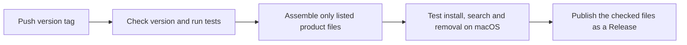

# Versioning and End-User Releases

[한국어](./releases.md) | [English](./releases.en.md) | [Technical design index](./README.en.md)

The GitHub repository continues to expose the development code and documentation.
A Release is a separate distribution page containing only the files needed to
install the product. This guide describes the process, not the outcome of any
particular remote run. Check GitHub Actions and Releases to confirm publication.

## What triggers publication

| Action | Result |
| --- | --- |
| Commit and push to `main` | Validation and installation rehearsal only |
| Pull request or manual Actions run | Validation and installation rehearsal only |
| Push a version tag | Publish a prerelease after validation succeeds |

A tag names a particular commit. For example, `v0.3.0` must match the product
version `0.3.0` in both `pyproject.toml` and `uv.lock`. A mismatch stops validation
and publication. Creating a local tag does not publish anything; it must be
pushed to GitHub.



## What the release contains

[`release-check.yml`](../../.github/workflows/release-check.yml) packages only
the files named in [`runtime-files.txt`](../../packaging/runtime-files.txt).
The current list has 49 destination paths. It includes code, skills, agents,
installation and removal tools, and user documentation. It excludes the
development harness, tests, technical documentation, personal configuration,
and research data. Review this list when adding a runtime dependency.

[`resources/AGENTS.runtime.md`](../../resources/AGENTS.runtime.md) is the single
source of product rules. The development root `AGENTS.md` refers to it. The
release places identical product rules at `resources/AGENTS.runtime.md` and its
root `AGENTS.md`. The skill and registered agents read the resource path.
This keeps development guidance out of the installation without maintaining
independent copies of the product rules in source control.

The Release has three assets:

| File | Purpose |
| --- | --- |
| `research-agent-0.3.0.tar.gz` | Versioned end-user product bundle |
| `install-release.sh` | Starts a fresh installation of a specified version |
| `SHA256SUMS` | SHA-256 values for the downloadable files |

Users copy the command from the [version's README](https://github.com/LWH4Data/research-agent/tree/v0.3.0#readme).
It downloads the installer, which downloads the
bundle and checksum file, verifies the archive, and installs it. GitHub's
**Code → Download ZIP**, `git clone`, and the Release's automatic **Source code**
downloads still provide the full development source.

Checked files are kept as the Actions `runtime-release` artifact for three days.
For a tag push, the publish job downloads that exact artifact and attaches its
files to the Release. Release assets do not expire when the separate Actions
artifact reaches its three-day retention limit.

## What is tested

After the automated suite, the actual release archive is extracted and installed
in a disposable macOS HOME. Checks cover skill and agent registration, version
reporting, registering and converting a fixture PDF, retrieval, original-file
preservation, and removal. HOME and Trash are temporary; the user's real
installation is not removed. Tests also check the exact file list, agreement
between source and archive contents, executable permissions, and checksums.
See [`test_release_bundle.py`](../../tests/test_release_bundle.py) for the scope.

These checks do not call subscription models. Opt-in permission integrations
remain skipped in the default run. Success does not establish actual permissions,
notifications, or model calls in every Codex environment, nor does it prove PDF
visual interpretation accuracy. Review skipped tests and failed steps in the
Actions result as well.

## Publishing the next version

1. Change the version in `pyproject.toml`. For example, a bug-fix release could use `0.3.1`.
2. Regenerate `uv.lock` with `uv lock` in the development environment. Do not manually replace only its version string.
3. Update the pinned download tag and `--version` value in the README and Korean/English user guides, plus [`RELEASE_NOTES.md`](../../packaging/RELEASE_NOTES.md). Review the manifest if runtime files were added.
4. Run tests for the changed behavior, the full automated suite, and version validation. The `0.3.1` below is an example next release.

```sh
bash scripts/reproduce-validation.sh full
.venv/bin/python -B scripts/check_release_version.py --tag v0.3.1
```

5. Commit the intended changes, push `main`, and confirm that its Actions validation succeeds.
6. Create a tag at the commit to release, then push that specific tag.

```sh
git tag -a v0.3.1 -m "Research Agent v0.3.1"
git push origin v0.3.1
```

7. Open **Actions → Validate and release** and check that both `validate` and `publish` succeeded. Confirm the matching version and three assets under **Releases**.

If validation fails, fix the failed step. Do not move an already published tag to
another commit or silently replace its files; publish a new fix version instead.
The README's new download URL may not work until the new version is published.

## Updates are not provided yet

The current installer supports **fresh installations only**. It stops rather than
overwriting an existing destination file, directory, or link. There is no automatic
updater or migration of an existing research library. Do not tell existing users
to delete their library to install a release. A future update flow needs separate
design and validation for active operations, storage compatibility, data
preservation, and recovery.
